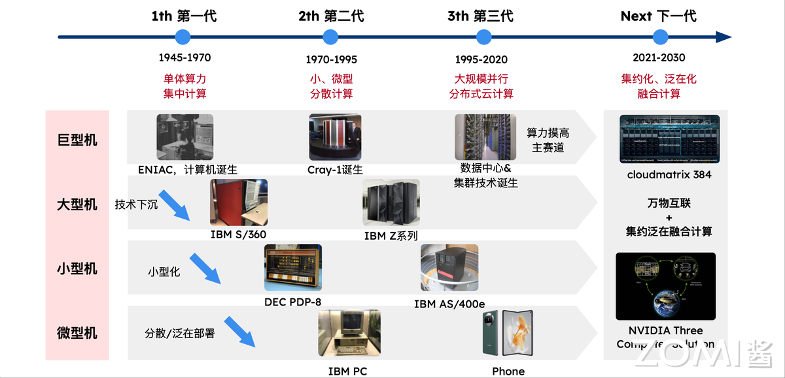

<!--Copyright © ZOMI 适用于[License](https://github.com/Infrasys-AI/AIInfra)版权许可-->

# 04.计算集群初期历史回顾

Author by: 陈悦孜

本章节将介绍集群计算的发展历程。总共分为4个时代：

1. 奠基时代 1945~1970

2. 通用架构 1971~1995

3. 云&大数据 1995~2020

4. 未来计算 2020~2030

## 计算产业发展历程

计算产业由计算需求驱动，发展历程从专用计算到通用计算，再到集约泛在融合的未来计算。

计算机发展历程大致可分为以下几个阶段：

1. 第一代（1945 - 1970 年）：单体算力集中计算
这一时期以巨型机、大型机为代表，核心是单体算力集中计算。1946 年 ENIAC（电子数字积分计算机）诞生，标志着计算机的问世，它体型庞大却开启了计算时代。之后，技术逐渐 “下沉”，出现了 IBM S/360 等大型机，为后续计算设备发展奠定基础。

2. 第二代（1970 - 1995 年）：小、微型分散计算
此阶段朝着小、微型分散计算演进。Cray - 1 诞生，在高性能计算领域崭露头角。同时，计算机不断 “小型化”，DEC PDP - 8 等小型机出现；还开始 “分散 / 泛在部署”，IBM PC 等微型机走入更多场景，计算不再仅依赖大型集中式设备，开始向更广泛领域分散。

3. 第三代（1995 - 2020 年）：大规模并行分布式云计算
这一阶段主打大规模并行分布式云计算，数据中心与集群技术诞生，成为 “算力摸高主赛道”。IBM Z 系列大型机、IBM AS/400e 等设备，助力计算能力通过分布式、并行化的方式大幅提升，能处理更海量的数据与更复杂的任务。

4. 下一代（2021 - 2030 年）：集约化、泛在化融合计算
未来将迈向集约化、泛在化融合计算，强调 “万物互联 + 集约泛在融合计算”。像 cloudmatrix 384、NVIDIA Three Computer Solution 等，预示着计算将在更广泛的万物互联场景下，实现资源的集约化与泛在化融合，释放更强算力潜能。

## 奠基时代 1945-1970

这一时期计算机器件以电子管、晶体管为主，因体积大、耗电多、计算资源消耗大且成本高，计算资源集中成为必然选择，主要服务于国防、科研等军事或准军事领域。

1924 年，IBM 创立，主营机械自动制表机，替代人力计算。1929 年，“超算” 一词首登《纽约时报》，IBM 为哥伦比亚大学定制制表机。

在密码破译等军事相关领域，1938 年，图灵用炸弹机破解 ENIGMA，选明文 + 查表法破译超 3.9 万亿密码组合，为破译情报、打击德军等作出贡献。

计算机研发方面，1944 年，Harvard Mark - 1 诞生，是 IBM 为军方研制的继电器计算机，能全自动计算曼哈顿计划军事数据，对现代电脑设计影响深远。

1946 年，首台通用可编程计算机 ENIAC 诞生，算力提升显著，用于火炮火力表精准度计算，后改进为冯・诺依曼架构，采用存储程序执行方式。

到了商业与高性能计算领域，1963 年，超算鼻祖 CDC6600 诞生，突破每秒百万次浮点运算，持续 5 年保持全球最快，采用管线标量架构、RISC 精简指令集，还有 IC 硅芯片与氟利昂制冷系统。1964 年，IBM System / 360 诞生，是首台商业成功的大型机，有 50 亿美元的资源投入，远超曼哈顿计划首台氢弹的花费，还曾用于计算阿波罗 11 号返回着陆点。

第一代计算机有着鲜明特点：采用单一专有架构，以图灵机或冯・诺依曼机为核心，形成封闭生态，不同厂商、不同型号的计算机系统间，硬件架构、指令集等难以兼容互通；软硬件呈紧耦合状态，这种模式虽让运行效率得以提高，能更高效地利用硬件资源执行任务，但也限制了软件的灵活性与可移植性；软件开发极为困难，正如 “人月神话” 所体现的，软件开发工作量大、周期长，且容易出现投入人力时间与实际产出不成正比的情况，极大地制约了软件的发展与创新。

### 第一代的计算机

### ENIAC

1946年，ENIAC诞生。ENIAC是数据中心发展的鼻祖，它长30.48 米，宽 6 米，高 2.4 米，占地约170 平方米，内部含有17468 只电子真空管、7200 个二极管、70000 多电阻器、10000 多只电容器和 6000 只继电器，有电路50万焊接点，30个操作台，重30吨，功耗150KW。运算速度为每秒5000次加法或400 次乘法，计算能力是继电器计算机的1000 倍，手工计算的20 万倍。ENIAC 首次应用即参与新墨西哥州洛斯阿拉莫斯，进行原子弹爆炸试验计算。

### EDVAC
1951年，EDVAC诞生。离散变量自动电子计算机（Electronic Discrete Variable Automatic Computer, EDVAC），是首台二进制的冯﹒诺伊曼架构计算机。它含有6000 个真空管，12000 个二级管，占地 45.5 平，功耗 56KW。运算速度为每秒可执行 1150 次加法或 340 次乘法，具备 1000 个 44bit（使用延迟线存储器）。EDVAC 被应用于美军阿伯丁实验室，进行弹道研究计算。

### CDC6600

1963 年 8 月推出 CDC6600 被评为第一个成功超级计算机（超算鼻祖），每秒浮点次数达 1 百万次，超过当时最快的计算机IBM 7030 约三倍。它专为伦斯辐射实验室设计，直到 1969 年一直保持世界最快计算机。它是超算创新技术的成果，采用超标量架构，使用 RISC 精简指令集、硅片和氟利昂冷却系统的锗晶体管，主要被用于高能核物理研究。

### S/360

1964 年，IBM推出第一台大型机 S/360。1956年，小汤姆 • 沃森接掌 IBM。当时，技术变革方兴未艾，晶体管取代了真空管，磁性存储器取代穿孔卡。1962年，小沃森决定彻底调整公司产品战略，研发 S/360 大型机，1964 年推向市场，小沃森最冒险决定开创大型机时代。

S/360 这项 50 亿美元的投资，被证实是一项启动创新商业运作历史性变革。超过第二次世界大战中研制原子弹的曼哈顿项目。大型机在可靠性、可用性和可服务性霸主地位至今仍无其他产品能够撼动。

### PDP-8

1966年，DEC数字设备公司（Digital Equipment Corporation）开创小型机时代，历经40年从辉煌走向消亡。
当计算机世界向复杂和昂贵方向发展， 1966 年 DEC 推出 PDP-8 型计算机，可以放在办公桌，价格只有 18,000美元，远低于 IBM 等计算机公司产品价格。PDP-8 系列产品一共卖出 30 万台，推动 DEC 上世纪六十年代中后期到七十年代中期称霸小型机市场。

20 世纪 80 年代末，DEC 的年收入达到了 130 亿美元 ，纯利润为 11 亿美元，在当时的计算机行业中，是仅次于 IBM 的第二号巨头企业，展现出强大的经济实力和市场影响力。达到发展巅峰后，DEC 的经营状况开始恶化。在微机市场领域，DEC 无法与个人计算机（PC）竞争，市场份额不断流失；在小型机市场，也面临新竞争对手的挑战，市场被逐渐蚕食 。1957 年，肯・奥尔森（Kenneth H. Olsen）等以 7 万美元创建了 DEC 公司。到了 1998 年 6 月，DEC 被康柏电脑公司（Compaq）以 96 亿美元的价格收购。然而，康柏自身也未能在激烈的市场竞争中保持优势，2001 年，惠普公司（HP）又以 250 亿美元的价格收购了康柏 。

### 贝尔定律

贝尔定律：如果保持计算机能力不变，每18个月微处理器的价格和体积减少一半。

贝尔定律是关于微处理器发展特点和规律经验性总结，是对摩尔定律补充。过去 30 年，这两条定律不仅适用于半导体行业，同样适用于存储容量、显卡性能和显示器性能发展。

70 年代，贝尔定律的提出者戈登贝尔任 DEC 计算机设计师。1987 年，Gordon Bell 创立戈登贝尔奖 ，国际上 HPC 应用领域最高学术奖项，被称为“超算领域的诺贝尔奖”，由ACM每年评选和颁发。1991 年到 1995 年，贝尔担任微软公司顾问，指导公司未来研发方向，并帮助建立第一个微软研究实验室。

## 本节视频

<html>
<iframe src="https://player.bilibili.com/player.html?isOutside=true&aid=114867390451909&bvid=BV1vugAzgEMK&cid=31102602285&p=1&as_wide=1&high_quality=1&danmaku=0&t=30&autoplay=0" width="100%" height="500" scrolling="no" border="0" frameborder="no" framespacing="0" allowfullscreen="true"> </iframe>
</html>
