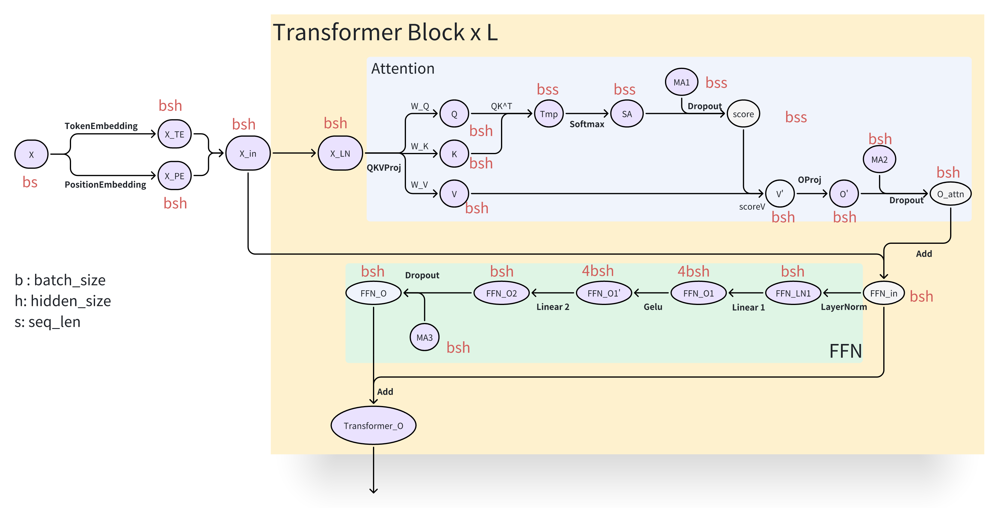

<!--Copyright © ZOMI 适用于[License](https://github.com/Infrasys-AI/AIInfra)版权许可-->

# 05.大模型训练内存与参数计算

> Author by: 刘凯旋

!!!!!!!!!
1）看 PR 修改，注意格式
2）没意义的信息，或者太通用的信息删掉了

## 大模型参数量的计算

准确计算模型的参数量是理解其复杂性和显存占用的基础。以下以一个 $L$ 层的标准 Transformer 模型为例，逐模块分解其参数。

!!!!!!!!!
把下面每一层的计算单独分开一个三级标题，单独用公式呈现，不要大模型的了列表方式


### Embedding 层参数

1.  **Token Embedding**：
 
 	$XW_t，W_t \in \mathbb{R}^{vocab\_size \times hidden\_size}$
 	 输入$X\in \mathbb R^{batch\_size \times seq\_len}$, $x_{i,j} \in \mathbb X$表示为第$i$ 个序列的第$j$个token 在词表中的index，是one-hot 向量的简化。$x_{ij}W_t$ 的结果是$W_t$的第$j$行，实现了离散的tokenID 到稠密向量的映射。综上，该层的参数量为：
	$$P_{TE} = vocab\_size \times hidden\_size$$

2. **Position Embedding**：

	在标准的Transformer架构中，使用固定正弦编码：
  	$PE_{(pos, 2i)} = \sin(pos / 10000^{2i/d_{model}}) , PE_{(pos, 2i+1)} = \cos(pos / 10000^{2i/d_{model}})$
	  参数量:
	  $$P_{TE} = 0$$
	- 若使用可学习矩阵 $W_p \in \mathbb{R}^{max\_seq\_len \times hidden\_size}$，参数量为： 
  		$$P_{PE} = max\_seq\_len \times hidden\_size$$


### Transformer Block (每层)

每个Transformer Block 由一个带残差连接的注意力模块和一个带残差连接的前馈网络（FFN）模块组成，每个模块前都配有 LayerNorm。

1.  **LayerNorm**：
   
	$$y = \frac{x - \mathbb{E}[x]}{\sqrt{\mathbb{V}ar[x] + \epsilon}} \cdot \gamma + \beta$$
	包含两个可训练向量：增益 $\gamma \mathbb R^{hidden\_size}$ 和偏置 $\beta\in \mathbb R^{hidden\_size}$，参数量为：
	$$P_{LN} = 2 \times hidden\_size = 4 \cdot hidden\_size$$ 
	（通常$hidden\_size << batch\_size$，在参数量估算时可忽略不计）

2. **注意力模块 (Attention Module)**：
   
    - 一个标准的Single-Head Attention模块前向计算过程如下： 
	    
     	* 输入： $X \in \mathbb R^{batch\_ size \times seq\_len \times hidden\_size}$ 
     	* Linear Proj： $W_{Q,K,V} \in \mathbb R^{hidden\_size \times 3 hidden\_size}$ $[Q,K,V] = XW_{Q,K,V} \in \mathbb R^{batch\_size \times seq\_len \times 3hidden\_size}$
     	* 计算注意力分数并归一化（概率空间）： $\text{alignment} = \frac{QK^T}{\sqrt {hidden\_size}} \in \mathbb R^{batch\_size \times seq\_len \times seq\_len}$ $\text{attn\_score} =\text{ softmax}(\text{alignment})$ 
     	* 输出： $\text{Attn\_Output} = \text{drop\_out}(\text{attn\_score})V,\quad \in \mathbb R^{batch\_size \times seq\_len \times hidden\_size}$
     	* 输出投影: $W_o\in \mathbb R^{hidden\_size \times hidden\_size}$ 
      
  	- 参数量估计：
      - **Q, K, V 投影矩阵**：通常通过一个大的线性层实现，参数量
	$P_{W_{Q,K,V}} = 3 \cdot hidden\_size^2$
      - **输出投影矩阵**：将注意力输出投影回 $hidden\_size$ 维，参数量 
	$P_{W_O} = hidden\_size^2$
      - **Dropout**：Dropout 在训练阶段以概率 $p$ 随机将神经元的输出置零，但在前向传播时并不引入任何可训练参数，不贡献参数量。 
        
	综上，注意力模块参数量为： 
 	 $$P_{Attn} =  P_{W_{Q,K,V}} + P_{W_O} = 4 \cdot hidden\_size^2$$
3. **前馈网络模块 (FFN Module)**：
   - 一个标准的FFN 模块计算流程如下：
      - 输入：$X \in \mathbb R^{batch\_ size \times seq\_len \times hidden\_size}$
      - 输出：$\text{FFN\_Output} = \text{drop\_out}( \text{GeLU}(XW_1)W_2)\quad W_1 \in \mathbb R^{hidden\_size \times h'}, W_2 \in \mathbb R^{h' \times hidden\_size}$。 其中$h'$ 取 $4hidden\_size$ , $\text{GeLU}$ 不贡献参数

   - 参数量估计： 
   	$$P_{W_1} = P_{W_2} = hidden\_size \times 4hidden\_size = 4hidden\_size^2$$
   	$$P_{FFN} = P_{W_1} + P_{W_2}  = 8hidden\_size^2$$


**每层总参数量**：
$$P_{layer} = P_{LN} + P_{Attn} + P_{LN} + P_{FFN} \approx 12 \cdot hidden\_size^2$$

### 输出层

- 通常与 Token Embedding 共享权重，即使用 $W_t^T$ 进行投影，**不引入额外参数**。
   参数量 $P_{out} = 0$
- 若不共享，则需要一个独立的线性层，参数量$P_{out} = vocab\_size \times hidden\_size$

**模型总参数量 $\phi$ 估算公式：**

$$\begin{array}{ll}
\phi &\approx P_{TE} + P_{PE} + L \times P_{layer}  + P_{out}\nonumber \\
 &\approx (vocab\_size \times hidden\_size) + 0  + L \times (12 \cdot hidden\_size^2)  + 0
 \end{array}$$

### 实例分析

!!!!!!!!!
除了通用的GPT 模型结构以外，把当前经典的几个模型 LLAMA4、DeepSeek3、Qwen3、Grok4 的模型结构和参数量计算拿出来看，去深入到模型结构的真正计算。


为了更直观地理解大模型参数量的计算方式，我们以LLaMA-2 70B 为例进行分析，其核心配置如下：

```json
{
  "hidden_act": "silu",
  "hidden_size": 8192,
  "intermediate_size": 28672,
  "max_position_embeddings": 4096,
  "num_attention_heads": 64,
  "num_hidden_layers": 80,
  "num_key_value_heads": 8,
  "torch_dtype": "float16",
  "vocab_size": 32000
}
```

- Embedding 层参数

  - **Token Embedding**：
    $$P_{embed} = vocab\_size \times hidden\_size = 32000 \times 8192 \approx 262.14M$$

  - **Position Embedding**：0（使用 RoPE，不引入可学习参数）

- 每层参数量

  - **注意力模块参数量**：
    $$P_{attn} = 3 \times num\_heads \times hidden\_size \times head\_dim + hidden\_size \times hidden\_size$$
    
    其中 $head\_dim = \frac{hidden\_size}{num\_heads}$

  - **前馈神经网络参数量**：
    $$P_{ffn} = 2 \times hidden\_size \times 4 \times hidden\_size$$

  - **单层总参数量**：
    $$P_{layer} = 12 \times 8192^2 = 805.31M$$

- 输出层参数
  
  0（与输入层共用词向量编码参数）

- 总参数量

$$\phi = P_{embed} + L \times P_{layer} = 262.14M + 80 \times 805.31M \approx 64.69B$$


## 浮点数精度与字节占用

!!!!!!!!
现在都用 FP8/FP6 混合精度训练了，了解最新的技术，然后补充详细内容

计算机中的浮点数遵循 IEEE 754 标准，由符号位 $S$、指数位 $E$ 和尾数位 $M$ 组成，下图是 FP16 的 IEEE 754 表示。


一个浮点数的数学表示为：

$$
(-1)^{\text{符号位}} \times (1.\text{尾数}) \times 2^{(\text{指数} - \text{偏置})}
$$

其中，记指数位的 bit 数为 $k$, 偏置值：$2^{k-1}-1$。

**指数位**决定了数值的**动态范围**（能表示的最大最小值），**尾数位**决定了数值的**精度**（有效数字位数）。更多的指数位意味着能表示更大或更小的数值，更多的尾数位意味着更高的精度。
现代深度学习中常用的数值精度格式如下：
<center> 表一</center>

| 精度格式     | 位宽      | 字节数       | 符号位   | 指数位    | 尾数位     |
| :------- | :------ | :-------- | :---- | :----- | :------ | 
| **FP32** | 32 bits | 4 bytes   | 1 bit | 8 bits | 23 bits | 
| **FP16** | 16 bits | 2 bytes   | 1 bit | 5 bits | 10 bits | 
| **BF16** | 16 bits | 2 bytes   | 1 bit | 8 bits | 7 bits  | 
| **INT8** | 8 bits  | 1 byte    | 1 bit | -      | 7 bits  | 
| **INT4** | 4 bits  | 0.5 bytes | 1 bit | -      | 3 bits  |


### 混合精度训练
!!!!!!!! 待完善

**混合精度训练 (Mixed Precision Training)** 是当前的主流实践。它在前向传播和反向传播过程中使用 FP16/BF16 进行计算和存储，以提升速度并节省显存，同时维护一个 FP32 格式的**主参数副本 (Master Weight)** 用于优化器更新，以此保证训练的数值稳定性。

传统的混合精度训练主要基于FP16或BF16格式。在这种框架下，模型参数以FP16/BF16格式存储用于前向和反向传播，而优化器则维护FP32精度的主参数副本用于精确更新。对于FP16训练，由于动态范围有限，需要采用损失缩放技术来防止梯度下溢；而BF16由于保留了FP32的指数位范围，通常不需要损失缩放。从内存开销来看，传统混合精度训练需要存储FP16/BF16模型参数（$2\Phi$字节）和FP32主参数副本（$4\Phi$字节），总额外开销达到6×φ字节，相比纯FP32训练仍有优化空间。

随着模型规模突破千亿参数，**FP8 (8-bit Floating Point)** 格式成为新的训练标准。FP8 主要有两种格式：


**FP8 格式对比**：
<center> 表二</center>

| 格式     | 符号位   | 指数位    | 尾数位    | 动态范围        | 精度特性   | 适用场景      |
| :----- | :---- | :----- | :----- | :---------- | :----- | :-------- |
| **E4M3** | 1 bit | 4 bits | 3 bits | $2^{-6}$ ~ $448$ | 更高精度   | 前向传播、权重存储 |
| **E5M2** | 1 bit | 5 bits | 2 bits | $2^{-14}$ ~ $57344$ | 更大动态范围 | 反向传播、梯度计算 |

随着模型规模突破千亿参数，FP8格式成为新的训练标准。在前向传播阶段，输入数据和权重均转换为FP8格式，但实际计算在FP32精度下进行，输出再转换为BP16格式；在反向传播阶段，数据梯度计算将输入梯度转换为BP16并在FP32下计算，输出梯度转换为FP8，而权重梯度计算在FP32下进行后也转换为FP8格式；在优化器更新阶段，系统维护FP32精度的主权重和优化器状态，权重梯度从FP32转换为BP16/BF16用于参数更新。

FP8混合精度训练具有显著优势。在显存效率方面，FP8模型参数仅需$\Phi$字节，相比BF16混合精度显存占用减半。在计算效率方面，NVIDIA H100 GPU的FP8 Tensor Core算力达到FP16的2倍，同时通信带宽需求降低50%，显著加速分布式训练。在数值稳定性方面，E4M3格式用于前向传播以保证激活值精度，E5M2格式用于反向传播以覆盖梯度的大动态范围。

除了FP8之外，FP6作为最新的极致量化方案正在探索中。FP6每个参数仅占0.75字节，使得千亿参数模型的权重存储仅需75GB，主要应用于权重存储和前向传播，需要配合FP8/BF16进行梯度计算。然而，FP6的动态范围极其有限，需要精细的量化策略和专门的硬件支持，目前仍处于发展阶段。

### DeepSeek-V3的混合精度训练实践


DeepSeek-V3（671B参数）采用了先进的FP8混合精度训练方案，体现了该技术在前沿模型中的实际应用。其训练配置采用多层次精度策略：前向传播使用FP8 E4M3格式处理权重和激活值，反向传播使用FP8 E5M2格式进行梯度计算，优化器状态使用FP32维护Adam状态，主参数副本则使用BF16格式以平衡精度和显存需求。

在显存优化方面，传统BF16混合精度需要约4TB显存（其中模型参数1342GB，主参数2684GB），而FP8混合精度仅需约2.7TB（模型参数671GB，主参数1342GB，梯度671GB），实现了约33%的显存节省。同时，通过利用NVIDIA H100的第四代Tensor Core，FP8矩阵乘法吞吐量达到3958 TFLOPS，相比BF16的1979 TFLOPS实现2倍理论加速，训练时长减少约40%，而最终模型困惑度与BF16训练相当。

为保证数值稳定性，DeepSeek-V3采用了多项创新技术。Per-Tensor Scaling为每个张量动态计算缩放因子，结合延迟缩放更新策略避免频繁计算开销。梯度裁剪技术与FP8量化协同工作，有效防止梯度爆炸。自适应损失缩放根据梯度分布动态调整缩放因子，混合精度累加器在LayerNorm、Softmax等关键操作中使用FP32累加，同时通过统计监控实时跟踪激活值和梯度的数值范围，及时调整量化策略。

在技术创新方面，DeepSeek-V3实现了细粒度量化，对不同网络层使用不同的FP8格式：注意力层使用E4M3保证高精度，FFN层则可使用更激进的E5M2格式。通过量化感知训练，在训练过程中模拟FP8量化效果，使模型权重分布更适合低比特表示。对于混合专家模型结构，专家参数使用FP8存储，而路由计算使用FP32保证精度，巧妙平衡了显存节省与路由准确性。

通过FP8混合精度训练，DeepSeek-V3在保持模型性能的同时显著降低了训练成本，使得千亿参数规模的模型训练变得更加可行和高效。这一实践标志着大模型训练进入了超低精度时代，为未来万亿参数模型的训练奠定了坚实的技术基础，推动了整个领域向更高效、更可扩展的方向发展。

## 训练显存分析

!!!!!!!
大模型要做性能优化，优化哪部分？深度学习了解

模型训练中，GPU 显存的消耗远不止模型参数本身。对于一个拥有 ϕ 个参数的模型，一次完整的训练迭代（Step）所产生的显存占用可以系统地分为以下几个核心部分。理解这些组成有助于进行有效的显存优化和模型部署。

### 静态显存占用分析
!!!!!!!!!
不要用大模型的列表方式，改成自己理解的形式

在深度学习训练过程中，静态显存是指那些需要在GPU中持久存储的数据部分，主要包括模型参数、梯度和优化器状态三大部分。这些组件构成了训练过程中的基础存储开销，其大小直接决定了能够训练模型规模的上限。

**模型参数显存**构成了静态显存的基础部分。模型的 $\phi$ 个参数需要完整存储在GPU显存中。在现代混合精度训练实践中，参数通常以FP16格式存储，每个参数占用2字节空间。因此，参数显存的总占用为 $2\phi$ 字节。以Qwen3-14B模型为例，其140亿个参数以float16或bf16精度存储时，所需的显存量约为28GB，这构成了模型训练的基础内存门槛。

**梯度显存**在反向传播过程中扮演关键角色。为了进行参数更新，需要为每个参数计算并存储对应的梯度值 $g_t = \frac{\partial \mathcal{L}}{\partial \theta}$。梯度通常采用FP32精度存储以确保数值稳定性，每个梯度值占用4字节空间。对于拥有 $\phi$ 个参数的模型，梯度显存的总占用达到 $4\phi$ 字节，相当于参数显存的两倍。

**优化器状态显存**是静态显存中最为复杂的部分。以广泛使用的Adam优化器为例，它为每个参数维护两个独立的指数移动平均量：一阶动量 $m_t^{(i)} = \beta_1 m_{t-1}^{(i)} + (1-\beta_1) g_t^{(i)}$ 存储参数梯度的指数移动平均，帮助优化器在梯度方向上保持惯性；二阶动量 $v_t^{(i)} = \beta_2 v_{t-1}^{(i)} + (1-\beta_2) (g_t^{(i)})^2$ 存储梯度平方的指数移动平均，实现学习率的自适应调整。这两个动量均以FP32精度存储，每个参数在优化器状态中的显存占用达到8字节。

综合上述三个核心组成部分，静态显存的总体占用可以通过以下公式精确计算：

$$
\begin{array}{ll}
Mem_{static} & = Mem_{param} + Mem_{grad} + Mem_{optim}  \\
& = 2\phi + 4\phi + 8\phi  \\
& = 14\phi 
\end{array}
$$


### 动态显存占用分析

在模型训练过程中，除了静态显存占用外，还存在随时间变化的动态显存开销。这部分显存主要由前向传播中产生的激活值，以及各种临时缓冲区和内存管理开销构成。

**激活值** 是指在神经网络前向传播过程中产生的中间张量，这些张量在后续的反向传播梯度计算中必须被保留。下面我们以标准的 Transformer 架构为例，对其关键组件中需要保存的激活值进行详细分析：

-  残差连接的结果不属于必须存储的激活值，因其梯度计算仅依赖于该分支内的中间结果。例如，对于 $y = x + f_\theta(x)$，在计算 $\partial y / \partial \theta$ 时，仅需 $f_\theta(x)$ 内部的前向缓存。

-  Dropout 所使用的掩码矩阵（Mask Matrix）属于激活值，需在前向时保存。通常掩码矩阵以 Byte 类型存储（1字节），而中间激活值若为 FP16/BF16 则占用 2 字节。

下图中的紫色图标清晰标识出了 Transformer 层中需要存储的激活张量（分析中暂不考虑 Embedding 层，并忽略 LayerNorm 的均值与方差所产生的约 $2bs$ 字节开销）：



基于此分析，我们可以对激活值的总显存占用进行量化估算：

注意力模块的激活显存占用为：
$$MemActive_{Attn} = 2(bsh + 3bsh + 2bss + bsh) + bs^2 + bsh = 11bsh + 5bs^2\ \text{Byte}$$

前馈神经网络模块的激活显存占用为：
$$MemActive_{FFN} = 2(bsh + 4bsh + 4bsh + bsh + bsh) + bsh = 23 bsh \ \text{Byte}$$

因此，总激活值显存占用为：
$$MemActive = MemActive_{Attn} + MemActive_{FFN} = 34bsh + 5bs^2 \ \text{Byte}$$

**其他显存开销** 构成了动态显存的另一重要组成部分。这包括各种临时缓冲区的分配、GPU内存管理产生的内存碎片，以及框架运行时的内部开销。根据实践经验，这类额外显存占用通常可以估算为模型参数内存的 $1.X$ 倍，即大约 $2.X\phi$ 字节。这部分开销虽然不如激活值那样具有明确的计算公式，但在大规模模型训练中却是不容忽视的因素。


## 总结与思考

!!!!!!!
一段话总结

## 参考与引用
   <div id="ref1"></div>
   
   1. [Attention Is All You Need](https://proceedings.neurips.cc/paper/2017/hash/3f5ee243547dee91fbd053c1c4a845aa-Abstract.html)
   2. [Reducing Activation Recomputation  in Large Transformer Models](https://proceedings.mlsys.org/paper_files/paper/2023/hash/80083951326cf5b35e5100260d64ed81-Abstract-mlsys2023.html)
   3. [MIXED PRECISION TRAINING](https://arxiv.org/abs/1710.03740)
   4. [DeepSeek-V3 Technical Report](https://arxiv.org/abs/2412.19437)

!!!!!!!
希望你不是大模型生成的，而是自己去看论文，看知乎，看别人的解读，然后总结成自己的理解；补充参考
