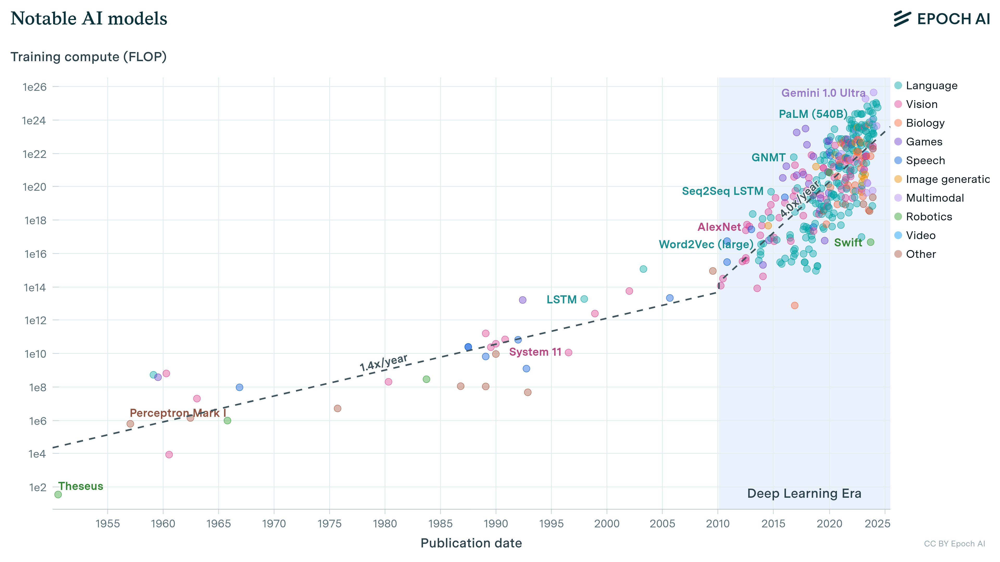
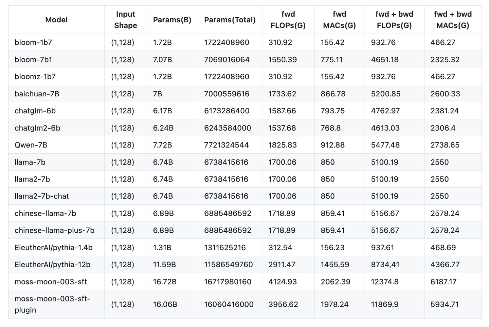

<!--Copyright © ZOMI 适用于[License](https://github.com/Infrasys-AI/AIInfra)版权许可-->

# CODE 01: 拆解 Transformer-Decoder

近年来，大型语言模型（LLMs）的发展令人瞩目，而它们中的绝大多数，例如著名的 GPT 系列，都构建于一种优雅而强大的架构之上——Transformer-Decoder。


许多初学者在使用这些模型时，往往将其视为一个黑箱。我们调用 `model.forward()`，然后奇迹就发生了。但是，模型内部究竟发生了什么？一个拥有数百亿参数的模型，其大小是如何计算的？当我们输入一段文本时，计算机会执行多少次浮点运算？为什么在生成长文本时，我们会遇到所谓的“显存瓶颈”？

我们将从零开始，用 Python 来定义一个 Transformer-Decoder 模型，然后像解剖一只麻雀一样，细致地分析它的每一个组成部分：

- **参数量 (Parameters)**：模型的“体重”是多少？参数都分布在哪里？
- **计算量 (FLOPs)**：模型进行一次推理需要“消耗”多少计算资源？
- **中间激活 (Activations)**：训练过程中，是什么在悄悄“吃掉”我们的显存？
- **KV Cache**：在推理（Inference）时，让模型高效生成文本的“记忆”机制是什么？

## 1. 精简 Transformer-Decoder

理论总是需要实践来验证。为了方便分析，我们首先需要用代码定义出今天的主角。我们将使用 PyTorch 来构建一个 Transformer-Decoder 模型。

首先，我们定义一个配置类 `ModelArgs`，规定了模型的所有核心超参数。

```python
import torch
import torch.nn as nn
from dataclasses import dataclass
import math

@dataclass
class ModelArgs:
    dim: int = 512  # 模型的嵌入维度 (Embedding Dimension)，通常也称为 n_embd
    n_layers: int = 8  # Transformer Block 的层数
    n_heads: int = 8  # 多头注意力机制中的头数
    vocab_size: int = 32000  # 词汇表大小
    max_seq_len: int = 2048  # 模型能处理的最大序列长度
    
    # 为了方便，我们让每个头的维度是 dim / n_heads
    @property
    def head_dim(self):
        return self.dim // self.n_heads

# 实例化配置
args = ModelArgs()
print(args)
```

这个配置定义了一个相对小巧的模型：512 的嵌入维度、8 个 Transformer 层、8 个注意力头。

## 2. 参数量分析

参数量是衡量模型规模最直观的指标。一个模型的参数，本质上就是它在训练过程中学习到的所有权重（weights）和偏置（biases）的总和。



### 2.1 Embedding 层

当一个词（Token）进入模型时，它首先需要被转换成一个稠密的向量。这个任务由词嵌入层完成。它本质上是一个巨大的查找表（Lookup Table），每一行代表词汇表中的一个词，每一列是这个词对应的向量表示。

- 原理：将一个 one-hot 编码的词索引映射到一个 `dim` 维的向量。
- 公式：该层的参数量为词汇表大小与嵌入维度的乘积。

$$
P\_{embed} = V \times d\_{model}
$$

其中 $V$ 是 `vocab_size`，$d\_{model}$ 是 `dim`。

让我们用代码来计算一下：

```python
# 词嵌入层的参数
vocab_size = args.vocab_size
dim = args.dim

embedding_params = vocab_size * dim
print(f"词嵌入层的参数量: {embedding_params:,}")
```

### 2.2 Attention 层

Transformer 的核心是由多个相同的 Block 堆叠而成。每个 Block 都包含两个关键组件：**多头自注意力（Multi-Head Self-Attention）** 和 **前馈网络（Feed-Forward Network）**。

a) 多头自注意力 (Multi-Head Self-Attention)

自注意力机制是 Transformer 的灵魂。在一个 Decoder 模型中，它允许每个位置的 Token 关注到它前面所有位置的 Token。为了生成 Query (Q), Key (K), 和 Value (V) 向量，输入向量 $x$ 需要分别乘以三个权重矩阵 $W\_q, W\_k, W\_v$。在多头注意力中，这个过程会重复 `n_heads` 次。

输入 $x \in \mathbb{R}^{d\_{model}}$ 会被线性投射到 Q, K, V。这三个投影矩阵是模型需要学习的参数。

$$W\_q, W\_k, W\_v \in \mathbb{R}^{d\_{model} \times d\_{model}}$$

还有一个最终的输出投影矩阵，用于将多头注意力的结果整合起来：

$$W\_o \in \mathbb{R}^{d\_{model} \times d\_{model}}$$

对于每一层的一个注意力模块，其参数量为：

$$
P\_{attn\_per\_layer} = (d\_{model} \times d\_{model})*Q + (d*{model} \times d\_{model})*K + (d*{model} \times d\_{model})*V + (d*{model} \times d\_{model})*O
$$

$$
P*{attn\_per\_layer} = 4 \times d\_{model}^2
$$

```python
# 计算一层注意力模块的参数
n_layers = args.n_layers

# Q, K, V, O 四个投影矩阵
attention_params_per_layer = 4 * (dim * dim) 
print(f"每层自注意力模块的参数量: {attention_params_per_layer:,}")

# 总的注意力参数
total_attention_params = n_layers * attention_params_per_layer
print(f"所有 {n_layers} 层自注意力模块的总参数量: {total_attention_params:,}")
```

### 2.3 FFN 层

前馈网络 (Feed-Forward Network, FFN) 为模型提供了非线性能力。它通常由两个线性层和一个非线性激活函数（如 GELU 或 SiLU）组成。第一个线性层将维度从 `dim` 扩大到一个中间维度（通常是 `4 * dim`），第二个线性层再将其恢复回 `dim`。

$$
FFN(x) = \text{Linear}\_2(\text{GELU}(\text{Linear}\_1(x)))
$$

$$
P\_{ffn\_per\_layer} = (d\_{model} \times 4d\_{model}) + (4d\_{model} \times d\_{model}) = 8 \times d\_{model}^2
$$

```python
# 计算一层 FFN 的参数
# 第一个线性层: dim -> 4 * dim
# 第二个线性层: 4 * dim -> dim
ffn_params_per_layer = (dim * 4 * dim) + (4 * dim * dim)
print(f"每层 FFN 模块的参数量: {ffn_params_per_layer:,}")

# 总的 FFN 参数
total_ffn_params = n_layers * ffn_params_per_layer
print(f"所有 {n_layers} 层 FFN 模块的总参数量: {total_ffn_params:,}")
```

你可以看到，FFN 部分的参数量是注意力部分的两倍，是模型参数的主要构成部分。

### 2.4 输出层

最后，模型需要一个输出层将最终的 Transformer Block 输出的向量转换回词汇表大小的 logits，用于预测下一个词。这个层通常是一个与词嵌入层权重共享（或不共享）的线性层。

$$
P\_{output} = d\_{model} \times V
$$
  
```python
output_params = dim * vocab_size
print(f"输出层的参数量: {output_params:,}")
```

### 2.5 汇总与验证

现在，将所有部分的参数加起来，得到模型的总参数量。我们还会加上一些通常被忽略但确实存在的参数，比如 LayerNorm 层的参数（每个 LayerNorm 有 weight 和 bias 两个参数，维度为 `dim`）。每个 Transformer Block 中有两个 LayerNorm。

```python
# LayerNorm 参数
layernorm_params_per_layer = 2 * dim # weight + bias
total_layernorm_params = n_layers * 2 * layernorm_params_per_layer # 每个 block 有两个 layernorm

total_params = (
    embedding_params + 
    total_attention_params + 
    total_ffn_params + 
    total_layernorm_params + 
    output_params
)

print(f"词嵌入层参数: {embedding_params:,}")
print(f"注意力总参数: {total_attention_params:,}")
print(f"FFN 总参数: {total_ffn_params:,}")
print(f"LayerNorm 总参数: {total_layernorm_params:,}")
print(f"输出层参数: {output_params:,}")
print("-----------------------------------------")
print(f"模型总参数量 (估算): {total_params:,} ({total_params/1e6:.2f}M)")
```

可以尝试调整 `ModelArgs` 中的配置，看看参数量是如何随之变化的。例如，将 `dim` 翻倍，参数量会大致变为原来的四倍，因为它主要受 $d\_{model}^2$ 项的影响。

## 3. 计算量分析 FLOPs

参数量描述了模型的静态大小，而计算量 FLOPs（浮点运算次数来衡量）则描述了模型在前向传播的动态消耗。



我们主要关注计算量最大的部分：矩阵乘法。一个维度为 $(m \times n)$ 的矩阵与一个维度为 $(n \times p)$ 的矩阵相乘，其计算量约为 $2 \times m \times n \times p$ FLOPs。

假设我们的输入批次大小为 $B$，序列长度为 $S$。

### 3.1 Attention 计算量

1. **Q, K, V 投影**：输入 $X \in \mathbb{R}^{B \times S \times d\_{model}}$ 与 $W\_q, W\_k, W\_v \in \mathbb{R}^{d\_{model} \times d\_{model}}$ 相乘。

$$
FLOPs\_{QKV} = 3 \times (2 \times B \times S \times d\_{model} \times d\_{model})
$$

2. **注意力分数计算 ($QK^T$)**：$Q \in \mathbb{R}^{B \times S \times d\_{model}}$ 与 $K^T \in \mathbb{R}^{B \times d\_{model} \times S}$ 相乘。

$$
FLOPs\_{scores} = 2 \times B \times S \times d\_{model} \times S = 2 \times B \times S^2 \times d\_{model}
$$

3. **分数与 V 的加权和**：注意力分数矩阵 $\in \mathbb{R}^{B \times S \times S}$ 与 $V \in \mathbb{R}^{B \times S \times d\_{model}}$ 相乘。

$$
FLOPs\_{weighted\_sum} = 2 \times B \times S \times S \times d\_{model} = 2 \times B \times S^2 \times d\_{model}
$$

4. **输出投影**：结果与 $W\_o \in \mathbb{R}^{d\_{model} \times d\_{model}}$ 相乘。

$$
FLOPs\_{O} = 2 \times B \times S \times d\_{model} \times d\_{model}
$$

注意，在这些计算中，与 $S^2$ 相关的项是计算的瓶颈，这就是为什么长序列处理成本高昂的原因。

### 3.2 FFN 计算量

1. **第一个线性层**：输入 $\in \mathbb{R}^{B \times S \times d\_{model}}$ 与 $W\_1 \in \mathbb{R}^{d\_{model} \times 4d\_{model}}$ 相乘。

$$
FLOPs\_{FFN1} = 2 \times B \times S \times d\_{model} \times 4d\_{model} = 8 \times B \times S \times d\_{model}^2
$$

2. **第二个线性层**：中间结果 $\in \mathbb{R}^{B \times S \times 4d\_{model}}$ 与 $W\_2 \in \mathbb{R}^{4d\_{model} \times d\_{model}}$ 相乘。

$$
FLOPs\_{FFN2} = 2 \times B \times S \times 4d\_{model} \times d\_{model} = 8 \times B \times S \times d\_{model}^2
$$

### 3.3 估算总计算量

让我们用代码将这些公式实现，并计算一个前向传播的总 FLOPs。

```python
def estimate_flops(args: ModelArgs, batch_size: int, seq_len: int):
    # 为了简化，我们只关注主要的矩阵乘法
    d = args.dim
    n_layers = args.n_layers
    
    # 1. 注意力部分 (每层)
    # QKV 投影
    flops_qkv = 3 * (2 * batch_size * seq_len * d * d)
    # 注意力分数 (QK^T)
    flops_scores = 2 * batch_size * seq_len * seq_len * d
    # 加权和 (Scores * V)
    flops_weighted_sum = 2 * batch_size * seq_len * seq_len * d
    # 输出投影
    flops_o = 2 * batch_size * seq_len * d * d
    
    flops_attn_per_layer = flops_qkv + flops_scores + flops_weighted_sum + flops_o
    
    # 2. FFN 部分 (每层)
    flops_ffn_per_layer = (2 * batch_size * seq_len * d * (4*d)) + \
                          (2 * batch_size * seq_len * (4*d) * d)

    # 3. 总计算量
    total_flops = n_layers * (flops_attn_per_layer + flops_ffn_per_layer)
    
    # 不要忘记最后的输出层
    total_flops += 2 * batch_size * seq_len * d * args.vocab_size
    
    return total_flops

# 假设 batch_size=1, seq_len=1024
flops = estimate_flops(args, batch_size=1, seq_len=1024)
print(f"对于一个序列 (B=1, S=1024) 的前向传播计算量约为: {flops/1e9:.2f} GFLOPs")
```

这个结果告诉我们，即使是这样一个小型模型，处理一个长度为 1024 的序列也需要数十亿次的浮点运算。

## 4. 显存分析

模型在 GPU 上运行时，显存通常是最大的限制因素。显存的消耗主要来自四个方面：模型参数、优化器状态、梯度和 **中间激活**。前三者相对固定，而中间激活是与输入数据大小直接相关的变量。

### 4.1 中间激活

在训练过程中，为了计算梯度，我们需要存储前向传播过程中几乎所有计算的输出。这些存储的张量就是“中间激活”(Intermediate Activations)。

**哪里消耗最大？** 通常，FFN 层的扩展部分是最大的激活值。

对于 FFN 的第一个线性层之后，激活张量的形状是 $(B, S, 4 \times d\_{model})$。如果使用 32 位浮点数（4 字节），其占用的显存为：

$$
M\_{act\_ffn} = B \times S \times 4d\_{model} \times 4 \text{ bytes}
$$

同时，注意力分数矩阵 $(B, S, S)$ 也是一个主要的显存消耗者，尤其是在长序列下。

$$
M\_{act\_attn} = B \times S \times S \times 4 \text{ bytes}
$$

```python
def estimate_activation_memory(args: ModelArgs, batch_size: int, seq_len: int, dtype_bytes=4):
    d = args.dim
    
    # FFN 中间激活
    mem_ffn = batch_size * seq_len * (4 * d) * dtype_bytes
    
    # 注意力分数激活 (假设需要存储)
    mem_attn_scores = batch_size * args.n_heads * seq_len * seq_len * dtype_bytes
    
    print(f"FFN 激活显存 (B={batch_size}, S={seq_len}): {mem_ffn / 1024**2:.2f} MB")
    print(f"注意力分数激活显存: {mem_attn_scores / 1024**2:.2f} MB")
    # 这只是冰山一角，实际总激活量会更大
    
estimate_activation_memory(args, batch_size=4, seq_len=1024)
```

这个计算清楚地表明，序列长度 $S$ 对显存的压力是二次方的，这就是为什么在训练时我们很难使用非常长的序列。

### 4.2 KV Cache

如果每次都对完整的序列进行计算，那将是极大的浪费，因为对于 "Hello" 部分的 Key 和 Value 向量是不会改变的。**KV Cache** 就是为了解决这个问题而生的。

在生成第 $t$ 个 token 时，我们只计算当前 token 的 Q 向量，然后从缓存中读取前面所有 $t-1$ 个 token 的 K 和 V 向量。这样，注意力计算的复杂度就从 $O(S^2)$ 降低到了 $O(S)$。

对于模型的每一层，我们需要缓存 Key 和 Value 向量。大小计算：

$$
M\_{KV\_cache} = N\_{layers} \times 2 \times B \times S \times d\_{model} \times \text{dtype\_bytes}
$$

其中 `2` 代表 Key 和 Value 两个部分。

```python
def estimate_kv_cache_memory(args: ModelArgs, batch_size: int, seq_len: int, dtype_bytes=2):
    # 推理时常用 float16 或 bfloat16，所以是 2 字节
    d = args.dim
    n_layers = args.n_layers
    
    # 每个 token 的 K 和 V 向量都需要存储
    # 形状为 (n_layers, 2, batch_size, seq_len, dim)
    cache_size = n_layers * 2 * batch_size * seq_len * d * dtype_bytes
    
    return cache_size

# 计算当上下文窗口达到最大长度时的 KV Cache 大小
max_len = args.max_seq_len
kv_cache_mem = estimate_kv_cache_memory(args, batch_size=1, seq_len=max_len)

print(f"当序列长度为 {max_len} 时，KV Cache 将占用: {kv_cache_mem / 1024**2:.2f} MB")
```

这个结果解释了为什么即使在推理时，长上下文窗口也会消耗大量显存。每一层、每一个 token 的 K 和 V 状态都需要被精确地“记忆”下来。

## 5. 总结与思考

通过这次深入的剖析，我们不再将 Transformer-Decoder 视为一个神秘的黑箱。我们亲手用公式和代码量化了它的核心特性：

参数量主要由模型的维度 `dim` 和层数 `n_layers` 的平方项决定，其中 FFN 占大头。计算量在前向传播中与序列长度 `seq_len` 的平方成正比，这是处理长文本的性能瓶颈。

训练显存消耗巨大，其中中间激活是主要元凶，它同样受到序列长度平方的影响。推理显存的关键在于 KV Cache，它的大小与序列长度成线性关系，决定了模型能处理的最大上下文长度。
