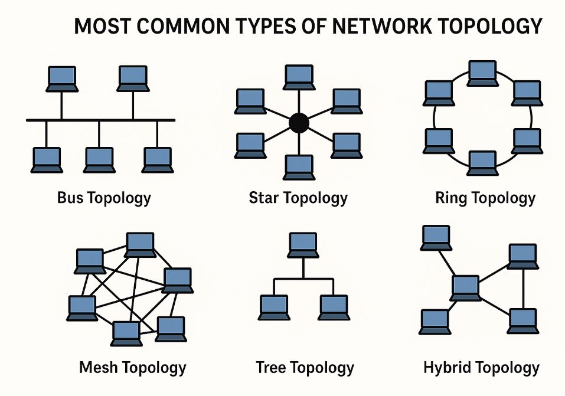

<!--Copyright © ZOMI 适用于[License](https://github.com/Infrasys-AI/AIInfra)版权许可-->

# 网络拓扑基本概述

author by: 张万豪

!!!!!!!
内容太大模型，自己重点去深入解读和理解拓扑，然后写成自己的技术博文

## 网络拓扑是什么

网络拓扑指的是网络中各种服务器、交换机和其他网络设备的**物理或者逻辑上的布局方式**。网络拓扑是一个**整体性的概念**，它描述的是**一个特定网络内部所有组件的总体布局和连接关系**，比如在一个公司内的网络拓扑、一个数据中心内的网络拓扑，可以把它看作是**整个网络的“骨架结构”**。

网络拓扑的主要作用是**决定网络中数据流动的路径和方式**，从而直接影响整个网络的**性能、可靠性和可扩展性**。一个设计良好的网络拓扑能够：优化网络性能、提升网络的可靠性与纠错能力、控制成本、简化管理与维护。

## 常见的网络拓扑类型

网络拓扑有多种常见的结构，这些是构建复杂网络的基础模块，如上图所示：

- **星型拓扑（Star Topology）**：所有设备都连接到一个中央节点（如交换机或集线器）。这是目前局域网中最常见的结构。
- **总线型拓扑（Bus Topology）**：所有设备共享一条单一的通信线路（总线）。结构简单，成本低，但总线故障会导致整个网络中断。
- **环形拓扑（Ring Topology）**：设备以点对点的方式连接成一个闭合的环路，数据沿固定方向在环中传输。
- **网状拓扑（Mesh Topology）**：节点之间存在多条连接路径。在完全网状拓扑中，每个节点都与其他所有节点直接相连，可靠性极高但成本也极为昂贵。
- **树形拓扑（Tree Topology）**：一种分层结构，由多个星型拓扑组合而成，形似一棵倒置的树。它易于扩展，但也存在根节点可能成为瓶颈的问题。
- **混合型拓扑（Hybrid Topology）**：将两种或多种基础拓扑结构结合起来，以满足特定的需求，兼顾不同拓扑的优点。

不同的网络拓扑结构有各自的优缺点，适应于不同的场景 。例如，**星型拓扑**因其易于管理和故障隔离的特点，广泛应用于企业办公网络。网状拓扑则因其极高的冗余和可靠性，成为**互联网骨干网络的核心选择**；**树形拓扑**虽然扩展性好，但其层级结构不可避免地会导致**靠近根节点的交换机成为流量瓶颈**，这对于需要全节点间高频通信（All-to-All）的AI负载是致命的。

## AI 驱动的网络拓扑设计

人工智能，特别是大规模深度学习模型的训练和推理，对传统数据中心网络架构提出了前所未有的挑战。随着模型参数规模从亿级迈向万亿级，计算集群从数百卡扩展至万卡乃至百万卡规模，**网络通信已成为影响整体系统性能和效率的关键瓶颈**。在分布式训练中，每个计算节点需在极短时间内同步梯度或参数，**网络延迟和带宽**直接决定了训练任务的加速比和资源利用率。

传统网络设计的目标通常是追求在**成本、易用性、可靠性、性能**之间做权衡，来满足多种应用的服务，并且主要设计用于处理**南北向流量**（客户端与服务器之间的通信）。而 AI 训练工作负载则产生大量**东西向流量**（服务器之间的通信），这种流量模式的根本差异使得传统网络拓扑难以满足 AI 工作负载的需求，AI 集群需要的是**高带宽、低延迟、无阻塞的网络基础设施**来支持频繁的节点间通信。

AI 集群设计的目标是让集群内部的大量 GPU 能够向一个计算机一样协同工作，所以 AI 集群中的网络拓扑设计的**核心需求**是**满足大规模并行计算带来的巨大通信压力**。对此，传统网络拓扑结构显露出了明显的局限性，比如**树形结构**存在根节点瓶颈问题，而**传统以太网**的丢包和拥塞控制机制不适合 AI 训练中的 all-reduce 通信模式，这些局限性促使了新型网络拓扑和通信技术的发展。目前在 AI 集群网络中主要有以下几种主流的拓扑技术：

- **胖树拓扑**（Fat-Tree）是由 Charles Leiserson 于 1985 年提出的网络结构，现已成为 AI 数据中心最主流的拓扑方案之一。其核心设计原则是**保持从根到叶子的带宽不变**，与传统树形结构越向上带宽越小的特点形成鲜明对比。在胖树中，越到树根，枝干越"粗"，即带宽越大，从而避免了顶层瓶颈问题

- **Clos 网络**是胖树拓扑的更一般化形式，由 Charles Clos 在 1953 年提出，最初用于电话交换系统。现代数据中心中，Clos 网络通常采用多级（如 5 级）交换结构，通过多个低成本、小容量的交换机构建大规模无阻塞网络。

- **环形拓扑**（Ring）是早期 AI 加速器（如 Google TPU）中采用的互联方案。在环形结构中，设备通过点对点连接形成闭环，数据沿着环单向或双向传输。Ring 拓扑的优点是**结构简单**、**布线成本低**和**延迟可预测**。
- **蜻蜓拓扑**（Dragonfly）提供了另一种大规模互联方案。Dragonfly 是一种**层次化**分组网络拓扑，将节点分组为多个"路由器组"，组内全连接，组间通过少量连接互联。这种设计大幅减少了全局直径，使得任意两个节点间最多只需经过两跳

- **环面拓扑**（Torus）是一种**多维网格**结构，每个节点与相邻节点连接，边缘节点实现回绕连接，形成环面。Torus 在超算领域有广泛应用（如 IBM Blue Gene），其优点是**结构规整**、**路径多样性**和**可扩展性**。但 Torus 的缺点是**直径较大**（节点间需要多跳）和**不均匀的延迟**

除了主流拓扑结构外，学术界和工业界还在探索多种创新网络设计：

- 华为提出了**UB-Mesh**（统一总线网格）互联架构。UB-Mesh 采用**统一总线协议**，将本地总线的概念扩展至数据中心级别，使不同类型端口间的通信无需额外转换，既降低了延迟，也简化了系统结构。UB-Mesh 采用**分层局部多维全互连**方式，通过不同维度实现任意节点间的完全连接，再由高维度连接低维度，形成混合型结构。

- 博通则提出了**Rail-Only**架构，并将其集成在最新发布的 Tomahawk 6 交换机芯片中。Rail-Only 是一种**高度简化的互连方案**，针对 AI 工作负载的通信模式进行了优化。与传统通用网络不同，Rail-Only 专注于**加速器间通信**的特定需求，通过减少不必要的协议转换和路径选择开销，提供**可预测的性能**和**低延迟**

在接下来的文章中，我们将深入探讨为这些网络拓扑的设计与适用场景。
