# NCCL 基本介绍

Author by: 刘军

在使用 GPU/NPU 进行大模型训练或推理时，因为模型太大所以需要使用多张卡组成集群，此时多卡之间的通信离不开 NCCL 通信库，本节主要介绍 NCCL 的通讯架构和工作原理。

## NCCL 基本介绍

本节主要参考英伟达官网（[https://developer.nvidia.com/nccl](https://developer.nvidia.com/nccl，)）关于 NCCL 的介绍，NCCL 是英伟达为实现 GPU 和 GPU 之间互联通信的集合通信库，提供相关协议和 API 接口。相关代码实现在 Github（[https://github.com/NVIDIA/nccl](https://github.com/NVIDIA/nccl)）开源，同时提供相关性能测试参考。

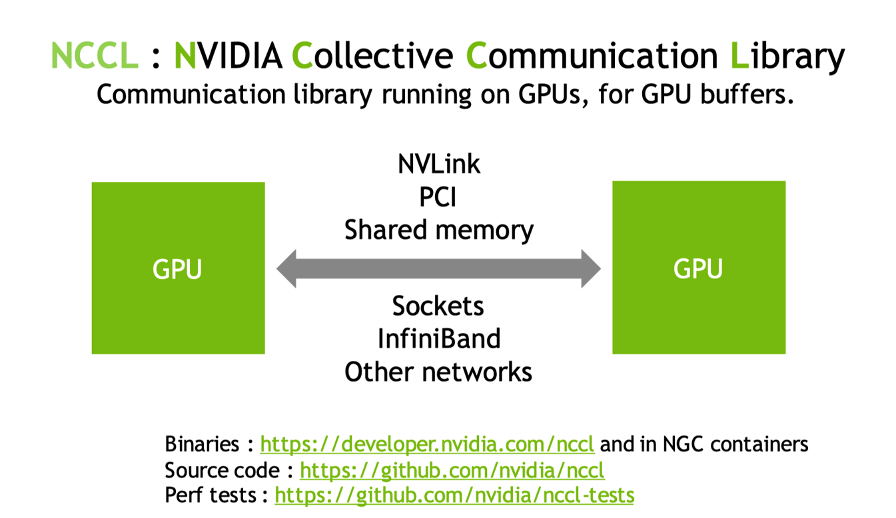

在整个深度学习软件栈中，最底层的是英伟达 GPU 相关硬件组成的多卡集群，中间层是 CUDA，更上层是基于 CUDA 实现的 NCCL，CUDNN 和 CUBLAS 等相关库，最上层就是 Tensorflow，PyTorch 等各种深度学习框架。

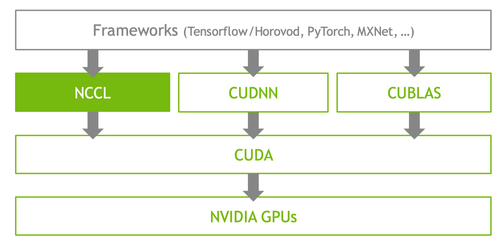

### 神经网络训练流程

在单张 GPU 卡上进行神经网络训练时，首先将数据 Batch 加载到 GPU，然后模型前向计算预测和损失，之后自动微分反向计算梯度，优化器用梯度更新模型参数，然后重复上面的过程。

+ 数据加载 (Data Loading)：数据样本被组合成一个 Batch（批次）。Batch Size（批次大小）是一个关键的超参数，决定了每次迭代用于计算梯度的样本数量。例如，Batch Size = 32 意味着每次处理 32 张图片或 32 个文本序列。

+ 前向传播 (Forward Pass)：模型根据存储在 GPU 显存中的当前参数（Parameters / Weights）逐层（Layer by Layer）进行计算，例如卷积、矩阵乘法、激活函数，每一层的输出是下一层的输入。经过所有层后，模型产生最终的预测输出（Predictions），例如图像分类的类别概率、回归的预测值。

+ 反向传播 (Backward Pass / Backpropagation)：前向传播计算得到的损失值（Loss），根据链式法则（Chain Rule），自动微分引擎计算损失值相对于模型每一层参数的偏导数（Partial Derivatives），这些偏导数就是梯度（Gradients）。 最终引擎计算出损失值相对于模型所有可训练参数的梯度，这些梯度存储在 GPU 显存中，与对应的参数形状相同。

+ 参数更新 (Parameter Update / Optimization Step)：反向传播计算得到的所有参数的梯度，优化器利用梯度和其内部状态以及学习率（Learning Rate）等超参数，计算出每个参数实际的更新量，参数更新旨在沿着梯度下降的方向，稍微改进模型在这个 Batch 上的表现。

+ 循环迭代 (Iteration Loop)：遍历整个训练数据集一次称为一个 训练轮次（Epoch），模型通常需要训练多个 Epoch 才能收敛到较好的性能。

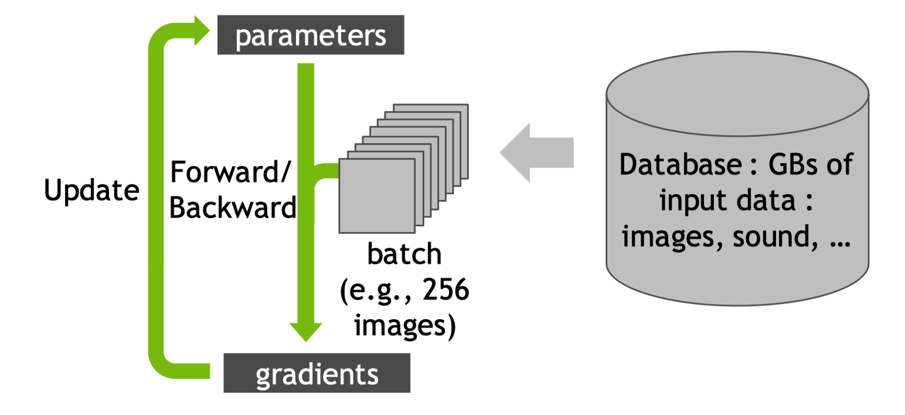

在使用多 GPU 进行数据并行训练时核心思想是复制相同的模型到多个 GPU 上，每个 GPU 处理不同的数据子集（Batch），然后聚合所有 GPU 计算出的梯度，并用聚合后的梯度更新所有 GPU 上的模型副本，确保所有副本始终保持一致。全局 Batch Size 是单卡 Batch Size 乘以 GPU 数量，例如，4 个 GPU，单卡 Batch Size=32，则全局 Batch Size=128。这些子 Batch 被分发到各个参与训练的 Local GPU（本地 GPU）的显存中。每个 GPU 获得一个互不重叠的子 Batch，每个 GPU 上的模型副本（Model Replica）具有完全相同的初始参数，独立地进行前向传播计算。每个 GPU 独立计算出损失值相对于其本地模型副本所有参数的本地梯度（Local Gradients），这些梯度存储在各自 GPU 的显存中。

为了计算能代表整个全局 Batch（128 个样本）的梯度，需要聚合所有 GPU 上计算出的本地梯度（每个只基于 32 个样本），这是数据并行中最核心的通信步骤。使用高性能通信库 NCCL 执行 Allreduce 操作（通常使用 SUM 或 AVERAGE 操作）。经过 Allreduce (+ Averaging) 操作后，所有 Local GPU 上存储的每个参数的梯度值都变得完全相同，且代表了整个全局 Batch 的平均梯度信息，这一步确保了模型更新的梯度在所有副本上是一致的。

然后进行本地参数更新，由于每个 Local GPU 现在拥有相同的、基于全局 Batch 的平均梯度。经过一次迭代后，多 GPU 训练更新的模型参数与在单个超大 GPU 上使用全局 Batch 进行一次训练更新的结果是等效的，然后循环迭代。


### 节点内和节点间通信

在使用多 GPU 进行数据并行训练时，使用 NCCL Allreduce (通常 Sum + Average) 将所有 GPU 的本地梯度聚合为全局平均梯度，并确保每个 GPU 都获得一份相同的副本。大小相同的子 Batch 能确保每个 GPU 的计算负载相对均衡，避免某些 GPU 等待其他 GPU 完成计算（负载不均衡），可以最大限度地利用所有 GPU 的算力。

NCCL 通过三大硬件协调通信过程，其中 GPU 负责执行 Reduce 操作并在缓冲区之间迁移数据；CPU 负责启动计算 Kernel 及 Host 端的协调管理；NIC 网卡承担跨节点数据包传输任务。

#### 节点内数据传输

NCCL 采用层次化架构来实现节点内通信，优先选择同一物理机内 GPU 间延迟最低、带宽最高的传输路径。该策略深度依赖 NVIDIA 的 GPUDirect P2P 技术，使 GPU 能够直接访问彼此的显存，不需要通过 CPU 系统内存进行中转。

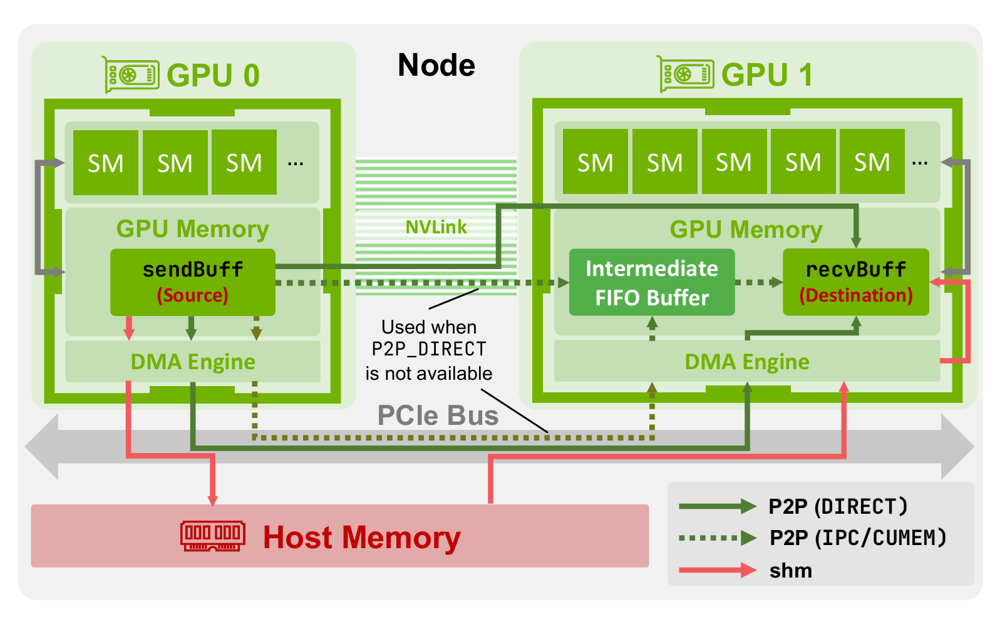

#### 节点间数据传输

NCCL 根据可用硬件在两种主要网络传输协议之间进行选择，首先是基于套接字的通信，当 NIC 不支持 RDMA 时，NCCL 采用套接字传输，在此模式下，中间缓冲区被分配为 Host 内存中的 CUDA 固定内存。

针对 IB 或 RoCE 等高性能网络，NCCL 采用传输方案利用 RDMA 技术，在最小化 CPU 干预的情况下实现节点间的直接数据传输。与套接字传输类似，所有传输均通过中间缓冲区进行中转，但该缓冲区的具体位置取决于硬件支持及配置参数。

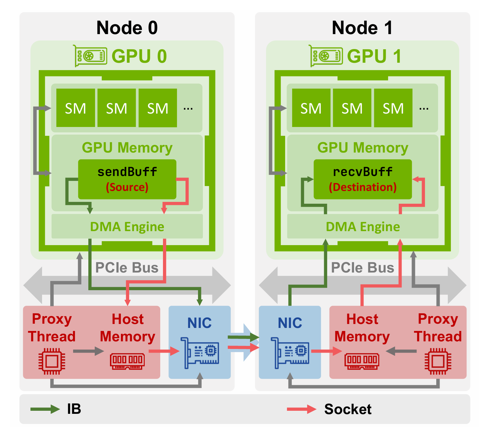

实际 GPU 和 GPU 进行通信的目的是同步神经网络模型里面的参数，同步的过程可以分为节点内（Intra-node）使用 NVLink/PCI 通信和节点之间（Inter-node）使用 Sockets/RDMA 进行通信，一般来说通信的带宽和效率，节点内会高于节点之间。

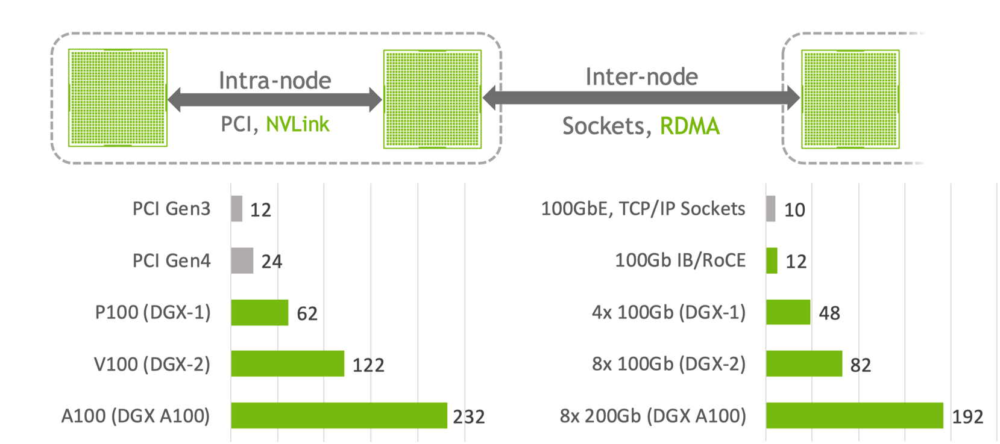

## 初始化过程

NCCL 用于在多个 GPU 之间进行高效的通信，在开始集合通信（如 AllReduce、Broadcast 等）之前，NCCL 必须初始化并建立通信所需的连接。NCCL 提供了相关 API，接下来解释相关 API 是如何定义和工作的。

### 建立通信所需的连接

初始化的执行过程主要分为 worker0 和 workers，worker0 可以看作是一个父节点或者父线程，首先初始化一个具体的 id 来声明自己是一个主线程，然后通知通信域中的所有其它 rank，其它并行的线程在感知或接受主线程的 id 之后会进行初始化去获取它相关的 IP，在拿到对应的 IP 信息之后开始真正去执行对应的 All-reduce 完成集合通信的操作。

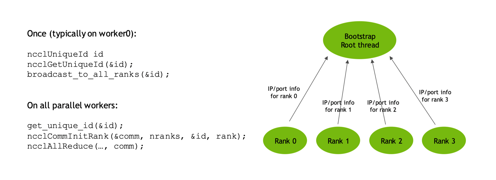

可以看出在整个初始化过程中，NCCL Bootstrap 在同一个任务中使用 TCP/IP sockets 去连接不同的 Ranks，然后提供一个带外信道在 Ranks 间传输不同的数据。Bootstrap 操作在 NCCL 整个生命周期内都是可用的，不过主要用于初始化阶段，当然也可以用于动态连接时 send/recv 操作。


### Bootstrap 代码实例

NCCL Bootstrap 过程是这一初始化的关键部分，目标是让所有参与通信的进程（每个进程通常对应一个 GPU）相互发现并建立连接。这个过程通常包括以下步骤：

1.**启动参数**：每个进程在启动时知道自己的信息（如本地 IP 地址、端口号、rank 等）以及一个共同的“引导信息”，这个信息通常包括一个或多个根进程的地址，用于协调发现过程。

2.**建立初始连接**：在 NCCL 中，通常使用一个或多个“引导服务器”或指定一个进程作为根（root）来协调。每个进程首先连接到这个根进程，并交换自己的网络地址信息。

3.**信息交换**：根进程收集所有进程的信息（如 IP 地址、端口号、rank 等），然后将这些信息广播给所有进程。这样每个进程就知道了所有其他进程的网络位置。

4.**建立对等连接**：每个进程使用获取到的信息与其他进程直接建立连接，这些连接将用于后续的集合通信操作。

5.**握手与验证**：建立连接后，进程之间会进行握手，验证彼此的身份，并协商通信参数（如协议、缓冲区大小等）。

在 NCCL 中，这个 Bootstrap 过程通常是通过一个名为 `ncclCommInitRank`或 `ncclCommInitAll`的 API 函数触发的。在底层，NCCL 使用套接字（sockets）进行初始的通信，然后可能会切换到更高效的传输方式（如 InfiniBand Verbs，或者通过 NVLink 进行 GPU Direct 通信）。

值得注意的是，NCCL 的 Bootstrap 过程需要确保所有进程能够相互通信，因此网络配置必须允许这些进程之间的连接。下面是一个简化的代码示例，展示如何使用 NCCL 进行初始化（包括 Bootstrap 过程）：

```c
#include<nccl.h>
#include<mpi.h> // 假设使用 MPI 来启动多个进程

int main(intargc, char*argv[]) {
  MPI_Init(&argc, &argv);
  int world_rank, world_size;

  MPI_Comm_rank(MPI_COMM_WORLD, &world_rank);
  MPI_Comm_size(MPI_COMM_WORLD, &world_size);

  ncclUniqueId id;

  if (world_rank == 0) {
    ncclGetUniqueId(&id); // 根进程生成唯一的 ID
  }

  MPI_Bcast(&id, sizeof(id), MPI_BYTE, 0, MPI_COMM_WORLD); // 广播给所有进程

  ncclComm_t comm;
  cudaStream_t stream;
  cudaStreamCreate(&stream);
  ncclCommInitRank(&comm, world_size, id, world_rank); // 初始化 NCCL 通信器

  // ... 使用 NCCL 进行集合通信 ...
  ncclCommDestroy(comm);
  cudaStreamDestroy(stream);
  MPI_Finalize();

  return 0;
}
```

在这个例子中使用 MPI 来启动多个进程。根进程（rank 0）调用 `ncclGetUniqueId`生成一个唯一的 ID，然后通过 MPI 广播给所有进程。每个进程（包括根进程）调用 `ncclCommInitRank`，传入这个 ID、总的进程数和自己的 rank。在 `ncclCommInitRank`函数内部，NCCL 执行了 Bootstrap 过程：每个进程尝试连接到根进程（通过 ID 中包含的地址信息），交换各自的地址信息，然后建立相互之间的连接。

需要注意的是，这个例子使用了 MPI 来广播 NCCL 的唯一 ID，但实际上，NCCL 并不依赖 MPI。任何能够将唯一 ID 从根进程传递到其他进程的方法都可以使用。

NCCL 的 Bootstrap 过程是一个关键步骤，它使得所有参与通信的进程能够相互发现并建立连接，为后续的集合通信做好准备。这个过程依赖于一个共同的引导信息（唯一 ID）和初始的根进程来协调信息的交换。

## 通信架构

在使用 NCCL 进行多 GPU 或多节点通信时，高性能计算和分布式计算中常见的通信初始化流程主要包括拓扑检测、图搜索，图连接和 Kernel 执行，在完成 Bootstrap 初始化之后，主要分为 4 步来进行通信：

+ 拓扑检测（Topology Detection）：首先 NCCL 会感知具体的物理拓扑，比如 GPU 之间的通信、CPU 之间的通信，使用 NVLink 或者 NVSwitch 通信；

+ 图搜索（Graph Search）：在获得了具体的拓朴信息之后，会进一步检索查找到拓扑关系中具体的环或者树结构；

+ 图连接（Graph Connection）：有了拓朴信息之后进行图连接，把节点和节点之间的连接关系转变为对应的序列形成图；

+ Kernel 执行（Kernel Execution）：得到图之后可以通过 CUDA 执行具体的集合通信操作。

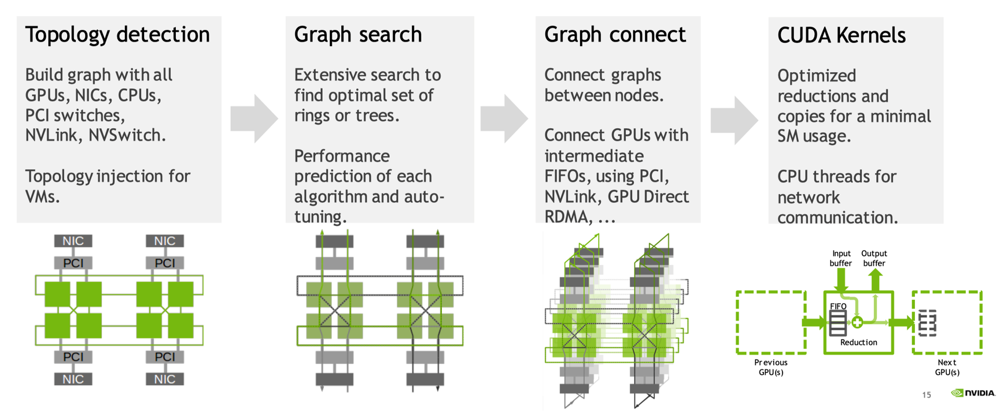

### 拓扑检测

拓扑检测是通信初始化的第一步，其目的是确定计算节点（如 GPU 或 CPU）之间的物理连接关系。具体来说 NCCL 会检测系统中的硬件资源，例如 GPU 的数量、位置以及它们之间的连接方式。对于 GPU，NCCL 会检查它们是否通过 NVLink 或 NVSwitch 连接。

NCCL 还会识别不同硬件之间的通信路径。例如，它会确定哪些 GPU 可以直接通过 NVLink 通信，哪些需要通过 PCIe 总线或网络接口进行通信。对于 CPU 之间的通信，它会检测 CPU 之间的 NUMA 拓扑结构。在检测拓扑的同时，NCCL 还会评估不同通信路径的性能，例如带宽和延迟。这些信息对于后续的通信优化至关重要，因为不同的通信路径可能具有不同的性能特性。

### 图搜索

在拓扑检测完成后，NCCL 会根据检测到的拓扑信息进行图搜索，以确定最优的通信结构。NCCL 会尝试在拓扑图中找到环（Ring）或树（Tree）结构。这些结构是集合通信（如 AllReduce、Broadcast 等）的常用拓扑形式。

在环结构中，每个节点（GPU 或 CPU）都与两个相邻节点相连，形成一个闭环。这种结构适用于某些类型的集合通信，例如环形 AllReduce。在树结构中，节点以层次化的方式连接，通常有一个根节点，其他节点通过分支连接。树结构适用于广播（Broadcast）和归约（Reduce）等操作。

NCCL 会根据拓扑检测阶段收集的性能数据，选择最优的通信结构。例如，如果某些 GPU 之间的 NVLink 连接具有高带宽和低延迟，NCCL 可能会优先选择这些连接来构建通信结构。

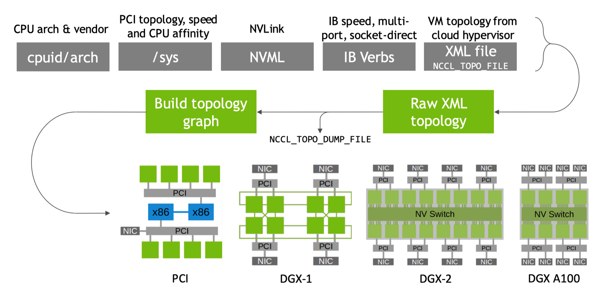

### 图连接

在确定了通信结构（环或树）之后，NCCL 会进行图连接，将节点之间的连接关系具体化。NCCL 会为每个节点之间的连接建立通信通道。这些通道可以是 NVLink、PCIe 或其他网络连接。具体来说，NCCL 会配置每个节点的通信接口，确保它们能够按照预定的拓扑结构进行通信。

NCCL 会将节点之间的连接关系序列化，形成一个具体的通信图。这个图定义了每个节点在通信过程中的角色和通信顺序。例如，在环结构中，每个节点会知道它的前驱和后继节点是谁；在树结构中，每个节点会知道它的父节点和子节点。

NCCL 还会为每个通信通道配置合适的通信协议。例如，对于 NVLink 连接，NCCL 会使用专为 NVLink 优化的协议；对于网络连接，它会使用 TCP/IP 或其他网络协议。

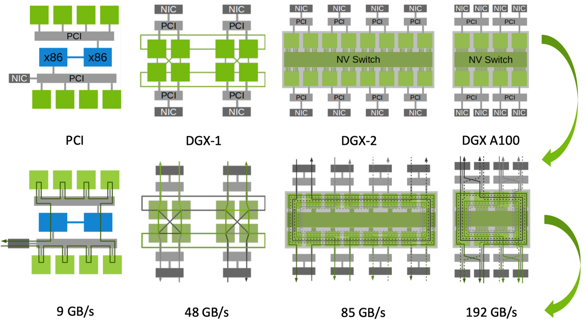

### Kernel 执行

最后一步是 Kernel 执行，即在构建好的通信图上执行具体的集合通信操作。NCCL 会通过 CUDA API 调用 GPU 上的 Kernel 来执行通信操作。这些 Kernel 是预先编写好的，用于实现各种集合通信算法，例如 AllReduce、Broadcast、Reduce 等。

在 Kernel 执行过程中，数据会在节点之间传输。NCCL 会确保数据传输的正确性和同步性。例如，在 AllReduce 操作中，每个节点会将自己的数据发送给其他节点，并接收其他节点的数据，最终每个节点都获得全局聚合的结果。NCCL 在 Kernel 执行阶段还会进行一些性能优化，它会根据通信图的拓扑结构和节点之间的连接性能，动态调整数据传输的顺序和方式，以提高通信效率。

上面四个步骤共同构成了 NCCL 在多 GPU 或多节点环境中的通信初始化和执行流程。拓扑检测提供了硬件连接信息，图搜索确定了最优的通信结构，图连接将通信关系具体化，而 Kernel 执行则实现了具体的通信操作。通过这一系列步骤，NCCL 能够高效地完成大规模并行计算中的集合通信任务。

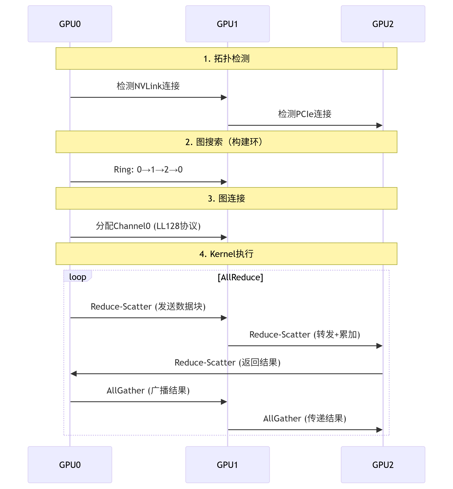

## 节点间通信

在节点之间通信，首先需要明确多 GPU 节点和交换机之间的连接方式，英伟达采用了多轨的连接方式，比如不同节点上的 GPU 连接到同一个交换机上。当假设通过 NIC 网口可以在节点间进行高效通信，那么具体的连接方式就是对每个节点的 Rings 进行相互连接。

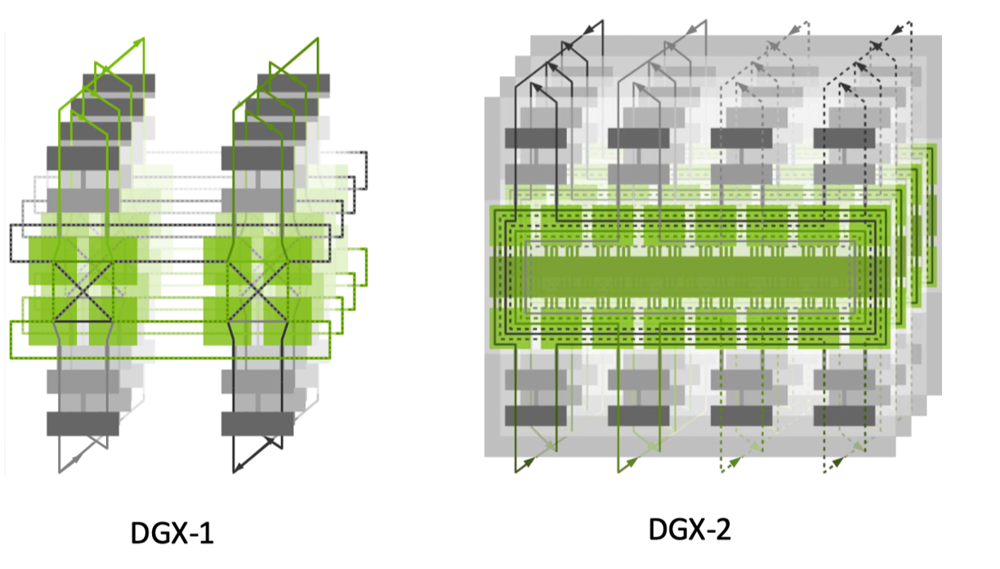

节点之间通信采用环（Rings）和树（Trees）两种方式，当采用环的通信方式时会把不同 GPU 组成一个具体的环连接，采用树的通信方式则是把不同节点组成一个子树图，节点内通过多块 NIC 网卡聚合带宽，实际的节点之间通信取决于物理拓扑的感知结果。

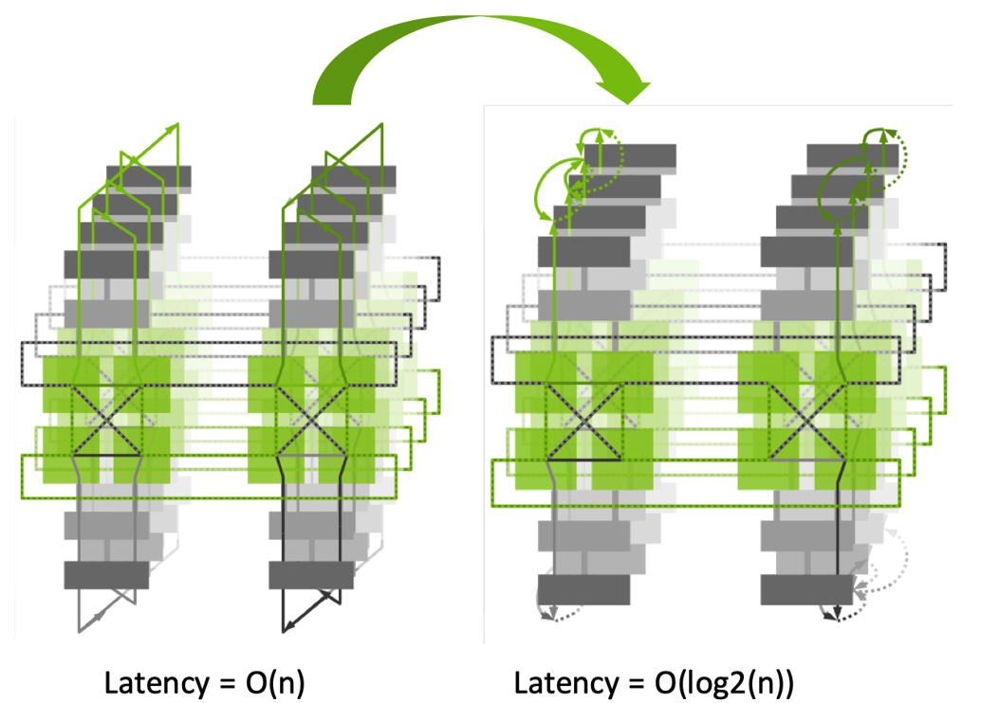

当节点规模很大的时候，节点间通信采用双二叉树（Dual binary tree）进行建图和通信，此时两棵树二叉树有两种模式，两棵互补二叉树，每一棵树处理一半的数据，充分利用网络带宽，可以最大化局部通信。

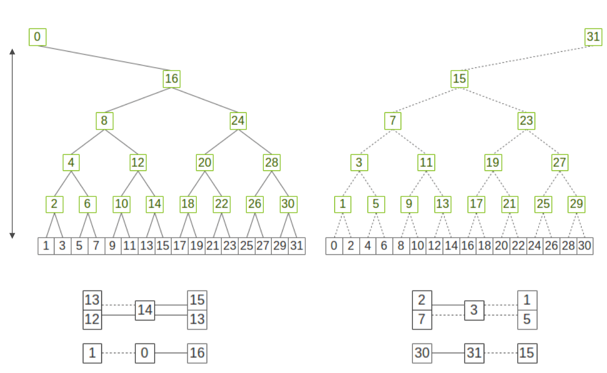

## CUDA 执行核心

GPU 核心内通过 GPU 内 FIFO 队列从其他 GPU 中接收和发送数据，同时使用本地和远程缓冲区执行 reductions 和 copy 操作，相关操作结束之后再通过 FIFO 输出到下一个 GPU 中。

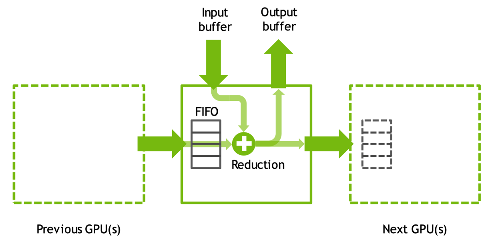

GPU0 和 GPU1 之间可能通过 NVLink 或者 NVSwitch 进行连接，当发生跨节点时就需要通过交换机并使用 Sockets 或者 Infiniband 网络从一个节点的 CPU 发送一个代理的线程到另一个节点的 CPU。

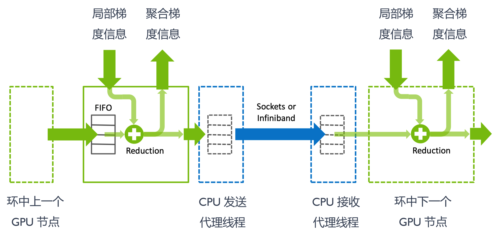

## 数据发送和接收

在数据发送和接收过程中，NCCL 对外提供了 send、recv、gather、scatter、alltoall、neighbor 等相关通信原语以及相关 API。例如 recvReduceSend 表示 GPU 从对端接收数据，与本地缓冲区执行归约操作，并将结果发送至下一个 GPU 的步骤。在执行过程中，NCCL 运行时通过循环步骤迭代调度这些原语，从而实现对不同算法、拓扑结构和传输层的灵活协调。


通过网络模型的优化，通过比较不同 Alltoall 实现算法在不同 GPU 数量时的带宽和时延，可以看出随节点数增加，网络时延也会增加，因此在上万卡集群中时延会达到更高的峰值。随着节点数的增多，集群规模越大，网络处在满带宽的情况，因此带宽理论值可以指引优化方向。


## 通信协议对比与使用

NCCL 使用 3 种不同的协议，分别是 LL、LL128 和 Simple，分别具有不同延迟（1us，2us 和 ~6us），不同带宽（50%、95% 和 100%）以及其他影响其性能的差异。时延越长带宽越高，时延越高带宽越长，不同协议在带宽和延迟之间做出了不同的权衡 。

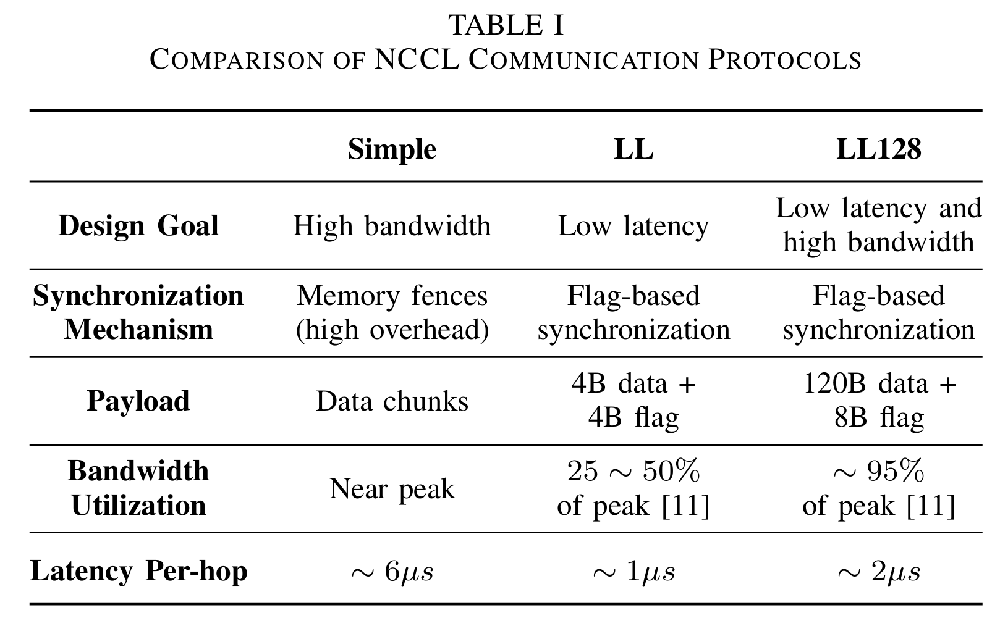

LL，Low Latency 协议可以优化小数据量传输，比如在小数据量情况下，打不满传输带宽时，优化同步带来的延迟。8 bit 原子存储操作，提供低延迟通信。LL128，Low Latency 128 协议依赖硬件 NVLink 实现，128 bit 原子存储实现低延迟，能够以较低延迟达到较大带宽，NCCL 会在带有 NVLink 硬件上默认使用该协议。Simple 协议使用场景较少，比如 CPU 与 GPU 通过 PCIe 的场景进行通信。以下是 NCCL 通信协议的对比总结：

| **特性** | **Simple 协议** | **LL 协议** | **LL128 协议** | **选择策略** |
| --- | --- | --- | --- | --- |
| **设计目标** | 最大化**大消息带宽** | 优化**小消息低延迟** | 兼顾**低延迟 + 高带宽**（NVLink 优化） | 动态适配消息大小与硬件条件 |
| **同步机制** | 内存屏障（高开销） | 轻量级标志同步（4B 数据+4B 标志） | 轻量级标志同步（120B 数据+8B 标志） |  |
| **传输单元** | 大块数据 | 8 字节原子操作（含数据+标志） | 128 字节原子操作（含数据+标志） |  |
| **关键优势** | 大消息接近**峰值带宽** | 小消息**延迟极低** | 带宽利用率高（≈95%峰值） | • **小消息** → LL/LL128（优先延迟）   • **大消息** → Simple（优先带宽） |
| **核心限制** | 小消息**延迟高**（屏障开销主导） | **带宽严重受限**（峰值 25-50%）   • 禁用 GPUDirect RDMA   • 中间缓冲强制位于主机内存 | **依赖硬件支持**   • 需 128 字节原子写   • 跨节点流水线受限 | • 受 `NCCL_PROTO` 设置、系统拓扑、GPU 架构约束   • NCCL 自动调优 |
| **适用场景** | 大规模数据并行（如 AI 训练） | 延迟敏感型小消息（如参数同步） | 需平衡延迟与带宽的中小消息 |  |

NCCL 在运行时根据用户配置（如 NCCL_PROTO 参数）、集合通信算法及内部性能启发式规则，动态选择 Simple、LL 和 LL128 三种协议。若未显式指定协议，系统将基于拓扑结构、GPU 架构、消息大小等性能指标构建调优模型，自动选择最优的算法-协议组合。典型场景下，针对小消息采用 LL/LL128 以降低通信延迟，而对大消息则选用 Simple 以实现最大吞吐量。NCCL 支持 5 种集合通信操作的算法与通信协议，提供 6 种算法，但并非每种算法均适合每种协议。


此外，不同节点通信拓扑结构，比如通信方式采用环或者树相关算法，很大程度上也会影响通信带宽。采用 16 个配备 NVIDIA GH200 的计算节点。每个节点提供 150GB/s 的节点内互联带宽，并通过 25GB/s 单向网络链路接入 Cray Slingshot 互连架构，基于此对 3 种 NCCL 通信协议在节点内与节点间 AllReduce 操作的性能进行了对比：

+ 在节点间，对于 Tree 和 Ring 算法：LL 协议与 LL128 协议在小消息（小于 64 KiB）场景表现最优。当 AllReduce 消息规模扩展至跨 16 节点的千兆字节量级时，其性能较 Simple 协议显著下降。

+ 在节点内通信场景中：LL128 协议凭借其充分利用 NVLink 的优势，在所有消息尺寸下均展现出稳定的性能表现。LL 与 Simple 分别在两个极端场景表现最优，Simple 协议擅长处理大消息。LL 协议则专精于小消息传输。

无论在节点内还是节点间通信环境下，Ring 算法在大消息传输中表现卓越，而 Tree 算法则更适用于小消息场景。

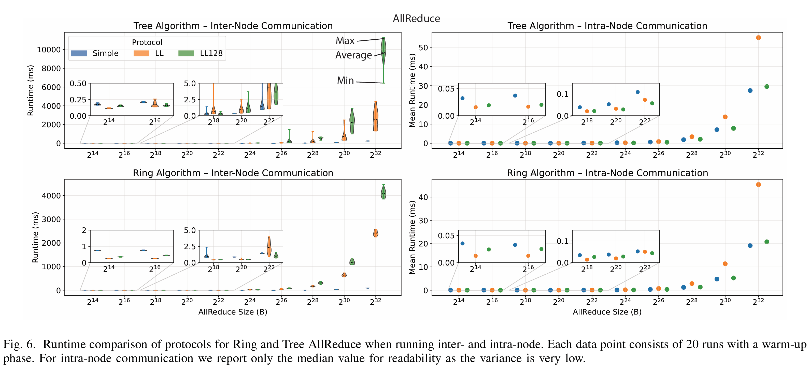

## 总结与思考

在单张和多张 GPU 卡上进行神经网络训练的基本过程中需要使用 NCCL 集合通信实现数据并行，梯度聚合确保每个 GPU 都获得一份相同的副本，同时大小相同的子 Batch 能确保每个 GPU 的计算负载相对均衡，避免某些 GPU 等待其他 GPU 完成计算（负载不均衡），可以最大限度地利用所有 GPU 的算力。

节点内数据传输优先选择同一物理机内 GPU 间延迟最低、带宽最高的传输路径。该策略深度依赖 NVIDIA 的 GPUDirect P2P 技术，使 GPU 能够直接访问彼此的显存，不需要通过 CPU 系统内存进行中转。

在进行节点间数据传输时，NCCL 根据可用硬件在两种主要网络传输协议之间进行选择，首先是基于套接字的通信，当 NIC 不支持 RDMA 时，NCCL 采用套接字传输，针对 IB 或 RoCE 等高性能网络，NCCL 采用传输方案利用 RDMA 技术。一般来说节点内通信的带宽和效率会高于节点之间的通信。

NCCL Bootstrap 过程是初始化的关键部分，目标是让所有参与通信的进程（每个进程通常对应一个 GPU）相互发现并建立连接，为后续的集合通信做好准备。

在使用 NCCL 进行多 GPU 或多节点通信时，拓扑检测提供了硬件连接信息，图搜索确定了最优的通信结构，图连接将通信关系具体化，而 Kernel 执行则实现了具体的通信操作。通过这一系列步骤，NCCL 能够高效地完成大规模并行计算中的集合通信任务。

NCCL 使用 LL、LL128 和 Simple 3 种不同的通信协议，分别具有不同延迟（1us，2us 和 ~6us），不同带宽（50%、95% 和 100%）以及其他影响其性能的差异。时延越长带宽越高，时延越高带宽越长，不同协议在带宽和延迟之间做出了不同的权衡 。与此同时不同节点通信拓扑结构，比如通信方式采用环或者树相关算法，很大程度上也会影响通信带宽。

## 内容参考

Demystifying NCCL: An In-depth Analysis of GPU Communication Protocols and Algorithms，[https://www.arxiv.org/abs/2507.04786](https://www.arxiv.org/abs/2507.04786)

NCCL 系列之深入理解内部原理和运行机制，[https://mp.weixin.qq.com/s/EtPXyXD6l8Xt18pvMJxSLg](https://mp.weixin.qq.com/s/EtPXyXD6l8Xt18pvMJxSLg)

## 本节视频

<html>
<iframe src="https://player.bilibili.com/player.html?isOutside=true&aid=112991261428456&bvid=BV1SWpXe2Epa&cid=500001655289821&p=1" width="100%" height="500" scrolling="no" border="0" frameborder="no" framespacing="0" allowfullscreen="true"> </iframe>
</html>
