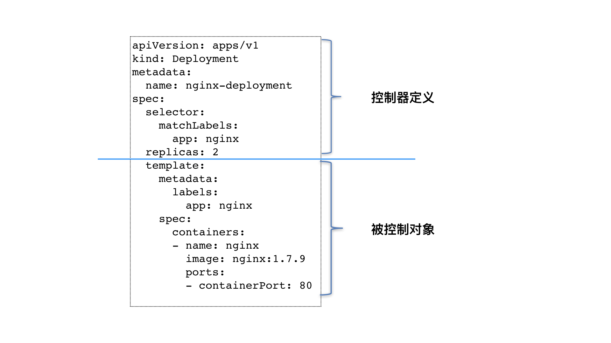

<!--Copyright © ZOMI 适用于[License](https://github.com/Infrasys-AI/AIInfra)版权许可-->

# k8s容器编排与作业管理

> Author by: 何晨阳

k8s本质上是面向数据中心的操作系统，容器编排和作业管理是云原生架构的核心支撑。其中容器编排负责应用容器的自动部署、扩缩容、负载均衡和自愈，保证服务高可用运行。同时作业管理则专注于批处理和定时任务的自动调度与容错，提升任务执行可靠性和自动化水平。

## 容器编排

首先我们来思考为什么需要容器编排？其有哪些优势？其实现原理是什么？

### 容器编排的由来

随着复杂应用和大规模部署的挑战，使用复杂脚本来管理大规模机器的方法变的越来越力不从心。同时在面对服务扩缩容、故障自愈、资源优化等问题时，也缺少一套统一的方案来应对。于是“容器编排”这项技术应运而生。

这项技术正是基于前文介绍的Cgroups与Namespaces等基础技术，为容器发展奠定了基础。Linux Containers是早期容器实现，后面随着Docker诞生，提供了标准化的容器镜像格式和相应的命令行工具，但是此时还缺乏自动化等编排能力。随着Docker Compose、Docker Swarm等编排工具的发展，容器逐步具备了调度编排等能力。随着Kubernetes的开源，其逐步成为容器编排领域内的事实标准，拥有全球最大的开源社区，并构建了丰富的生态工具，引领着云原生技术发展。

### 容器编排的优势

**其最大的优势便是自动部署与管理**，只需要开发运维人员预先定义好期望的状态，系统便能自动运行，直至达到期望的状态。

**弹性扩缩容的能力**，可以根据负载自动增加或减少容器副本数，优化资源利用率，提升服务的弹性。

**故障自愈能力**，随着机房机器规模的增长，机器故障也逐渐成为常态。其能够自动检测容器和节点故障，实现自动重启、迁移或替换，保障服务的高可用。

### 实现原理

Pod是k8s中最核心的设计之一，本质上是一组超亲密容器集合，容器间共享IPC、Network、UTS等命名空间，是k8s中最基本的单位。引入Pod后，应该如何让Pod内的容器能够共享资源和数据呢？

答案见下图中的infra container。它作为Pod中第一个启动的容器，负责申请基础的UTS、IPC、网络等命名空间，而其他容器通过setns共享该命名空间。但是PID和文件系统的命名空间仍然是隔离的，因为容器需要独立的文件系统，并且避免某些容器进程缺少PID=1的进程。当然，如果想要共享PID命名空间，也可以在Pod的yaml中设置shareProcessNamespace:true来实现。


有了Pod作为最小调度单元后，于是又抽象出Deployment这个概念，用于管理应用发布。它可以通过定义Pod模版，来控制ReplicSet的创建和更新，实现滚动更新等管理功能。

以如下代码为例，其定义了期望的Pod副本数。可以看出Deployment的设计哲学是，通过声明式API定义期望的状态，只关注要做什么，不关注实现过程。

```yaml
apiVersion: apps/v1
kind: Deployment
spec:
  replicas: 3          # 期望的Pod副本数
  revisionHistoryLimit: 10  # 保留的旧ReplicaSet数量
  strategy:
    type: RollingUpdate
    rollingUpdate:
      maxSurge: 1       # 允许超出期望副本数的最大Pod数
      maxUnavailable: 0 # 更新期间允许不可用的Pod数
  template:            # Pod模板
    spec:
      containers:
      - name: nginx
        image: nginx:1.25.3

```

完成Pod相关功能定义后，再向上一层就需要对外暴露底层服务。这个功能就是通过**Service**和**Ingress**来实现。

Service通过为变化的Pod提供稳定的访问入口，屏蔽Pod Ip变化带来的影响。Ingress基于域名、路径等L7规则将外部请求路由到不同的Service，比如example.com/app1 路由到 app1-svc，example.com/app2 路由到 app2-svc。

如下图定义了k8s中核心功能模块关系图，本章节重点介绍了Pod、Deployment、Service和Ingress等概念，后续章节将继续介绍剩下的模块。


### 控制器模型

为了实现对不同的对象、资源的编排操作，核心就是通过控制器模型实现的。如下图所示，其首先会通过上半部分定义期望的状态，下半部分定义被控制对象的模版组成。



定义完期望状态后，会通过控制循环，来将目标对象调谐到指定的状态，执行逻辑如下：

```go
for {
  实际状态 := 获取集群中对象 X 的实际状态（Actual State）
  期望状态 := 获取集群中对象 X 的期望状态（Desired State）
  if 实际状态 == 期望状态{
    什么都不做
  } else {
    执行编排动作，将实际状态调整为期望状态
  }
}
```

### 关键功能

Kubernetes通过声明式配置与控制循环机制，将容器编排抽象为四大核心能力，通过对这四种能力的总结，能进一步了解其设计背景与价值所在。

**资源分配智能化**的核心在于调度算法的优化与资源感知。k8s调度器持续监控集群中各节点的资源状态，包括实时CPU利用率、内存剩余量、存储类型及网络拓扑。当用户提交Pod部署请求时，调度器不仅考虑基本的资源请求（requests）和限制（limits），还会结合节点亲和性规则（nodeAffinity）决定最优部署位置。例如，针对需要GPU加速的工作负载，调度器会筛选带有特定标签的节点，同时避免将高内存消耗的Pod部署到磁盘I/O密集型节点，防止资源竞争。存储的动态供给机制则通过StorageClass实现自动化卷创建，当PersistentVolumeClaim声明存储需求时，系统自动关联匹配的存储后端并挂载到Pod，这种机制有效解决了传统运维中手动配置存储的繁琐问题。

**故障恢复自动化**依赖于控制器模式与健康检查机制的协同。每个Deployment控制器持续监听APIServer的状态变化，当检测到实际运行的Pod副本数低于预期时，立即触发ReplicaSet创建新实例。健康探针在此过程中起到关键作用：存活探针（LivenessProbe）定期检测应用进程状态，若连续失败则重启容器；就绪探针（ReadinessProbe）确保Pod完成初始化后再接入服务流量，避免请求分发到未准备好的实例。当底层节点发生故障时，节点控制器会标记节点状态为NotReady，并启动驱逐流程，将受影响Pod重新调度到健康节点。这种设计使得单个节点或Pod的故障对整体服务的影响被控制在毫秒级，实现了系统层面的高可用性。

**基础设施抽象化**通过分层设计屏蔽环境差异。在存储层面，PersistentVolume将物理存储设备抽象为统一接口，开发者只需声明所需存储大小和访问模式，无需关心底层是NFS、云盘还是本地SSD。（存储、网络等相关知识，后文会详细介绍）网络抽象则通过Service和CNI插件实现，ClusterIP类型的Service为Pod集合提供稳定的虚拟IP，Ingress资源定义七层路由规则，而具体流量转发由IngressController（如Nginx、Traefik）实现。这种抽象机制使得应用可以无缝迁移跨公有云、私有云甚至边缘节点，运维人员通过统一API管理异构资源，显著降低了环境适配成本。

**变更操作无损化**的实现依赖于版本控制与流量管理策略。Deployment控制器在更新镜像时，会创建新的ReplicaSet并逐步调整新旧副本集的比例，通过maxSurge参数控制同时创建的新Pod数量，maxUnavailable参数确保最少可用实例数。在Pod终止阶段，kubelet先发送SIGTERM信号触发应用优雅关闭流程，等待terminationGracePeriodSeconds后强制终止，确保进行中的请求处理完毕。对于需要零停机的高敏感服务，PreStop钩子可执行自定义清理脚本，如从负载均衡器摘除节点。金丝雀发布场景下，通过ServiceMesh或IngressAnnotation将部分流量路由到新版本，验证通过后再全量切换，这种渐进式更新最大限度降低了变更风险。

一些主要功能的配置如下所示：

| 功能 | 描述 | 配置示例 |
|------|------|----------|
| 自动调度 | 基于资源需求和节点亲和性 | `nodeSelector: {disk: ssd}` |
| 自愈能力 | 自动重启故障容器 | `restartPolicy: Always` |
| 滚动更新 | 零停机部署 | `strategy: {type: RollingUpdate}` |
| 存储编排 | 动态挂载持久卷 | `persistentVolumeClaim: my-pvc` |

### Deployment 配置示例

Deployment是管理无状态应用的核心抽象对象，下面是一个配置示例，其定义了Kubernetes Deployment的YAML配置文件，用于部署一个Nginx服务的多副本实例：

```yaml
apiVersion: apps/v1
kind: Deployment
metadata:
  name: nginx-deploy
spec:
  replicas: 3
  selector:
    matchLabels:
      app: nginx
  template:
    metadata:
      labels:
        app: nginx
    spec:
      containers:
      - name: nginx
        image: nginx:1.25
        ports:
        - containerPort: 80
```

## 作业管理（Job Management）

Kubernetes 作业管理通过 Job 和 CronJob 实现了对非持续型任务的精细化控制，主要包括一次性任务和定时执行任务。

### Job（一次性任务）

运行直到**成功完成**（退出码为 0）的离散任务，配置示例如下所示，定义了完成任务总数、同时运行Pod数量等：

```yaml
apiVersion: batch/v1
kind: Job
metadata:
  name: data-processing
spec:
  completions: 6     # 需要完成的任务总数
  parallelism: 2     # 同时运行的Pod数量
  backoffLimit: 3    # 失败重试次数
  template:
    spec:
      containers:
      - name: processor
        image: data-tool:v3.2
        command: ["python", "/app/process.py"]
      restartPolicy: OnFailure  # 失败时自动重启
```

### CronJob（定时执行任务）

下面定义了一个每天3点运行的任务示例：

```yaml
apiVersion: batch/v1
kind: CronJob
metadata:
  name: daily-report
spec:
  schedule: "0 3 * * *"  # 每天 3 点运行
  jobTemplate:
    spec:
      template:
        spec:
          containers:
          - name: report-generator
            image: report-tool:latest
          restartPolicy: OnFailure
```

### 关键参数

作业管理的一些关键配置参数如下所示：

| 参数| 作用 | 示例值 |
|------|------|----------|
| backoffLimit | 失败重试次数 | 3 |
| activeDeadlineSeconds | 任务超时时间 | 3600 |
| successfulJobsHistoryLimit | 保留成功 Job 记录数 | 5 |
| failedJobsHistoryLimit | 保留失败 Job 记录数 | 2 |

### 容器编排 vs 作业管理对比

下面比较了容器编排和作业管理各自适用的场景以及一些策略差别：

| 维度| 容器编排（Deployment） | 作业管理（Job/CronJob） |
|------|------|----------|
| 设计目标 | 长期运行服务 | 离散任务执行 |
| 生命周期 | 持续运行 | 运行到完成/超时 |
| 重启策略 | Always (默认) | OnFailure/Never |
| 扩缩容机制 | HPA 自动扩缩 | parallelism 手动控制并发 |
| 典型场景 | Web 服务/数据库 | 批处理/定时报表/数据迁移 |

### 最佳实践

下面是使用时的推荐的一些最佳配置：

- **资源限制：为Job设置resources.requests/limits 避免资源竞争。**
- **超时控制：使用activeDeadlineSeconds防止任务卡死。**
- **存储分离：Job中挂载临时卷（emptyDir）避免数据残留。**
- **监控：通过Prometheus监控Job执行状态和时长。**

## 总结与思考

k8s通过容器编排和作业管理，实现了大规模容器部署，解决了手动调度效率低、易出错等问题，通过 Job/CronJob 优化了批处理任务管理。借助这两大能力，实现了从基础设施到应用层的全栈自动化，构建了现代分布式系统的基石。

## 参考与引用

- https://aws.amazon.com/cn/what-is/container-orchestration/
- https://www.cnblogs.com/BlueMountain-HaggenDazs/p/18147309（《深入剖析 Kubernetes》容器编排与 k8s 作业管理）
- https://www.thebyte.com.cn/container/summary.html
