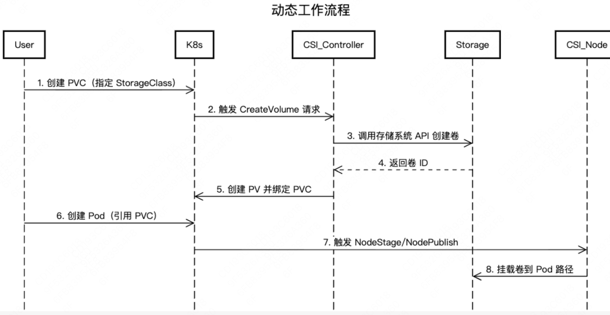

<!--Copyright © ZOMI 适用于[License](https://github.com/Infrasys-AI/AIInfra)版权许可-->

# K8S 容器持久化存储

> Author by: 何晨阳

容器持久化存储是有状态服务容器化的基石，解决了临时存储无法满足数据持久性、共享性和高可用性的核心痛点。从以下三个视角可以看出其存在的必要性与合理性：

- **开发者视**：只需声明存储需求，无需关注底层实现。
- **运维视角**：自由更换存储后端（NFS/云盘/分布式存储）不影响业务。
- **核心价值**：实现应用与基础设施的关注点分离。

## 核心概念与架构

首先了解容器持久化相关的基础概念，主要包括一些概念的抽象。

### 存储抽象层

Kubernetes 的存储抽象层是解耦应用与底层存储基础设施的核心设计，其核心组件与逻辑关系如下：


### 核心组件关系

其中核心组件的角色、生命周期关系如下表所示：

| 组件 | 角色 | 生命周期 | 创建者 |
|------|------|----------|----------|
| PersistentVolume (PV) | 集群存储资源 | 独立于 Pod | 管理员/StorageClass |
| PersistentVolumeClaim (PVC) | 用户存储请求 | 与应用 Pod 关联 | 开发者 |
| StorageClass (SC) | 存储动态供应模板 | 集群级别长期存在 | 管理员 |

## 存储类型详解

为了支持不同存储介质，支持了多种不同的卷类型。

### 卷类型比较

Kubernetes中主要存储卷类型的对比分析，主要特点、适用场景如下所示：

| 类型 | 特点 | 适用场景 | 示例 |
|------|------|----------|----------|
| 本地存储 | 高性能，节点绑定 | 临时缓存 | hostPath, emptyDir |
| 网络存储 | 跨节点共享 | 数据库/共享文件 | NFS, CephFS |
| 云存储 | 托管服务，高可用 | 云原生应用 | AWS EBS, GCP PD |
| 分布式存储 | 可扩展性强 | 大数据平台 | GlusterFS, Ceph RBD |

### 访问模式

Kubernetes 中存储卷的访问模式（Access Modes）定义了存储介质如何被节点（Node）或 Pod 挂载和使用。以下是核心访问模式的详细说明及适用场景：

| 类型 | 特点 | 适用场景 | 
|------|------|----------|
| ReadWriteOnce (RWO) | 单节点读写 | 块存储(EBS) | 
| ReadOnlyMany (ROX) | 多节点只读	 | 文件存储(NFS) |
| ReadWriteMany (RWX)	 | 多节点读写	 | 分布式存储(CephFS) | 

## Volume

Volume（存储卷） 是用于在容器之间或容器重启后持久化数据的抽象层。与Docker容器内的临时存储不同，k8s Volume的生命周期与 Pod绑定，而非单个容器，确保数据在容器重启、重建或跨容器共享时不丢失。

### 核心作用

Volume是用于解决容器数据持久化、跨容器数据共享以及安全存储敏感信息的关键机制。其核心作用如下：

- **数据持久化：**容器重启后数据不丢失（容器本身的文件系统是临时的）。
- **跨容器共享：**同一Pod内的多个容器可通过Volume共享数据。
- **集成外部存储：**对接各种外部存储系统（如本地磁盘、云存储、分布式存储等）。
- **配置管理：**通过Volume向容器注入配置文件（如 ConfigMap、Secret）。

### 临时卷类型

临时卷是Kubernetes中处理短期数据的轻量化方案，通过emptyDir和本地存储机制，为临时文件、缓存和跨容器通信提供高效支持。临时卷与Pod绑定，Pod删除后数据就不存在了。临时卷的使用说明、和场景示例如下所示：

| 类型 | 说明 | 场景示例 | 
|------|------|----------|
| emptyDir | Pod 创建时自动创建的空目录，存储在节点本地（内存或磁盘） | 容器间临时数据共享、缓存 | 
| configMap | 将 ConfigMap 中的配置数据挂载为文件	 | 应用配置注入 |
| secret	 | 类似 ConfigMap，但用于存储敏感数据（如密码、证书），数据会 base64 编码	 | 数据库密码、API 密钥挂载 | 
| downwardAPI	 | 将 Pod 或容器的元数据（如名称、IP）挂载为文件	 | 应用获取自身运行时信息 | 

下面是一个临时卷的配置示例，Nginx容器将日志写入/var/log/nginx，Fluentd容器从/logs读取并处理，共享同一个emptyDir卷。

```yaml
apiVersion: v1
kind: Pod
metadata:
  name: log-processor
spec:
  containers:
  - name: web-server
    image: nginx
    volumeMounts:
    - name: shared-logs
      mountPath: /var/log/nginx
  - name: log-collector
    image: fluentd
    volumeMounts:
    - name: shared-logs
      mountPath: /logs
  volumes:
  - name: shared-logs
    emptyDir: {}
```

### 持久化存储类

顾名思义，持久化存储用于保存需要长期保留的数据，确保即使Pod被删除或节点故障，数据依然安全可用。以下是持久化存储类型及场景示例：

| 类型                          | 说明                                                                 | 场景示例                     |
|-------------------------------|----------------------------------------------------------------------|------------------------------|
| **persistentVolumeClaim (PVC)** | 通过PVC动态绑定PersistentVolume (PV)，抽象存储细节                | 数据库数据持久化             |
| **hostPath**                  | 将节点本地磁盘路径直接挂载到Pod(不推荐在生产环境使用)              | 开发测试、节点级日志存储     |
| **nfs**                       | 挂载 NFS (网络文件系统) 共享目录                                     | 跨节点数据共享               |
| **云厂商存储**                | 如awsElasticBlockStore (AWS)、gcePersistentDisk (GCP)、azureDisk (Azure) | 云环境中持久化存储           |
| **分布式存储**                | 如cephfs、glusterfs、rook (基于 Ceph)                              | 大规模分布式存储需求         |

下面是一个云原生块存储的配置示例，适用于高性能、低延迟的单节点读写，其中alicloud-disk-ssd表示使用阿里云提供的SSD云盘存储类。

```yaml
apiVersion: v1
kind: PersistentVolumeClaim
metadata:
  name: mysql-pvc
spec:
  accessModes:
    - ReadWriteOnce
  storageClassName: alicloud-disk-ssd
  resources:
    requests:
      storage: 100Gi
```

### 特殊用途卷类型 csi

CSI（Container Storage Interface）是容器存储接口的标准，允许存储供应商编写插件来支持其存储系统。CSI 卷类型允许Pod使用任何符合CSI规范的存储驱动程序。

下面的yaml，展示了通过CSI接口扩展存储能力的典型方式，适用于需要对接非原生存储系统的场景。实际生产环境中，需替换`my-csi-driver`为具体存储方案对应的驱动名称（如AWS EBS、Azure Disk、Ceph RBD等）。

```yaml
apiVersion: v1
kind: Pod
metadata:
  name: csi-pod
spec:
  containers:
  - name: test-container
    image: nginx:1.20
    volumeMounts:
    - mountPath: /data
      name: csi-volume
  volumes:
  - name: csi-volume
    csi:
      driver: my-csi-driver
      volumeAttributes:
        storage.kubernetes.io/csiProvisionerIdentity: my-provisioner
```

## 持久化卷

### 核心概念

持久化卷（PersistentVolume，PV）是集群级别的存储资源抽象，其核心作用是为有状态应用提供与Pod生命周期解耦的持久化存储。比如数据库应用中，当Pod被删除、重建或节点迁移时，确保数据可以独立于Pod存在。下面是持久化卷中最关键的三个概念：

- PersistentVolume：PV具有独立于Pod的生命周期，封装了底层存储实现的具体细节。
- PersistentVolumeClaim：类似于Pod消耗节点资源，PVC 消耗 PV 资源。用户通过 PVC 请求特定大小和访问模式的存储，无需了解底层存储实现。
- StorageClass：支持动态配置、不同的服务质量级别，并可定义配置参数和回收策略。

### 关键阶段说明

在k8s持久化存储管理中，持久化卷包括六个关键阶段。以下是各个阶段的简要介绍：

| 阶段           | 触发条件       | 系统行为             | 持续时间          |
|----------------|----------------|----------------------|-------------------|
| Provisioning   | PVC创建        | 动态分配存储资源     | 秒级~分钟级       |
| Binding        | PVC匹配PV      | 建立绑定关系         | 瞬时完成          |
| Using          | Pod挂载        | 数据读写操作         | 应用运行期        |
| Releasing      | PVC删除        | 解除 PV 绑定           | 瞬时完成          |
| Reclaiming     | PV释放         | 执行回收策略         | 依赖策略类型      |
| Recycling      | 回收完成       | 等待重新绑定         | 无限期            |

### 生命周期管理

PV和PVC按照配置阶段不同，又可以分为静态配置和动态配置。静态配置指管理员手动创建PV，而非通过StorageClass动态生成。CSI在此场景中负责底层存储的挂载与卸载操作。流程如下，管理员手动在集群中创建PV，配置存储类型、路径等。用户创建PVC，声明所需容量和访问模式。Kubernetes自动将PVC与合适的PV进行绑定。


动态配置指通过StorageClass和PVC自动创建并绑定PV，无需管理员手动预配存储资源。
Kubernetes自动根据StorageClass动态创建PV并绑定到PVC。流程如下：



静态配置灵活性较低，变更需要人工干预。而动态配置灵活性高，支持弹性扩展。静态配置适合传统、固定需求的场景，动态配置则更适合现代云原生、自动化和弹性扩展的应用。

在实际运维中，还会面临着卷扩容的需求。扩容过程首先会确认PVC及StorageClass支持扩容，然后调整PVC中的配置spec.resources.requests.storage为更大的值。k8s控制器检测到变更并触发扩容。交互流程如下所示：


在传统的立即绑定模式下，PVC创建时会立即与符合条件的PV绑定。这种方式可能导致以下问题：
- **资源调度冲突**：当PVC绑定到PV后，Kubernetes调度器必须将Pod调度到PV所在的节点。若节点资源不足（如CPU、内存），Pod可能无法运行，导致资源浪费或调度失败。
- **存储资源浪费**：提前绑定的PV可能被预留但未被实际使用，尤其在动态供应场景下，可能创建不必要的存储资源。

延迟绑定模式下，PVC不会立即绑定到PV，而是等到第一个使用该PVC的Pod被调度时才进行绑定。具体流程如下：


### StorageClass 示例

StorageClass 为管理员提供了描述和管理存储资源的标准化方法，用于解决静态配置的局限性，传统方式需管理员手动创建PV，无法适应云原生场景中存储资源的弹性需求。同时为了解决存储后端差异化问题，不同存储系统（如AWSEBS、Ceph、NFS）的配置参数差异大，需统一抽象接口，比如上述的动态工作流程、延迟绑定都会用到该能力。使用示例如下，展示定义了一个名为fast-ssd的StorageClass，用于在Kubernetes集群中动态创建高性能AWS EBS存储卷：

```yaml
apiVersion: storage.k8s.io/v1
kind: StorageClass
metadata:
  name: fast-ssd
provisioner: kubernetes.io/aws-ebs
parameters:
  type: gp3
  fsType: ext4
  iops: "10000"
  throughput: "250"
reclaimPolicy: Delete
allowVolumeExpansion: true
volumeBindingMode: WaitForFirstConsumer
```

### PV/PVC状态流转

PV 的状态转换规则如下：

- Available → Bound：PVC与PV的storageClassName、accessModes、容量 匹配，且 PV 处于可用状态。
- Bound → Released：绑定的 PVC 被删除，且PV的persistentVolumeReclaimPolicy为Retain。
触发操作：kubectl delete pvc <name>。
- Released → Available：管理员手动清理PV（删除并重新创建相同配置的 PV）。
- Released → Failed：PV 回收策略为Delete，但存储后端删除卷失败（如权限不足、网络故障）。
- Failed → 删除：管理员手动删除 PV。


PVC 的状态转换规则如下：

- Pending → Bound：找到匹配的 Available PV；StorageClass的Provisioner成功创建PV。PV控制器完成绑定。
- Bound → Lost条件：绑定的PV被手动删除或存储后端故障导致PV不可用。


## 高级特性

### 快照机制

Kubernetes通过多种机制确保数据的安全性、完整性和可用性。首先是存储卷快照，创建存储卷的时间点副本，用于快速恢复或克隆数据卷快照。下面yaml就展示了创建一个mysql的存储快照：

```yaml
apiVersion: snapshot.storage.k8s.io/v1
kind: VolumeSnapshot
metadata:
  name: db-snapshot
spec:
  volumeSnapshotClassName: csi-aws-vsc
  source:
    persistentVolumeClaimName: mysql-pvc
```

### 克隆技术与数据迁移

克隆技术和跨集群/云数据迁移是数据管理的核心能力，用于快速复制存储卷或迁移数据到不同环境。

**克隆技术**基于存储卷快照（Snapshot）快速创建新卷，无需全量数据拷贝。克隆过程共分为两步，首先是快照生成，存储系统（如AWS EBS、Ceph）创建快照时，仅记录数据块的元信息，采用写时复制（Copy-on-Write,COW）技术，不立即复制全部数据。然后从快照创建新卷时，存储系统基于快照元数据快速生成新卷的元信息。新卷初始仅引用快照数据块，写入新数据时才分配独立空间。配置如下，首先创建PVC快照：

```yaml
apiVersion: snapshot.storage.k8s.io/v1
kind: VolumeSnapshot
metadata:
  name: mysql-snapshot
spec:
  source:
    persistentVolumeClaimName: mysql-pvc
```

从快照创建新PVC：

```yaml
apiVersion: v1
kind: PersistentVolumeClaim
metadata:
  name: mysql-clone-pvc
spec:
  dataSource:
    name: mysql-snapshot
    kind: VolumeSnapshot
    apiGroup: snapshot.storage.k8s.io
  storageClassName: fast-ssd
  accessModes: [ReadWriteOnce]
  resources:
    requests:
      storage: 100Gi
```

跨集群/云厂商数据迁移可以将存储卷数据从一个集群或云平台迁移到另一个集群或云平台，比如在多云/混合云架构下的数据迁移。执行过程包括全量数据迁移，可以使用使用Velero、云厂商工具直接复制数据。然后是增量数据迁移，基于快照的增量同步。

以一个简单的例子说明，跨云迁移示例（Velero + Rclone）如下：

第一步备份源数据到跨云对象存储：

```bash
# 使用 Velero 备份 PVC 数据到 AWS S3
velero backup create cross-cloud-backup \
  --include-namespaces my-app \
  --storage-location s3://my-bucket
```

第二步从S3恢复数据到目标云：

```bash
# 在目标集群配置 Velero 访问同一 S3
velero restore create cross-cloud-restore \
  --from-backup cross-cloud-backup \
  --restore-volumes=true
```

第三步使用Rclone直接迁移卷数据：

```bash
# 从 AWS S3 同步数据到 Google Cloud Storage
rclone sync aws-s3:bucket/path gcs:bucket/path \
  --progress --transfers 32
```


## 总结与思考

Kubernetes 存储系统通过抽象层设计与插件化架构，已成为云原生生态的核心支柱。其当前设计在灵活性、扩展性上表现突出，但面临性能优化、多租户安全等挑战。未来发展方向将聚焦于高性能（如 PMEM、NVMe-oF）、生态融合和安全合规。

## 参考与引用

- https://jimmysong.io/book/kubernetes-handbook/storage/volume/（Volume）
- https://jimmysong.io/book/kubernetes-handbook/storage/persistent-volume/（持久化卷）
- https://jimmysong.io/book/kubernetes-handbook/storage/storageclass/