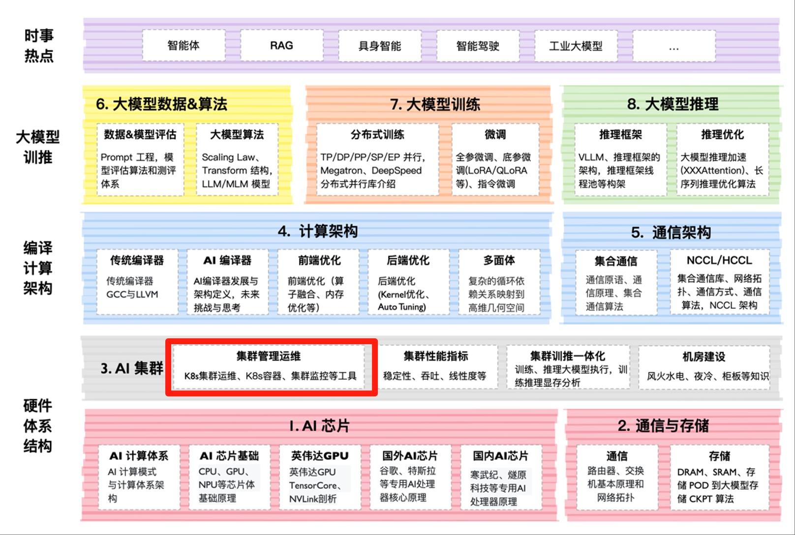

<!--Copyright © ZOMI 适用于[License](https://github.com/Infrasys-AI/AIInfra)版权许可-->

# 集群容器与云原生概述

Author by: 张柯帆

云计算是一种将**计算、存储、网络等 IT 资源市场化**的一种商业模式，它旨在克服物理基础设置固有的弹性不足和高门槛的问题。在数字化浪潮下，IT 资源被视为如同电力、水力一样的社会基础设施。

云计算的一个重要领域就是容器化与云原生技术，其具有**核心支柱和效率革命**两大作用，也催生了一个规模庞大的开源社群 CNCF（云原生计算基金会）。云原生的本质是将过去以物理机（也包括虚拟机）为核心的模式转变为以容器为核心。这个过程中不仅涉及 CPU/内存、网络、存储、分布式系统的容器化改造，也促成了技术迭代模式的升级，从过去开发、运维各司其职的模式向 DevOps 转变。这极大地释放了生产力：开发桎梏消减、迭代周期缩短、技术门槛下沉。最终，更广泛的参与者、更快的创新涌现，共同重塑了互联网如今的竞争格局。

本章将从容器技术入手，从 Docker（容器）到 Kubernetes（编排），逐步展开云原生如何将物理资源转变成更方便使用的"虚拟"资源。

## 课程位置

## 课程简介

[02. Docker 与 K8S 初体验](./02DockerK8s/)：在云原生技术主导现代应用开发的今天，​​Docker​​与​​Kubernetes已成为开发者必须掌握的核心工具。Docker通过容器化技术将应用及其依赖封装为轻量级、可移植的镜像，彻底解决了“本地能跑，线上崩盘”的环境一致性问题。而K8S作为容器编排领域的事实标准，则负责自动化调度、扩展和管理这些容器集群，让应用在分布式环境中实现高可用与弹性伸缩。本系列文章将从零开始，带你了解Docker的基本原理和 K8S 的基础。

## 课程知识

## 备注

系列视频托管[B 站](https://space.bilibili.com/517221395)和[油管](https://www.youtube.com/@ZOMI666/playlists)，PPT 开源在[github](https://github.com/Infrasys-AI/AIInfra)，欢迎引用！

> 非常希望您参与到这个开源课程中，B 站给 ZOMI 留言哦！
>
