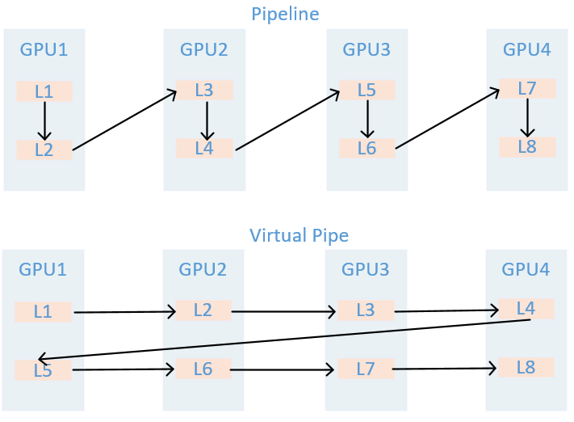
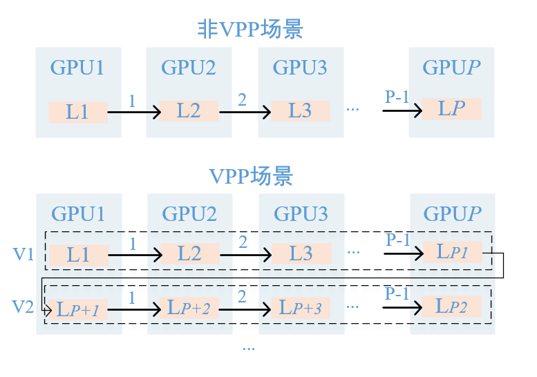

<!--Copyright © ZOMI 适用于[License](https://github.com/Infrasys-AI/AIInfra)版权许可-->

# 09. 流水并行衍生算法

> Author by：高亮

在大模型训练中，并行技术是突破硬件算力与显存瓶颈的核心手段，而流水并行凭借对模型层的纵向切分能力，成为大规模训练的关键支柱。传统GPipe虽通过micro-batch（微批）切分摊薄气泡，但面临尾部气泡先天存在、激活显存随micro-batch数量（记为m）线性增长的难题；当m受硬件显存限制时，流水线深度增加反而会降低吞吐效率。

为突破这一困境，One-Forward-One-Backward（1F1B，即PipeDream）调度方式应运而生：通过让micro-batch的反向计算尽早折返并与后续前向计算交错，将激活驻留时间从$O(m)$压缩至$O(p)$（$p$为流水线深度，即切分后的stage数量），大幅降低显存压力。在此基础上，虚拟流水并行（Virtual Pipeline Parallelism，简称VPP）、PipeDream-2BW、Zero-Bubble PP（简称ZB-V）等衍生技术进一步优化气泡率与通信开销。本文将从原理出发，拆解这些主流流水并行技术的设计逻辑与优势，为大模型高效并行训练提供技术参考。

## 1. PipeDream 算法

### 1.1 两段式问题

先全前向、再全反向的“两段式”调度流水线技术，以朴素流水和GPipe为代表。

朴素流水相当于$m{=}1$（即不切分micro-batch），GPipe则把mini-batch切成$m$个micro-batch，并在前向、反向两个阶段内各自形成流水。两段式流水调度的核心问题在于由调度技术导致的流水气泡难以消除（warmup灌满与cooldown排空阶段不可并行导致空闲），只能通过增大$m$摊薄；当$m$因硬件内存有限而受限时，即使加深流水线深度$p$，头尾气泡的相对占比也会上升，导致吞吐不增反降。此外，两段式流水调度还存在以下问题：

- **尾部气泡先天存在**：由于前向、反向两个阶段被硬性分隔，反向计算无法与后续前向计算交错，流程收尾阶段（cooldown）的尾部气泡完全暴露，最多只能通过增大$m$来“摊薄”气泡占比。
- **通信-计算重叠受限**：前向或反向阶段内部，可将激活/梯度传输与算子计算重叠，但跨阶段无法把反向计算“藏进”下一轮前向计算；整体关键路径仍包含两段流程各自的灌满、排空开销，单步时延为$(m+p-1)(t_f) + (m+p-1)(t_b)$（$t_f$为单个micro-batch在单个stage的前向时间，$t_b$为反向时间）。
- **显存与$m$互相制约**：为等待反向传输，每个stage必须长期保留本段的$m$份前向激活，造成显存压力；同时激活峰值近似为$M^{(i)}_{\text{act,peak}}\!\approx m\,L_i A_{\text{layer}}$（$L_i$为第$i$段包含的模型层数，$A_{\text{layer}}$为单一层的激活张量大小），这直接限制了$m$的上限。

整体峰值显存公式可表示为：

$$
 M_{\text{peak}} \;\approx\; \underbrace{P_{\max}}_{\text{参数系（单段最大参数占用）}} \;+\; \underbrace{\max_i \big(m L_i A_{\text{layer}}\big)}_{\text{激活系（各段激活峰值最大值）}}\;\;\propto\;\; \text{Params（参数总量）} + \text{Activations（单段激活量）}\times m.
$$

- **微批切分的边际收益递减**：增大$m$会引入更密集的启动/同步开销，同时减小单个计算核（per-kernel）的批量，可能抵消部分吞吐收益。综合来看，“两段式”PP的瓶颈在于：要提升效率需增大$m$，但大$m$又受激活显存与系统长尾开销约束——这正是后续更先进调度方案试图突破的根本原因。

### 1.2 核心思想

1F1B的核心是**让每个micro-batch的反向计算尽早折返，并与后续micro-batch的前向计算交错**。与两段式“先全前向、再全反向”的调度过程不同，1F1B在warmup完成后直接进入稳态：末段stage一旦完成某个micro-batch的前向计算，就立即启动该micro-batch的反向计算（因此得名1F1B）；与此同时，前端stage继续为后续micro-batch执行前向计算，如下所示。

在这一机制下，反向梯度沿流水线向前回传，各stage在时间线上呈现“F（前向）→ B（反向）→ F → B…”的交替节奏，仅在流程开头/结尾保留不可避免的warmup/cooldown气泡。由于反向计算被尽早触发，同一份激活“从产生到被消耗”的时间距离，由GPipe的$O(m)$（需等所有micro-batch前向完成）降至$O(p)$（只需等反向计算折返到当前stage），显著缩短激活驻留时间。

末段stage对第$j$个micro-batch完成前向计算后，立即启动该micro-batch的反向计算，无需等待其他micro-batch；反向计算仅需沿流水线深度$p$折返到第$i$段。等待时隙近似为：

$$
\Delta t_{\text{1F1B}}(i,j)\;\approx\;
\underbrace{(p-1)}_{\text{等末段拿到该micro-batch}}
+\underbrace{(p-1-i)}_{\text{反向回传到第 }i\text{ 段}}
\;-\;\underbrace{i}_{\text{激活产生时刻的相位}}
\;=\;\mathcal{O}(p).
$$

无“等完全部$m$个micro-batch”的项，等待时长仅与流水线深度$p$相关，与$m$无关。

若不启用重计算，GPipe的第$i$段stage在前向结束时需同时保留$m$份可反向激活，峰值近似$m\,L_i A_{\text{layer}}$；而1F1B在稳态交错下，每段stage同时“挂起”的在途micro-batch数量受$p$限制（记常数$k_i\!\sim\!O(p)$），激活峰值近似为：

$$
M^{(i)}_{\text{act, peak}} \approx k_i \cdot L_i \cdot A_{\text{layer}}
\quad\text{（无重算）},
$$

若启用重计算，激活峰值近似为：

$$
M^{(i)}_{\text{act, peak}} \approx k_i \cdot A_{\text{boundary}} + \alpha\,L_i A_{\text{layer}}
\quad\text{（有重算）},
$$

其中$A_{\text{boundary}}$为stage边界的激活张量大小，$\alpha$为重计算引入的激活系数（$\alpha<1$）。

对比可见，1F1B将激活峰值从$\mathcal{O}(m)$压至$\mathcal{O}(p)$，这是其“先天降低显存压力”的核心原因：即使在相同$m$下，1F1B更省显存；或在相同显存预算下，1F1B允许将$m$调得更大，从而进一步摊薄气泡、提升吞吐。

但需注意：1F1B不直接减少气泡大小本身。定义气泡时间$t_{\text{bubble}}=(p-1)(t_f+t_b)$、理想计算时间$t_{\text{ideal}}=m(t_f+t_b)$，则气泡率（bubble ratio）保持不变：

$$
\mathit{bubble\ ratio}
=\frac{t_{\text{bubble}}}{t_{\text{bubble}}+t_{\text{ideal}}}
=\frac{p-1}{m+p-1}.
$$

其中$p$为流水线深度（stage数量），$m$为micro-batch数量，$t_f/t_b$为单个micro-batch在单个stage的前/反向时间。关键在于：$t_{\text{bubble}}$的来源与调度方式无关——无论是两段式（GPipe）还是交错式（1F1B），都必须经历$(p−1)$个“warmup/cooldown”的结构性头尾时延，这是由有限流水线深度决定的不可消除开销。

因此，1F1B的核心改善是**显存占用**，而非气泡大小；但它通过降低显存压力，允许在相同显存预算下增大$m$，进而通过更大的$m$压低气泡率（$\frac{p-1}{m+p-1}$随$m$增大而减小）——这是1F1B间接降低气泡占比、提升稳态吞吐的根本机制。

## 2. Virtual Pipeline 算法

后续Megatron-LM在1F1B基础上，提出**Interleaved 1F1B（交错式1F1B）**，即**虚拟流水并行（Virtual Pipeline Parallelism，VPP）**，用于进一步削减流水线气泡。其核心并非“通过增大$m$细化流水划分”，而是在每张物理GPU上引入$v$个“虚拟流水阶段（virtual pipeline stages），并通过交错调度（interleaving）填充空闲时间。

具体机制如下图所示：不同于1F1B“单张GPU仅承担1个或多个连续stage计算”的方案——该方案会导致未执行计算的GPU因等待数据而空闲，VPP采用虚拟化设计：将多个**不相邻**的流水线阶段计算任务，分配给同一张GPU承担；同时通过多个并行线程或CUDA流，在同一张GPU上交错执行不同虚拟阶段的前向/反向计算。这样，GPU在等待上/下游数据的空隙中，可切换到本卡的其他虚拟阶段继续计算，充分利用原本的空闲（idle）时间。

### 2.1 虚拟化理解

给定模型总层数$L_{\text{total}}$、流水线并行度$p$（物理GPU设备数）、虚拟并行度$v$（每张GPU的虚拟阶段数），VPP将模型划分为$p\times v$个连续、等长的层段，每个层段的长度为：

$$
L_{\text{seg}}=\frac{L_{\text{total}}}{p\,v}.
$$

对第$d\in\{0,\dots,p-1\}$张GPU，分配的虚拟阶段索引集合为：

$$
\mathcal{S}_d=\{\,s\mid s\equiv d \ (\mathrm{mod}\ p),\ s\in[0,pv-1]\}.
$$

即虚拟化的对象是“流水阶段”，因此同一张GPU负责$v$个不相邻的虚拟阶段（跨步映射）。执行时，为$\mathcal{S}_d$中的每个虚拟阶段各开启一条CUDA流，在1F1B语义下交错推进这些更小的前/反向计算片段：当某虚拟阶段因P2P传输（跨GPU数据传输）或上游依赖而空等时，GPU立即切换到本卡的另一虚拟阶段执行计算，以此填充原本的空闲时隙。

### 2.2 降低气泡率

在1F1B中，warmup/cooldown过程需要跨越$(p-1)$个固定的流水线阶段（因$p$恒定，即模型纵向切分的stage总数固定）。VPP不减少流水线阶段总数，而是将“每次跨越单张GPU对应的流水线阶段时长”按$1/v$缩短——例如，非VPP场景下跨越单张GPU需执行4个流水线阶段的计算，VPP仅需执行1个虚拟阶段的计算（因单张GPU承担$v=4$个虚拟阶段），即可进入下一张GPU执行下一阶段计算，如下所示：

若设非VPP场景下，单个stage的前/反向时间分别为$t_f、t_b$，则开启VPP后，单个虚拟阶段的前/反向时间缩短为：

$$
t_f^{(v)}=\frac{t_f}{v},\qquad t_b^{(v)}=\frac{t_b}{v}.
$$

由此，同样需要跨越$(p-1)$次的气泡时间被压缩为：

$$
t_{\text{bubble}}^{\text{VPP}}
=(p-1)\Bigl(t_f^{(v)}+t_b^{(v)}\Bigr)
=\frac{(p-1)(t_f+t_b)}{v}.
$$

理想计算工作量不变（$t_{\text{ideal}}=m(t_f+t_b)$），因此VPP的气泡率为：

$$
\text{bubble ratio}^{\text{VPP}}
=\frac{t_{\text{bubble}}^{\text{VPP}}}{t_{\text{ideal}}}
=\frac{\frac{(p-1)(t_f+t_b)}{v}}{m(t_f+t_b)}
=\frac{1}{v}\cdot\frac{p-1}{m}.
$$

> 直观解释：VPP中，流水线仍需经历$(p-1)$次跨GPU阶段切换，但每次切换仅需推进$1/v$的前/反向计算片段，因此总等待时隙宽度按$1/v$缩减；理想计算量不变，故气泡率与虚拟并行度$v$成反比。

VPP的“虚拟化”并非合并多张GPU，而是在每张GPU内拆分出$v$个虚拟流水阶段，通过并行/交错推进更小的前/反向片段填补空闲时隙。其最终效果是：在不改变总算量与1F1B低激活驻留优势的前提下，将气泡时间缩小为1F1B的$\tfrac{1}{v}$倍（$\text{bubble ratio}^{\text{VPP}}=\tfrac{1}{v}\cdot\tfrac{p-1}{m}$），但代价是通信频率与通信量均提升$v$倍。

### 2.3 VPP 通信开销

VPP的通信开销体现在**通信频率提升**与**通信容量提升**两个方面：

相比于非VPP流水线技术（如1F1B），由于每张GPU承载$v$个虚拟阶段，单个micro-batch需以1F1B的方式穿过$p\times v$个虚拟流水线阶段，而非仅穿过$p$个物理阶段。这导致跨GPU跃迁次数大幅增加，如下图所示：

| 场景   | 条件     | 前向跨 GPU 跃迁次数         | 反向跨 GPU 跃迁次数         |
|--------|----------|------------------------------|------------------------------|
| 非 VPP | \(v=1\)  | \(p-1\)                      | \(p-1\)                      |
| VPP    | \(v>1\)  | \(pv-1 \;\approx\; v(p-1)\)  | \(pv-1 \;\approx\; v(p-1)\)  |

理解了通信次数的额外开销，通信量的额外开销就好理解了，若设单次跨GPU通信的激活量为$S$字节（梯度大小与激活量同阶），则两类场景的通信量对比为：

| 场景 | 条件 | 前向全路径通信字节 | 反向全路径通信字节 | 单个 micro-batch 合计通信字节 |
|---|---|---|---|---|
| 非 VPP | \(v=1\) | \((p-1)S\) | \((p-1)S\) | \((p-1)\times 2S\) |
| VPP | \(v>1\) | \((pv-1)S \approx v(p-1)S\) | \((pv-1)S \approx v(p-1)S\) | \(v(p-1)\times 2S\) |

与非VPP（$v{=}1$）相比，VPP的通信频率提升$v$倍，总通信字节量也提升$v$倍——即VPP以“通信开销×$v$”为代价，换取“气泡率÷$v$”的收益。

## 3. PipeDream-2BW 算法

### 3.1 核心思想

在不执行周期性flush（流程中断）的前提下，兼顾高吞吐与低显存，同时尽量贴近数据并行的权重更新语义。将1F1B调度与**双缓冲权重（2-Buffered Weights，简称2BW）**、**梯度合并（coalescing）** 结合：

1. 每个stage仅保留两份权重版本——`current`（当前正在使用的权重版本）与`shadow`（待更新的权重版本），而非原始PipeDream可能需要的最多$p$份（$p$为流水线深度）；
2. 对同一micro-batch的前向/反向计算，严格使用同一份权重（消除“权重版本不一致”问题）；
3. 权重更新采用“1-stale语义”（即更新时使用上一批次的梯度），避免flush引起的流程停顿。

### 3.2 调度机制

* 基础调度逻辑：仍遵循1F1B规则，各stage交替执行不同micro-batch的前向/反向计算；
* 权重版本滚动：每处理完$m$个micro-batch（梯度在$m$个micro-batch内合并），生成1个新权重版本（`shadow`升级为`current`，旧`current`丢弃）；且要求$m\ge p$（确保流水线内的在途micro-batch均能使用对应版本权重），常见简化设定为$m=p$；
* 版本兼容性：新权重版本仅供“新进入流水线的micro-batch”使用，流水线中已在执行的在途micro-batch，继续使用其前向计算时的旧版本权重完成反向——因此每个stage最多只需保留2份权重（`current`+`shadow`），无额外版本冗余。

> 直观理解：权重版本的推进以“$m$个micro-batch为1批”滚动；一旦旧版本权重对应的所有在途micro-batch完成反向计算，该旧版本即可立即丢弃，因此内存占用上限被固定为“2份权重”，避免原始PipeDream中“多版本权重占用大量显存”的问题。

### 3.3 更新 1-stale 与优化器

设批级权重为$W(t)$（$t$为批索引），批平均梯度为$\nabla f(W)$（基于权重$W$计算的梯度）：

* **标准小批SGD**：权重更新依赖当前批梯度，即$W(t{+}1)=W(t)-\nu\,\nabla f(W(t))$（$\nu$为学习率）；
* **PipeDream-2BW（1-stale语义）**：权重更新依赖上一批梯度，即$W(t{+}1)=W(t)-\nu\,\nabla f\big(W(t{-}1)\big)$。

其中“1-stale”表示“梯度延迟1个批次”，且该延迟对所有stage一致。实验表明，1-stale语义与标准小批SGD的收敛效果相当；对于动量（Momentum）、Adam等优化器，也可直接平移至“1-stale梯度”场景，无需额外引入影子变量。

### 3.4 显存与吞吐优势

* **显存优化**：
  1. 权重版本：仅2份（2BW），远少于原始PipeDream的最多$p$份，权重显存占用大幅下降；
  2. 激活显存：仅需缓存“在途micro-batch”的激活，量级随1F1B保持$\mathcal{O}(p)$，远低于两段式（GPipe）在大$m$下的$\mathcal{O}(m)$。
* **吞吐优势**：
  无flush导致的结构性空转，稳态效率显著高于GPipe；据相关论文报告，对GPT/BERT类模型，PipeDream-2BW可比传统优化基线加速1.3×–20×，较GPipe加速可达3.2×。

PipeDream-2BW = 1F1B调度 + 双缓冲权重 + 批内梯度合并 + 1-stale更新。其核心价值是将原始PipeDream的“多版本权重、不均匀梯度延迟”，收敛为“每stage最多2份权重、全stage统一1-stale延迟”，最终在不中断流程（无flush）的前提下，实现“高吞吐、低显存、收敛效果贴近数据并行”的目标。

## 4. Zero-Bubble 算法

### 4.1 核心思想

ZB（Zero-Bubble）系列的关键创新是**将反向传播拆分为两个独立子过程**：

1. $B_\text{in}$（Input Gradient Calculation，输入梯度计算）：计算“需向上游stage传输的输入梯度”，即把梯度往上游传递；
2. $B_\text{w}$（Weight Gradient Calculation，权重梯度计算）：计算“当前stage局部权重的梯度（dW）”，仅用于本地权重更新。

关键依赖变为：$B_{\text{in}}^{(s,j)}$ 只依赖 $B_{\text{in}}^{(s+1,j)}$，$\quad B_{\text{w}}^{(s,j)}$ 依赖 $\big(F^{(s,j)},B_{\text{in}}^{(s,j)}\big)$，这使得 $B_{\text{w}}$ 可以在许多本来空闲的时隙中穿插执行，以填满气泡。因此通过拆分反向过程，ZB可将$B_\text{in}$、$B_\text{w}$作为“可自由插入的子片段”，填充流水线中原本不可避免的空闲时隙，从而在同步训练语义下将气泡压至接近0。其中ZB-V（V-Shaped ZB）是一类手工设计的调度方案：每张GPU负责2个模型分块（chunk，即拆分后的子模型段），前向计算与两段反向子过程（$B_\text{in}$、$B_\text{w}$）的依赖关系在时间轴上呈“V”字形，因此得名ZB-V。

### 4.2 V 字形调度机制

* 模型分块与执行逻辑：将每个物理stage进一步拆分为2个chunk，安排它们在时间线上以“F → $B_\text{in}$ / $B_\text{w}$”的交错方式执行；相邻物理GPU上的2个chunk彼此错位，使“一个chunk的$B_\text{w}$计算”能精准填充“另一个chunk的空闲时隙”。

* 稳态特征：前向计算（$F$）与两段反向子过程（$B_\text{in}$、$B_\text{w}$）交替推进，将1F1B中“尾部cooldown暴露的空隙”用$B_\text{w}$完全塞满。因此“零气泡”的实现条件是：单chunk的F时长 ≈$B_\text{in}$时长 ≈ $B_\text{w}$时长；若三者时长不匹配，仍会留下少量残余空隙（需通过贪心调度或自动调度策略补偿）。

> 直观理解：相比1F1B仅用“F、B”两种计算片段拼合时间轴，ZB-V新增了“$B_\text{in}$、$B_\text{w}$”两种子片段，可在更细粒度上“填补时间缝隙”。当$F$、$B_\text{in}$、$B_\text{w}$的时长接近时，子片段能恰好填满所有空闲时隙，实现“气泡≈0”；若某一子片段时长过短/过长，仍会出现微小空隙，但远小于1F1B的气泡。

### 4.3 何时能实现 ZB？

* **理想条件**：若单chunk的$F$时长 = $B_\text{in}$时长 = $B_\text{w}$时长，ZB-V可在同步训练语义下实现严格“零气泡”。实际模型中，三者时长难以完全相等，需引入贪心调度（如动态调整子片段执行顺序）或搜索式调度（如基于模型结构预计算最优时序），尽可能靠近零气泡。
* **工程优化要点**：ZB-V论文还提出“绕过优化器步的同步屏障”——传统同步训练中，所有stage需等待全局优化器更新完成才能推进，这会引入尾部屏障气泡；ZB-V通过“局部权重更新与全局同步解耦”，进一步消除该屏障，是达成“真正零气泡”的关键工程手段。

### 通信/内存代价

* **激活峰值控制**：ZB-V的设计可在“不抬升1F1B激活峰值”的前提下显著减泡；若将“零气泡”作为硬性约束，通常需提升激活显存预算（文献报告“接近零气泡”的现实设定下，激活显存约为1F1B的2×）；而在“F≈B_in≈B_w”的理想均衡下，激活显存最低可降至“参数-激活校准内存的1/2”（即参数与激活的显存占比更均衡）。

* **权重与版本**：ZB-V无需像原始PipeDream那样存储多份权重版本，其核心优化在于“$B_\text{in}$/$B_\text{w}$的算子级时序切分”，在1F1B的低激活驻留量级（≈O(p)）基础上，做更精细的时间编排——因此权重显存仍保持低占用。

**通信条数增加**：与VPP类似，更细粒度的子片段（F、$B_\text{in}$、$B_\text{w}$）意味着更多stage边界的通信消息；同时$B_\text{in}$、$B_\text{w}$的交错执行会引入额外的依赖关系与消息序列，需通过“多CUDA流 + NCCL多通道 + 分块通信”等技术隐藏通信延迟（即让通信与计算重叠）。

**调度复杂度提升**：需开发专用调度器，管理“$F$/$B_\text{in}$/$B_\text{w}$”三类片段的事件依赖（如“$B_\text{in}$需在$F$之后执行”“$B_\text{w}$可与其他chunk的$F$并行”）与“何时插入子片段”的策略；目前ZB-V的官方实现已在Megatron-LM分支开源，包含通用运行时与不同ZB族调度方案。

ZB-V通过“拆分反向为$B_\text{in}$/$B_\text{w}$”与“V字形双chunk/卡调度”，让前向/反向子片段更细粒度地占满时间轴；在$F\approx B_{\text{in}}\approx B_{\text{w}}$的理想条件下可实现近乎零气泡，同时维持接近1F1B的激活驻留量级，但需承担“更复杂的调度逻辑”与“更多的通信消息”。落地时需依赖成熟的开源实现（如Megatron-LM的ZB分支）与“通信-计算重叠”优化。据文献数据，在类似内存预算下，ZB-V相对1F1B的吞吐提升可达15–23%；若放宽内存预算（允许2×激活占用），吞吐提升可至30%，体现其“以细粒度时序填补空隙”的核心优势。

## 5. 近年 PP 算法总结

### 5.1 PP 算法优化点与演进

* **基线：1F1B（非 VPP）**
  交替执行前/反向，消除了“等待全部 (m) 个 micro-batch”带来的长尾等待；激活驻留量级为 $(\mathcal{O}(p))$。

* **Interleaved 1F1B / VPP**
  在每卡引入 (v>1) 个“虚拟 stage”，用交错调度在同一 GPU 内切换执行多个不相邻的虚拟段，以更细粒度片段填充空隙：
  
  $$\text{bubble ratio}^{\text{VPP}}=\frac{1}{v}\cdot\frac{p-1}{m} $$.
  
  代价是通信频率与通信量均 $(\times v)$：单个 micro-batch 的全路径通信字节由 $(2S(p-1))$ 增至 $(2S\cdot v(p-1))$；跨 GPU 跃迁次数由 $(p-1)$ 增至 $(pv-1\approx v(p-1))$。

* **PipeDream-2BW**
  在 1F1B 框架上，用双缓冲权重（2-Buffered Weights, 2BW）与批内梯度合并保证“前/反向使用同一份权重”，形成统一的 1-stale 更新语义：
$$W(t{+}1)=W(t)-\nu\,\nabla f\big(W(t{-}1)\big)$$

  每个 stage 仅需2份权重（`current` / `shadow`），显著降低权重显存；常见设定 $(m\ge p)$（多取 $m=p$）。

* **Zero-Bubble（以 ZB-V 为例）**
  将反向拆为 $B_\text{in}$（向上游的输入梯度）与 $B_\text{w}$（本地权重梯度），在时间轴上与前向 **F** 交错成“V”字形，以更细颗粒子片段填满空隙；当 $(F\approx B_{\text{in}}\approx B_{\text{w}})$ 时，气泡可逼近 0。工程上需多流/多通道与分块通信掩蔽更高的消息数与依赖开销。

### 5.2 衍生 PP 算法对比

| 算法/范式            | 关键机制与粒度                              | 气泡/等待（稳态）                         | 显存占用（激活/权重）                | 通信代价（频次×字节）                               | 更新语义 / 一致性        | 适用要点与限制                                  | 实现复杂度 |
|---|---|---|---|---|---|---|---|
| 1F1B（非 VPP）       | stage 级交替 F/B                            | 等待量级 ~ 𝒪(p)；无“等完 m”长尾          | 激活 ~ 𝒪(p)；权重可 1 份             | 跨卡跃迁：前/后各 p−1；单 mb 字节 ≈ 2S(p−1)        | 标准（可 0-stale）       | m≥p 性能更稳；算子不均衡/通信抖动需对齐          | 低 |
| Interleaved 1F1B / VPP | 每卡 v 个虚拟 stage，交错推进            | 气泡率 ≈ (1/v)·((p−1)/m)             | 激活 ~ 𝒪(p)；权重同 1F1B             | 频率×v，字节×v：跃迁 ≈ pv−1；总字节 ≈ 2S·v(p−1) | 与 1F1B 一致             | 受带宽/NVLink 拓扑限制；v 过大得不偿失          | 中 |
| PipeDream-2BW        | 1F1B + 双缓冲权重 + 批内合并             | 无 flush；高吞吐，尾部空转小              | 激活 ~ 𝒪(p)；权重恒 2 份（2BW）  | 近似 1F1B；合并通信以提升重叠度                    | 1-stale（统一）      | 常设 m≥p（多取 m=p）；适合长序列/大模型          | 中 |
| Zero-Bubble（ZB-V）  | 反向拆分 $B_\text{in}$/$B_\text{w}$，V 字形双 chunk    | 目标 bubble → 0（需 F≈B_in≈B_w）      | 激活 ~ 𝒪(p)；若追求严格零泡，峰值↑    | 消息条数更多；需多流/多通道/分块重叠隐藏通信        | 同步语义（无权重多版本） | 需算子/chunk 时长配平；依赖管理复杂              | 高 |

## 总结与思考

1F1B调度（PipeDream）通过“前向与反向计算尽早交错”，显著降低激活峰值显存（从$\mathcal{O}(m)$至$\mathcal{O}(p)$），从而在相同硬件条件下支持更大规模模型或更深流水线。在此基础上，各衍生技术从不同维度优化：

1. **Virtual Pipeline（VPP）**：通过“在每张物理GPU拆分$v$个虚拟阶段”，将气泡率降低至1F1B的$\tfrac{1}{v}$，但代价是通信量与通信频率均提升$v$倍，适合“通信带宽充足、追求低气泡”的场景；
2. **PipeDream-2BW**：结合“双缓冲权重”与“1-stale更新语义”，将权重版本数量固定为2份，在保持1F1B高吞吐的同时进一步压缩权重显存，适合“显存紧张、需贴近数据并行收敛语义”的场景；
3. **ZB-V（Zero-Bubble PP）**：通过“拆分反向为B_in/B_w”与“V字形调度”，在$\mathcal{O}(p)$激活量级下将气泡压至接近0，代价是调度复杂度与通信条数增加，适合“对吞吐要求极高、可承担工程复杂度”的场景；

这些技术的核心逻辑均围绕“**平衡显存、气泡、通信三者关系**”——无绝对最优方案，需根据硬件条件（显存/带宽）、模型规模、训练目标（吞吐/收敛速度）灵活选择，或组合使用（如VPP与ZB-V叠加）以最大化并行效率。

## 参考文献

1. [Huang, M. Y., et al. "GPipe: Efficient Training of Giant Neural Networks using Pipeline Parallelism." *Proceedings of the 36th International Conference on Machine Learning (ICML)*, 2019.](https://proceedings.mlr.press/v97/huang19h.html)
2. [Narayanan, D., et al. "PipeDream: Fast and Efficient Pipeline Parallel DNN Training." *Proceedings of the 27th Symposium on Operating Systems Principles (SOSP)*, 2019.](https://dl.acm.org/doi/10.1145/3341301.3359646)
3. [Jain, S., et al. "Efficient Memory Management for Pipeline Parallelism." *Proceedings of the 4th Conference on Machine Learning and Systems (MLSys)*, 2021.](https://proceedings.mlsys.org/paper/2021/file/938331137a7123d4f113320917215465-Paper.pdf)
4. [Anandkumar, A., et al. "Zero-Bubble Pipeline Parallelism for DNN Training." *arXiv preprint arXiv:2210.02020*, 2022.](https://arxiv.org/abs/2210.02020)
5. [Zhang, Y., et al. "Hanayo: Wave-like Pipeline Parallelism for Efficient DNN Training." *Proceedings of the 30th International Symposium on High-Performance Parallel and Distributed Computing (HPDC)*, 2021.](https://dl.acm.org/doi/10.1145/3431379.3460627)
6. [Pratishraj, D. "Demystifying Virtual Pipeline Parallelism in Llama 3 Model Training." *Medium*, 2024.](https://medium.com/@dpratishraj7991/demystifying-virtualpipeline-parallelism-in-llama-3-model-training-faf2fe7e60e5)
7. [NVIDIA. "Megatron-LM: Training Multi-Billion Parameter Language Models Using Model Parallelism." *GitHub Repository*, 2024.](https://github.com/NVIDIA/Megatron-LM)
8. [知乎专栏. "流水线并行（PP）：从GPipe到1F1B的演进." *知乎*, 2023.](https://zhuanlan.zhihu.com/p/650744349)
9. [知乎专栏. "深入理解PipeDream：1F1B调度的显存与吞吐权衡." *知乎*, 2024.](https://zhuanlan.zhihu.com/p/701716465)
10. [CSDN博客. "大模型流水并行：VPP的通信开销与优化实践." *CSDN博客*, 2024.](https://blog.csdn.net/just_sort/article/details/135981391)
11. [CSDN博客. "ZB-V调度的工程落地：多Stream与NCCL通信优化." *CSDN博客*, 2024.](https://blog.csdn.net/HaoBBNuanMM/article/details/134095326)
