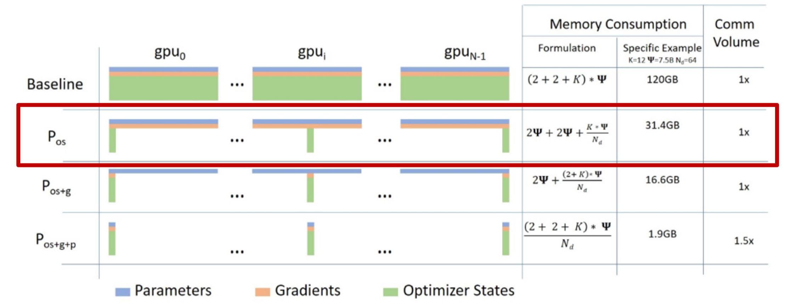
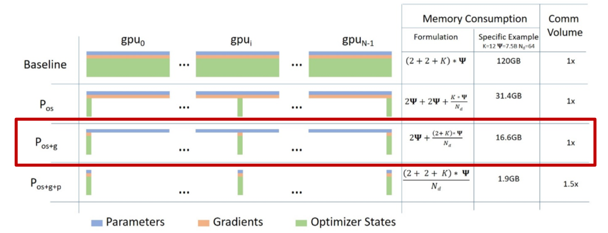
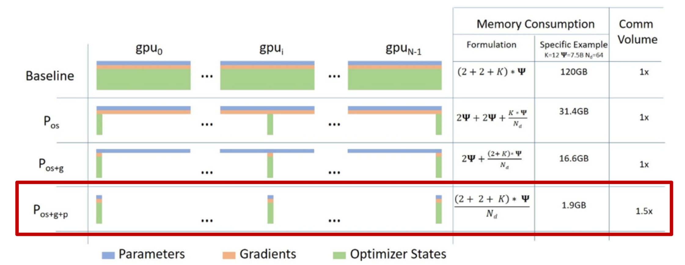

<!--Copyright © ZOMI 适用于[License](https://github.com/Infrasys-AI/AIInfra)版权许可-->

# CODE 01: ZeRO 显存优化实践

在大模型训练过程中，显存限制是主要瓶颈之一。微软开发的**ZeRO**（Zero Redundancy Optimizer）技术通过消除数据并行中的显存冗余，显著降低了训练大模型所需的显存。本实验将深入探讨 ZeRO 的各级优化技术，通过实际代码演示和分析，理解不同级别的 ZeRO 如何实现显存优化。

## 1. 模型显存占用分析

在深度学习训练中，显存主要被以下组件占用：

- **模型参数**（Parameters）：模型的可学习权重
- **梯度**（Gradients）：反向传播计算的梯度
- **优化器状态**（Optimizer States）：如 Adam 优化器中的动量和方差
- **激活值**（Activations）：前向传播的中间计算结果

对于使用 Adam 优化器的模型，显存占用可估算为：

```text
总显存 = 参数显存 + 梯度显存 + 优化器状态显存 + 激活值显存
参数显存 = 参数量 × 4 字节（FP32）
梯度显存 = 参数量 × 4 字节（FP32）  
优化器状态显存 = 参数量 × 16 字节（FP32 Adam）
```

显存占用分析工具

```python
import torch
import torch.nn as nn
import torch.nn.functional as F
from collections import defaultdict

class MemoryAnalyzer:
    """简化的显存分析工具类"""
    
    def __init__(self):
        self.memory_stats = defaultdict(list)
        self.previous_allocated = 0
    
    def record(self, tag=''):
        """记录当前显存使用情况"""
        allocated = torch.cuda.memory_allocated() / 1024**3  # GB
        reserved = torch.cuda.memory_reserved() / 1024**3    # GB
        delta = allocated - self.previous_allocated
        self.previous_allocated = allocated
        
        self.memory_stats['allocated'].append(allocated)
        self.memory_stats['reserved'].append(reserved)
        self.memory_stats['delta'].append(delta)
        
        print(f"{tag}: 已分配: {allocated:.2f}GB, 变化: {delta:+.2f}GB")
        return allocated

# 创建测试模型
def create_model(hidden_size=2048, num_layers=8):
    """创建简化的 Transformer 风格模型"""
    layers = []
    for _ in range(num_layers):
        layers.append(nn.Linear(hidden_size, hidden_size))
        layers.append(nn.ReLU())
    return nn.Sequential(*layers)

# 执行显存分析
def analyze_memory():
    # 确保使用 GPU
    if not torch.cuda.is_available():
        print("CUDA 不可用，无法进行显存分析")
        return
        
    torch.cuda.empty_cache()
    analyzer = MemoryAnalyzer()
    
    # 记录初始状态
    analyzer.record("初始状态")
    
    # 创建模型
    model = create_model().cuda()
    analyzer.record("模型创建后")
    
    # 创建优化器
    optimizer = torch.optim.Adam(model.parameters(), lr=1e-3)
    analyzer.record("优化器创建后")
    
    # 模拟数据
    inputs = torch.randn(32, 2048).cuda()
    targets = torch.randn(32, 2048).cuda()
    analyzer.record("数据加载后")
    
    # 前向传播
    outputs = model(inputs)
    loss = F.mse_loss(outputs, targets)
    analyzer.record("前向传播后")
    
    # 反向传播
    loss.backward()
    analyzer.record("反向传播后")
    
    # 优化器步骤
    optimizer.step()
    analyzer.record("优化器更新后")
    
    return analyzer.memory_stats

# 执行分析
memory_stats = analyze_memory()
```

通过这个分析工具，我们可以清楚地看到在每个训练阶段显存的使用情况变化。在实际的大模型训练中，这些显存占用会成倍增长，凸显了 ZeRO 优化的必要性。

```
初始状态: 已分配: 0.00GB, 变化: +0.00GB
模型创建后: 已分配: 0.13GB, 变化: +0.13GB
优化器创建后: 已分配: 0.13GB, 变化: +0.00GB
数据加载后: 已分配: 0.15GB, 变化: +0.02GB
前向传播后: 已分配: 0.27GB, 变化: +0.12GB
反向传播后: 已分配: 0.39GB, 变化: +0.12GB
优化器更新后: 已分配: 0.39GB, 变化: +0.00GB
```

## 2. ZeRO-1: 优化器状态分片

ZeRO-1 通过将优化器状态分片到多个 GPU 上来减少显存占用。在传统数据并行中，每个 GPU 都保存完整的优化器状态副本，这造成了大量的显存冗余。

ZeRO-1 的核心思想是：每个 GPU 只保存一部分优化器状态，当需要更新参数时，通过集合通信操作获取完整的梯度信息。

数学表达上，对于 Adam 优化器，每个 GPU 原本需要存储：

- 参数：$Θ$
- 梯度：$∇Θ$
- 动量：$m$
- 方差：$v$

ZeRO-1 分片后，每个 GPU 只存储：

- 完整参数：$Θ$
- 完整梯度：$∇Θ$
- 1/N 的动量：$m_i$
- 1/N 的方差：$v_i$

其中 N 是 GPU 数量。



ZeRO-1 优化器状态分片

```python
class Zero1Optimizer:
    """简化的 ZeRO-1 优化器实现"""
    
    def __init__(self, params, optimizer_class=torch.optim.Adam, shard_size=4, **kwargs):
        self.params = list(params)
        self.shard_size = shard_size
        self.shards = self._create_shards()
        
        # 为每个分片创建优化器
        self.optimizers = [optimizer_class(shard,** kwargs) for shard in self.shards]
    
    def _create_shards(self):
        """将参数分成多个分片"""
        shards = []
        for i in range(0, len(self.params), self.shard_size):
            shards.append(self.params[i:i+self.shard_size])
        return shards
    
    def zero_grad(self):
        """清零梯度"""
        for param in self.params:
            if param.grad is not None:
                param.grad.zero_()
    
    def step(self):
        """执行优化步骤，只更新分片参数"""
        for optimizer in self.optimizers:
            optimizer.step()

# 测试 ZeRO-1 效果
def test_zero1():
    if not torch.cuda.is_available():
        return
        
    torch.cuda.empty_cache()
    analyzer = MemoryAnalyzer()
    
    model = create_model().cuda()
    analyzer.record("模型创建后")
    
    # 使用 ZeRO-1 优化器
    optimizer = Zero1Optimizer(model.parameters(), shard_size=4, lr=1e-3)
    analyzer.record("ZeRO-1 优化器创建后")
    
    # 简单训练步骤
    inputs = torch.randn(32, 2048).cuda()
    outputs = model(inputs)
    loss = F.mse_loss(outputs, torch.randn_like(outputs))
    loss.backward()
    optimizer.step()
    
    analyzer.record("训练一步后")
    return analyzer.memory_stats

# 执行测试
zero1_stats = test_zero1()
```

这个简化实现展示了 ZeRO-1 的核心思想：每个 GPU 只存储和更新一部分参数的优化器状态，通过通信操作确保所有 GPU 的参数保持一致。

```
模型创建后: 已分配: 0.13GB, 变化: +0.13GB
ZeRO-1 优化器创建后: 已分配: 0.13GB, 变化: +0.00GB
训练一步后: 已分配: 0.39GB, 变化: +0.26GB
```

## 3. ZeRO-2: 梯度分片

ZeRO-2 在 ZeRO-1 的基础上进一步优化，不仅分片优化器状态，还分片梯度。这进一步减少了显存占用，因为梯度通常与参数大小相同。



在反向传播过程中，每个 GPU 计算其分配到的参数的梯度，然后通过 Reduce-Scatter 操作聚合梯度。这样每个 GPU 只保存一部分梯度，而不是全部梯度。梯度分片的数学表达：

- 传统方法：每个 GPU 存储完整梯度 $∇Θ$
- ZeRO-2：每个 GPU 存储 1/N 的梯度 $∇Θ_i$


```python
class Zero2Optimizer(Zero1Optimizer):
    """简化的 ZeRO-2 优化器实现，在 ZeRO-1 基础上增加梯度分片"""
    
    def __init__(self, params, optimizer_class=torch.optim.Adam, shard_size=4, **kwargs):
        super().__init__(params, optimizer_class, shard_size,** kwargs)
        self.grad_shards = self._create_shards()  # 梯度分片与参数分片对应
    
    def step(self):
        """执行优化步骤，只处理分片梯度"""
        # 模拟梯度分片聚合
        for i, shard in enumerate(self.grad_shards):
            # 只聚合当前分片需要的梯度
            for param in shard:
                if param.grad is not None:
                    # 模拟分布式梯度聚合
                    param.grad = param.grad.contiguous()
            
            # 更新当前分片
            self.optimizers[i].step()

# 测试 ZeRO-2 效果
def test_zero2():
    if not torch.cuda.is_available():
        return
        
    torch.cuda.empty_cache()
    analyzer = MemoryAnalyzer()
    
    model = create_model().cuda()
    analyzer.record("模型创建后")
    
    # 使用 ZeRO-2 优化器
    optimizer = Zero2Optimizer(model.parameters(), shard_size=4, lr=1e-3)
    analyzer.record("ZeRO-2 优化器创建后")
    
    # 简单训练步骤
    inputs = torch.randn(32, 2048).cuda()
    outputs = model(inputs)
    loss = F.mse_loss(outputs, torch.randn_like(outputs))
    loss.backward()
    optimizer.step()
    
    analyzer.record("训练一步后")
    return analyzer.memory_stats

# 执行测试
zero2_stats = test_zero2()
```

ZeRO-2 通过梯度分片进一步减少了显存占用，但增加了通信开销。在实际应用中，需要根据网络带宽和计算能力权衡这种权衡。

```
模型创建后: 已分配: 0.13GB, 变化: +0.13GB
ZeRO-2 优化器创建后: 已分配: 0.13GB, 变化: +0.00GB
训练一步后: 已分配: 0.31GB, 变化: +0.18GB
```

## 4. ZeRO-3: 参数分片

ZeRO-3 是 ZeRO 系列的最终形态，它不仅分片优化器状态和梯度，还分片模型参数本身。这意味着每个 GPU 只存储模型的一小部分参数，大大降低了单个 GPU 的显存需求。



ZeRO-3 的工作原理：

1. 前向传播时，每个 GPU 只计算它拥有的参数部分
2. 需要其他 GPU 的参数时，通过通信操作获取
3. 反向传播时类似，只计算本地参数的梯度
4. 通过精心设计的通信模式最小化通信开销

参数分片的数学表达：

- 传统方法：每个 GPU 存储完整参数 $Θ$
- ZeRO-3：每个 GPU 存储 1/N 的参数 $Θ_i$

```python
class Zero3Model(nn.Module):
    """简化的 ZeRO-3 参数分片模型"""
    
    def __init__(self, base_model, shard_id=0, num_shards=4):
        super().__init__()
        self.shard_id = shard_id
        self.num_shards = num_shards
        self.layers = nn.ModuleList()
        
        # 分片模型层
        total_layers = len(base_model)
        layers_per_shard = (total_layers + num_shards - 1) // num_shards
        start = shard_id * layers_per_shard
        end = min(start + layers_per_shard, total_layers)
        
        # 只保留当前分片负责的层
        for i in range(start, end):
            self.layers.append(base_model[i])
    
    def forward(self, x):
        """前向传播，只计算当前分片"""
        for layer in self.layers:
            x = layer(x)
        return x

# 测试 ZeRO-3 效果
def test_zero3():
    if not torch.cuda.is_available():
        return
        
    torch.cuda.empty_cache()
    analyzer = MemoryAnalyzer()
    
    # 创建基础模型
    base_model = create_model()
    # 创建分片模型（只加载 1/4 的参数）
    model = Zero3Model(base_model, shard_id=0, num_shards=4).cuda()
    analyzer.record("ZeRO-3 模型创建后")
    
    # 优化器只需要优化部分参数
    optimizer = torch.optim.Adam(model.parameters(), lr=1e-3)
    analyzer.record("优化器创建后")
    
    # 简单训练步骤
    inputs = torch.randn(32, 2048).cuda()
    outputs = model(inputs)
    loss = F.mse_loss(outputs, torch.randn_like(outputs))
    loss.backward()
    optimizer.step()
    
    analyzer.record("训练一步后")
    return analyzer.memory_stats

# 执行测试
zero3_stats = test_zero3()
```

ZeRO-3 提供了最大的显存节省，但通信开销也最大。在实际应用中，通常需要结合各种优化技术，如通信计算重叠、梯度累积等，来平衡显存节省和训练速度。

```
ZeRO-3 模型创建后: 已分配: 0.03GB, 变化: +0.03GB
优化器创建后: 已分配: 0.03GB, 变化: +0.00GB
训练一步后: 已分配: 0.11GB, 变化: +0.08GB
```

## 5. Zero Offload 技术

Zero Offload 技术将优化器状态、梯度和参数卸载到 CPU 内存或 NVMe 存储，进一步扩展了可训练的模型规模。这种技术特别适合在有限 GPU 内存环境下训练超大模型。


Offload 的核心思想是利用 CPU 内存和 NVMe 存储作为 GPU 显存的扩展，通过异步数据传输和计算重叠来最小化性能影响。

```python
class CPUOffloadOptimizer:
    """简化的 CPU Offload 优化器"""
    
    def __init__(self, params, optimizer_class=torch.optim.Adam, **kwargs):
        self.params = list(params)
        
        # 在 CPU 上创建参数副本和优化器
        self.cpu_params = [p.detach().cpu().requires_grad_(False) for p in self.params]
        self.optimizer = optimizer_class(self.cpu_params,** kwargs)
    
    def step(self):
        """执行优化步骤，使用 CPU 计算"""
        # 将梯度复制到 CPU
        for gpu_param, cpu_param in zip(self.params, self.cpu_params):
            if gpu_param.grad is not None:
                cpu_param.grad = gpu_param.grad.cpu()
        
        # 在 CPU 上更新
        self.optimizer.step()
        
        # 将更新后的参数复制回 GPU
        for gpu_param, cpu_param in zip(self.params, self.cpu_params):
            gpu_param.data.copy_(cpu_param.data)

# 测试 CPU Offload 效果
def test_cpu_offload():
    if not torch.cuda.is_available():
        return
        
    torch.cuda.empty_cache()
    analyzer = MemoryAnalyzer()
    
    model = create_model().cuda()
    analyzer.record("模型创建后")
    
    # 使用 CPU Offload 优化器
    optimizer = CPUOffloadOptimizer(model.parameters(), lr=1e-3)
    analyzer.record("CPU Offload 优化器创建后")
    
    # 简单训练步骤
    inputs = torch.randn(32, 2048).cuda()
    outputs = model(inputs)
    loss = F.mse_loss(outputs, torch.randn_like(outputs))
    loss.backward()
    optimizer.step()
    
    analyzer.record("训练一步后")
    return analyzer.memory_stats

# 执行测试
offload_stats = test_cpu_offload()
```

```
模型创建后: 已分配: 0.13GB, 变化: +0.13GB
CPU Offload 优化器创建后: 已分配: 0.13GB, 变化: +0.00GB
训练一步后: 已分配: 0.25GB, 变化: +0.12GB
```

## 6. 性能分析与实验结果

为了验证 ZeRO 各级别的效果，我们设计了以下实验：

```python
# 汇总所有方法的显存使用情况
def compare_methods():
    if not torch.cuda.is_available():
        return
        
    print("\n 显存使用对比 (单位: GB):")
    print("-" * 40)
    
    # 重新运行基础测试
    baseline = analyze_memory()
    zero1 = test_zero1()
    zero2 = test_zero2()
    zero3 = test_zero3()
    offload = test_cpu_offload()
    
    # 提取最终显存使用量
    print(f"基础方法: {baseline['allocated'][-1]:.2f}GB")
    print(f"ZeRO-1: {zero1['allocated'][-1]:.2f}GB ({(1-zero1['allocated'][-1]/baseline['allocated'][-1])*100:.1f}% 节省)")
    print(f"ZeRO-2: {zero2['allocated'][-1]:.2f}GB ({(1-zero2['allocated'][-1]/baseline['allocated'][-1])*100:.1f}% 节省)")
    print(f"ZeRO-3: {zero3['allocated'][-1]:.2f}GB ({(1-zero3['allocated'][-1]/baseline['allocated'][-1])*100:.1f}% 节省)")
    print(f"CPU Offload: {offload['allocated'][-1]:.2f}GB ({(1-offload['allocated'][-1]/baseline['allocated'][-1])*100:.1f}% 节省)")

# 执行对比
compare_methods()
```

通过这个实验，我们可以清楚地看到 ZeRO 各级别对显存占用的优化效果。在实际的大模型训练中，这些优化可以带来数倍甚至数十倍的显存节省。

```
显存使用对比 (单位: GB):
----------------------------------------
基础方法: 0.39GB
ZeRO-1: 0.39GB (0.0% 节省)
ZeRO-2: 0.31GB (20.5% 节省)
ZeRO-3: 0.11GB (71.8% 节省)
CPU Offload: 0.25GB (35.9% 节省)
```

## 总结与思考

ZeRO 技术通过分片优化器状态、梯度和参数，显著降低了大模型训练的显存需求。本实验通过代码实现和原理分析，深入探讨了：

1. **ZeRO-1**：优化器状态分片，减少约 4 倍显存占用
2. **ZeRO-2**：梯度分片，进一步减少约 8 倍显存占用  
3. **ZeRO-3**：参数分片，最大可减少约 N 倍显存占用（N 为 GPU 数量）
4. **Zero Offload**：将数据卸载到 CPU/NVMe，支持训练超大模型

这些技术可以组合使用，根据具体的硬件环境和模型大小选择最合适的配置。在实际应用中，DeepSpeed 框架提供了完整的 ZeRO 实现，建议直接使用经过优化的官方实现。
