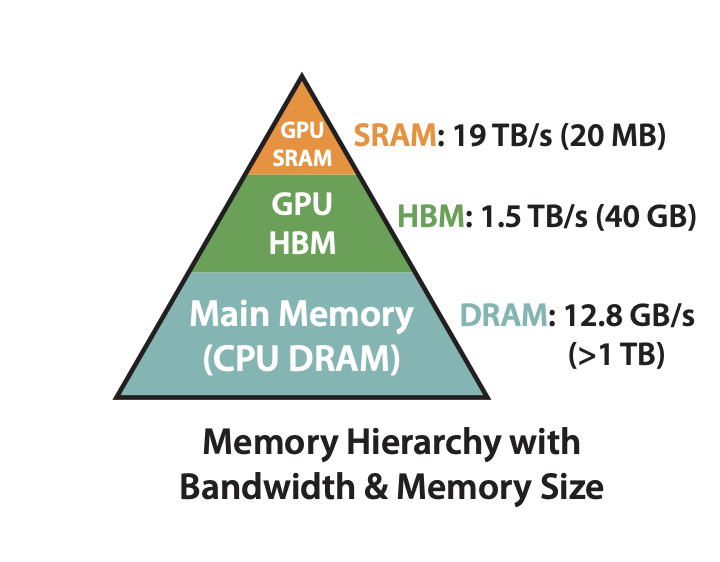
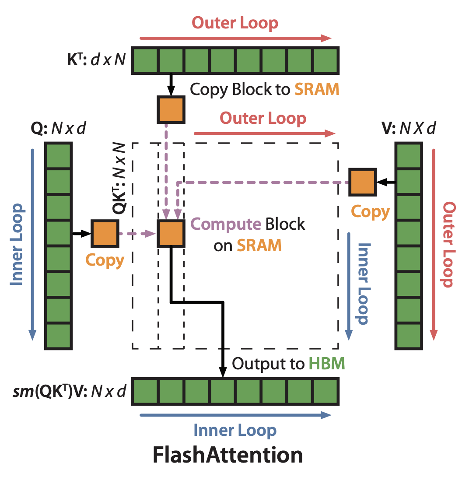
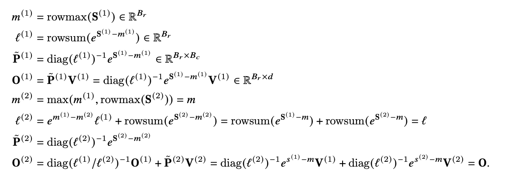

<!--Copyright © ZOMI 适用于[License](https://github.com/Infrasys-AI/AIInfra)版权许可-->

# 02.计算优化：FA 演进

Author by: 桑青园

由于 Transformer 架构的核心模块——Attention 机制在计算时存在时空复杂度随序列长度呈二次方增长的问题，导致该结构在处理长序列时面临计算效率低下和显存占用较高的问题。为此，Flash Attention（以下简称 FA）提出通过分块计算（tilling）和算子融合（kernel fusion）的方式，不仅有效降低了显存占用，同时提升了训练速度和模型性能，接下来本文将详细介绍 FA 从 V1 到 V3 的演进及性能收益。

## 标准的 Attention 及访存、算力瓶颈

首先我们来简单回顾一下标准 Attention 的算法公式：

$$
\text{Attention}(Q, K, V) = \text{softmax}\left(\frac{QK^T}{\sqrt{d_k}}\right)V
$$

输入为 $Q,K,V \in \mathbb{R}^{N \times d}$ , 其中 $N$ 表示序列长度，$d$ 表示注意力头的维度。虽然这个公式在数学表达上十分简洁，但在实际 GPU 训练过程中会引发显著的内存访问效率问题。这主要是由于标准 Attention 的计算过程中，内存访问模式与 GPU 存储架构之间存在冲突。

现代 GPU 采用分层存储体系，主要包含共享内存（SRAM）和全局内存（HBM）两级存储，不同存储的显存大小和访问带宽存在数量级差异。以 A100-40GB 为例，内存分级图如下所示：

- HBM：global memory，即显存，访问速度相对较慢，但容量较大，通常用于存储模型参数和中间计算结果。共 40GB，带宽 1.5TB/s
- SRAM：shared memory，GPU 的片上高速缓存，容量较小但访问速度极快，GPU 在进行计算时通常需要将数据从 HBM 拷贝到 SRAM 中。共 20MB，带宽 19TB/s

可以看到，HBM 的存储空间远大于 SRAM，同时访存带宽也远低于 SRAM 的带宽。因此，结合 GPU 内存分级存储架构，我们可以将标准 Attention 算法的实际执行过程抽象出如下流程：

- 计算注意力分数：首先从 HBM 中读取 $Q,K$，计算 $S=QK^\top \in \mathbb{R}^{N \times N} $ 并将结果 $S$ 写回 HBM，此时访存次数为 $O(Nd+N^2)$
- 计算注意力权重：从 HBM 中读取 $S$,计算 $P=softmax(S) \in \mathbb{R}^{N \times N} $ ，并将 $P$ 写回 HBM, 访存次数为 $O(N^2)$
- 加权求和：从 HBM 中读取 $P, V$, 计算 $O=PV$ , 并将结果 $O$ 写回 HBM, 访存次数为 $O(Nd+N^2)$
- 返回结果：返回 $O$

由此可见，在标准 Attention 的计算过程中，存在非常多对 HBM 的访问，同时，部分中间变量在计算完成写入 HBM 后又立刻被访问，如：$S, P$，这会带来两个问题：

1. 访存瓶颈：HBM 带宽较低，频繁的 HBM 读写操作导致内存访问成为瓶颈，进而导致计算效率降低
2. 显存 OOM：中间变量的存储消耗大量显存空间，$S$ 的大小为 $N \times N$，显存占用随序列长度平方增长

针对中间变量 S 和 P 带来的问题，常规的优化方案是将 $S=QK^\top $ 矩阵乘法、Softmax 归一化和 PV 乘积累加三个计算阶段融合为单一融合算子。但是，这个方案面临两个关键技术挑战：

1. 为充分发挥 SRAM 的高带宽优势（19TB/s），必须采用分块计算策略，但 SRAM 的有限容量（20MB）导致长序列场景下无法完整存储注意力矩阵
2. 标准 softmax 的全局归一化特性与分块计算模式存在本质冲突

FA 通过分块计算（tilling）和重计算（recompute）解决了这两个问题。

## Flash Attention V1

FA 的核心目标是尽量减少 HBM 中的频繁重复读写开销及中间结果的缓存，主要通过:

- SoftMax Tiling : 将 Softmax 的计算分块（Tile）进行，以适应 SRAM 的容量限制
- Recomputation : 在反向传播过程中，重新计算前向传播的部分结果，以减少存储需求

### SoftMax Tiling

我们先来看下 SoftMax Tiling， 在 Softmax 计算中，如果我们对 Q、K、V 进行分块（Block），在 SRAM 中完成相应块的计算，就可以减少存储 S、P 所需要的 HBM 的读写及显存占用。但是这种切分策略下，同一 sequence 可能会被分为多块，导致标准的 SoftMax 无法得到正确的结果。FA 通过分块 SoftMax 算法，确保了整个 Flash Attention 的正确性：

如图所示：我们将 Q 划分成 $T_r$ 个 Bolck，K、V 划分成 $T_c$ 个 Block，初始化 attention output O，并划分成 $T_r$ 个 Block。FA 计算主要通过两层循环实现：  

外层循环：对于每一个 Block Key 和 Value，从 HBM 加载进 SRAM  
内层循环：对于每个 Block Query，从 HBM 加载进 SRAM  
在 SRAM 上完成 Block S 和 P 的计算，更新得到 Block O，写入到 HBM 中，完成所有计算后返回完整 attention output O。  

那么 FA 是如何通过分块 SoftMax 保证 SoftMax 计算的准确性呢？我们先来回忆一下标准 SoftMax 的计算公式，假设输入为向量 $x \in \mathbb{R}^{B}$ ：

$$
\text{softmax}(x_i) = \frac{e^{x_i}}{\sum_{j=1}^{K} e^{x_j}} \quad \text{for } i = 1, 2, ..., K
$$

在实际的训练过程中，在做标准 softmax 函数计算的时候，我们经常会遇到数值稳定性的问题：在浮点数表示范围有限的情况下，softmax 公式在输入值较大时容易出现数值溢出：以 LLM 训练常用的 bfloat16 数据类型为例：当输入 x≥89 时，指数运算 $e_x$ 的结果会超出 float32 最大可表示范围（约 3.4×10³⁸），导致结果变为 inf（无穷大）触发上溢。

为解决这个问题，"safe softmax" 通过一个简单而有效的变换实现数值稳定：

对输入向量中的每个元素减去该向量的最大值。具体来说，当输入向量为 $x = [{x_1,x_2, ... x_K}]$，令 $c = max ({x_1,x_2, ... x_K})$，则 safe softmax 的计算公式调整为：

$$
\text{safe-softmax}(x_i) = \frac{e^{x_i - c}}{\sum_{j=1}^{K} e^{x_j - c}} \quad \text{for } i = 1, 2, ..., K
$$

这一变换的数学等价性在于当分子分母同时乘以 $e^{-c}$（一个正数），不会改变最终结果，但能将所有指数项的输入限制在≤0 的范围内（$ x_i - c ≤ 0 $）。这时， $e^{x_i - c}$ 的最大值为 $e^{0} = 1$ ，最小值趋近于 0，避免了上溢风险。同时，由于分母是多个小于等于 1 的正数之和，也不会出现下溢导致的精度丢失问题。这种数值稳定策略已成为所有主流深度学习框架（如 PyTorch、TensorFlow、JAX 等）中 softmax 实现的标准方案。

我们可以将其表示为：

!!!!!!!!
公式改为 markdown 

在 safe softmax 的基础上，FA 通过引入了 $ m(x), \ell(x)$ 两个中间量实现了 SoftMax 分块算法，假设有向量 $x^{(1)}, x^{(2)} \in \mathbb{R}^{2B}$ ，拼接后的向量可以表示为 $x = [x^{(1)}, x^{(2)} ]\in \mathbb{R}^{2B}$ ， softmax 计算可以分解为:

!!!!!!!!
公式改为 markdown 

根据公式，我们可以将完整的 softmax 计算分为 4 步：

- 合并 “最大值”：我们通过中间变量 $ m(x)$ 维护最大值，完整向量 x 的最大值等于两个子块各自最大值的 “全局最大值”，通过不断更新 $ m(x)$ ，根据更新后的 $ m(x)$ 及上一步的计算结果 $ f(x^{(1)})$ 重新计算 $f(x), \ell(x)$，并不断迭代这个过程。假设存在 $x^{(3)}$, 我们就可以将 $x^{(1)}$ 和 $x^{(2)}$ 合并成一个序列，重复这个步骤。因此，分块后我们只需跟踪每个块的最大值，再取全局最大，就能替代完整向量的最大值，避免存储整个长向量。

- 合并 “指数”：我们为什么需要给 $f(x^{(k)}), k=(1,2)$ 加一个系数 $ e^{m(x^{(k)}) - m(x)}$ 呢，上文有提到， safe softmax 要求所有指数项都减去全局最大值，而子块 $f(x^{(k)})$ 的指数项只减了自己的最大值 $m(x^{(k)})$，所以需要补一个 “差值因子”如下：

$$
e^{x_i - m(x)} = e^{x_i - m(x^{(k)}) + m(x^{(k)}) - m(x)} = e^{x_i - m(x^{(k)})} \cdot e^{m(x^{(k)}) - m(x)}
$$

- 合并 “指数和统计量”：$\ell(x)$ 是完整向量的 “指数和”, 即 safe softmax 的分母，等价于两个子块 “合并后的指数和” 之和: $\ell(x) = \ell(x^{(1)}) + \ell(x^{(2)})$ , 两个子块的相加就是全局的 $\ell(x)$ 。

- 完成 softmax 计算：既然 softmax 计算的分子和分母都能通过分块统计量合并得到，那么最终的 softmax 结果自然也和 “完整向量计算” 完全等价 —— 这就从数学上证明了 “分块计算 softmax” 的正确性。

我们再来看一下 FA 整体 Forward 的计算过程（为了便于理解省略了 dropout 和 mask）, 假设 K，V 只分成两个 Block， S 表示 attention score，P 表示 softmax 后的 attention score，softmax tiling 发生在 S --> P：

如图所示，我们通过 Softmax tiling 替换掉完整 safe softmax 计算后，Attention 计算的整体流程可以表示为：

其中，$B_r$ 为 Q 的块大小，$B_c$ 为 K，V 的分块大小，对于不同大小的数据，我们仅需迭代这个计算过程就可以得到完成的 Attnetion 结果。  

最后我们再来看下 FA 的访存次数，前文有提到，标准 attention 计算的访存次数为 $O(Nd+N^2)$。对于 FA 计算：

- 由于 $K,V \in \mathbb{R}^{N \times d}$ 的每个 block 都需要 Load 进 SRAM，因此该过程的 HBM 访问次数为 $O(Nd)$  
- Q 也需要分 block Load 进 SRAM，该过程一共持续外循环 $T_c$ 次，因此该过程的 HBM 访问次数为 $O(T_c Nd)$  

由于 $T_c = \frac{N}{B_c} = \frac{4Nd}{M}$， 因此 FA 的 HBM 实际访问次数为 $O(\frac{N^2d^2}{M})$ 。在实际的模型结构中，通常 N >> d（例如 GPT2 中 N=1024，d=64），M(SRAM 大小)为 100K~20M，由此可见，相较于 Standard Attention 标准计算，FA 大大减少了 HBM 的访问次数，从而提升了训练和推理速度。

### Recomputing

在反向传播过程中，FA 最主要的优化就是 Recomputing。相比于标准计算，FA 在前向计算时并不会保留 S、P 矩阵，但是反向计算又依赖于 S、P 矩阵计算梯度，比较朴素的想法就是参考 FA forward，在 backward 过程中，利用 softmax tiling 将 Q、K、V 分块 load 到 SRAM 中重新计算 S、P 的值，再按照分块矩阵的方式分别计算梯度：

- Forward 过程会保留 $Q，K，V，O，\ell，m$ 在 HBM 中，$dO$ 由反向计算得到后，按照 forward 的分块模式将其重新分为 $T_r$ 块。
- 初始化 dQ，dK，dV 为全 0 矩阵，并按照对等 Q，K，V 的分割方式分割 dQ，dK，dV
- 分别从 HBM 中 Load K V block 到 SRAM，再 Load Q block on SRAM。根据前向过程重新计算对应 block 的 S 和 P；按分块矩阵的方式分别计算对应梯度
- 完成梯度更新  

在这里需要注意的是，虽然 Recomputing 增加了计算量 FLOPs，但是由于 GPU 计算速度非常快，实际的瓶颈为访存速度，因此 IO 的减少带来的收益更大

### 性能分析与总结

如图为官方论文中提供的性能数据，使用 FA 训练 GPT-2 相比于 Huggingface 实现可以加速 3 倍,相比于 Megatron-LM 实现可以加速 1.7 倍：

!!!!!!!
论文引用的地方

总体来看，FA V1 通过 softmax tiling 及 kernel fusion 突破了显存限制，减少了计算及访存的开销，并通过 recomputaing 降低了反向传播的显存需求，从而显著提升了 Transformer 模型的训练和推理效率。

尽管 FA 取得了令人满意的效果，但由于其并未对不同的线程块（thread blocks）和线程束（wraps）进行最优分配，这导致了计算资源的低利用率以及不必要的共享内存读写操作，同时与其他基本操作（如矩阵乘法）相比，其效率仍有提升空间。

## Flash Attention V2

在 FA V1 的基础上，FA2 针对反向传播、因果掩码（Causal Mask）以及 GPU 的并行计算等方面进行了更深入的优化，进一步提升了性能  

### 算法优化

### 并行策略重构

### warps 间协作

### 性能分析

## Flash Attention V3

### 新硬件 Hopper 架构带来的挑战

### 性能分析

!!!!!!!!!
新增 ## Flash Attention V4

## 总结与思考

## 参考与引用