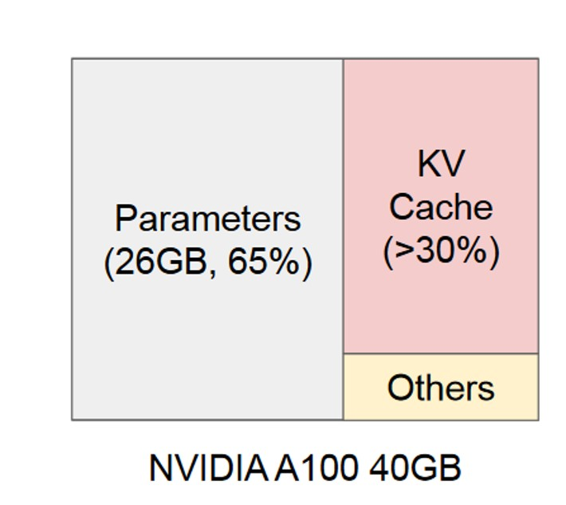
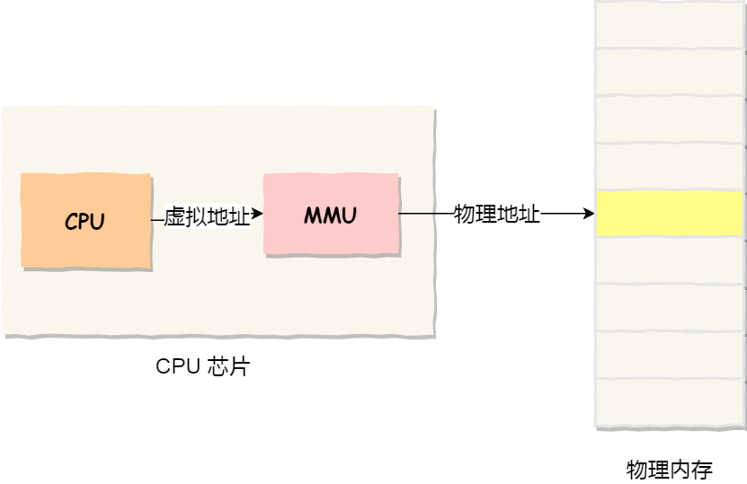
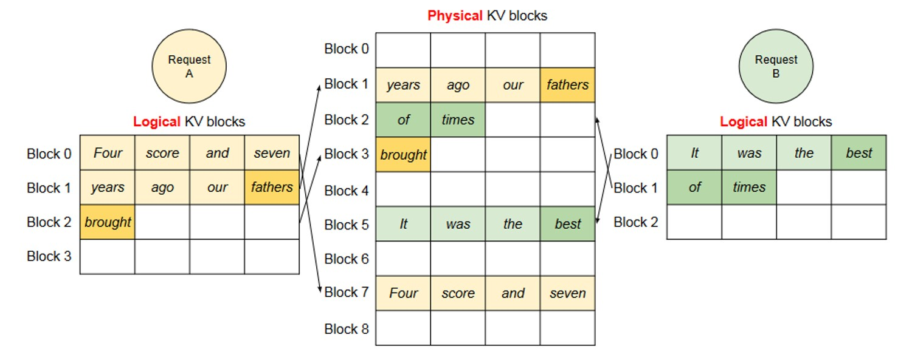
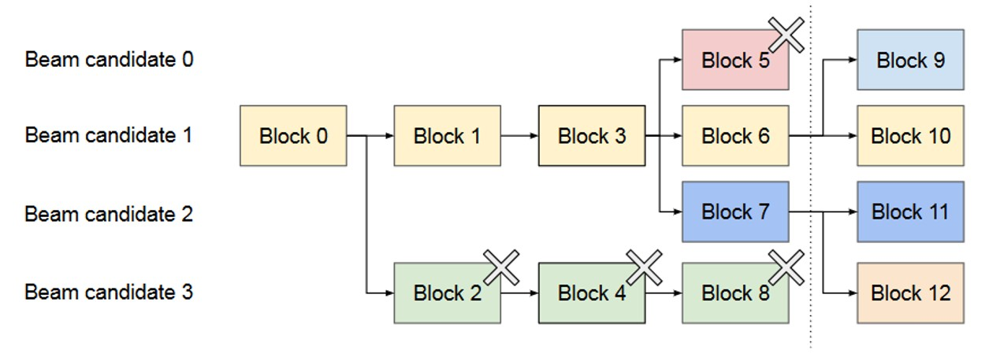
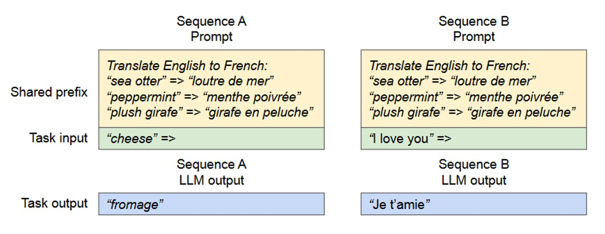
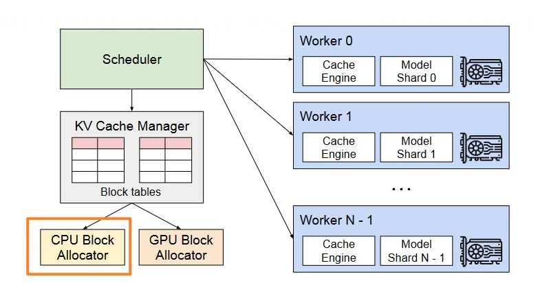
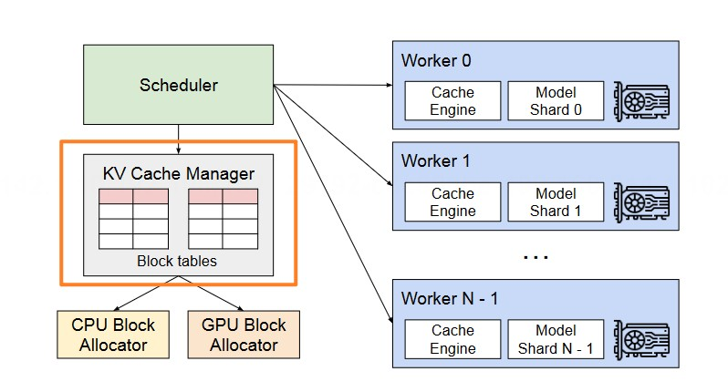

<!--Copyright © ZOMI 适用于[License](https://github.com/Infrasys-AI/AIInfra)版权许可-->

# Paged Attention 原理

> Author by: 张艺蓉

!!!!!!!
全文统一使用“块（Block）”、“块表（Block Table）”、“物理块/逻辑块”等术语

## 大模型推理的内存管理挑战

### 内存管理挑战

!!!!!!!!!
先放文字，再放图片，后面的相同

!!!!!!!!!
注意格式

大模型推理中，处理推理请求的数量受到 GPU 内存容量的限制，也就是说，推理服务系统的吞吐量是 memory-bound，克服这个内存限制需要解决以下内存管理方面的挑战：

1. KV Cache 内存大。KV Cache 的大小随着请求数量的增加而迅速增长，如图所示，KV Cache 所占内存接近大模型参数的一半。
2. 复杂的解码策略。大模型推理有多种解码策略，每种算法对内存管理的影响各不相同。
3. 输入与输出序列长度未知。在大模型推理中，输入 prompt 与最终输出长度是不确定的。

### 常规内存管理方式与问题

大部分框架将同一个请求的 KV Cache 连续存储，按照`（batch_size, max_seq_len）`这样的的固定尺寸预先分配内存，这样的内存分配方式**会造成三类内存浪费**：

1. 为未来 Token 预留的空间。
2. 由于为潜在的最大序列长度过度预留而导致的内部碎片。
3. 由内存分配器导致的外部碎片。

## Paged Attention 原理

!!!!!!!!!!
直接明确“块（Block）”对应“物理页（Physical Page）”，“块表（Block Table）”对应“页表（Page Table）”，“逻辑块索引”对应“虚拟地址”。强调其带来的两大核心好处：​​消除外部碎片​​和​​实现细粒度的内存共享

为了解决传统静态分配内存时造成的内存浪费问题，vllm 提出了 Paged Attention 算法，动态地为请求分配 KV cache 显存，提升显存利用率。

### 操作系统虚拟内存概念

Paged Attention 的思想来源于操作系统中的虚拟内存与分页技术。因此我们先来简要回顾这一部分内容。

操作系统的虚拟内存机制为每个程序提供了一个巨大且连续的私有地址空间，这被称为“虚拟地址空间”。然而，在物理内存中，这些数据实际上被存储在**任意位置、不连续的物理页面（Physical Page）**中。

系统通过一个名为**页表（Page Table）**的核心数据结构来建立这两者之间的映射关系。页表就像一本地址翻译词典，记录了每个虚拟页面对应哪个物理页面。

这个机制带来了两大好处：

1. 消除外部碎片：由于数据可以被存储在任意可用的物理页面中，操作系统不再需要寻找一大块连续的物理内存。只要物理内存的总空闲量足够，程序就能运行，从而极大地提高了内存利用率。
2. 灵活的内存管理：数据可以在物理内存和硬盘之间轻松地“换入”（Page-in）和“换出”（Page-out），实现了远超物理内存容量的内存空间，并且可以实现高效的写时复制（Copy-on-Write）等高级功能。

这种“逻辑上连续，物理上分散”的核心思想，为我们解决其他领域的资源管理难题提供启发。

### Paged Attention 算法

在回顾了操作系统中的虚拟内存技术之后，我们再来看 paged attention 算法，它将操作系统中 “逻辑连续，物理分散” 的经典思想，迁移到了 GPU 显存管理这一场景，以此解决 KV Cache 带来的内存浪费问题。

PagedAttention 算法的核心内容如下：

- 它不再为每个序列预留一块庞大而连续的内存。相反，它将每个序列的 KV Cache 都划分为许多个固定大小的 “块”（Block）。每一个块都可以存储固定数量 Token 的 Key 和 Value 向量（例如，16 个 Token）。这些块在物理显存中可以存储在任意不连续的位置。
- 为了管理这种映射关系，PagedAttention 为每个序列引入了一个名为 “块表”（Block Table） 的数据结构。这个块表的作用，就如同操作系统中的“页表”，它维护着从序列的“逻辑块”到显存中“物理块”的映射。

接下来，让我们通过实际的推理示例，来直观地感受 PagedAttention 的完整工作流程。

#### 处理单个推理请求

如图所示，推理的请求 prompt 为“Four score and seven years ago our”。
首先是 Prefill 阶段【对应图中步骤 1】：

1. 划分逻辑块：针对拿到的 prompt 按照 block 大小划分逻辑块
2. 映射物理块：用一张 block table 记录逻辑块和物理块的映射关系（其中`Physical block number`表示映射关系，`# filled`表示物理块上被填满的槽位编号）

!!!!!!!!!
注意格式

接下来是 Decode 阶段【对应图中步骤 2/3】：

1. 计算 attention，生成第一个 token fathers
2. 更新逻辑块，物理块和 block table
3. 分配新的逻辑块和物理块：当 fathers 填入后，逻辑块 1 已经装满，需要开辟新的逻辑块 2，更新对应的物理块和 block table

#### 同时处理多个推理请求

处理多个推理请求时与单个请求类似。如图所示，两个序列的逻辑块分别映射到不同的物理块，两个序列的相邻逻辑块在物理 GPU 内存中不需要连续，一旦一个请求完成，其 KV 块可以被释放以存储其他请求的 KV 缓存。

## 不同解码策略下的应用

在前面我们了解了 PagedAttention 原理的基本流程，但是在实际的大模型场景中，有很多更加复杂的解码策略，接下来我们将介绍 PagedAttention 在不同解码策略下的表现。

### 解码策略——Parallel Sampling

!!!!!!
强调​​写时复制 CoW ​​机制

Parallel Sampling：LLM 对于一个 prompt 产生多个采样输出，用户可以从各种候选中选择自己喜欢的输出。

如图所示就是一个 parallel sampling 的例子。我们可以看到两个输出可以共享一个提示，所以在 prefill 阶段，我们只需要预留一个 prompt 的空间，两个序列的 prompt 的逻辑块映射到相同的物理块。由于单个物理块可以映射到多个逻辑块，因此我们需要为每个物理块引入一个 reference count 进行计数。

在 decoding 阶段，由于两个序列新产生的 token 不同，因此需要单独存储 KV 缓存。vllm 对需要多序列修改的物理块实现了 copy-on-write 机制，具体来说，图中当样本 A 需要将 mothers 写入 block 1 的最后一个逻辑块时，vllm 识别除对应的物理块的 reference count 大于 1，因此它会分配一个新的物理块（block 3），复制 block 1 中的信息，并将 block 1 的引用次数减少到 1。

### 解码策略——Beam Searching

Beam Search：在每个 decode 阶段，产生 top k 个 token（这里 k 也被称为束宽）。然后再把这 top k 个序列喂给模型，假设词表的大小为|V|，那么在下一时刻，就要在 k*|V|个候选者中再选出 top k，以此类推。束搜索在 LLM 中被广泛使用，因为它减轻了完全遍历的计算复杂度。

图中所展示的就是 k=4 的情况下的束搜索示例。我们可以看到，与并行解码不同的是，束搜索不仅可以共享初始提示块，还可以在解码过程中跨不同候选块共享其他块，而且共享模式随着解码过程的进行不断发生变化。

### 解码策略——Shared prefix

Shared prefix：在许多 llm 应用场景（例如翻译），用户会先提供任务的描述，然后再输入实际的任务，最终的 promt 是将任务描述与实际任务拼接起来。对于这种类型的应用，许多用户提示可以共享同一个任务描述的前缀。

如图所示是一个常见的翻译任务，不同用户的前缀都是描述翻译任务并给出示例，再之后的实际任务输入中每个用户的输入不同，再这种情况下，vllm 可以提前存储前缀的 KV 缓存（类似于操作系统中跨进程的共享库）。这样只需要实时计算用户的具体任务输入部分。

## 调度与抢占

!!!!!!!!
补充决定选择两种策略的关键因素块大小 Block Size

上述章节讲述了如何使用 paged attention 是如何优化 kv cache 显存分配的，现在我们从 vllm 这个推理系统的角度，探究 vllm 时如何对推理请求进行调度的。

当有一堆请求来到 vllm 服务器上，vllm 首先需要有一个原则来安排以何种顺序执行这些请求，在 vllm 中，采用的是如下调度策略：

1. **先到的请求先服务（FCFS）**。保证了公平性并防止了饥饿。如有抢占的需要，后来的请求先被抢占。
2. **如有抢占的需要，后来的请求先被抢占**。LLM 的 prompt 可能在长度上有很大的变化，而最终的输出长度是未知的。

当我们采用动态分配显存的方式时，由于没有为每个 prompt 预留充足的显存空间，可能出现在某一个时刻，显存已经被打满，而此时所有的 prompt 都还没有做完推理的情况，为了推理服务能够继续运行下去，vllm 需要暂停这堆请求中最后到达的那些请求的推理，同时将它们相关的 KV cache 从 gpu 上驱逐。以便为更早到达的请求留出足够的 gpu 空间，让它们完成推理任务。vllm 采用的是 all-or-nothing 策略，即释放被抢占请求的所有 block。

对于这些被抢占的任务，vLLM 需要在 gpu 充足时，重新恢复这些被驱逐的块。对此 vllm 设计了两种策略恢复被驱逐的块。

**Swapping（交换）**:这是大多数虚拟内存实现所使用的经典技术，它将被删除的页复制到磁盘上的交换空间中。对于这个任务，vllm**将被驱逐的块拷贝到 CPU 内存中**。如下图所示，除了 GPU 块分配器外，vLLM 还包括一个 CPU 块分配器，用于管理交换到 CPU RAM 中的物理块。等到 gpu 显存充足时，再将这些 block 从 CPU 中加载到 GPU 中。

**Recomputation（重计算）**：当任务被抢占时，我们也可以不做交换，直接在 GPU 中释放相应的 block，等到 GPU 显存充足时再重新开始推理。

**两种方式的比较**

vLLM 同时支持重计算和交换作为其恢复机制。并对两种方式的性能进行评估，结果表明在块大小较小的情况下，交换会带来过多的开销。这是因为较小的分块大小往往导致 CPU 和 GPU 之间存在大量的小数据传输，限制了 PCIe 的有效带宽。相比之下，重计算的开销在不同的块大小之间保持不变。因此，当块较小时，重计算更有效；当块较大时，交换更有效，因为重计算开销较大。

## 分布式场景内存管理

随着模型规模的急剧增长，单张 GPU 已无法容纳整个 LLM 的参数。因此，必须采用**模型并行（Model Parallelism）**技术，将模型切分到多张 GPU 上协同工作。这就需要一个能够处理分布式内存的内存管理器。

vllm 因此设计了一个调度器，其核心思想可以概括为：“中心化内存管理，分布式计算执行”。具体设计如下：

- 如图所示，vllm 中有一个中央 KV Cache 管理器，负责计算和管理每张卡上 KV Cache 逻辑块到物理块的映射表。
- 所有 GPU Worker 共享映射关系：调度器会将为请求分配好的 Block Table 广播给所有参与计算的 GPU。每张 gpu 接收到相关信息后，负责管理自己 gpu 上的 KV block。

## Attention 算子适配

!!!!!!!
这个内容过于简单，Attention 的算法开发其实很多内容，可增加更接近底层实现的伪代码，描述 att 计算如何按块 fetch 和计算的

PagedAttention 通过分页机制巧妙地管理内存，但也引入了一个挑战：逻辑上连续的 KV Cache 在物理上却分散存储。传统的 GPU 计算库专为处理连续内存而优化，直接应用于这种非连续数据会造成严重的性能瓶颈。

为了解决这个问题，vLLM、直接开发了一系列定制化的高性能 GPU Kernel，让计算直接适配这种非连续的内存布局。主要包含三大优化：

1. 融合的 KV Cache 写入操作
在每个生成步骤中，新的 KV Cache 需要被切分并写入到指定的物理块中。vLLM 将这一系列操作（分割、重塑、写入）融合（Fuse）成一个单一的 GPU Kernel。这样做减少了 CPU 与 GPU 之间的通信开销，提高了写入效率。
2. 支持非连续内存的注意力计算
这是最核心的优化。vLLM 对注意力计算 Kernel 进行了改动，使其能够：
   - 直接读取 Block Table：Kernel 在计算时能“实时”地根据逻辑块索引查找到分散的物理块地址，并直接从中读取数据进行注意力计算。这避免了在计算前耗时地将数据拷贝到连续内存中。
   - 保持高效内存访问：Kernel 通过线程调度设计，确保了即使数据物理上不连续，也能实现高效的“合并内存访问”，充分利用显存带宽。
3. 批处理的写时复制（Copy-on-Write）
在 Beam Search 等场景中，需要复制序列。PagedAttention 的写时复制（CoW）机制仅在必要时才拷贝物理块。当需要同时拷贝多个分散的块时，vLLM 使用一个批处理拷贝 Kernel，将多次小数据拷贝合并为一次 GPU 任务，显著降低了操作开销。

## 小结与思考

!!!!!!!!!
一段话 200-300 字描述

1. 常规大模型内存管理方式内存效率极低

2. Paged Attention 算法用类似操作系统管理内存的方式管理 KV Cache

3. vllm 推理框架基于 paged attention 算法实现，在多种场景下表现优异

## 引用与参考

- https://zhuanlan.zhihu.com/p/691038809
- https://arxiv.org/pdf/2309.06180
- https://zhuanlan.zhihu.com/p/673284781
