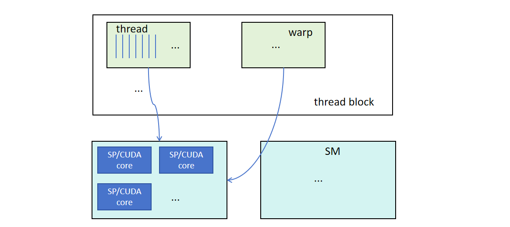
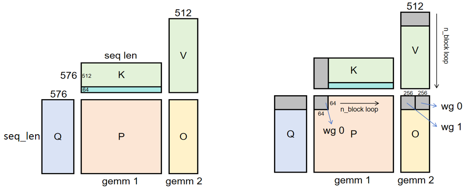

# FP8 flashMLA原理解读

DeepSeekV2技术报告中提出了一种新的attention计算方法，叫做multi-head latent attention，简称MLA，可以减少KV Cache缓存和计算量，MLA对应的FlashAttention就叫做FlashMLA。本文重点讲解FlashMLA的工作原理，不了解MLA的同学可以先参考[这个链接](https://zhuanlan.zhihu.com/p/1945942669441343674)进行学习。

## 1. flashAttention原理回顾

FlashAttention是Tri Dao等人于2022年提出的一种高性能attention计算方法，现在是transformer模型必不可少的组成部分。截至到目前，FlashAttention包含V1、V2、V3三个版本，FlashMLA采用的计算流程就是V3版本，V3版本实际上是基于Hopper架构的编程模式而设计的。现在网上有很多写的比较清晰的博客：[V1版本](https://blog.csdn.net/qq_41913559/article/details/146318915?spm=1001.2014.3001.5506)、[V2版本](https://blog.csdn.net/weixin_42924914/article/details/142496358?spm=1001.2014.3001.5506)、[V3版本](https://blog.csdn.net/xuebinding/article/details/151676334?spm=1001.2014.3001.5506)，想详细了解的同学可以参考学习。

### 1.1 Hopper GPU架构编程模式简介



上图是GPU的软硬件基本单元。在硬件方面，最基础的计算单元是CUDA core，也叫SP（Streaming Processor），SP包含计算单元（ALU、FPU等）和寄存器。多个SP组成一个SM（Streaming MultiProcessor），一张GPU卡有多个SM。

在软件方面，最基本的执行单位是thread。多个thread组成一个warp，每个warp中的thread可以同时执行相同的指令，从而实现SIMT（单指令多线程）并行。warp是SM的最小调度单位（the smallest scheduling unit on an SM），一个SM可以同时处理多个warp。

多个warp又组成1个thread block。同一个block中的thread可以同步，也可以通过shared memory进行通信。thread block是编程人员进行线程组织和协作的基本逻辑单位。

基于上面的结构，Hopper之前的Ampere的编程模型采用以warp（32线程）为核心的编程模型，程序员需要手动管理数据在全局内存与共享内存之间的移动，通过频繁的线程块内同步来协调计算与数据访问，并依赖warp级的Tensor Core指令（WMMA）进行矩阵计算，这种模式要求开发者精细地控制资源分配和数据流以实现计算与内存操作的局部重叠。而Hopper架构引入了**Producer-consumer编程模式**，示意图如下：


首先，每个producer、consumer都是一个warpgroup，4个warp组成一个warpgroup。与之对应的，软件层面提供了**WGMMA** (Warpgroup-level Matrix Multiply)，WGMMA相比于WMMA能处理更大shape的矩阵计算。Hopper架构在硬件层面增加了**TMA (Tensor Memory Accelerator)**，每个SM配备一个TMA单元。TMA具备将数据从全局内存高效地传输到多个SM的共享内存的能力，这种操作被称为“多播”。producer一般负责调用TMA将矩阵分片从全局内存传输到共享内存，然后consummer调用WGMMA进行计算。当然，有时候producer也会调用WGMMA进行计算。Producer-consumer编程模式可以让producer和consumer进行异步并行计算，提升执行性能。我们将在第2部分解释如何把这些功能应用在flashMLA的计算流程中。

### 1.2 flashAttention矩阵计算切分策略

基础的attention计算过程如下：

① 把Q矩阵和K矩阵从HBM加载到SRAM（共享内存和寄存器）；

② 计算出${S=QK^T}$，把S写回HBM；

③ 把S加载到SRAM，计算P=softmax(S)；，把P写回HBM；

④ 把P和V加载到SRAM，计算O=PV，把O写回HBM；

⑤ 返回O。

上面过程中，涉及多次HBM和SRAM之间的数据传输，当Q、K、V的shape很大时，数据传输耗时会非常大。

flashAttention的思想就是把各个输入切片后，在SRAM里面完成切片数据的S、P以及O的计算，直接把切片数据对应的O返回给HBM，这样每组切片数据的计算只涉及1次HBM和SRAM之间的来回传输。flashAttentionV3的切分计算逻辑如下（以切分成4份为例）：


```python
for i in [1, 2, 3, 4]:
    Q = Q_i
    O_i = torch.zeros(Q)
    for j in [1, 2, 3, 4]:
        S_ij = Q*K_j
        O_i += S_ij*V_j
```

在上面的伪代码中，Q的循环处于外部，K和V的循环处于内部，所以我们把这种切分计算策略叫做“Q外循环，K、V内循环”。而且O的每块分片的计算可以并行处理，例如我们可以把Q1和K、V都发送给warpgroup1处理，得到O1；把Q2和K、V都发送给warpgroup2处理，得到O2，等等。

细心的同学可能发现了，我们没有把P=softmax(S)画上去，主要原因是在上面伪代码的 j 循环中，我们每次算出$S_i$的一部分后，就要立马和$V_j$相乘。而计算softmax是要按整行的值来计算的，也就是`softmax(S1)=F.softmax(x, dim=-1)`。为了解决这个问题，研究人员提出了softmax在线计算方法。

### 1.3 online softmax计算方法

online softmax允许把整行的数据分段，每次只计算一小段数据的softmax，并且在计算新的小段数据的softmax值时，对之前计算的小段数据的softmax值乘上一个标量进行更新，使得算完最后一小段数据的softmax值后，各小段数据的softmax值和整行计算方式对应的softmax值相等。

举个简单的例子进行说明。

假设现在只有1段数据：$X_1={[x_1,x_2, ..., x_n]}$，那么它的softmax操作应该如下进行：

首先计算最大值：$X_{1}^{max}=max(X_1)$，并且把当前最大值记作$max_1$；

然后进行指数归一化：$exp(X_{1})=torch.exp(X_{1}- max_1)$，这一步通常是为了防止下一步求和的时候溢出；

再进行softmax，我们把归一化之后的序列之和记作$l_1$，也就是$l_1=sum(exp(X_{1}))$，那么$softmax(X_{1})=exp(X_{1})/l_1$；

现在又来了一段数据，$X_2={[x_{n+1},x_{n+2}, ..., x_{2n}]}$，我们现在想求$X_1$和$X_2$一起组成的序列的softmax值，但此时没有$X_1$，那么我们可以怎么做呢？可以如下进行：

1，首先同样计算$X_2$的最大值：$X_{2}^{max}=max(X_2)$；

然后和$X_1$的最大值进行比较，获取合并序列的最大值：$max_2=max(max_1,X_2^{max})$；

2，然后进行指数归一化：$exp(X_{2})=torch.exp(X_{2}- max_2)$；

$X_1$的指数归一化理论上也可以写成$exp(X_{1})_{new}=torch.exp(X_{1}- max_2)$，但在实际的计算过程中，此时我们已经没有$X_1$的数据了，所以我们要基于之前的计算结果进行更新：$exp(X_1)_{new}=exp(X_1)*torch.exp(max_1-max_2)$;

3，计算softmax：首先更新当前总序列的和，$l_2=l_1*torch.exp(max_1-max_2)+sum(exp(X_2))$，$softmax(X_{2})=exp(X_{2})/l_2$；

同样的，$X_1$的softmax也要更新：$softmax(X_{1})_{new}=exp(X_{1})_{new}/l_2$;

我们可以比较一下$softmax(X_{1})_{new}$和$softmax(X_{1})$:$softmax(X_{1})_{new}/softmax(X_1)=torch.exp(max_1-max_2)*l_1/l_2$。

可以发现，我们计算完$X_1$后，只需要保存好序列的最大值$max_1$和序列之和$l_1$；然后在计算第二段数据的时候，把$max_1$和$l_1$更新成$max_2$和$l_2$，就可以根据这些参数调整之前计算的$softmax(X_1)$的值，得到$X_1$部分在合并序列中的softmax值。

以此类推，如果后面还有新片段数据加入，我们同样只需要维护$max$和$l$，就可以调整之前计算好的softmax值，保证结果的正确性。

[aiInfra项目](https://github.com/Infrasys-AI/AIInfra.git)的`04Train\03TrainAcceler\Code01FlashAtten.md`文件给出了flashAttentionV3的切分策略和online softmax的仿真代码，推荐大家学习一下。

## 2. flashMLA工作原理

好的，由于flashMLA采用的也是flashAttentionV3的切分算法，接下来我们看一下flashMLA的计算流程。

我们借用[这篇文章](https://zhuanlan.zhihu.com/p/26080342823)的一张图来说明：



上图左边是MLA的原始计算任务，右边表示切分计算图，和1.2章节大体是一致的。

我们先看左边，gemm1是QK乘法，gemm2是PV乘法。回忆一下MLA的计算公式：


q、k、v分别是$q_{t}=[q_{t}^C;q_{t,}^R],k_{t}=[k_{t}^C;k_{t}^R],v_t^C=W^{UV}c_t^{KV}$，由于k的前面部分$k_{t}^C=W^{UK}c_t^{KV}$，而且在计算的过程中，$W^{UV}$和$W^{UK}$可以被吸收（不清楚“吸收”含义的同学可以学习[这个链接](https://zhuanlan.zhihu.com/p/1945942669441343674)）。所以实际上在计算的时候，只需要让$k_{t}^C=c_t^{KV},v_{t}^C=c_t^{KV}$即可，这也是为什么左图k和v是用同一个颜色表示，K青色的部分代表的是$k_t^R$。

再看右边，表示flashMLA的切分计算过程，其切分计算流程和上面介绍的flashAttentionV3是一样的。Q处于外循环，K和V处于内循环。而且这里有一个不同就是在计算$P_{i,j}*V_i$的时候，拆成了2部分计算，得到$O_i$的2个小灰块。接下来我们看一下在Hopper架构中，这些计算过程是怎样异步配合的：回忆1.1章节，我们提到了producer-consumer模式，应用到这里来，在计算图中O的灰块切片过程中，wg0(全称是warpgroup 0)就是consumer，wg1就是producer。wg1的任务一方面是加载Q片段、K/V片段，一方面是计算gemm2的一部分；wg0的任务一方面是计算gemm1和softmax，一方面是计算gemm2的一部分。下面描述producer和consumer的执行活动：

① 任务启动，wg1把Q分块（灰色部分）和K/V分块（灰色部分）加载到共享内存中；

② wg0使用Q分块和K分块计算gemm1，接着计算softmax，并把结果保存在共享内存中。注意，Q分块加载后，会一直保留在共享内存中，直到n_block_loop次循环结束。

③ wg0和wg1使用softmax的结果计算gemm2；

④ wg1把K/V的第2个分块加载到共享内存中；

⑤ wg0使用Q分块和K分块计算gemm1，接着计算softmax，并把结果保存在共享内存中；

⑥ wg0和wg1使用softmax的结果计算gemm2；

以此类推，直到n_block_loop次循环结束。

需要注意的是。wg0和wg1是异步执行的，除了有数据依赖的步骤需要插入同步标志（比如wg1必须加载q、k、v之后，wg0才能计算基于这几个分片计算gemm1，以及只有wg0计算完softmax，wg1才能计算gemm2），其他步骤是可以异步执行的，比如wg1加载完K/V的第一个分块后，不需要等wg0算完gemm1，就可以立马加载第2个分块；比如wg0计算完第一组分块的softmax之后，就可以立马计算第二组分块的。这个过程实际上可以看出n_block_loop维度的pipeline流水并行。

## 3. FP8 flashMLA实现

flashMLA中的GEMM是算力的主要消耗点，使用fp8代替fp16/bf16计算不仅可以降低计算量，还能降低显存，提升每次计算的batch_size/seq_length。目前，deepseek公布的资料中，flashMLA只支持bf16/fp16的WGMMA计算，而摩尔线程([开源代码仓MUTLASS](https://github.com/MooreThreads/mutlass/tree/68f1bf1806f5435246518bbeecd3aa810704e3ae))实现了fp8数据类型的计算，包括`mp31_fp8_gemm`和`fp8_scaling_gemm`。接下来我们参考它的进行介绍。

mutlass采用的fp8是e4m3_t格式，如果用$x=(-1)^S*1.m*(2^e-bias)$表示的话，S就是1位二进制，e是4位二进制，m是3位二进制，偏移量一般是7。能表示的最大值是$(1+2^{-1}+2^{-2})*2^{15-7}=448$。FP8 E4M3 不遵循 IEEE754 标准，其在指数全为1时仍然可以表示有效数字，当且仅当指数与底数部分全为1时，其表示无穷大（NaN）。

`mp31_fp8_gemm`的输入是fp8格式的A矩阵和B矩阵，在分块计算过程中，会进行fp8矩阵乘法，并把结果以fp32的格式进行累加。

`fp8_scaling_gemm`比`mp31_fp8_gemm`多几个步骤，引入了 按块缩放（block-wise scaling） 技术，用于在FP8下维持数值稳定性。计算流程如下：输入A、B进行缩放，再量化成fp8，再进行Gemm计算（fp32累加），最后缩放会原来的尺度。


