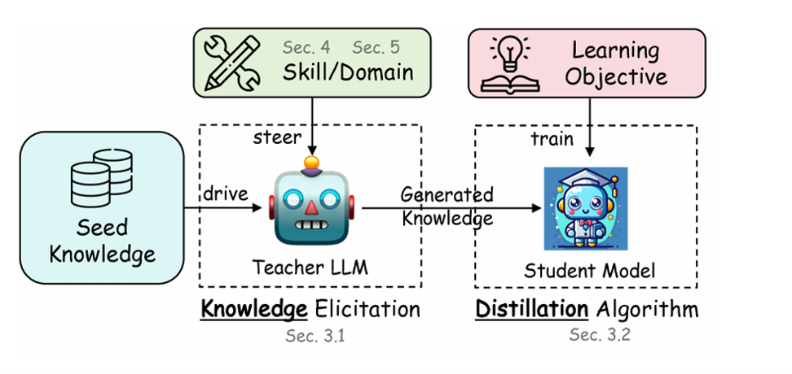
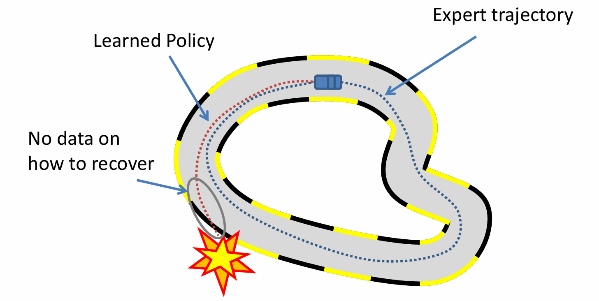
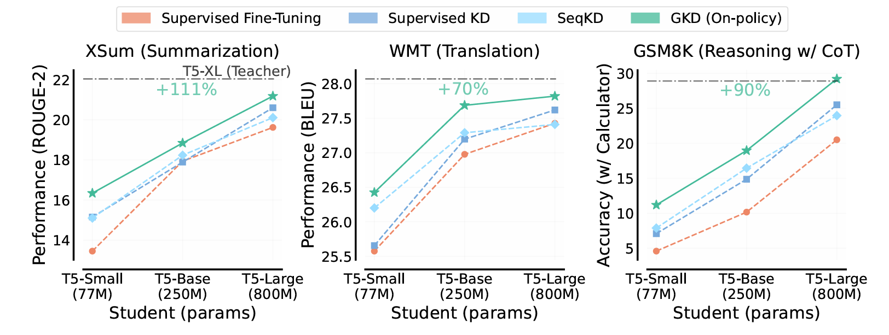
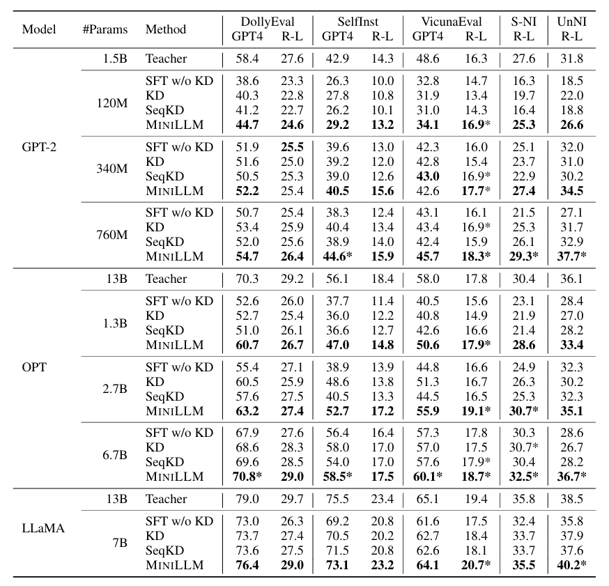
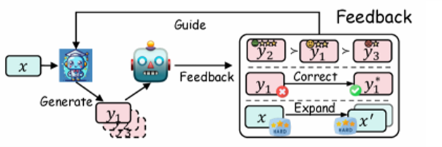

<!--Copyright © ZOMI 适用于[License](https://github.com/Infrasys-AI/AIInfra/)版权许可-->

# 6.2 大模型蒸馏技术

> Author by: 曾薇敏

!!!!!!!!!
整体没搞清楚大模型蒸馏到底是什么，建议多看看知乎和微信公众号最新的内容，不要一上来就展开两个蒸馏框架。先搞清楚什么是大模型蒸馏。

!!!!!!!!!
关键点，大模型+蒸馏。

!!!!!!!!!
https://zhuanlan.zhihu.com/p/1908894189313323730
https://zhuanlan.zhihu.com/p/1891266113632965483
https://www.zhihu.com/question/625415893/answer/1941504017751607226

目录结构建议如下：

## 为什么大模型需要蒸馏
## 什么是大模型蒸馏
## 主流蒸馏方法分类
   ### 做好分类，跟下一节做好映射（稀疏到稠密蒸馏、多模态蒸馏、数据蒸馏、与 RL 结合等）
## 主流大模型蒸馏算法
   ### MiniLLM（GOLD+RL）、LM-Cocktail（混合专家）、SDD（逐层动态蒸馏） xxxx
## 蒸馏效果评估
## 实例：DeepSeek 蒸馏技术解读
## 总结与思考

在大模型技术快速发展的背景下，大型语言模型(LLMs)的规模不断扩大，参数量从数亿增长到数千亿，性能也随之提升。然而，**模型并非越大越好**。从实际部署角度考量，大模型所需的庞大的内存使其难以在资源受限设备上运行，推理过程伴随高昂的计算成本；较长的推理时间削弱了用户体验，也无法适应需要实时响应的场景。

这些限制凸显了模型蒸馏技术的必要性和合理性。模型蒸馏通过"教师-学生"范式，将大型模型的知识转移到更小的模型中，在保持可接受性能的前提下，显著减小模型体积。这种技术实现了推理速度的提升、部署成本的降低和资源占用的优化，使 AI 应用能够在边缘设备上高效运行。蒸馏后的模型不仅满足实际部署需求，还能在性能与资源消耗之间取得理想平衡，为 AI 技术的普及应用提供了切实可行的解决方案。

下图展示了知识蒸馏在大型语言模型背景下发挥的这三个关键作用。

大语言模型的知识蒸馏过程类似于把能力更强的教师的"知识"传授给学生，其中学生模型（如参数量更小的开源大语言模型）学习模仿教师模型（如参数量更大的闭源大语言模型）的性能特征。

1. **增强**：与传统知识蒸馏算法相比，数据增强已成为实现大型语言模型知识蒸馏的主流范式，即使用少量知识种子来提示大型语言模型生成针对特定技能或领域的更多数据。

2. **压缩**：知识蒸馏对大语言模型还有压缩作用，使模型在不显著损失性能的情况下更加高效。

3. **自我提升**：近期，将开源大型语言模型作为教师用于自我改进的策略已成为一种有前景的方法，能够显著提升模型能力。比如自我奖励语言模型，其通过"LLM 作为评判者"的提示方式，让语言模型本身在训练过程中提供自身的奖励信号。模型本身带来的超人类的反馈可以提供充分的训练信息，使模型不受限于人类表现水平。

大型语言模型(LLM)的蒸馏工作流是一个结构化过程，旨在将知识从复杂的教师模型转移到更简单的学生模型。整个蒸馏过程可分为四个关键阶段：

1. 通过精心设计的指令引导教师模型专注于特定技能或领域；

2. 提供种子知识作为输入，促使教师模型生成更详细的输出；

3. 教师模型根据种子知识和引导指令生成问答对话或解释性内容作为蒸馏知识；

4. 使用这些生成的知识示例和特定学习目标训练学生模型，通过最小化损失函数使学生模型逐步获得类似教师模型的能力。

这一工作流确保了知识的有效传递，使更轻量级的模型也能展现出类似高级模型的专业能力。

下面是对两种蒸馏的典型算法——GKD（Generalized Knowledge Distillation）方法和 MiniLLM 方法的详细介绍。

## GKD：广义知识蒸馏

GKD 通过利用教师对学生自生成序列的反馈来训练学生模型，还提供了灵活性，可以在学生与教师之间使用替代的损失函数，这在学生模型缺乏表达能力以完全模仿教师分布时尤其有用。此外，GKD 便于将蒸馏过程与语言模型的强化学习微调（RL fine-tuning）无缝结合。GKD 在自回归 T5 语言模型上验证了其有效性，包括任务特定的蒸馏（如摘要、翻译和推理任务）以及任务无关的蒸馏（用于指令调优）。

### 现有问题：

由于传统蒸馏方法在训练时通常使用教师模型生成的固定样本或现成数据集，无法反映学生模型在推理时真实的输出分布，这会导致训练阶段和推理阶段输出序列分布不匹配（train-inference mismatch）。

1. **普通方法的局限性**：
   
   - **Seq KD**(Sequence-Level Knowledge Distillation)：从教师模型生成固定的输出序列集合来学习，可以看作是基于教师生成输出的 SFT（Supervised Fine-Tune）方法。这种方法计算成本高昂，需要教师模型生成大量样本，且学生只学习"最终答案"而非决策过程中的概率分布。
   
   - **SKD**(Supervised Knowledge Distillation)：使用固定的数据集，由教师模型为每个词元分配概率，学生可以学习教师生成的概率。
     
     这两种方法都存在训练阶段和推理阶段输出序列分布不匹配（train-inference mismatch）的问题。

2. **分布不匹配问题**： 使用固定数据集进行蒸馏时，学生模型在训练和推理阶段面临不同的分布：
   
   - **训练时**：学生模型学习基于"完美"历史预测下一个词（因为它使用教师提供的数据）
   - **推理时**：学生模型必须基于自己生成的历史（可能已经偏离最优路径）来预测下一个词
   
   如下图所示，学生对教师轨迹进行学习，但学生学习策略与专家轨迹之间可能出现不匹配问题，学生没有关于如何恢复的数据，出错后不知该如何纠正回到正确的轨迹上。这种不匹配会导致误差累积，被称为"模仿学习中的分布偏移问题"。
   
   

3. **KL 散度优化的局限性**：
   
   - 传统蒸馏通常试图最小化教师和学生分布之间的前向 KL 散度(KL($p_{teacher}$||$p_{student}$))
   - 当学生模型表达能力不足时（例如参数更少），它可能无法完全拟合复杂的教师分布
   - 这会导致学生模型生成的样本质量较差，与教师模型的分布不一致

为此，提出广义知识蒸馏（GKD）来缓解上述问题。通过**让学生在训练阶段使用自身生成的序列并接受教师反馈**的方式，缓解了分布不匹配，同时允许使用灵活的损失函数来克服表达能力的差距。

### 技术细节与原理：

GKD 将蒸馏过程推广为包含训练阶段采样的自监督（on-policy）的框架，并引入可调的混合策略与损失度量。其主要思想可归纳为以下几点：

#### on-policy 框架

在 GKD 中，学生模型不仅在训练中处理固定教师样本，同时也会**生成自己的序列**用于训练，即采用**自监督（on-policy）框架**，这样可以实现训练-推理的分布匹配。对于每个提示词，学生先用当前策略生成一批候选回答（这些回答来自学生自身分布），然后教师模型对这些答案打分（计算概率）。通过在训练损失中加入对学生自生成序列的反馈，学生在训练时就能见到和其推理时分布更接近的样本，从而减轻训练与推理的不一致性。即：

1. On-policy 数据：从学生模型中采样输出序列

2. 反馈：使用教师模型对学生生成的样本进行推理以获取 logits

3. 监督训练：最小化学生和教师模型在 token 层面 logits 之间的差异（如 KL 散度）
   
   

#### 灵活的损失函数：

 GKD 采用**广义 Jensen–Shannon 散度（generalized JSD）** 来度量学生分布与教师分布之间的差异，并引入参数来插值不同散度。

基于 KL 的散度是衡量两个概率分布相似性的测量方法，其中 KL 散度（Kullback-Leibler 散度）是一种常用的度量。两个离散分布 P(C) 和 Q(C) 之间的 KL 散度定义为：

$$D_{KL}(P||Q) = \sum_{c\in C} P(c) \log \frac{P(c)}{Q(c)}$$

KL 散度不具有对称性：

$$D_{KL}(P||Q) \neq D_{KL}(Q||P)$$

因此，我们将 $D_{KL}(P||Q)$ 称为 P 和 Q 之间的前向 KL 散度，而 $D_{KL}(Q||P)$ 称为反向 KL 散度。在监督学习中，基于经验数据分布的前向 KL 对应于我们优化的最大似然。当使用分布 $Q_θ(C)$ 近似 P(C) 时，如果模型容量不匹配，最小化反向和前向 KL 分别会导致均值寻找和模式搜索行为。

> ## 前向 KL 散度与反向 KL 散度的行为差异
> 
> 下表展示了前向 KL 散度和反向 KL 散度，以及 JS 散度的计算公式。
> 
> 
> 
> 如下图所示我们展示了在最小化前向 KL 散度(\text{KL}(P\|Q_\theta))和反向 KL 散度(\text{KL}(Q_\theta\|P)时，单峰高斯分布 Q_θ相对于混合分布 P 的学习结果。
> 
> | 特征       | 反向 KL 散度 ($\text{KL}(Q_\theta\|P)$) | 前向 KL 散度 ($\text{KL}(P\|Q_\theta)$) |
> | -------- | --------------------------------- | --------------------------------- |
> | **行为特性** | 模式搜索 (Mode-seeking)               | 模式覆盖 (Mode-covering)              |
> | **主要特点** | 强制要求 $Q_θ$ 在 $P$ 为零的地方也为零             | 确保在 P 有概率质量的地方，$Q_θ$ 也必须分配概率质量       |
> | **结果**   | $Q_θ$ 集中在 $P$ 的某一个模式上                | $Q_θ$ 尝试覆盖 $P$ 的所有模式                 |
> | **倾向性**  | 倾向于"忽略"P 中的某些模式，专注于单个模式            | 可能会在真实分布模式之间的低概率区域分配过多概率质量        |
> | **适用场景** | 当需要精确捕捉单个模式时                      | 当需要覆盖所有可能模式时                      |
> 
> 下图所示的例子是用单峰高斯 $Q_θ$ 拟合多峰分布 $P$，可以观察到，当模型容量不匹配时：
> 
> - 反向 KL 会选择一个模式并精确拟合
> - 前向 KL 会尝试覆盖所有模式，但可能导致在实际上不存在数据的区域产生概率质量

> 

JSD(β) 使用有界系数 0 < β < 1 在前向和反向 KL 之间进行插值。

$$D_{JSD(β)}(P||Q) = βD_{KL}(P||βP + (1-β)Q) + (1-β)D_{KL}(Q||βP + (1-β)Q)$$

将 JSD 表示为参数 $\beta$ 插值：$\beta=0$ 时近似前向 KL，$\beta=1$ 时近似逆向 KL。广义 JSD 的引入增加了灵活性，使其能够适应不同权重分配的应用场景。例如，可以让损失从正向 KL 过渡到逆向 KL，控制学生对不同分布区域的关注程度。这种灵活性使得当学生容量不足以完全模仿教师时，可以调整散度侧重学生更容易生成的区域。

#### 统一框架：

 GKD 实际上将传统的离线蒸馏（off-policy KD）和在线蒸馏（on-policy KD）纳入一个框架。通过调节 $\lambda$ 和 $\beta$，可以自由切换和混合这两种极端，以及介于它们之间的“混合策略 KD（mixed-policy KD）”。当 $\lambda=0$ 且采用学生对教师输出的交叉熵时，GKD 回退到标准的教师生成样本训练，等同于普通的有监督序列级蒸馏；当 $\lambda=1$ 且使用全局 JSD 时，完全依赖学生自生成数据，它就是纯粹的 on-policy 蒸馏。这样的设计使研究者能够按需选取最适合任务的数据策略和发散度，比如 GKD 的作者发现在多个任务上 on-policy 数据（高 $\lambda$）往往获得更好效果。

如表 Algorithm 1 所示，在这个广义知识蒸馏(GKD)算法中，`λ`是一个超参数，取值范围在[0, 1]之间，用于控制学生模型的数据采样策略：`λ`决定了算法在每一步迭代中使用哪种类型的数据，当随机生成的值`u ≤ λ`时，算法使用学生模型自己生成的输出，当`u > λ`时，算法使用原始数据集中的输入-输出对。它实际上控制了自生成数据与原始数据的比例，`λ`值越大，算法越倾向于使用学生模型生成的输出。`λ`值越小，算法越倾向于使用原始标签数据。这种机制允许学生模型在学习过程中既探索自己生成的知识，又利用真实数据的监督信号。

#### 与强化学习结合：

GKD 天生支持与 RLHF 相结合。在生成式任务中，除了利用 KL 散度作为训 练目标，还可以在同一个框架中引入额外的序列级奖励（例如任务指标或人类反馈分数）。GKD 能无缝集成这类奖励优化过程，在蒸馏大型教师的同时优化不可微目标。这种设计允许蒸馏过程兼顾模型对任务指标的优化，使学生模型更适应实际应用需求。

在某些任务中，从教师模型蒸馏可能只是为我们的主要目标提供一个代理，而这个目标也可能是不可微分的。我们可以通过强化学习(RL)直接优化这个目标。在线策略 GKD 很容易与基于人类反馈(RLHF)或 AI 反馈(RLAIF)的强化学习微调相结合，因为它只需要学生模型的输出样本。如果想要优化学生策略以获得标量奖励 r，同时保持与教师策略的接近度，那么我们可以使用这个正则化的 RL 微调目标函数：

$$E_{x\sim X} \left[ (1 - \alpha) E_{y\sim p^S_\theta(\cdot|x)}[r(y)] - \alpha E_{y\sim p^S(\cdot|x)} D(p^T\parallel p^S_\theta)(y|x) \right]$$

其中第一项是 RL 目标，第二项是泛化 On-policy 蒸馏，α ∈ [0,1]控制蒸馏损失相对于 RL 目标的强度。当α=1 时，将只执行蒸馏。

上述目标函数允许我们在最大化奖励的同时，通过蒸馏改进模型的其他能力，这可能减少"对齐税"——即在将语言模型与人类偏好对齐时通常导致的模型通用能力下降。

实现 On-Policy GKD 的可以归纳为以下三个步骤：

1. 使用你喜欢的 RLxF 框架（强化学习框架）

2. 关闭奖励最大化项（图中红色箭头指向的部分）

3. 将参考 SFT 策略替换为教师策略（改变不同方法的分配策略）
   
   

实现了带有反向 KL 散度的 on-policy GKD。可以将这里的反向 KL 替换为其他 token 级别的 f-divergence（如 JSD、Jeffreys 散度）以获得最佳效果。

Hugging Face 官方文档对 GKD 的关键点总结为：**GKD 在自回归序列模型中通过在训练时使用学生自生成数据来解决分布不匹配问题；同时它使用通用的 JSD 损失来灵活选择不同的散度度量**。在具体实现时，GKD Trainer 将上述 $\lambda$、$\beta$ 等超参数暴露给用户，方便调节蒸馏强度、混合策略和散度插值。

**创新点与优势：** GKD 的核心创新在于 **“泛化”蒸馏目标**——它将学生蒸馏训练过程从传统固定样本学习，扩展到了在线自采样学习。与 Seq KD 相比，GKD 不再局限于教师事先生成的一套参考答案，而是让学生主动探索输出空间并向学生自身的弱点学习。这一策略有效缓解了训练-推理不一致现象，使得学生训练时更加贴近推理环境。此外，通过引入可调的广义 JSD，GKD 提供了按需控制散度的能力，当学生表达力有限时可侧重逆向 KL，以让学生更多关注教师认为“可能”的输出区域。

实验证明，GKD 在多个自然语言生成任务（摘要、翻译、算术推理）上的表现都超过了常用的蒸馏基线。例如，GKD 在抽象摘要和机器翻译任务上取得了比传统 KD 更低的困惑度和更高的 Rouge 分数，并在算术推理等高难度任务中也显示出更高的一致性和准确性。官方文档和论文都指出，**整合 RLHF 后的 GKD（带有附加奖励）能进一步改善模型输出的任务合规性**，例如在文本摘要中降低幻觉风险。另外，GKD 框架具有高度可调性，用户可以根据具体任务需求灵活设置 $\lambda$ 和 $\beta$，这使得它能在不同规模和类型的模型之间迁移应用。Hugging Face 的实践经验也表明，GKD 在使用领域大模型（如 Qwen 系列）时，同样能在不同 $\lambda$ 和 $\beta$ 配置下获得稳定效果。

尽管 GKD 显示出显著优势，它仍有一些限制。首先，GKD 需要在训练过程中频繁地进行模型采样和评估，比传统 KD 方法计算更昂贵，需要更多训练时间和算力。其次，参数调节较为复杂：$\lambda$、$\beta$ 等超参数对最终效果影响巨大，不同下游任务最优配置可能差异显著，需要经验或额外调优。此外，GKD 的效果依赖于教师模型的质量和学生的初始化策略（一般学生先要经过 SFT 预训练以产出合理输出），对于非常低资源场景或超大规模学生可能面临收敛困难。最后，从研究层面看，GKD 目前主要在语言生成领域验证，对视觉、表格、代码等其它序列型输出的蒸馏应用尚不明确，拓展应用领域是未来需要探索的方向之一。

### 实验效果：

#### GKD 方法对于模型应对不同任务的性能提升

将 GKD 与不同学生模型大小的 KD 方法进行比较。我们使用经过监督微调训练的 T5 模型作为学生模型。我们使用经过监督微调的 T5-XL(约 30 亿参数)作为教师模型，其性能由水平线表示。监督 KD 和 FT 使用真实输出序列进行训练，而 SeqKD 则在教师生成的输出序列上训练。在线 GKD 在从学生模型采样的输出序列上进行训练。对于 GKD，我们在 WMT（Workshop on Machine Translation）数据集上使用 JSD(0.1)，在其他任务上使用前向 KL 散度。在评估中，我们对 XSum 和 GSM8K 使用贪婪采样，对 WMT 使用束搜索。

GKD 统一了自回归语言模型的一些现有知识蒸馏方法，同时实例化了新的在线策略方法，这些方法大大优于其他基本的方法。在从在线 GKD 获得的对初始学生模型的性能提升方面，平均在不同大小的 T5 学生模型上，与基准 KD 方法相比（如上图），我们在总结任务上看到相对提升 1.1 倍，在机器翻译上提升 0.7 倍，在算术推理任务上提升 0.9 倍。

#### On-Policy 蒸馏的有效性和效率

通过比较蒸馏与直接强化学习的性能和计算成本（以 GPU 小时计）来评估 on-policy 蒸馏的有效性和效率，两者都从相同的 off-policy 蒸馏 Qwen3-8B 检查点开始。为简单起见，我们在这个比较中仅关注数学和代码相关的查询。

以上数据表明，On-policy 蒸馏实现了显著优于强化学习的性能，同时仅需约 1/10 的 GPU 小时。此外，从教师 logits 进行蒸馏使学生模型能够扩展其探索空间并增强其推理潜力，这一点从蒸馏后 AIME'24 和 AIME'25 基准测试的 pass@64（模型在 64 次尝试中至少有 1 次生成正确答案的概率）分数相比于初始检查点的改善中得到证明。On-policy 蒸馏在显著降低计算资源的同时，却获得了全面超越强化学习的性能。

#### 散度对性能和多样性的影响

使用不同散度的在线策略 GKD，我们通过改变采样温度，来评估蒸馏后学生模型的生成质量和多样性之间的权衡。我们使用 Self-BLEU 来量化多样性，其中 100 分表示确定性输出，0 分表示最大多样性。

从图中结果中可以看到，从前向 KL 过渡到反向 KL，再到广义 JSD，会导致多样性降低，这归因于散度的增强模式搜索特性。模式搜索型散度通常能产生更优质的输出，特别是在高温度(γ = 1)时。降低温度会减少多样性，同时缩小不同散度之间的性能差异。

#### On-policy GKD 与 RLAIF 在总结任务中的性能权衡

下面是关于的一个简单但有力的例子证明了 RLHF/RLAIF 对 GKD 方法的改进作用。只需要对损失函数加入教师模型的部分进行正则化，下面是这个正则化的 RL 微调目标函数：

$$E_{x\sim X} \left[ (1 - \alpha) E_{y\sim p^S_\theta(\cdot|x)}[r(y)] - \alpha E_{y\sim p^S(\cdot|x)} D(p^T\parallel p^S_\theta)(y|x) \right]$$

下图展示了在 XSum 数据集上奖励最大化与摘要性能之间的权衡。图中结果是相对于原始 T5-base 学生模型的改进。遵循 Roit 等人(2023)的方法，使用来自 T5-XXL NLI 分类器的文本蕴含分数作为奖励。参数α控制基于策略的 GKD 损失函数 JSD(0.9)的强度。

随着α的增加，ROUGE-2 分数提高，而事实一致性的改进则减少。作为比较，我们展示了规模大 12 倍的 T5-XL 教师模型的相对性能。RLEF 对应于 Roit 等人(2023)的 RLAIF 方法，其中学生模型向原始学生模型本身而非教师模型进行正则化。基于策略的 GKD + RL 与 RLEF*相比达到了更高的 ROUGE-2 分数，同时与教师模型相比生成了事实一致性更强的摘要。

### 关键代码展示：

    # Apply temperature scaling
    student_logits = student_logits / temperature
    teacher_logits = teacher_logits / temperature
    
    # Compute log probabilities for student and probabilities for teacher
    student_log_probs = F.log_softmax(student_logits, dim=-1)
    teacher_log_probs = F.log_softmax(teacher_logits, dim=-1)
    
    # Compute the log of the mixture distribution
    # log(a + b) = log(exp(log(a)) + exp(log(b))) -> for mixture
    beta = torch.tensor(beta, dtype=student_log_probs.dtype)
    mixture_log_probs = torch.logsumexp(
        torch.stack([student_log_probs + torch.log(1 - beta), teacher_log_probs + torch.log(beta)]),
        dim=0,
    )
    
    # Compute KL divergences using F.kl_div
    # PyTorch differs from the standard mathematical definition, so the order of the probability distributions is swapped compared to that defined in the paper.
    kl_teacher = F.kl_div(mixture_log_probs, teacher_log_probs, reduction="none", log_target=True)
    kl_student = F.kl_div(mixture_log_probs, student_log_probs, reduction="none", log_target=True)
    
    # Compute the Generalized Jensen-Shannon Divergence
    jsd = beta * kl_teacher + (1 - beta) * kl_student

这段代码实现了广义 Jensen–Shannon 散度（Generalized JSD）的计算，用于衡量学生模型与教师模型预测分布的差异：

1. 温度缩放 logits  
   对学生和教师 logits 除以 temperature，控制 softmax 分布的平滑程度。

2. 计算对数概率  
   $\text{student\_log\_probs} = \log \text{softmax}(\text{student\_logits})$
   
   $\text{teacher\_log\_probs} = \log \text{softmax}(\text{teacher\_logits})$

3. 按权重 β 混合分布  
   $\log p_\text{mix} = \log \big((1-\beta) \cdot p_\text{student} + \beta \cdot p_\text{teacher}\big)$

4. 计算 KL 散度  
   分别计算  
   $KL(p_\text{mix} || p_\text{teacher}), \quad KL(p_\text{mix} || p_\text{student})$
   代码中使用 `F.kl_div(mixture_log_probs, teacher_log_probs, log_target=True)` 等函数，PyTorch 的参数顺序和标准 KL 定义略有不同。

5. 按权重组合得到广义 JSD  
   $\text{GJSD} = \beta \cdot KL(p_\text{mix} || p_\text{teacher}) + (1-\beta) \cdot KL(p_\text{mix} || p_\text{student})$

### 应用与挑战：

GKD 被用于蒸馏各种自回归语言模型任务，比如 Gemma2。GKD 也用于任务无关的指令蒸馏：即学生在没有特定任务数据的情况下，通过教师生成的通用指令-回答对进行训练，提升其对指令的整体响应能力。在工业界，由于 Hugging Face 等开源社区的推动，GKD 已被整合进通用训练流程。例如，Hugging Face 的 `trl` 库提供了 GKDTrainer 接口，开发者可以方便地在自己模型上尝试 GKD 蒸馏。此外，在需要低延迟推理的场景中（如客服机器人或对话助手部署），GKD 提供了一条平衡模型质量与效率的路径：可以利用 GKD 从大模型中提取能力，使小模型在保持较高输出质量的同时大幅降低推理成本。

GKD 技术面临的主要挑战有两个：一是计算负担和超参调优难题。由于需要重复生成序列并计算梯度，GKD 训练时间往往较长，尤其是在面对对大型模型时；二是需要在多样性与精确度间寻求平衡，过度强调 on-policy 采样可能导致学生过拟合于自己易生成的模式，而忽略长尾样本。

### 大语言模型蒸馏与推测解码的结合——OSD

在 KD 的众多变体中，**GKD（Generalized Knowledge Distillation）**是一种混合式的蒸馏框架，GKD 能够兼顾模型在不同场景下的表现，兼具精度和泛化能力，是目前蒸馏方法中的代表性方向。然而，不论是 KD 还是 GKD，它们的共性局限在于：**蒸馏往往是离线的、一次性的**。训练时，学生模型在固定的教师数据分布下学习；一旦蒸馏完成，学生参数就被冻结，不会再随着后续的用户输入而改变。学生模型学到的只是教师在特定训练语料上的“快照”，而非教师在真实应用场景中动态展现出来的全部能力。

这种静态的蒸馏方式有两个问题：一是当用户的查询分布与训练数据存在差异时，学生模型的性能往往迅速下降；二是蒸馏得到的小模型虽然能在推理时替代部分计算，但并不能主动适应新的输入分布。在实际加速大语言模型（LLM）的场景下，其性能仍有一定的局限。

为了让蒸馏不只停留在训练阶段，而是持续发生在推理过程中，可以使用推测解码方法。推测解码中引入了一个 **draft model（草稿模型）**。它会在用户输入后一次性生成一段候选 token 序列。与此同时，**target model（目标模型）** 并不从头开始逐个生成，而是并行地对这些候选 token 进行验证。如果其中大部分 token 都与目标模型的分布一致，那么这些 token 就可以直接被采纳。如果不一致的话，就由目标模型完成正确的 token 选择。推测解码的效率提升，取决于一个关键指标——**token 接受率 α**。接受率越高，说明草稿模型预测得越准，目标模型需要重新生成的 token 越少，加速效果就越显著；反之，如果草稿模型预测偏差很大，目标模型频繁回滚修正，不仅会抵消推测解码的节省，甚至可能拖慢整体推理。然而草稿模型与目标模型之间往往存在能力差距，尤其是当用户输入的文本分布与训练数据存在差异（也就是 **domain shift**）时，草稿模型的预测准确率会大幅下降。

推测解码虽然在机制上提供了一种新的加速路径，其效果仍受 **草稿模型预测不准** 的制约。为了突破接受率上的瓶颈， **OSD（Online Speculative Decoding，在线推测解码）** 被提出。它的核心创新在于：把蒸馏从训练阶段延伸到 **推理阶段**，让草稿模型在真实用户请求中不断学习，从而逐步缩小与目标模型之间的差距。

#### OSD 框架概述

在 OSD 框架中，用户的输入首先进入草稿模型（Draft Model, 学生），草稿模型会生成一批候选 token 及其概率分布。随后，目标模型（Target Model, 教师）并行验证这些 token：预测一致的直接接受，不一致的则由目标模型提供正确结果。对于被拒绝的 token，系统会将草稿和目标模型的概率分布成对存入缓冲区（Buffer）。当缓冲区的大小超过阈值，或时间超过设定阈值时，就会触发一次在线蒸馏更新，利用 KL 散度、反向 KL 或 JSD 等距离度量，让草稿模型逐步对齐目标模型。更新后的草稿模型在后续推理中表现更接近目标模型，token 接受率不断提升，系统则从最新的正确 token 继续生成后续序列，进入下一轮推理与验证。整个过程形成了一个闭环，实现了推理加速与草稿模型的实时进化。

#### OSD 实现在线蒸馏

OSD 本质上仍然是一种知识蒸馏（Knowledge Distillation）方法，它继承了 “teacher → student” 的学习范式，由目标模型提供正确分布，草稿模型不断学习模仿。不同之处在于，OSD 并不是在离线训练阶段一次性完成，而是将蒸馏嵌入到推理过程中。用户的每一次真实交互都会经历“draft 生成 → target 验证”，并产生新的蒸馏信号。通过持续更新草稿模型，OSD 能逐渐消除训练分布与查询分布（推理分布）之间的偏移，使草稿模型在真实场景下越来越接近目标模型的行为，从而提升 token 接受率 α，实现推理加速。换句话说，OSD 是一种“在线化的蒸馏架构”，让知识蒸馏从一次性训练手段，升级为推理系统的实时优化机制。

OSD 带来了两点重要优势：

1. **持续自适应**：草稿模型不再局限于离线训练时的分布，而是能在实际交互中逐步适应用户的真实输入。即使出现 domain shift，OSD 也能通过在线蒸馏快速恢复接受率。

2. **接受率提升 → 加速增强**：随着草稿模型越来越接近目标模型，它的预测正确率不断提高，token 接受率 α 稳步上升。这样目标模型需要重新生成的 token 就越来越少，整体推理延迟显著降低。实验证明，OSD 可以将接受率提高 0.1–0.65，端到端延迟减少 1.4–2.1 倍。

从本质上看，OSD 的提出解决了推测解码和蒸馏的共同短板：草稿模型的静态局限性。它既继承了蒸馏“教师指导学生”的思想，又利用推测解码的交互过程，把蒸馏嵌入了推理环节。可以说，OSD 代表了一种新的蒸馏形态：**让蒸馏从一次性的训练技巧，变为推理系统中的长期机制**。

在线蒸馏（OSD）可提升学生模型推理性能与适应性，但伴随一定代价。推理过程中需对草稿模型进行小规模更新，会增加算力和显存负担；缓冲区存储草稿（draft）与目标（target）分布，多模型支持下内存消耗更高。系统需在推理与训练间动态调度，更新过频或过稀均影响性能，同时传输教师分布增加带宽与能耗压力。尽管如此，如果需要更高性能的蒸馏模型，这些投入仍是具有重要意义的。

## MiniLLM 框架

!!!!!!!
论文的图呢？不要搞太多内容，意义不大，聚焦技术核心重点。

知识蒸馏（Knowledge Distillation, KD）是压缩大规模语言模型（LLMs）的关键手段，但现有方法多依赖正向 KL 散度，往往要求学生模型覆盖教师模型的长尾分布。在开放式生成任务中，这种模式覆盖容易导致生成质量下降与暴露偏差加剧。为解决这一问题，本文提出 **MiniLLM 框架**：以反向 KL 散度为核心目标，并结合三项关键训练策略——单步分解、教师混合采样以及长度归一化，从而稳定优化过程。基于该方法训练得到的学生模型统称为 **MiniLLM**，在不同模型族与规模（120M–13B）上进行了系统评估。实验结果表明，MiniLLM 在文本生成质量、长文本一致性以及概率校准方面显著优于传统 KD 和监督微调方法，部分学生模型甚至超过教师模型表现。这一研究为构建更高效且可靠的轻量化语言模型提供了新的思路。

### 现有问题：

知识蒸馏（Knowledge Distillation, KD）作为一种经典的模型压缩方法，通过将大模型（教师模型）的知识迁移到小模型（学生模型），在自然语言处理的诸多任务中展现出广泛应用价值。传统 KD 方法普遍基于**正向 KL 散度 $KL[p‖q]$** 作为优化目标，即令学生模型尽可能覆盖教师模型的概率分布。这种“模式覆盖（mode-covering）”特性在分类任务中通常有效，但在开放式文本生成任务中却带来了严重问题：教师模型的分布往往包含大量长尾模式，而学生模型容量有限，被迫去拟合低概率区域，容易导致生成质量下降。更具体而言，学生模型在训练时过度追逐教师的长尾分布，推理时则表现为**暴露偏差（exposure bias）**、文本不连贯以及生成内容的置信度偏差。这一缺陷显著限制了现有 KD 方法在生成任务中的适用性。

针对这一问题，本文提出了一种新的蒸馏思路：**以反向 KL 散度 $KL[q‖p]$ 替代正向 KL 散度**作为蒸馏目标。与正向 KL 的模式覆盖不同，反向 KL 具有**模式寻求（mode-seeking）** 的特性，使学生模型更专注于教师分布的高概率区域，而非追逐长尾噪声，关于正向 KL 与反向 KL 的覆模式的区别在前文 GKD 中有详细介绍，此处不再赘述。该目标更契合开放式生成的需求，有助于提升生成文本的准确性与一致性。然而，直接最小化反向 KL 在实践中会遇到训练方差过大、奖励黑客（reward hacking）以及生成长度偏差等问题，因此需要进一步设计稳定有效的训练策略。

为了解决上述挑战，作者提出了 **MiniLLM 框架**，并将基于该方法训练得到的学生模型系列统称为 **MiniLLM**。该框架的主要贡献体现在以下三个方面：

1. **方法层面**：提出以反向 KL 散度为目标的蒸馏方法，并从理论上论证其在生成任务中更适合捕捉高质量模式。  
2. **训练稳定性**：设计了三项关键策略——单步分解（single-step decomposition）、教师混合采样（teacher-mixed sampling）以及长度归一化（length normalization），以显著降低方差、抑制无意义高分样本以及缓解短文本偏好，从而保证训练可行性。  
3. **系统验证**：在不同模型族（GPT、OPT、LLaMA 等）与多种规模（120M–13B）上，系统性地评估了 MiniLLM 框架的性能。结果显示，MiniLLM 在生成质量、长文本一致性、概率校准等方面显著优于传统 KD 和监督微调（SFT），部分学生模型甚至超过教师模型表现。

!!!!!!!
注意格式，一段一个空行

### MiniLLM 框架的核心方法

MiniLLM 框架的核心方法的整体思路是将蒸馏目标从传统的正向 KL 散度替换为反向 KL 散度，并通过策略梯度实现可训练化。在此基础上，作者设计了三项稳定训练的关键策略，有效解决了方差过大、奖励黑客以及长度偏差等问题。

上图是对序列级知识蒸馏 Seq-KD（左图）与 MiniLLM 框架（右图）的比较。二者的根本区别在于，序列级 KD 强制学生模型记住教师生成的所有样本，而 MiniLLM 则通过教师模型的反馈指导学生在自身能力范围内改进生成文本。如右图所示，首先对教师反馈进行采样，然后计算反向 KL 指导梯度更新，实现对学生模型的优化。

#### 反向 KL 作为目标

传统蒸馏中常用的的正向 $KL$ 公式如下：

$$
\mathrm{KL}[p \| q_\theta] = \mathbb{E}_{x \sim p_x, y \sim p(y|x)} \left[ \log \frac{p(y|x)}{q_\theta(y|x)} \right]
$$

其中 $ p$ 表示教师模型的条件分布， $q_\theta$ 表示学生模型。该目标要求学生模型覆盖教师分布的全部模式（mode-covering），包括低概率的长尾区域。在生成任务中，这种强制覆盖往往导致学生模型的容量被浪费在低质量样本上，从而引发文本不连贯、置信度偏差等问题。

为解决这一问题，MiniLLM 将优化目标改为 **反向 KL 散度**：

$$
\mathrm{KL}[q_\theta \| p] = \mathbb{E}_{x \sim p_x, y \sim q_\theta(y|x)} \left[ \log \frac{q_\theta(y|x)}{p(y|x)} \right]
$$

与 forward KL 的区别在于采样来源：这里的样本来自学生模型 \($ q_\theta\ $)，而不是教师模型。直观上，反向 KL 具有**模式寻求（mode-seeking）** 特性，促使学生模型聚焦教师分布的高概率区域，忽略长尾噪声。这更契合开放式生成的需求，因为用户更关心高质量主模式的生成。

#### 策略梯度推导

直接最小化 $\mathrm{KL}[q_\theta \| p]$ 并不简单，因为期望是在学生模型分布下取样的。为此，作者将其转化为类似强化学习的 **策略梯度（policy gradient）** 形式。

定义奖励函数为：

$$
r(x, y) = \log \frac{p(y|x)}{q_\theta(y|x)}
$$

则目标函数的梯度为：

$$
\nabla_\theta L(\theta) = - \mathbb{E}_{x \sim p_x, y \sim q_\theta} \left[ r(x, y) \nabla_\theta \log q_\theta(y|x) \right]
$$

这一形式与 REINFORCE 算法高度类似：学生模型生成序列，相当于执行策略；奖励由教师分布与学生分布的比值决定。然而，这种梯度估计在实践中会遇到两个问题：

1. **方差过大**：由于奖励取决于完整序列的对数概率，估计方差随序列长度迅速累积。  
2. **奖励黑客（reward hacking）**：学生可能学会生成在公式上得高分、但在人类看来无意义的序列，例如短小、重复的文本。

因此，仅依赖策略梯度是不可行的，必须通过设计额外的机制来稳定优化过程

#### 三个稳定训练策略

为了克服策略梯度中遇到的方差过大和奖励黑客问题，MiniLLM 提出了三项关键策略，从不同角度解决训练中的核心挑战。

!!!!!!!
不要展开 5 级标题，最好 3 级标题 ### 够了

##### 1.单步分解（Single-step decomposition）

直接计算完整序列的奖励会导致方差过大，尤其是长文本情况下。为此，作者将序列级奖励分解为逐步奖励：

$$
R_t = \sum_{i=t}^T r_i, \quad r_i = \mathbb{E}_{y_i \sim q_\theta} \left[ \log \frac{p(y_i|x, y_{<i})}{q_\theta(y_i|x, y_{<i})} \right]
$$

这样，每个 token 的奖励可以通过对词表求期望获得，而不是依赖采样。该分解显著降低了方差，并强化了前几个 token 对整体质量的影响，有助于稳定训练。

##### 2.教师混合采样（Teacher-mixed sampling）

如果完全依赖学生模型采样，容易出现低质量序列，甚至导致奖励黑客。为此，MiniLLM 引入 **教师混合采样**：在每一步生成时，使用以下混合分布采样：

$$
\tilde{p} = \alpha p + (1 - \alpha) q_\theta
$$

其中, $\alpha$ 是混合系数（如 0.2）。这样可以在一定程度上引入教师分布的高质量样本，从而避免学生过早陷入劣质模式。由于采样分布改变了，训练时还需要通过 **重要性采样（importance sampling）** 对梯度进行修正。论文中采用近似形式，以降低计算方差。

这一策略的直观效果是：既保留了学生模型探索的多样性，又注入了教师分布的正确性，防止模型偏离合理区域。

##### 3.长度归一化（Length normalization）

另一个问题是学生模型倾向生成极短的序列（甚至空响应），因为短文本在奖励定义下可能得到较高分。为缓解这一偏差，MiniLLM 对奖励进行**长度归一化**，确保奖励与序列长度无关。具体做法是将累计奖励除以序列长度，从而避免模型过度偏好短文本。

这一改进使学生模型在训练中更平衡地对待不同长度的生这一改进使学生模型在训练中更平衡地对待不同长度的生成，最终提升了长文本生成的一致性。

### 算法简介

如上图，MiniLLM 的蒸馏算法可分为两个阶段。**第一阶段**是初始化：学生模型先在大规模预训练语料上预训练，并在指令数据集上做一次监督微调，以获得基本的生成能力。**第二阶段**是核心蒸馏训练：在每次迭代中，算法从指令数据集中采样提示，并利用教师模型生成对应响应；同时，也从预训练语料中采样长文档，用于维持学生模型的语言建模能力。接着，算法计算三类梯度：①基于反向 KL 的单步分解梯度，用于降低方差并确保前向 token 更重要；②长度归一化梯度，避免学生偏好短文本；③语言建模损失梯度，保证生成流畅性。通过将这些梯度结合并更新参数，学生模型逐步对齐教师分布的高概率区域，并保持在长文本和多样性方面的稳健表现。最终训练收敛后，得到兼具性能与效率的紧凑型学生模型。

MiniLLM 的蒸馏流程可概括为以下几个关键步骤：首先在输入与初始化阶段，准备指令数据集 $D$（用于蒸馏对齐）、预训练语料 $D_{PT}​$（保持语言建模能力）、教师模型 $p$、以及已在 DPT​ 上预训练的学生模型 $q_{θ0​​}$，并设定学习率、批大小和梯度裁剪阈值等超参数。为了让学生模型具备基本的指令遵循能力，算法先在 $D$ 上进行一次监督微调，选取验证集损失最低的参数作为起点。进入核心的迭代蒸馏阶段，每轮训练会从 $D$ 中采样提示并获取教师响应，同时从 DPT​ 中采样长文档文本。接着计算三类梯度：一是基于反向 KL 的单步分解梯度，用于降低方差并突出前向 token；二是长度归一化梯度，避免学生偏好短文本；三是语言建模梯度，用于维持流畅性与知识覆盖。最后，将这三类梯度结合起来更新参数 $θ$，不断迭代直至收敛。通过这一流程，学生模型不仅继承了教师分布的高概率模式，还在长文本生成、一致性与校准性上超越了传统蒸馏方法。

### 实验与结果

本节展示了 MiniLLM 框架在多组实验中的表现。整体实验设计遵循以下思路：首先选择不同规模和体系的教师模型，使用 Dolly-15k 等公开数据集进行蒸馏；随后在多个维度上评估学生模型性能，包括自动指标、GPT-4 打分、人工评测、校准性与暴露偏差分析；最后通过消融实验验证提出的三项稳定训练策略的重要性。

#### 实验设置

!!!!!!!
这些都不需要，直接引用论文的图和实验结果即可，不要大模型堆砌

主要实验使用了 *Databricks Dolly-15k* 指令微调数据集，该数据集包含约 12.5K 条高质量指令-响应对，覆盖问答、摘要、对话等多种任务。为保证学生模型的语言建模能力不受影响，作者还在通用预训练语料（如 OpenWebText）上进行语言建模训练，以维持基础流畅性。
实验涵盖多个主流**模型族及不同规模**：

- GPT-2（124M, 355M, 1.3B）  
- OPT（350M, 1.3B, 6.7B）  
- LLaMA（7B, 13B）  

教师模型分别取自相同规模或更大规模的对应族模型，学生模型在蒸馏后被命名为 **MiniLLM**，例如 MiniLLM-124M、MiniLLM-1.3B 等。

**对比基线**  

- **SFT**（Supervised Fine-Tuning）：直接在 Dolly-15k 上微调学生模型。  
- **KD**（Token-level Knowledge Distillation）：传统基于 forward KL 的蒸馏。  
- **SeqKD**（Sequence-level KD）：利用教师生成的样本训练学生模型。  

**评价指标**  

- **自动指标**：Rouge-L，用于评估生成与参考答案的重叠度。  
- **GPT-4 打分**：利用 GPT-4 比较学生与教师生成的质量，给出相对偏好。  
- **人工评测**：人工标注对比结果，检验自动指标的一致性。  
- **校准性（ECE, Expected Calibration Error）**：衡量模型置信度与准确率的差异。  
- **暴露偏差（ExAccErr）**：评估随着生成长度增长而累积的错误。  
- **多样性（Distinct-4）**：统计四元组的独特性，衡量生成的多样性。  

#### 主要结果

上图所示为评估结果。GPT4 和 R-L 分别表示在 5 个随机种子下的 GPT-4 平均反馈分数和 Rouge-L 分数。每种模型规模的最佳分数用加粗字体表示，当学生模型表现超过教师模型，其分数则标记为 *。

实验结果表明，MiniLLM 在多个规模和模型族下均显著优于基线方法。与传统 KD 和 SeqKD 相比，MiniLLM 更好地对齐教师分布，在 Rouge-L 和 GPT-4 偏好评测中均取得领先。在部分规模下（如 GPT-2 1.3B 的学生模型），MiniLLM 的表现甚至超过了对应的教师模型。

基于 LLaMA 系列模型，在 SelfInst 数据集上的结果中，MiniLLM 在人类偏好方面优于所有基线方法，并与教师模型表现相当。在生成长度较长的任务中，MiniLLM 显示出更强的稳健性。对比图表显示，随着生成长度增加，基线模型的准确率迅速下降，而 MiniLLM 保持了更低的累积错误率（ExAccErr）。这说明反向 KL 的模式寻求特性有效缓解了暴露偏差。ECE 指标也表明，MiniLLM 的输出概率更接近真实准确率，校准性显著优于基线，准确率也更高。即 MiniLLM 不仅生成质量更高，其置信度预测也更可靠，这对下游任务（如多轮对话、决策）具有实际价值。Rouge-L 与 GPT-4 偏好评分高度相关，人工评测结果也验证了这一趋势。MiniLLM 生成的文本在流畅性、相关性和逻辑性上普遍优于 SFT、KD 与 SeqKD。在 Distinct-4 指标上，MiniLLM 与基线方法相近，说明反向 KL 的模式寻求特性并未导致明显的模式坍缩。学生模型既能保证生成质量，也能维持基本的多样性。

实验结果清晰地展示了 MiniLLM 框架的有效性与稳健性。通过引入反向 KL 与三项稳定训练策略，MiniLLM 不仅在整体生成质量上超过传统蒸馏方法，还显著改善了长文本一致性与概率校准。同时，学生模型的多样性未受到明显削弱，表明模式寻求与生成多样性之间可以取得良好平衡。

!!!!!!!
下面都不是重点，1 短话就结束了

#### 讨论与分析

**暴露偏差**是生成模型的核心问题：训练依赖教师前缀，推理依赖自身输出，误差会累积。forward KL 迫使学生覆盖长尾模式，使有限容量的模型更易扩散错误；而反向 KL 只关注学生分布，并校正其与教师高概率区域的一致性，能显著缓解这一问题。实验中的 ExAccErr 曲线表明，MiniLLM 在长文本生成中错误增长更慢，文本更稳健。
良好校准意味着模型置信度能反映真实准确率，但 forward KL 容易因过度关注长尾而导致置信度失真，ECE 升高。MiniLLM 的机制则不断用教师分布对学生进行修正，使输出概率与正确性更一致，使得**校准性改善**。实验显示，在多个规模下 MiniLLM 的 ECE 显著降低，预测更可信，这对于对话系统或辅助决策等场景尤为重要。  
模式寻求带来更高准确性，却可能忽视教师的长尾分布，导致生成趋同甚至**模式坍缩**。实验中 MiniLLM 的 Distinct-4 与基线接近，说明三项稳定策略（尤其是教师混合采样）在一定程度上保留了多样性，使得结果并非完全单一。但在依赖创造性或多样化回答的任务中，这种平衡可能仍不足，需进一步探索动态调节机制。
消融实验证明，三项策略各有关键作用：单步分解降低方差，保证长序列训练稳定；教师混合采样防止奖励黑客，维持合理生成分布；长度归一化矫正短文本偏好，提升长文本表现。消融实验表明它们相互补充，共同支撑了 MiniLLM 的优势，也为未来基于反向 KL 的方法提供了设计参考。

### 局限与未来工作

MiniLLM 以反向 KL 散度为目标，强调模式寻求，使学生模型更聚焦教师的高概率区域。但这也可能导致 **模式坍缩（mode collapse）**，忽视长尾模式，生成趋于单一，在开放域或创意任务中表现受限。未来可通过多样性约束或自适应采样，在保持模式寻求优势的同时缓解这一风险。

反向 KL 蒸馏依赖策略梯度，天然存在方差大和不稳定问题。尽管单步分解、教师混合采样和长度归一化能缓解，但也 **增加了复杂度与调参难度**，降低了方法的可移植性。未来可探索更稳健的梯度估计、改进采样或近似推断，以提升稳定性与扩展性。

此外，实验主要基于 **Dolly-15k 等中等规模数据集**，评测范围有限，难以保证在更大规模、多任务或跨领域场景下同样有效。未来应在更复杂语料和应用中验证，并探索与 RLHF 等方法结合，以增强实用价值。

### 结论

MiniLLM 框架针对传统知识蒸馏在生成任务中存在的局限性，提出了基于反向 KL 散度的蒸馏框架，并结合单步分解、教师混合采样与长度归一化三项关键策略，成功实现了稳定高效的优化。通过在多个模型族与不同规模的实验验证，结果表明该方法在文本生成质量、长文本一致性以及概率校准方面均显著优于传统 KD 与监督微调方法，部分学生模型甚至超越了教师模型的表现。

MiniLLM 的优势主要体现在其模式寻求特性，使学生模型能够更好地对齐教师分布的核心区域，同时避免暴露偏差与置信度失衡的问题。实验中的消融研究进一步证明了三项稳定策略在保证训练可行性与性能提升方面的必要性。

未来的工作可以围绕如何在保证模式寻求优势的同时进一步提升多样性展开，并探索与人类反馈对齐（RLHF）或其他蒸馏范式的结合。总体而言，MiniLLM 不仅展示了一种更合理的蒸馏目标选择，也为轻量化大语言模型的研究与应用提供了新的思路与实践指南。

## GKD 和 MiniLLM 框架的对比

| 方法（出处）                        | 技能 (Skill)                     | 种子知识 (Seed Knowledge)                   | 教师 LLM (Teacher LLM)     | 学生模型 (Student Model)         | 知识引导 / 提取 (Knowledge Elicitation) | 目标函数(Objective)                     |
| ----------------------------- | ------------------------------ | --------------------------------------- | ------------------------ | ---------------------------- | --------------------------------- | ----------------------------------- |
| **MiniLLM**（Gu et al., 2024）  | IF（Instruction Following，指令跟随） | Dolly Dataset                           | GPT2 / OPT / LLaMA（多种大小） | GPT2 / OPT / LLaMA（多种大小作为学生） | Feature（基于特征/概率信息）                | D&S（Divergence & Similarity，散度与相似性） |
| **GKD**（Agarwal et al., 2024） | NLG / NLU / IF（生成 / 理解 / 指令跟随） | XSum + WMT14 (en-de) + GSM8K + FLAN2021 | T5-XL                    | T5                           | Feature + Feedback（特征 + 反馈信号）     | D&S + RL（散度与相似性 + 强化学习）             |

两种方法的**共同点**是:

1. 它们的**共同动机**是改进传统 SFT 或序列级 KD 在生成式任务中的局限，尤其当学生模型容量有限而教师分布复杂时，直接进行前向 KL 拟合或强制记忆所有样本都会带来模式不匹配的问题, 因此两种方法都采用或部分地采用**反向 KL**。

2. 它们都强调利用**教师反馈**进行学习而非盲目记忆，即 GKD 中教师会看到学生的学习路线，根据学生输出给予更加高效准确的指导，而不是让学生直接学习教师输出，如上图所示，而 MiniLLM 中也通过教师给出的反馈（基于分布比值的奖励纳入目标函数）来修正自己的分布。

其不同点是：

1. 在**目标函数**上，MiniLLM 采用散度与相似性（D&S）相结合的策略，其散度部分主要依赖反向 KL 散度，侧重于让学生模型对齐教师模型的高概率分布。GKD 在 D&S 基础上引入了强化学习（RL），并将散度度量替换为更具平衡性的 JSD 散度，这使得 GKD 不仅追求分布对齐，更侧重于利用外部反馈信号（如任务得分）直接优化生成策略，以提升模型在特定任务上的综合表现，而不仅仅是模仿。

2. 在**采样与稳定化策略**上，MiniLLM 采用了带有教师保护的混合采样（teacher-mixed sampling）及长度归一化等多种稳定化技巧，有效降低了训练方差，并避免了简短重复输出。而 GKD 则引入了 on-policy 策略，即部分地由学生模型自主生成序列进行训练。可以缓解训练与推理阶段的分布不匹配问题（exposure bias），也可能引入更高的训练方差和退化输出的风险，对稳定化技术要求更高。

3. **适用场景**上，MiniLLM 更聚焦于指令跟随（instruction-following）类任务的蒸馏，而 GKD 则展现了更强的通用性，其设计使其能够覆盖摘要、翻译、数学推理等更广泛的自然语言处理任务。这种设计差异导致 MiniLLM 更适用于指令遵循（instruction-following）任务的稳定蒸馏，更稳健、更易于工程化实现，而 GKD 的框架则具备更强的通用性，可扩展至翻译、数学推理等更广泛的 NLP 任务。如果希望彻底解决训练与推理的分布偏差，或在特定任务上结合强化学习进行深度优化，GKD 的框架则提供了更大的灵活性和性能上限，不过这需要更精细的调参和更多的计算开销。

## 总结与思考

!!!!!!!!!
补充整体总结

## 参考文献

!!!!!!!!!
按格式

