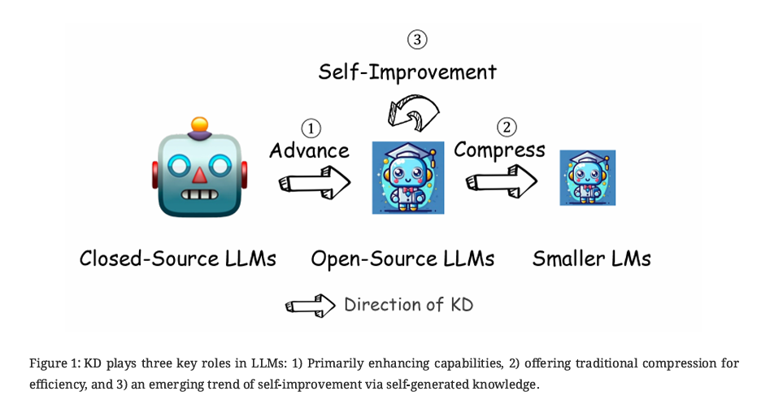
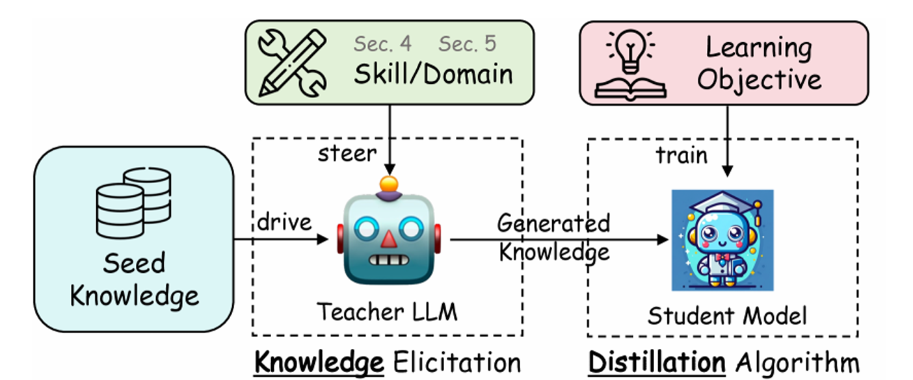

# 大模型蒸馏技术

Author by：曾薇敏

## 为什么大模型需要蒸馏

近年来，大语言模型（LLMs）迅速发展，以 GPT-5 与 Gemini 为代表的**专有模型**在参数规模和能力上持续突破，展现出涌现能力，能够处理远超其原始训练目标的任务，这些模型在上下文理解、复杂推理以及生成任务中表现卓越。然而，其高度闭源性与商业化属性带来了诸多限制：首先，**可访问性有限和成本较高**，使得个人和中小型组织难以承受；其次，使用过程中需将敏感数据传输至外部服务器，引发**数据隐私与安全风险**；最后，其通用性虽强，但缺乏**对特定领域任务的适配性**。因此，可访问性、成本和适应性方面的限制在充分发挥专有 LLMs 的潜力方面构成了重大挑战。

**开源大模型**因其**开放性与可定制性**而在人工智能研究中扮演着重要角色，使个人研究者和中小型组织能够以较低成本获取并应用先进模型。早期由于训练资源和数据规模的限制，开源模型在指令理解和复杂任务上的表现一度远落后于专有大模型。然而，随着大模型蒸馏技术的发展，这一差距正在快速缩小。通过知识蒸馏等技术手段，开源模型能够高效吸收专有模型的知识表示与推理模式，在很多下游任务上已能与专有模型接近。

大模型蒸馏不仅推动了开源模型在性能上的飞跃，也改善了其在计算效率、能耗和可部署性方面的表现。更重要的是，大模型蒸馏促进了人工智能的普惠化，使先进能力能够在更广泛的群体中传播与应用，推动了多样化和公平化的技术生态。

综上所述，对大型语言模型蒸馏的需求日益增长，源于人工智能领域（如 OpenAI 等）的快速演变以及这些模型复杂性的不断增加。随着人工智能不断渗透各个领域，将专有大型语言模型的知识高效有效地蒸馏到开源模型中的需求促使大模型蒸馏技术应运而生。这一需求是由对更易于获取、更具成本效益和适应性更强的 AI 解决方案日益增长的需求所驱动的，并且这些解决方案要能够满足各种特定垂直领域的应用需求。随着人工智能技术持续扩展至各个行业，大模型蒸馏已成为平衡性能、成本与安全性的必要手段，也是推动人工智能生态可持续发展的重要驱动力。

## 什么是大模型蒸馏

知识蒸馏是人工智能与深度学习领域的一项核心技术，其本质在于将大型复杂模型中的知识与能力迁移到更小、更高效的模型之中。这一过程源于早期的神经网络研究，最初的目标是通过模仿教师模型的输出，来训练出能够在资源受限环境中部署的学生模型。

随着大语言模型的兴起，知识蒸馏（KD）在大型语言模型（LLMs）中发挥着三个关键作用：

1. 主要为了**增强能力（advance）**，即通过从教师模型中提取和迁移知识，使学生模型能够掌握更高层次的推理与认知模式；

2. 提供传统的**压缩作用（compress）**，在保持性能的同时减少模型规模和计算开销，提高运行效率；

3. 一种新兴趋势是通过**自我生成知识实现自我改进（self-improvement）**，即利用模型自身生成的数据不断迭代训练，从而实现能力的持续提升。

### 大模型蒸馏的步骤：

LLMs 的通⽤知识蒸馏流程是⼀个结构化、系统化的过程，旨在将知识从复杂的教师模型迁移到较简单的学⽣模型。如上图所示，整体流程可分为四个阶段，每一阶段均对应着蒸馏在不同功能维度上的作用。

第一阶段是**目标技能或领域的引导**。教师模型通过提示或模板被聚焦到特定的知识范围或能力类型。与早期的无差别模仿不同，这一过程强调对教师知识的定向挖掘。例如，将教师模型限定在医学、法律等专业领域，或推理、语言理解等能力上。

第二阶段是**种子知识的注入**。种子知识通常是小规模的输入数据集，包含与目标领域相关的少量知识实例或线索。其作用是为教师模型提供生成的起点，使其能够基于有限的输入扩展出更大规模、更系统的训练样本。

第三阶段是**蒸馏知识的生成**。教师模型在指令和种子知识的引导下，生成符合目标领域的示例。示例不仅包括答案，还可能包含推理链条与解释性内容。教师模型将自身的隐性推理能力外化为显性数据，使学生模型能够从中学习如何进行复杂思考。

第四阶段是**学生模型的训练与优化**。生成的蒸馏数据被用作训练语料，学生模型在损失函数的约束下不断调整参数，以最小化与教师输出之间的差异。

总体而言，大模型蒸馏流程是一个多维度的知识迁移框架。它通过目标引导和种子扩展实现能力拓展，通过训练优化实现性能压缩。随着开源大模型的发展，蒸馏已不再局限于单向的“教师—学生”模式。利用开源模型自身作为教师角色，通过生成数据和自蒸馏的方式不断迭代更新已经成为新的趋势。

## 主流蒸馏方法分类

当前，针对大规模语言模型的知识蒸馏方法呈现多样化趋势，下面是一些比较典型的大模型蒸馏的类别。

**稀疏→稠密蒸馏**：稀疏→稠密蒸馏指使用稀疏的混合专家（Mixture-of-Experts, MoE）教师模型，将其知识迁移到结构致密的学生模型的过程。

典型流程通常分为**知识聚合**和**标准蒸馏**两阶段，先将不同专家的知识（如参数或输出）进行汇总，即聚合预训练专家知识，然后再通过常规的蒸馏损失对学生模型进行微调。知识聚合方式包括线性叠加和层次融合等。常用聚合策略包括对专家参数加权求和、取平均、Top-K 聚合或奇异值分解等方式收集知识，然后以 KL 散度等蒸馏损失细化学生。目标是在保持高性能的同时，获得一个硬件友好的稠密模型。

比如，Liu等提出了MoE专用的蒸馏方法（“Every Expert Matters”），通过知识增强（KA）和学生感知路由（SAR）让学生利用所有专家的输出，实验证明相比常规KD明显提升了压缩MoE模型的效果。

**多模态蒸馏**：多模态蒸馏指从包含多种模态信息（如视觉+语言）的教师模型向学生模型传递跨模态知识的过程。其基本机制通常包括对不同模态的表示进行对齐和融合，以使学生学习教师在视觉、语言等任务上的综合能力。

常见方法需要设计多模态对齐损失，包括跨模态表示对齐蒸馏和模态间关系蒸馏等，如**表示对齐蒸馏**通过最小化视觉和语言特征的距离（例如LLaVA-KD中的MDist将视觉表征与语言表征对齐）；**关系蒸馏**则关注元素之间的关系保持（如LLaVA-KD中的RDist对视觉令牌关系进行学习）。训练策略包括联合蒸馏和分阶段蒸馏，LLaVA-KD采用三阶段训练（蒸馏预训练、监督微调、蒸馏微调），并结合多模态输出蒸馏（MDist）和视觉关系蒸馏（RDist），以同时对齐学生模型的视觉特征和输出分布。还存在基于隐式视觉知识的方案，如VIKDF方法使用查询变换器提取图像隐含信息并融入LLM。输入包括图像、文本及其特征，输出为对齐后的多模态表示。适用任务涵盖视觉问答、图像描述、多模态对话等。

**数据蒸馏**：数据蒸馏指通过精简、压缩或合成训练数据来辅助知识蒸馏的技术，包括数据集蒸馏，伪标签数据蒸馏，合成数据蒸馏，任务驱动数据蒸馏等。**数据集蒸馏**旨在将大规模训练集压缩为极小的合成样本集合，同时保留原数据的训练效果；蒸馏流程通常先使用教师模型在原始大数据上学习，然后将该知识通过一小批高质量数据（原始子集或合成样本）传递给学生。

数据蒸馏方法主要可分为**基于优化的数据压缩**与**合成样本**生成两大类。前者采用梯度匹配、轨迹匹配等元学习技术迭代优化小数据集，使学生在该数据上训练时近似原数据训练效果；后者则利用生成模型或教师模型反演等手段直接合成语料（如使用MMD匹配分布或Prompt引导大模型生成数据）。另一种趋势是提示驱动的合成数据：通过设计提示词让大模型生成任务相关的伪标注数据，以此训练学生。输入输出形式包括原始大规模语料、合成数据以及学生模型；常用于低资源微调、持续学习等场景。

**与RL结合**：结合强化学习的蒸馏在学生模型训练中同时引入教师监督和环境奖励，将知识蒸馏和强化学习目标统一优化。实验证明相比单独使用RL或KD，联合训练能更高效地提升模型推理能力。例如，LLMR方法通过从教师LLM的预测概率导出q值并构造奖励函数，然后用策略梯度方法让学生根据该奖励进行训练，从而缓解了暴露偏差问题。类似地，DeepSeek团队使用基于RL优化的教师模型生成高质量推理示例，然后通过传统的监督蒸馏让小模型学习这些知识。
该类方法需要设计**联合损失**或**奖励塑形**，将蒸馏损失（如KL散度）与环境回报结合。常见策略有奖励塑形：在原始奖励中加入教师监督得到的KL项，使学生的策略优化既考虑任务回报也模仿教师；联合损失优化：将传统交叉熵或KL蒸馏损失作为RL的辅助损失同时最小化。输入输出形式为：学生作为策略网络输出行为序列，环境提供反馈，教师提供额外的分布或奖励信息。此方法适用于文本生成、编程或对话等需要策略探索的任务。

### 主流大模型蒸馏算法与效果

**MiniLLM**：MiniLLM 框架的核心方法的整体思路是将蒸馏目标从传统的正向 KL 散度替换为反向 KL 散度，避免学生模型高估教师分布的长尾概率。并通过策略梯度实现可训练化，有效解决了方差过大、奖励黑客以及长度偏差等问题。实验证明，采用反向KL的MiniLLM在指令跟随任务中生成更精确、整体质量更高的回答，具有更低的暴露偏差和更好校准，并在长文本生成上超过基线模型。这一方法可扩展至120M–13B参数规模的不同模型族。

GKD:

**LM-Cocktail**（混合专家）：

SDD(逐层动态蒸馏):

## 蒸馏效果评估

## 实例：DeepSeek 蒸馏技术解读

## 总结与思考

## 参考文献

Gu Y, Dong L, Wei F, et al. Minillm: Knowledge distillation of large language models[J]. arXiv preprint arXiv:2306.08543, 2023.

Liu X, Hu L, Bailis P, et al. Online speculative decoding[J]. arXiv preprint arXiv:2310.07177, 2023.

xxxxx
