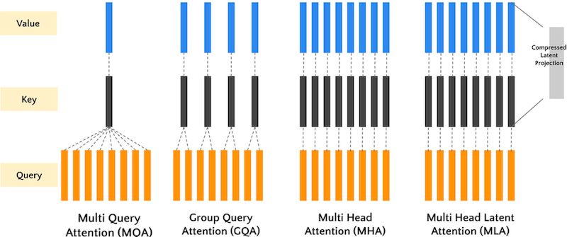
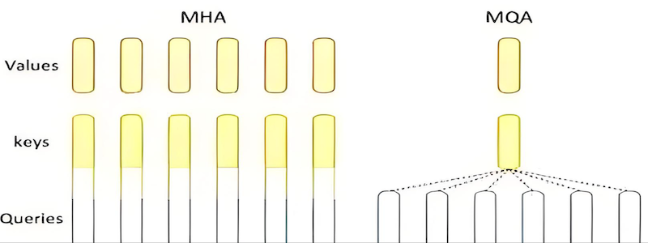
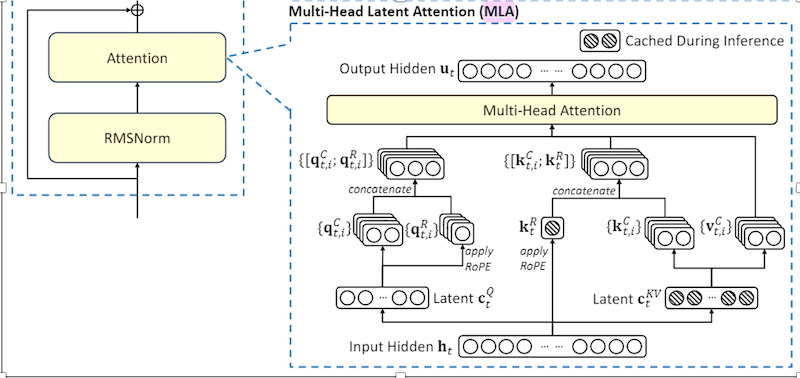
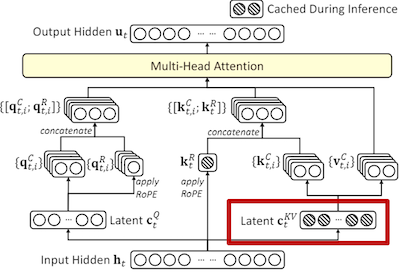
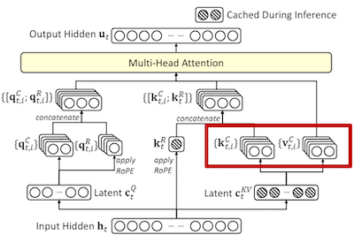
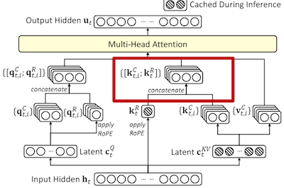
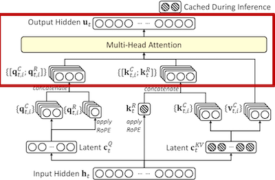

<!--Copyright © ZOMI 适用于[License](https://github.com/Infrasys-AI/AIInfra)版权许可-->

# 05.Attention 变种算法

## 1. 传统Attention痛点

传统 Attention(MHA)，主要主要在时间复杂度 和显存占用 两个方面的瓶颈, 本文着重讲解**显存瓶颈及解决办法**, 下一篇则讲解时间复杂度的问题。

### 时间复杂度

传统Attention中 时间复杂度为 $O(n^2)$ ，这**限制了序列长度的处理**

### 显存瓶颈

模型在线推理中 主要包含如下内容:

#### 模型权重

BF16精度下，每个参数占2字节. 以32B为例, 则权重部分显存占用计算如下:

```math
32 * 10^9 * 2 / 10^9 = 64GB
```
#### 激活值 + 框架

逐层计算且释放, 占用较小, 保守估计约100MB/请求(先不计入)

#### KVCache

在模型部署, 推理场景下传统attention, MHA下, 显存占用如下:

```math
memory = 2 * sequence\_length * n\_layers * d\_model * precision\_byte * batch\_size
```

- 2: 指的是 key cache 和value cache两个
- sequence_length: 指序列长度
- n_layers: 指 transformer layer(block)的层数
- d_model: 指的是隐藏层维度, 在MHA场景下 = num_heads(头的个数) * head_dim(每个头的维度)
- precision_byte: 精度对应字节数, eg: bf16 对应2字节,p32 对应4字节
- batch_size: 对应一次推理的batch数

以常见使用及开源项目(Qwen系列)中配置, 计算显存占用:
- 精度: bf16
- transformer layers: 64层
- d_model: 5120
- sequence_length: 2048


```math
kvcache ~= 2 * 2048 * 64 * 5120 * 2 * batch\_size / 10^9 GB
```

- kvcache: 

|    batch_size    | 16 |   32   |
| :------: | :------: | :------: |
|  模型权重 |   64.0  |   64.0     |
| KV Cache |   42.9  |    85.8     |
|    总计  |  \~=106.9GB | \~= 149.8GB |

常用nvidia显卡显存: 4090(24G)，5090(32G),A100(80G), A800(80G), H20(96G), H200(141G),H800(80G)。

经上述背景描述, 我们已经对模型部署, 推理显存占用 有初步概念, 下面开始讲解优化思路

## 2. 优化思路

减少KV Cache的目的就是要实现在更少的设备上推理更长的Context，或者在相同的Context长度
下让推理的batch size更大，从而实现更快的推理速度或者更大的吞吐总量。 

下述提到的MQA, GQA, MLA 都是围绕“如何减少KV Cache同时尽可能地保证效果”这个主题发展而来




## 1. MQA (Multi-Query Attention) 多查询注意力

### 1.1 简介



Multi-Query Attention (MQA) 是传统 Multi-Head Attention 的一种优化变体，它通过在每个head共享 Key 和 Value, 只有Q在不同head中不同的方式来减少内存使用和计算复杂度，同时保持查询的多样性。

- 文章来源: 2019 年 Google 论文
- 原始文章: https://arxiv.org/pdf/1911.02150

### 1.2 解决的问题

- **内存效率**：减少 KV 缓存的内存占用
- **计算效率**：降低注意力计算的时间复杂度
- **推理加速**：在生成任务中显著提升推理速度
- **资源优化**：在保持性能的同时减少模型参数量

### 1.3 数学表达

**在 MQA 中，多个 Query 头共享同一个 Key 和 Value 矩阵**：

$$
\begin{align*}
\text{MQA}(Q, K, V) &= \text{Concat}(\text{head}_1, \ldots, \text{head}_h) W^O \\
\text{其中}\quad \text{head}_i &= \text{Attention}(Q_i W_i^Q, K W^K, V W^V) \\
\text{Attention}(Q, K, V) &= \text{softmax}\left(\frac{Q K^T}{\sqrt{d_k}}\right) V
\end{align*}
$$

其中：
- $Q_i$：第 $i$ 个查询头
- $K, V$：共享的 Key 和 Value 矩阵
- $W_i^Q$：第 $i$ 个查询头的权重矩阵
- $W^K, W^V$：共享的 Key 和 Value 权重矩阵

### 1.4 伪代码实现

```python
def multi_query_attention(X, num_heads, d_model):
    """
    Multi-Query Attention 实现
    X: 输入序列 [seq_len, d_model]
    num_heads: 查询头数量
    d_model: 模型维度
    """
    d_k = d_model // num_heads
    
    # 为每个查询头创建 Q 的权重矩阵
    W_q = [random_matrix(d_model, d_k) for _ in range(num_heads)]
    
    # 共享的 K 和 V 权重矩阵
    W_k = random_matrix(d_model, d_k)
    W_v = random_matrix(d_model, d_k)
    
    # 计算共享的 K 和 V
    K = X @ W_k  # [seq_len, d_k]
    V = X @ W_v  # [seq_len, d_k]
    
    heads = []
    for i in range(num_heads):
        # 计算第 i 个查询头
        Q_i = X @ W_q[i]  # [seq_len, d_k]
        
        # 计算注意力分数
        scores = Q_i @ K.T  # [seq_len, seq_len]
        scores = scores / sqrt(d_k)
        
        # 应用 softmax
        attention_weights = softmax(scores)
        
        # 加权求和
        head_i = attention_weights @ V
        heads.append(head_i)
    
    # 拼接所有头的输出
    concat_heads = concatenate(heads, axis=-1)  # [seq_len, d_model]
    
    # 最终线性变换
    W_o = random_matrix(d_model, d_model)
    output = concat_heads @ W_o
    
    return output
```

### 1.5 优缺点

- 优点: 节省显存，KV Cache 降低为原始的 1/h，减少计算和通信开销，提升推理速度。
- 缺点: 性能下降：KV Cache 压缩过于严重，影响模型训练稳定性和模型效果。


## 2. GQA (Grouped-Query Attention) 分组查询注意力

### 2.1 简介


Grouped-Query Attention (GQA) 是 MQA 和传统 Multi-Head Attention 之间的折中方案，它将查询头分组，每组共享一个 Key 和 Value 矩阵，在性能和效率之间取得平衡。

- 文章出处: 2023 Google
- 文章链接: https://arxiv.org/pdf/2305.13245

### 2.2 解决的问题

- **平衡性能与效率**：在 MQA 和 MHA 之间找到最佳平衡点。MHA在大型模型和长序列处理中效率低下。MQA性能损失过大，不适合对精度要求高的场景
- **任务适应性**：根据任务需求调整分组数量

### 2.3 数学表达

**在 GQA 中，查询头被分为 $G$ 组，每组共享 Key 和 Value**：

$$
\begin{align*}
\text{GQA}(Q, K, V) &= \text{Concat}(\text{head}_1, \ldots, \text{head}_h) W^O \\
\text{其中}\quad \text{head}_i &= \text{Attention}(Q_i W_i^Q, K_{g(i)} W_{g(i)}^K, V_{g(i)} W_{g(i)}^V) \\
g(i) &= \lfloor i / (h/G) \rfloor
\end{align*}
$$

其中：
- $G$：分组数量
- $g(i)$：第 $i$ 个查询头所属的组
- $K_{g(i)}, V_{g(i)}$：第 $g(i)$ 组共享的 Key 和 Value 矩阵

### 2.4 伪代码实现

```python
def grouped_query_attention(X, num_heads, num_groups, d_model):
    """
    Grouped-Query Attention 实现
    X: 输入序列 [seq_len, d_model]
    num_heads: 查询头数量
    num_groups: 分组数量
    d_model: 模型维度
    """
    d_k = d_model // num_heads
    heads_per_group = num_heads // num_groups
    
    # 为每个查询头创建 Q 的权重矩阵
    W_q = [random_matrix(d_model, d_k) for _ in range(num_heads)]
    
    # 为每个组创建共享的 K 和 V 权重矩阵
    W_k = [random_matrix(d_model, d_k) for _ in range(num_groups)]
    W_v = [random_matrix(d_model, d_k) for _ in range(num_groups)]
    
    # 计算每组的 K 和 V
    K_groups = []
    V_groups = []
    for g in range(num_groups):
        K_g = X @ W_k[g]  # [seq_len, d_k]
        V_g = X @ W_v[g]  # [seq_len, d_k]
        K_groups.append(K_g)
        V_groups.append(V_g)
    
    heads = []
    for i in range(num_heads):
        # 确定当前头所属的组
        group_id = i // heads_per_group
        
        # 计算第 i 个查询头
        Q_i = X @ W_q[i]  # [seq_len, d_k]
        
        # 使用对应组的 K 和 V
        K_g = K_groups[group_id]
        V_g = V_groups[group_id]
        
        # 计算注意力分数
        scores = Q_i @ K_g.T  # [seq_len, seq_len]
        scores = scores / sqrt(d_k)
        
        # 应用 softmax
        attention_weights = softmax(scores)
        
        # 加权求和
        head_i = attention_weights @ V_g
        heads.append(head_i)
    
    # 拼接所有头的输出
    concat_heads = concatenate(heads, axis=-1)  # [seq_len, d_model]
    
    # 最终线性变换
    W_o = random_matrix(d_model, d_model)
    output = concat_heads @ W_o
    
    return output
```

### 2.5 优缺点

- 优点: 
   - 性能和效率之间平衡：保证 KV 多样性同时，减少 KV Cache 大小；
   - 稳定性：相比 MQA，训练过程较为稳定
- 缺点: 
   - 需人为合理设置组数 g


## 3. MLA (Multi-Latent Attention) 多潜在注意力

### 3.1 简介



Multi-Latent Attention (MLA) 是一种创新的注意力机制，它通过引入潜在变量来建模复杂的注意力模式，能够更好地捕捉序列中的长距离依赖和复杂关系。

- 文章出处: 2024.09 Deepseek在初版Deepseek V3模型推出时技术报告 
- 文章链接: https://github.com/LRriver/DeepSeek-V3/blob/main/DeepSeek_V3.pdf

### 3.2 解决的问题

- **更高效的KV缓存压缩**: MLA通过低秩联合压缩，比GQA更有效地减少KV缓存需求，尤其在处理长文本时优势明显。
- **性能与效率的更好平衡**: MLA在减少KV缓存的同时，能保持与标准多头注意力相当的性能，而GQA可能在减少缓存的同时会牺牲部分性能。
- **训练与推理的双重优化**: MLA不仅优化了推理阶段，还通过低秩压缩减少了训练时的激活内存，而GQA主要关注推理阶段的优化

### 3.3 数学表达

MLA 通过潜在变量 $Z$ 来建模注意力分布：

$$
\begin{align*}
\text{MLA}(Q, K, V) &= \text{Concat}(\text{head}_1, \ldots, \text{head}_h) W^O \\
\text{其中}\quad \text{head}_i &= \text{Attention}(Q_i, K_i, V_i, Z_i) \\
\text{Attention}(Q, K, V, Z) &= \text{softmax}\left(\frac{Q K^T + Z}{\sqrt{d_k}}\right) V \\
Z &= \text{LatentModule}(Q, K)
\end{align*}
$$

其中：
- $Z$：潜在变量矩阵，用于建模复杂的注意力模式
- $\text{LatentModule}$：潜在变量生成模块
- 其他符号含义与标准注意力机制相同

### 3.4 计算步骤

#### 1. 计算代表 KV Cache的潜在向量



$c_t^{KV}$ 是在时间步 $t$ 计算的键值缓存潜在向量。 $W^{DKV}$ 是一个权重矩阵，用于将隐藏状态 $h_t$ 映射到键值缓存空间，这一步可以通过神经网络映射得到。 $c_t^{KV}$ 相对于原来的 $h_t$ 要小很多。

#### 2. 计算 Query, Key 和 value 潜在向量



$k_t^C$ 是 Key 潜在向量，通过将 $c_t^{KV}$ 与权重矩阵 $W^{UK}$ 相乘得到，这一步是做上采样，通过潜向量特征 $c_t^{KV}$ 映射得到较大的 $k_t^C$ 用于后续的注意力计算。 $v_t^C$ 计算同理。


K 向量的计算类似，通过潜在向量计算得到参与后续 MHA 计算的查询向量 q

#### 3. 计算旋转位置编码（RoPE）


用于在键向量中引入位置信息

#### 4. 组合潜向量k和位置编码k得到最终的键向量



最终的键向量 $k_{(t,i)}$ 是通过将内容相关的键向量 $k_{(t,i)}^C$ 和位置编码 $k_t^{R}$ 连接起来得到

#### 5. 注意力计算



最终的注意力输出 $u_t$ 是通过将查询 $(q_{(t,i)})$，键 $(k_{(t,i)})$ 和值 $(v_{(j,i)}^C)$ 结合起来计算。其中 $o_{(t,i)}$ 是第 i 个注意力头的输出


### 3.5 伪代码实现

```python
def multi_latent_attention(X, num_heads, d_model, latent_kv_dim, rope_params):
    """
    Multi-Latent Attention 实现（按照“计算步骤 1-5”对应实现）
    X: 输入序列 [seq_len, d_model]
    num_heads: 注意力头数量
    d_model: 模型维度
    latent_kv_dim: KV 缓存潜在向量维度（步骤1：缩小后的维度）
    rope_params: RoPE 位置编码参数（步骤3）
    """
    d_k = d_model // num_heads

    # 步骤 1：计算代表 KV Cache 的潜在向量 c_t^KV
    # 将隐藏状态 h_t（此处为 X 的每个时间步行向量）映射到更小的 KV 空间
    W_d_kv = random_matrix(d_model, latent_kv_dim)
    C_kv = X @ W_d_kv  # [seq_len, latent_kv_dim]

    # 步骤 2：由 c_t^KV 上采样得到内容相关的潜在向量 Q^C, K^C, V^C
    # 使用不同的上采样矩阵分别得到每个 head 的 Q/K/V 内容分量
    W_uq = [random_matrix(latent_kv_dim, d_k) for _ in range(num_heads)]
    W_uk = [random_matrix(latent_kv_dim, d_k) for _ in range(num_heads)]
    W_uv = [random_matrix(latent_kv_dim, d_k) for _ in range(num_heads)]

    Q_c_list = []  # 每个 head 的 Q^C
    K_c_list = []  # 每个 head 的 K^C
    V_c_list = []  # 每个 head 的 V^C
    for i in range(num_heads):
        Q_c_list.append(C_kv @ W_uq[i])  # [seq_len, d_k]
        K_c_list.append(C_kv @ W_uk[i])  # [seq_len, d_k]
        V_c_list.append(C_kv @ W_uv[i])  # [seq_len, d_k]

    # 步骤 3：计算旋转位置编码（RoPE），得到位置相关的键向量 K^R
    # 这里生成形状为 [seq_len, d_k] 的位置编码分量，供各 head 共享
    K_r = apply_rope_positions(C_kv.shape[0], d_k, rope_params)  # [seq_len, d_k]

    # 步骤 4：组合潜向量 k^C 与位置编码 k^R 得到最终键向量 K
    # 文档描述为“连接（concat）”，随后投影回 d_k，保证与 Q^C 维度一致
    W_k_mix = [random_matrix(2 * d_k, d_k) for _ in range(num_heads)]
    K_list = []  # 每个 head 的最终 K
    for i in range(num_heads):
        K_concat = concatenate([K_c_list[i], K_r], axis=-1)  # [seq_len, 2*d_k]
        K_i = K_concat @ W_k_mix[i]  # [seq_len, d_k]
        K_list.append(K_i)

    # 步骤 5：注意力计算（使用 Q=Q^C, K=组合后的 K, V=V^C）
    heads = []
    for i in range(num_heads):
        scores = Q_c_list[i] @ K_list[i].T  # [seq_len, seq_len]
        scores = scores / sqrt(d_k)
        attention_weights = softmax(scores)
        head_i = attention_weights @ V_c_list[i]
        heads.append(head_i)

    # 拼接所有头输出并线性变换
    concat_heads = concatenate(heads, axis=-1)  # [seq_len, d_model]
    W_o = random_matrix(d_model, d_model)
    output = concat_heads @ W_o
    return output

def apply_rope_positions(seq_len, d_k, rope_params):
    """
    旋转位置编码（RoPE）生成（对应“步骤 3”）
    返回形状 [seq_len, d_k] 的位置编码向量，用于形成 K^R
    """
    # 伪代码：根据 rope_params 产生 cos/sin 参数，并生成对应维度的位置向量
    return rope_matrix(seq_len, d_k, rope_params)  # [seq_len, d_k]

def rope_matrix(seq_len, d_k, rope_params):
    """
    构建 RoPE 基向量矩阵（示意；细节实现取决于具体 RoPE 定义）
    """
    # 占位实现：返回一个与维度匹配的占位矩阵
    return random_matrix(seq_len, d_k)
```


## 4. 三种注意力机制对比

| 特性 | MQA | GQA | MLA |
|------|-----|-----|-----|
| **KV 缓存占用** | 显存占用低(仅需 1 组 KV 缓存) | 显存占用低于 MHA, 但高于 MQA(分组共享 KV cache) | 显存占用显著降低(低秩压缩) |
|**计算复杂度**|最低(共享 KV 计算)|中等(分组共享 KV 计算)|低于 MHA 和 GQA(低秩空间计算)|
|**模型效果**|略低于 MHA(共享 KV 导致信息损失)|接近 MHA(分组共享平衡性能效率)|接近 MHA(低秩压缩保留关键特征)|
|**应用模型**|Falcon 系列模型|LLaMA-2/LLaMA-3、Qwen3|DeepSeek-V3、Kimi-K2|


## 5.总结与思考

本章节为 对传统attention机制, 显存占用问题的优化改进。但也仅是基础, 各家在解决长序列问题时, 还会有很多其他的解决办法, 其中不少都是以上述attention变种为基础。未来attention优化的方向一定为**高效, 可扩展, 注意力效果好, 适合长上下文的方向** 如下:

- 减少复杂度：随着大模型发展，通过优化 Attention 计算复杂度提出 Linear Attention 等
- 长序列建模​​：结合稀疏注意力与动态路由，进一步压缩KV Cache。
- 多模态扩展​​：探索跨模态注意力交互，如视觉-语言联合表征。

## 本节视频

<html>
<iframe src="https://player.bilibili.com/player.html?isOutside=true&aid=114682388093947&bvid=BV1GzMUz8Eav&cid=30498491822&p=1&as_wide=1&high_quality=1&danmaku=0&t=30&autoplay=0" width="100%" height="500" scrolling="no" border="0" frameborder="no" framespacing="0" allowfullscreen="true"> </iframe>
</html>

## 参考与引用

!!!!!!!!!加入参考的文章和内容