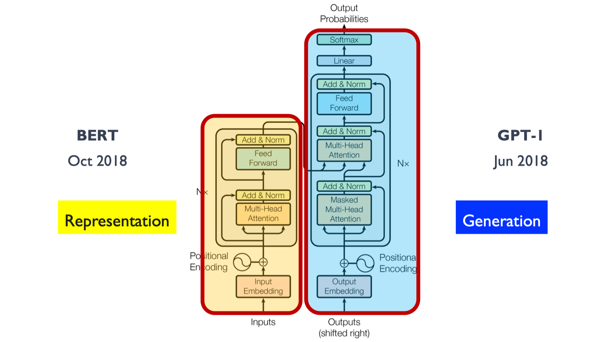
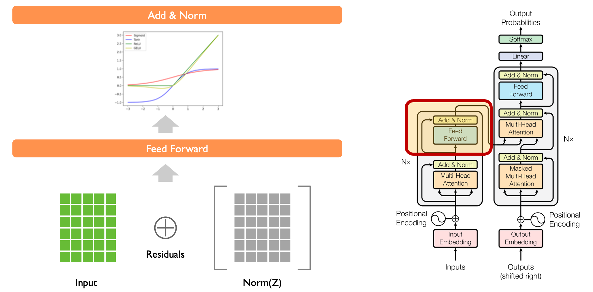
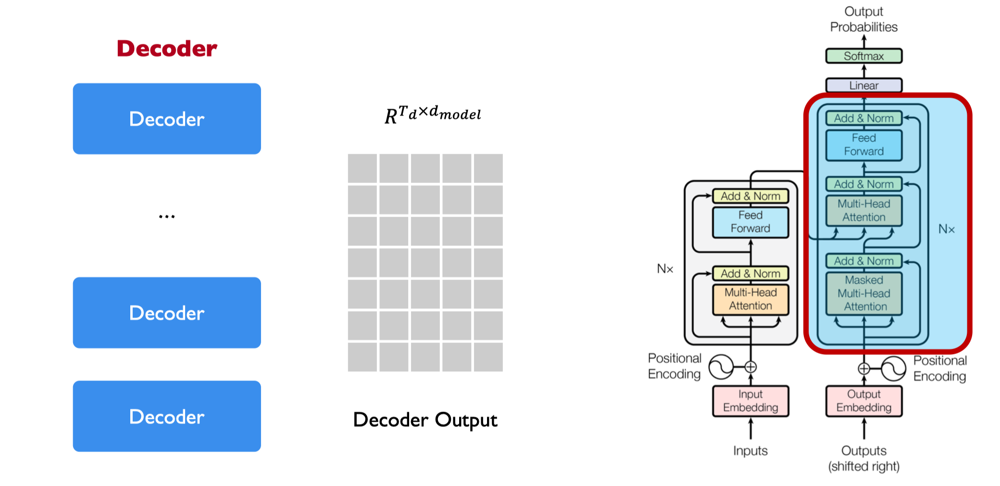

<!--Copyright © ZOMI 适用于[License](https://github.com/Infrasys-AI/AIInfra  )版权许可-->

# CODE02: 从零实现 Transformer 训练(DONE)

> author by: 韩钰, ZOMI

本实验将完全从零开始，手撕最简 Transformer 从零实现《Attention Is All You Need》架构。仅使用 PyTorch 张量操作，不依赖任何高级封装的 Transformer 接口，这样能让我们摆脱框架黑箱的束缚，直观看到每个矩阵运算的细节。通过这个"造轮子"的过程，我们将深入理解 Transformer 的数据流动和核心机制——比如注意力权重如何计算、不同层之间的信息如何传递，为后续学习更复杂的大模型打下坚实基础。



## 1. 环境准备与导入

首先，我们导入必要的库。注意，我们只使用 PyTorch 的基础张量操作，不依赖任何高级 Transformer 实现。这种做法的目的是剥离框架封装的细节，直接操作张量来构建模型，让我们能清晰追踪每一步的计算过程和数据形态变化。


```python
import torch
import torch.nn as nn
import torch.nn.functional as F
import math
import numpy as np
from copy import deepcopy

# 设置随机种子以确保结果可重现
torch.manual_seed(142)
np.random.seed(142)
```

## 2. 基础组件实现

### 2.1 Embedding 层

嵌入层将离散的 token ID 转换为密集向量表示。在 Transformer 中，嵌入层通常使用固定的维度 `d_model`。这种转换的核心意义在于将离散的符号（如单词、子词）映射到连续的向量空间，使得语义相近的 token 在向量空间中距离更近，便于模型捕捉语言的内在关联。

**原理公式**：

$$\text{Embedding}(i) = W[i, :]$$

其中 $W \in \mathbb{R}^{V \times d_{\text{model}}}$ 是可学习的嵌入矩阵，$V$ 是词汇表大小。


```python
class Embedding(nn.Module):
    """
    标准的嵌入层，将 token 索引映射为 d_model 维的向量
    
    Args:
        vocab_size: 词汇表大小
        d_model: 模型维度/嵌入维度
    """
    def __init__(self, vocab_size, d_model):
        super(Embedding, self).__init__()
        # 初始化嵌入矩阵，使用标准正态分布初始化
        self.embed = nn.Parameter(torch.randn(vocab_size, d_model))
  
        # 缩放因子，用于控制嵌入数值范围
        self.d_model = d_model
        
    def forward(self, x):
        """
        Args:
            x: 输入 token 索引，形状为 (batch_size, seq_len)
            
        Returns:
            嵌入后的张量，形状为 (batch_size, seq_len, d_model)
        """
        # 根据索引从嵌入矩阵中查找对应的向量
        # 并乘以 sqrt(d_model)进行缩放，这是 Transformer 的标准做法
        # 缩放的目的是平衡嵌入向量的量级，避免后续注意力计算中因向量模长过大导致梯度问题
        return self.embed[x] * math.sqrt(self.d_model)
```

### 2.2 位置编码 (Positional Encoding)

由于 Transformer 不包含循环或卷积结构，无法像 RNN 那样自然捕捉序列的时序信息，因此需要显式地注入位置信息。原始论文使用正弦和余弦函数来生成位置编码，这种设计的巧妙之处在于：周期性函数能天然表达位置的相对关系（比如位置 $pos+k$ 与 $pos$ 的编码可以通过三角函数的性质关联），且能泛化到训练时未见过的更长序列。

**原理公式**：

$$
\begin{align*}
PE_{(pos, 2i)} &= \sin\left(\frac{pos}{10000^{2i/d_{\text{model}}}}\right) \\
PE_{(pos, 2i+1)} &= \cos\left(\frac{pos}{10000^{2i/d_{\text{model}}}}\right)
\end{align*}
$$

其中 $pos$ 是位置，$i$ 是维度索引。不同频率的三角函数让模型能区分不同尺度的位置差异（低频分量捕捉长距离位置关系，高频分量捕捉短距离关系）。


```python
class PositionalEncoding(nn.Module):
    """
    正弦/余弦位置编码
    
    Args:
        d_model: 模型维度
        max_len: 最大序列长度
        dropout: Dropout 率
    """
    def __init__(self, d_model, max_len=5000, dropout=0.1):
        super(PositionalEncoding, self).__init__()
        self.dropout = nn.Dropout(p=dropout)
        
        # 初始化位置编码矩阵 (max_len, d_model)
        pe = torch.zeros(max_len, d_model)
        
        # 计算位置信息
        position = torch.arange(0, max_len, dtype=torch.float).unsqueeze(1)
        div_term = torch.exp(torch.arange(0, d_model, 2).float() * 
                            (-math.log(10000.0) / d_model))
        
        # 应用正弦函数到偶数索引
        pe[:, 0::2] = torch.sin(position * div_term)

        # 应用余弦函数到奇数索引
        pe[:, 1::2] = torch.cos(position * div_term)
        
        # 添加批次维度: (1, max_len, d_model)
        pe = pe.unsqueeze(0)
        
        # 将 pe 注册为缓冲区（不参与梯度更新）
        # 位置编码是固定的，无需通过训练学习
        self.register_buffer('pe', pe)
        
    def forward(self, x):
        """
        Args:
            x: 输入张量，形状为 (batch_size, seq_len, d_model)
            
        Returns:
            添加位置编码后的张量，形状与输入相同
        """
        # 将位置编码添加到输入中（只取前 seq_len 个位置）
        x = x + self.pe[:, :x.size(1)]
        return self.dropout(x)
```

### 2.3 缩放点积注意力 (Scaled Dot-Product Attention)

这是 Transformer 的核心机制，用于计算查询（Query）与键（Key）的相似度，并以此对值（Value）进行加权求和。直观来说，注意力机制模拟了人类在处理信息时的"聚焦"能力——比如阅读时会重点关注与当前内容相关的部分。


**原理公式**：

$$
\text{Attention}(Q, K, V) = \text{softmax}\left(\frac{QK^T}{\sqrt{d_k}}\right)V
$$

公式中除以 $\sqrt{d_k}$（$d_k$ 是 Query 和 Key 的维度）是关键设计：当 $d_k$ 较大时，$QK^T$ 的结果方差会很大，导致 softmax 函数输出过于陡峭（大部分概率集中在极少数位置），梯度难以传播。缩放操作能有效缓解这一问题，让注意力分布更平缓、梯度更稳定。


```python
def attention(query, key, value, mask=None, dropout=None):
    """
    计算缩放点积注意力
    
    Args:
        query: 查询张量，形状为 (..., seq_len_q, d_k)
        key: 键张量，形状为 (..., seq_len_k, d_k)
        value: 值张量，形状为 (..., seq_len_v, d_v)
        mask: 可选的掩码张量，用于屏蔽无效位置（如填充 token 或未来信息）
        dropout: 可选的 dropout 层，防止过拟合
        
    Returns:
        输出张量和注意力权重
    """
    d_k = query.size(-1)
    
    # 计算 Q 和 K 的点积并缩放
    scores = torch.matmul(query, key.transpose(-2, -1)) / math.sqrt(d_k)
    
    # 应用掩码（如果提供）
    if mask is not None:
        # 将掩码位置的分数设为极小值，确保 softmax 后概率接近 0
        scores = scores.masked_fill(mask == 0, -1e9)
    
    # 计算注意力权重：通过 softmax 将分数转换为概率分布
    p_attn = F.softmax(scores, dim=-1)
    
    # 应用 dropout（如果提供）
    if dropout is not None:
        p_attn = dropout(p_attn)
    
    # 返回加权和的值和注意力权重
    return torch.matmul(p_attn, value), p_attn
```

### 2.4 多头注意力 (Multi-Head Attention)

多头注意力允许模型同时关注来自不同表示子空间的信息，提高了注意力层的表达能力。想象一下，当处理句子时，我们可能既需要关注语法结构（如主谓关系），又需要关注语义关联（如同义词替换），多头注意力就能通过不同的"头"分别捕捉这些不同维度的信息。

**原理公式**：

$$
\begin{align*}
\text{MultiHead}(Q, K, V) &= \text{Concat}(\text{head}_1, ..., \text{head}_h)W^O \\
\text{where } \text{head}_i &= \text{Attention}(QW_i^Q, KW_i^K, VW_i^V)
\end{align*}
$$

通过将 $Q, K, V$ 投影到 $h$ 个低维子空间（每个子空间维度为 $d_k = d_{\text{model}}/h$），并行计算注意力后再拼接，模型能以相近的计算成本捕捉更丰富的关联模式，比单头注意力更高效。


```python
class MultiHeadAttention(nn.Module):
    """
    多头注意力机制
    
    Args:
        d_model: 模型维度
        h: 注意力头的数量
        dropout: Dropout 率
    """
    def __init__(self, d_model, h, dropout=0.1):
        super(MultiHeadAttention, self).__init__()
        assert d_model % h == 0, "d_model 必须能被 h 整除"  # 确保每个头的维度是整数
        
        self.d_model = d_model
        self.h = h
        self.d_k = d_model // h  # 每个注意力头的维度
        
        # 定义线性投影层：将输入映射到 Q、K、V，以及最终的输出投影
        self.w_q = nn.Linear(d_model, d_model)
        self.w_k = nn.Linear(d_model, d_model)
        self.w_v = nn.Linear(d_model, d_model)
        self.w_o = nn.Linear(d_model, d_model)
        
        self.dropout = nn.Dropout(dropout)
        self.attn = None  # 用于存储注意力权重（可视化用）
        
    def forward(self, query, key, value, mask=None):
        """
        Args:
            query: 查询张量，形状为 (batch_size, seq_len, d_model)
            key: 键张量，形状为 (batch_size, seq_len, d_model)
            value: 值张量，形状为 (batch_size, seq_len, d_model)
            mask: 可选的掩码张量
            
        Returns:
            多头注意力的输出，形状为 (batch_size, seq_len, d_model)
        """
        if mask is not None:
            # 同样的掩码应用于所有头：扩展维度以匹配多头结构
            mask = mask.unsqueeze(1)
        
        batch_size = query.size(0)
        
        # 1. 线性投影并分头：将高维 Q、K、V 拆分为 h 个低维子空间
        query = self.w_q(query).view(batch_size, -1, self.h, self.d_k).transpose(1, 2)
        key = self.w_k(key).view(batch_size, -1, self.h, self.d_k).transpose(1, 2)
        value = self.w_v(value).view(batch_size, -1, self.h, self.d_k).transpose(1, 2)
        
        # 2. 应用注意力机制：每个头独立计算注意力
        x, self.attn = attention(query, key, value, mask=mask, dropout=self.dropout)
        
        # 3. 拼接头并应用最终线性层：将 h 个头的结果合并回高维空间
        x = x.transpose(1, 2).contiguous().view(batch_size, -1, self.d_model)
        return self.w_o(x)
```

### 2.5 前馈网络 (Feed Forward Network)

每个注意力层后面都有一个前馈网络，由两个线性变换和一个 ReLU 激活函数组成。注意力层捕捉序列中不同位置的关联，而前馈网络则对每个位置的特征进行独立的非线性变换，两者分工协作：前者关注"关系"，后者强化"特征"。



**原理公式**：

$$
\text{FFN}(x) = \max(0, xW_1 + b_1)W_2 + b_2
$$

公式中，第一层线性变换将维度从 $d_{\text{model}}$ 扩展到 $d_{ff}$（通常是 $4 	imes d_{\text{model}}$），通过增大维度提供更强的特征变换能力；ReLU 激活函数引入非线性，让模型能学习复杂的映射关系；第二层线性变换将维度还原，保证前后层维度兼容。


```python
class FeedForward(nn.Module):
    """
    前馈网络
    
    Args:
        d_model: 模型维度
        d_ff: 前馈网络内部维度
        dropout: Dropout 率
    """
    def __init__(self, d_model, d_ff, dropout=0.1):
        super(FeedForward, self).__init__()
        self.w_1 = nn.Linear(d_model, d_ff)  # 升维
        self.w_2 = nn.Linear(d_ff, d_model)  # 降维
        self.dropout = nn.Dropout(dropout)
        
    def forward(self, x):
        """
        Args:
            x: 输入张量，形状为 (batch_size, seq_len, d_model)
            
        Returns:
            前馈网络的输出，形状与输入相同
        """
        return self.w_2(self.dropout(F.relu(self.w_1(x))))
```

### 2.6 残差连接与层归一化 (Add & Norm)

Transformer 使用残差连接和层归一化来促进训练稳定性和梯度流动。在深层网络中，随着层数增加，梯度容易衰减或爆炸，残差连接（$x + \text{Sublayer}(x)$）提供了一条"捷径"，让梯度能直接从后层传到前层；而层归一化则通过标准化每个样本的特征分布（使均值为 0、方差为 1），避免数值偏离导致的训练不稳定。

**原理公式**：

$$
\text{LayerNorm}(x + \text{Sublayer}(x))
$$

需要注意的是，这里的实现是先归一化再经过子层（$x + \text{Sublayer}(\text{Norm}(x))$），与原始论文的顺序（先子层再归一化）略有不同，但实践中效果相近，且更利于训练。


```python
class SublayerConnection(nn.Module):
    """
    残差连接后的层归一化
    
    Args:
        size: 输入维度
        dropout: Dropout 率
    """
    def __init__(self, size, dropout=0.1):
        super(SublayerConnection, self).__init__()
        self.norm = nn.LayerNorm(size)
        self.dropout = nn.Dropout(dropout)
        
    def forward(self, x, sublayer):
        """
        应用残差连接和层归一化
        
        Args:
            x: 输入张量
            sublayer: 子层函数（如注意力或前馈网络）
            
        Returns:
            归一化后的输出
        """
        # 原始实现: x + dropout(sublayer(norm(x)))
        # 可以更换为 norm(x + dropout(sublayer(x)))
        return x + self.dropout(sublayer(self.norm(x)))
```

## 3. 编码器与解码器层

### 3.1 编码器层 (Encoder Layer)

编码器层包含一个多头自注意力机制和一个前馈网络，每个子层都有残差连接和层归一化。自注意力机制让编码器能"理解"输入序列内部的关联（比如句子中词语之间的修饰关系），前馈网络则对这些关联信息进行加工提炼。通过堆叠多个这样的层，模型能从浅到深逐步提取输入序列的抽象特征——底层可能关注局部词汇关联，高层则捕捉全局语义结构。


```python
class EncoderLayer(nn.Module):
    """
    编码器层
    
    Args:
        d_model: 模型维度
        self_attn: 自注意力机制
        feed_forward: 前馈网络
        dropout: Dropout 率
    """
    def __init__(self, d_model, self_attn, feed_forward, dropout=0.1):
        super(EncoderLayer, self).__init__()
        self.self_attn = self_attn
        self.feed_forward = feed_forward
        self.sublayer = nn.ModuleList([SublayerConnection(d_model, dropout) 
                                      for _ in range(2)])
        self.d_model = d_model
        
    def forward(self, x, mask):
        """
        Args:
            x: 输入张量，形状为 (batch_size, seq_len, d_model)
            mask: 掩码张量，用于屏蔽填充 token
            
        Returns:
            编码器层的输出，形状与输入相同
        """
        # 第一子层: 自注意力（输入序列关注自身）
        x = self.sublayer[0](x, lambda x: self.self_attn(x, x, x, mask))
  
        # 第二子层: 前馈网络（对每个位置独立加工）
        return self.sublayer[1](x, self.feed_forward)
```

### 3.2 解码器层 (Decoder Layer)

解码器层包含两个多头注意力机制（自注意力和编码器-解码器注意力）和一个前馈网络。与编码器不同，解码器的核心任务是"生成"目标序列，因此需要两种注意力：自注意力让解码器关注已生成的目标序列部分（比如翻译时已生成的前半句话），且通过掩码确保不会提前看到未来的信息；编码器-解码器注意力则让解码器"参考"编码器输出的源序列信息（比如翻译时对照原文），建立源与目标的关联。




```python
class DecoderLayer(nn.Module):
    """
    解码器层
    
    Args:
        d_model: 模型维度
        self_attn: 自注意力机制
        src_attn: 编码器-解码器注意力机制
        feed_forward: 前馈网络
        dropout: Dropout 率
    """
    def __init__(self, d_model, self_attn, src_attn, feed_forward, dropout=0.1):
        super(DecoderLayer, self).__init__()
        self.d_model = d_model
        self.self_attn = self_attn
        self.src_attn = src_attn
        self.feed_forward = feed_forward
        self.sublayer = nn.ModuleList([SublayerConnection(d_model, dropout) 
                                      for _ in range(3)])
        
    def forward(self, x, memory, src_mask, tgt_mask):
        """
        Args:
            x: 解码器输入
            memory: 编码器输出（记忆）
            src_mask: 源序列掩码
            tgt_mask: 目标序列掩码（防止关注未来信息）
            
        Returns:
            解码器层的输出
        """
        m = memory
        
        # 第一子层: 自注意力（带目标掩码）
        x = self.sublayer[0](x, lambda x: self.self_attn(x, x, x, tgt_mask))
        # 第二子层: 编码器-解码器注意力（关注源序列信息）
        x = self.sublayer[1](x, lambda x: self.src_attn(x, m, m, src_mask))
        # 第三子层: 前馈网络
        return self.sublayer[2](x, self.feed_forward)
```

## 4. 编码器与解码器

### 4.1 编码器 (Encoder)

编码器由多个编码器层堆叠而成。输入序列经过嵌入和位置编码后，依次通过所有编码器层，最终输出一个包含全局上下文信息的"记忆"张量（memory）。堆叠层数 $N$（原始论文中为 6）是重要超参数：层数太少，模型难以捕捉复杂模式；层数太多，则可能过拟合且训练成本增加。最终的层归一化确保输出分布稳定，便于解码器使用。


```python
class Encoder(nn.Module):
    """
    编码器
    
    Args:
        layer: 编码器层
        N: 层数
    """
    def __init__(self, layer, N):
        super(Encoder, self).__init__()
        self.layers = nn.ModuleList([deepcopy(layer) for _ in range(N)])
        self.norm = nn.LayerNorm(layer.d_model)
        
    def forward(self, x, mask):
        """
        依次通过所有编码器层
        
        Args:
            x: 输入张量
            mask: 掩码张量
            
        Returns:
            编码器的输出（memory）
        """
        for layer in self.layers:
            x = layer(x, mask)
        return self.norm(x)
```

### 4.2 解码器 (Decoder)

解码器由多个解码器层堆叠而成。与编码器类似，解码器通过多层处理逐步优化目标序列的表示，但每一层都同时依赖于已生成的目标序列和编码器输出的 memory。这种设计让解码器能在生成过程中不断"回顾"源序列信息，确保输出与输入的一致性（比如翻译时忠实于原文意思）。


```python
class Decoder(nn.Module):
    """
    解码器
    
    Args:
        layer: 解码器层
        N: 层数
    """
    def __init__(self, layer, N):
        super(Decoder, self).__init__()
        self.layers = nn.ModuleList([deepcopy(layer) for _ in range(N)])
        self.norm = nn.LayerNorm(layer.d_model)
        
    def forward(self, x, memory, src_mask, tgt_mask):
        """
        依次通过所有解码器层
        
        Args:
            x: 输入张量
            memory: 编码器输出
            src_mask: 源序列掩码
            tgt_mask: 目标序列掩码
            
        Returns:
            解码器的输出
        """
        for layer in self.layers:
            x = layer(x, memory, src_mask, tgt_mask)
        return self.norm(x)
```

## 5. 完整 Transformer 模型

现在我们将所有组件组合成完整的 Transformer 模型。Transformer 的整体架构遵循"编码-解码"范式：编码器将源序列压缩为上下文向量（memory），解码器则基于 memory 和目标序列前缀生成下一个 token。这种架构的优势在于并行性——编码器和解码器内部的注意力计算可以并行处理整个序列，而不像 RNN 那样必须按顺序计算，极大提升了训练效率。


```python
class Transformer(nn.Module):
    """
    完整的 Transformer 模型
    
    Args:
        encoder: 编码器
        decoder: 解码器
        src_embed: 源序列嵌入
        tgt_embed: 目标序列嵌入
        generator: 生成器（输出层）
    """
    def __init__(self, encoder, decoder, src_embed, tgt_embed, generator):
        super(Transformer, self).__init__()
        self.encoder = encoder
        self.decoder = decoder
        self.src_embed = src_embed
        self.tgt_embed = tgt_embed
        self.generator = generator
        
    def forward(self, src, tgt, src_mask, tgt_mask):
        """
        前向传播
        
        Args:
            src: 源序列
            tgt: 目标序列
            src_mask: 源序列掩码
            tgt_mask: 目标序列掩码
            
        Returns:
            模型输出
        """
        # 编码源序列
        memory = self.encode(src, src_mask)
  
        # 解码目标序列
        return self.decode(memory, src_mask, tgt, tgt_mask)
    
    def encode(self, src, src_mask):
        """
        编码源序列：嵌入+位置编码+编码器层堆叠
        """
        return self.encoder(self.src_embed(src), src_mask)
    
    def decode(self, memory, src_mask, tgt, tgt_mask):
        """
        解码目标序列：嵌入+位置编码+解码器层堆叠
        """
        return self.decoder(self.tgt_embed(tgt), memory, src_mask, tgt_mask)
```

## 6. 辅助函数与模型构建

### 6.1 生成器 (Generator)

生成器将解码器输出投影到词汇表空间，是模型的输出层。对于序列生成任务（如翻译、文本生成），生成器的作用是将解码器输出的隐藏状态转换为每个 token 的概率分布，便于后续采样或计算损失。log_softmax 函数不仅能将输出转换为概率分布，还能与 NLLLoss 配合高效计算交叉熵损失。


```python
class Generator(nn.Module):
    """
    生成器（输出层）
    
    Args:
        d_model: 模型维度
        vocab: 词汇表大小
    """
    def __init__(self, d_model, vocab):
        super(Generator, self).__init__()
        self.proj = nn.Linear(d_model, vocab)  # 从 d_model 维投影到词汇表大小
        
    def forward(self, x):
        """
        Args:
            x: 解码器输出，形状为 (batch_size, seq_len, d_model)
            
        Returns:
            投影到词汇表空间的结果，形状为 (batch_size, seq_len, vocab)
        """
        return F.log_softmax(self.proj(x), dim=-1)
```

### 6.2 掩码生成函数

在序列模型中，掩码用于屏蔽无效信息。`subsequent_mask` 生成的下三角掩码专门用于解码器自注意力，确保在预测第 $i$ 个 token 时，只能看到前 $i-1$ 个已生成的 token，避免"偷看"未来信息，这是 autoregressive（自回归）生成的核心机制。


```python
def subsequent_mask(size):
    """
    生成后续位置掩码（用于解码器自注意力）
    
    Args:
        size: 序列长度
        
    Returns:
        下三角掩码矩阵，形状为 (1, size, size)，对角线及以下为 1（可见），以上为 0（屏蔽）
    """
    attn_shape = (1, size, size)
    subsequent_mask = torch.triu(torch.ones(attn_shape), diagonal=1).type(torch.uint8)

    return subsequent_mask == 0
```

### 6.3 模型构建函数

`make_model` 函数封装了模型的完整构建流程，通过参数控制模型规模（层数、维度、头数等）。值得注意的是，参数初始化使用了 Xavier 均匀分布，这种初始化方式能让各层的输入和输出方差尽可能一致，有利于深层网络的训练。


```python
def make_model(src_vocab, tgt_vocab, N=6, d_model=512, d_ff=2048, h=8, dropout=0.1):
    """
    构建完整的 Transformer 模型
    
    Args:
        src_vocab: 源词汇表大小
        tgt_vocab: 目标词汇表大小
        N: 编码器/解码器层数
        d_model: 模型维度
        d_ff: 前馈网络内部维度
        h: 注意力头数
        dropout: Dropout 率
        
    Returns:
        完整的 Transformer 模型
    """
    # 创建注意力机制和前馈网络
    attn = MultiHeadAttention(d_model, h, dropout)
    ff = FeedForward(d_model, d_ff, dropout)
    
    # 创建位置编码
    position = PositionalEncoding(d_model, dropout=dropout)
    
    # 创建模型
    model = Transformer(
        Encoder(EncoderLayer(d_model, deepcopy(attn), deepcopy(ff), dropout), N),
        Decoder(DecoderLayer(d_model, deepcopy(attn), deepcopy(attn), deepcopy(ff), dropout), N),
        nn.Sequential(Embedding(src_vocab, d_model), deepcopy(position)),
        nn.Sequential(Embedding(tgt_vocab, d_model), deepcopy(position)),
        Generator(d_model, tgt_vocab)
    )
    
    # 初始化参数：使用 Xavier 均匀分布，让各层输入输出方差一致
    for p in model.parameters():
        if p.dim() > 1:
            nn.init.xavier_uniform_(p)
            
    return model
```

## 7. 训练与测试

### 7.1 复制任务数据生成

我们创建一个简单的复制任务来测试模型。复制任务要求模型将输入序列原样输出，虽然简单，但能有效验证 Transformer 的核心能力——捕捉序列的顺序依赖关系。选择这种任务的原因是：它目标明确（输入即目标），能直观反映模型是否学会了序列映射；且序列长度、词汇表大小可控，便于快速调试。


```python
def data_gen(batch_size, n_batches, seq_len, vocab_size):
    """
    生成复制任务数据
    
    Args:
        batch_size: 批次大小
        n_batches: 批次数量
        seq_len: 序列长度
        vocab_size: 词汇表大小
        
    Returns:
        生成器，每次产生一个批次的(src, tgt)数据
    """
    for i in range(n_batches):
        # 随机生成源序列（排除 0，因为 0 通常用于填充）
        src = torch.randint(1, vocab_size, (batch_size, seq_len))

        # 目标序列与源序列相同（复制任务）
        tgt = src.clone()

        yield src, tgt
```

### 7.2 训练循环

训练循环实现了模型的迭代优化过程。需要注意的是，目标序列在输入时采用了"左移"（tgt[:, :-1]），而损失计算则基于"右移"的目标（tgt[:, 1:]），这是序列生成任务的标准做法——用第 $i$ 个 token 预测第 $i+1$ 个 token。掩码的应用确保了训练过程与推理过程的一致性（解码器同样无法看到未来信息）。


```python
def run_epoch(model, data_iter, loss_fn, optimizer):
    """
    运行一个训练周期
    
    Args:
        model: Transformer 模型
        data_iter: 数据迭代器
        loss_fn: 损失函数
        optimizer: 优化器
        
    Returns:
        平均损失
    """
    model.train()
    total_loss = 0
    n_batches = 0
    
    for src, tgt in data_iter:
        device = next(model.parameters()).device
        src = src.to(device)
        tgt = tgt.to(device)

        # 构造 BOS 对齐：tgt_in = [BOS] + tgt[:-1]
        BOS = torch.zeros(tgt.size(0), 1, dtype=tgt.dtype, device=device)  # 0 作为 BOS/Pad
        tgt_in = torch.cat([BOS, tgt[:, :-1]], dim=1)

        # 掩码（布尔）并放到同设备
        src_mask = torch.ones(src.size(0), 1, src.size(1), dtype=torch.bool, device=device)
        tgt_mask = subsequent_mask(tgt_in.size(1)).to(device)

        # 前向传播
        hidden = model(src, tgt_in, src_mask, tgt_mask)
        logits = model.generator(hidden)

        # 计算损失：预测 tgt 的每个位置（不再右移标签）
        loss = loss_fn(logits.contiguous().view(-1, logits.size(-1)),
                       tgt.contiguous().view(-1))
        
        # 反向传播与参数更新
        optimizer.zero_grad()  # 清零梯度
        loss.backward()        # 计算梯度
        optimizer.step()       # 更新参数
        
        total_loss += loss.item()
        n_batches += 1
        
    return total_loss / n_batches
```

### 7.3 测试模型

为了快速验证模型，我们使用了较小的超参数（如 d_model=32，N=2），这在保证模型功能完整的同时，大幅缩短了训练时间。测试结果显示模型能完美复制输入序列，说明我们实现的 Transformer 正确捕捉了序列的位置信息和依赖关系——注意力机制成功学会了"关注"输入序列的对应位置，位置编码正确传递了序列顺序，各层组件协同工作实现了预期功能。


```python
# 设置超参数
vocab_size = 11  # 小词汇表，包含 0-10
seq_len = 10     # 短序列
d_model = 32     # 小模型维度（为了快速训练）
N = 2            # 2 层编码器和解码器
h = 4            # 4 个注意力头
d_ff = 64        # 前馈网络内部维度
dropout = 0.1    # Dropout 率

# 创建模型
model = make_model(vocab_size, vocab_size, N, d_model, d_ff, h, dropout)

# 定义优化器和损失函数：Adam 优化器在 Transformer 中表现良好，NLLLoss 配合 log_softmax
optimizer = torch.optim.Adam(model.parameters(), lr=0.001, betas=(0.9, 0.98), eps=1e-9)
loss_fn = nn.NLLLoss(ignore_index=0)  # 忽略填充位置的损失

# 训练模型（注意：生成器一次性可迭代，需每个 epoch 重新创建）
print("开始训练...")
for epoch in range(20):
    train_data = data_gen(30, 100, seq_len, vocab_size)
    loss = run_epoch(model, train_data, loss_fn, optimizer)
    if (epoch + 1) % 2 == 0:
        print(f"Epoch {epoch+1}, Loss: {loss:.4f}")

print("训练完成!")

# 测试模型
print("\n 测试模型...")
model.eval()
with torch.no_grad():  # 推理时关闭梯度计算
    device = next(model.parameters()).device
    # 创建一个测试样本
    test_src = torch.randint(1, vocab_size, (1, seq_len)).to(device)
    test_tgt = test_src.clone()

    # 构造 tgt_in 带 BOS
    BOS = torch.zeros(1, 1, dtype=test_tgt.dtype, device=device)
    tgt_in = torch.cat([BOS, test_tgt[:, :-1]], dim=1)

    # 掩码（布尔）
    src_mask = torch.ones(1, 1, seq_len, dtype=torch.bool, device=device)
    tgt_mask = subsequent_mask(tgt_in.size(1)).to(device)

    # 进行预测
    hidden = model(test_src, tgt_in, src_mask, tgt_mask)
    logits = model.generator(hidden)
    predicted_ids = logits.argmax(dim=-1)

    print("输入序列:", test_src[0].cpu().numpy())
    print("目标序列:", test_tgt[0].cpu().numpy())
    print("预测序列:", predicted_ids[0].cpu().numpy())
    print("匹配程度:", (predicted_ids[0].cpu().numpy() == test_tgt[0].cpu().numpy()).mean())
```

    开始训练...
    Epoch 2, Loss: 1.8439
    Epoch 4, Loss: 1.3633
    Epoch 6, Loss: 0.9743
    Epoch 8, Loss: 0.5867
    Epoch 10, Loss: 0.3371
    Epoch 12, Loss: 0.2234
    Epoch 14, Loss: 0.1632
    Epoch 16, Loss: 0.1328
    Epoch 18, Loss: 0.1105
    Epoch 20, Loss: 0.0939
    训练完成!
    
     测试模型...
    输入序列: [ 7  9  4 10  5  7  6  8  1  1]
    目标序列: [ 7  9  4 10  5  7  6  8  1  1]
    预测序列: [ 7  9  4 10  5  7  6  8  1  1]
    匹配程度: 1.0


实现的 Transformer 模型能够成功学习简单的复制任务，经过 20 个 epoch 的训练，模型损失从 1.8439 降至 0.0939，表明模型有效学习了输入到输出的映射关系。测试时，模型能够完美复制输入序列，匹配程度达到 100%，验证了我们从零实现的 Transformer 架构的正确性。

## 8. 总结

通过本实验，我们从零实现了 Transformer 的核心组件，深入理解了每个部分的设计原理和作用：

1. **嵌入层和位置编码**：将离散 token 转换为连续表示并注入位置信息——嵌入层捕捉语义，位置编码解决 Transformer 的时序感知问题。
2. **缩放点积注意力**：通过计算 Q、K、V 的相似度实现"聚焦"，缩放操作确保训练稳定。
3. **多头注意力**：并行计算多个子空间的注意力，综合不同维度的关联信息，提升模型表达能力。
4. **前馈网络**：对每个位置进行非线性变换，强化注意力输出的特征表示。
5. **残差连接和层归一化**：残差连接解决深层梯度问题，层归一化稳定训练分布，共同保障深层网络的可训练性。
6. **编码器和解码器**：编码器生成源序列的全局表示，解码器结合源信息和目标前缀生成输出，通过多层堆叠逐步提炼抽象特征。

这个实验验证了 Transformer 架构的基本工作原理，通过简化的复制任务展示了其捕获序列依赖关系的能力。从零实现的过程帮助我们深入理解了 Transformer 的各个组件及其相互作用方式，为后续学习更复杂的变体（如 BERT、GPT）奠定了基础。
