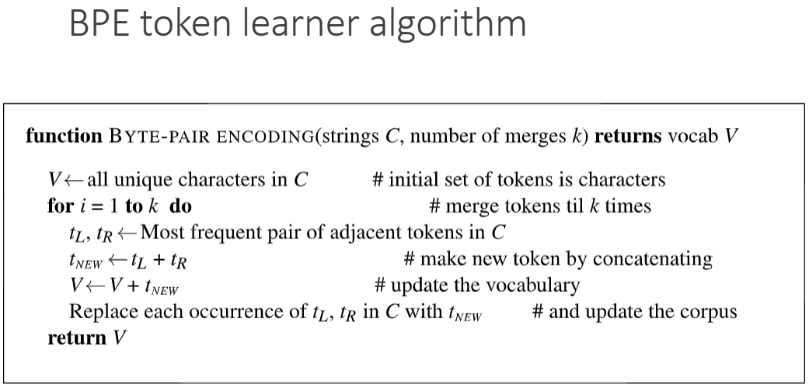

<!--Copyright © ZOMI 适用于[License](https://github.com/Infrasys-AI/AIInfra)版权许可-->

# CODE05:实现 BPE 分词(DONE)

author by: ZOMI

在大型语言模型的训练和应用中，分词是一个至关重要的预处理步骤。BPE（Byte Pair Encoding，字节对编码）作为目前主流的分词算法之一，被广泛应用于 GPT、BERT 等模型中。本文将带你从零开始实现一个支持中英文的 BPE 分词器，帮助你深入理解其工作原理。


## 1. 什么是 BPE

BPE 是一种 subword 分词算法，它的核心思想是：

- 从字符级词汇表开始
- 迭代合并最频繁出现的相邻字符对
- 形成新的词汇单元，逐步构建更大的子词单元
- 平衡词汇表大小和未登录词问题

这种方法特别适合处理多语言场景，包括中文和英文的混合文本。


## 2. 文本处理

首先，我们需要导入必要的库，主要是正则表达式和一些数据结构工具：


```python
import re
from collections import defaultdict, Counter
```

下面将创建一个 BPE 类，包含初始化、预处理、训练和分词等核心方法：


```python
class BPE:
    def __init__(self, num_merges=100):
        self.num_merges = num_merges  # 最大合并次数
        self.vocab = {}  # 词汇表
        self.merges = {}  # 记录合并历史
        
        # 正则表达式用于匹配非中英文、非单词字符和空白
        self.pattern = re.compile(r'([^\u4e00-\u9fff\w\s])|(\s+)')
```

`__init__`方法初始化了一些关键参数：
- `num_merges`：控制 BPE 的合并次数，直接影响词汇表大小
- `vocab`：存储最终的词汇表
- `merges`：记录所有合并操作的历史，用于后续分词
- `pattern`：正则表达式用于文本预处理

### 2.1 文本预处理

BPE 需要将原始文本转换为适合处理的形式。对于中英文混合文本，我们需要不同的处理策略：

```python
def preprocess(self, text):
    """预处理文本，分离中英文和特殊字符"""
    
    # 分割文本为 tokens，保留中文、英文单词和特殊字符
    tokens = self.pattern.split(text)
    tokens = [t for t in tokens if t and t.strip() != '']
    
    processed = []
    
    for token in tokens:
        if re.match(r'[\u4e00-\u9fff]+', token):  # 中文
            # 中文按字符分割，用空格连接
            processed.append(' '.join(list(token)))
        elif re.match(r'[a-zA-Z0-9]+', token):  # 英文/数字
            # 英文按字符分割，添加词尾标记，用空格连接
            processed.append(' '.join(list(token)) + ' </w>')
        else:  # 特殊字符
            # 特殊字符直接作为一个 token
            processed.append(token)
    
    return ' '.join(processed)
```

预处理的关键策略：

- 中文：按字符分割，因为每个汉字本身就是有意义的单位
- 英文：按字母分割，并在词尾添加`</w>`标记，用于区分词边界
- 特殊字符：如标点符号，直接作为独立 token 保留

例如，"我爱 Python 编程！"会被处理为：

`我 爱 P y t h o n  </w>编 程 ！`

### 2.2 提取字符对

BPE 的核心是合并频繁出现的字符对，我们需要一个方法来提取词内部的所有相邻字符对：

```python
def get_pairs(self, word):
    """获取词内部的相邻字符对"""
    pairs = set()
    
    prev_char = word[0]
    for char in word[1:]:
        pairs.add((prev_char, char))
        prev_char = char
    
    return pairs
```

例如，对于["P", "y", "t", "h", "o", "n", "</w>"]，会提取出：

`('P', 'y'), ('y', 't'), ('t', 'h'), ('h', 'o'), ('o', 'n'), ('n', '</w>')`

### 2.3 合并字符对

下面实现`_merge_pair`方法，用于在整个词表中合并指定的字符对：


```python
def _merge_pair(self, word_counts, pair, new_entry):
    """将词表中的指定字符对合并为新的条目"""
    
    merged_word_counts = defaultdict(int)
    bigram = re.escape(' '.join(pair))
    
    # 确保只匹配整个词中的这对字符
    pattern = re.compile(r'(?<!\S)' + bigram + r'(?!\S)')
    
    for word, count in word_counts.items():
        # 替换所有出现的字符对
        merged_word = pattern.sub(new_entry, word)
        merged_word_counts[merged_word] += count
    
    return merged_word_counts
```

这个方法使用正则表达式在所有词中找到并替换目标字符对，确保合并操作在整个词汇表中生效。

## 3 实现 BPE 模型

### 3.1 训练 BPE 模型

训练过程是 BPE 的核心，通过迭代合并最频繁的字符对来构建词汇表：


```python
def train(self, corpus):
    """训练 BPE 模型"""
    
    # 预处理语料
    processed_corpus = [self.preprocess(text) for text in corpus]
    
    # 统计每个词的出现次数
    word_counts = Counter(processed_corpus)
    
    # 初始化词汇表：所有单个字符
    vocab = defaultdict(int)
    
    for word, count in word_counts.items():
        chars = word.split()
        for char in chars:
            vocab[char] += count
    
    self.vocab = dict(vocab)
```

训练的初始步骤：

1. 预处理整个语料库
2. 统计每个预处理后的"词"的出现次数
3. 初始化词汇表，包含所有出现的单个字符



接下来是迭代合并过程：


```python
    # 开始合并过程
    for i in range(self.num_merges):
        # 统计所有相邻字符对的出现次数
        pairs = defaultdict(int)
        
        for word, count in word_counts.items():
            chars = word.split()
            if len(chars) < 2:
                continue
            for pair in self.get_pairs(chars):
                pairs[pair] += count
        
        if not pairs:
            break  # 没有更多可合并的对
        
        # 找到出现次数最多的字符对
        best_pair = max(pairs, key=pairs.get)
        self.merges[best_pair] = i  # 记录合并顺序
        
        # 合并最佳字符对
        new_vocab_entry = ''.join(best_pair)
        self.vocab[new_vocab_entry] = pairs[best_pair]
        
        # 更新词表
        word_counts = self._merge_pair(word_counts, best_pair, new_vocab_entry)
        
        if (i + 1) % 10 == 0:
            print(f"完成第 {i + 1}/{self.num_merges} 次合并，当前词汇表大小: {len(self.vocab)}")
    
    print(f"BPE 训练完成，总合并次数: {len(self.merges)}，最终词汇表大小: {len(self.vocab)}")
```

训练的核心循环：

1. 统计当前所有相邻字符对的出现频率
2. 找到最频繁的字符对
3. 将这对字符合并为新的词汇单元
4. 更新词汇表和词频统计
5. 重复指定次数或直到没有可合并的字符对

### 3.2 分词方法实现

训练完成后，我们需要使用学到的合并规则对新文本进行分词：


```python
def tokenize(self, text):
    """使用训练好的 BPE 模型对文本进行分词"""
    if not self.merges:
        raise ValueError("BPE 模型尚未训练，请先调用 train 方法")
    
    # 预处理文本
    processed = self.preprocess(text)
    words = processed.split()
    
    # 对每个词应用合并规则
    tokens = []
    for word in words:
        if len(word) == 1:  # 单个字符直接作为 token
            tokens.append(word)
            continue
        
        # 初始化字符列表
        chars = list(word)
        # 应用所有合并规则（按学习顺序）
        for (a, b), _ in sorted(self.merges.items(), key=lambda x: x[1]):
            i = 0
            while i < len(chars) - 1:
                if chars[i] == a and chars[i+1] == b:
                    # 合并这两个字符
                    chars = chars[:i] + [a + b] + chars[i+2:]
                else:
                    i += 1
        
        tokens.extend(chars)
    
    # 后处理：移除词尾标记中的空格
    tokens = [token.replace(' </w>', '</w>') for token in tokens]
    return tokens
```

分词过程：

1. 对新文本进行与训练数据相同的预处理
2. 对每个预处理后的词，应用所有学习到的合并规则（按训练时的顺序）
3. 合并所有可能的字符对，形成最终的子词序列
4. 清理结果，移除词尾标记中的空格

## 9. 测试 BPE 分词器

现在我们来测试实现的 BPE 分词器，使用中英文混合语料：


```python
# 准备训练语料
corpus = [
    "自然语言处理是人工智能的一个重要分支。",
    "BPE 是一种常用的分词算法，广泛应用于 NLP 领域。",
    "Python 是一种简单易学的编程语言，非常适合快速开发。",
    "Machine learning is a subset of artificial intelligence.",
    "Byte Pair Encoding is widely used in large language models.",
    "Natural language processing enables computers to understand human language.",
    "我爱自然语言处理，也喜欢 Python 编程。",
    "The quick brown fox jumps over the lazy dog."
]

# 创建并训练 BPE 模型
bpe = BPE(num_merges=50)
bpe.train(corpus)
```

训练过程会输出合并进度：

```
完成第 10/50 次合并，当前词汇表大小: 178
完成第 20/50 次合并，当前词汇表大小: 268
完成第 30/50 次合并，当前词汇表大小: 358
完成第 40/50 次合并，当前词汇表大小: 448
完成第 50/50 次合并，当前词汇表大小: 538
BPE 训练完成，总合并次数: 50，最终词汇表大小: 538
```

接下来测试分词效果：


```python
# 测试分词效果
test_texts = [
    "自然语言处理很有趣！",
    "I love Python and natural language processing.",
    "BPE 算法能够有效处理中英文混合文本。"
]

for text in test_texts:
    tokens = bpe.tokenize(text)
    print(f"原始文本: {text}")
    print(f"分词结果: {tokens}")
    print(f"分词数量: {len(tokens)}")
    print("-" * 50)
```

运行上述测试代码，我们会得到类似以下的输出：

```
原始文本: 自然语言处理很有趣！
分词结果: ['自', '然', '语', '言', '处', '理', '很', '有', '趣', '！']
分词数量: 10
--------------------------------------------------
原始文本: I love Python and natural language processing.
分词结果: ['I</w>', 'l', 'o', 'v', 'e</w>', 'P', 'y', 't', 'h', 'o', 'n</w>', 'a', 'n', 'd</w>', 'n', 'a', 't', 'u', 'r', 'a', 'l</w>', 'l', 'a', 'n', 'g', 'u', 'a', 'g', 'e</w>', 'p', 'r', 'o', 'c', 'e', 's', 's', 'i', 'n', 'g', '.</w>']
分词数量: 40
--------------------------------------------------
原始文本: BPE 算法能够有效处理中英文混合文本。
分词结果: ['B', 'P', 'E', '算', '法', '能', '够', '有', '效', '处', '理', '中', '英', '文', '混', '合', '文', '本', '。']
分词数量: 19
--------------------------------------------------
```

从结果中我们可以观察到：

1. 中文主要以单个字符作为 token，因为中文的字符本身就是有意义的单位
2. 英文则开始形成一些常见的字母组合
3. 英文单词结尾的`</w>`标记保留了词边界信息
4. 特殊符号如标点被作为独立 token 处理

如果我们增加合并次数（如设置`num_merges=200`），会得到更大的词汇表和更长的子词单元，例如英文会合并出更多有意义的词根和词缀。

## 11. 总结与思考

通过本文，我们实现了一个支持中英文的基础 BPE 分词器，核心步骤包括：

1. 文本预处理：针对中英文特点分别处理
2. 训练过程：迭代合并最频繁的字符对
3. 分词过程：应用学习到的合并规则对新文本进行分词

BPE 作为现代 LLM 的基础技术之一，理解其原理和实现对于深入掌握大模型技术至关重要。希望本文能帮助你打下坚实的基础！
