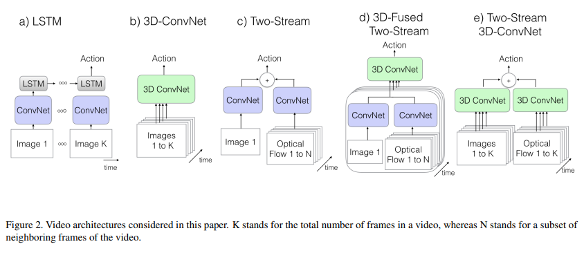
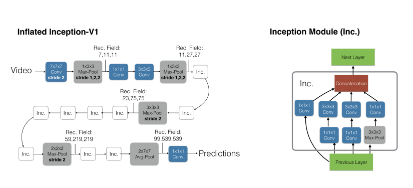
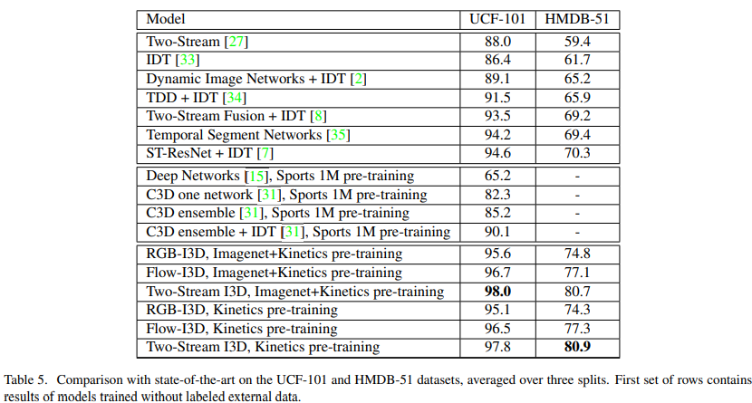
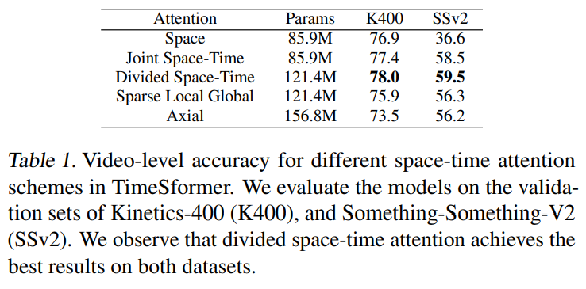
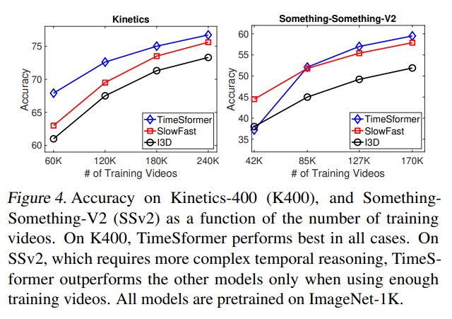

<!--Copyright © ZOMI 适用于[License](https://github.com/Infrasys-AI/AIInfra)版权许可-->

# 早期视频理解发展

> Author by: 李志峰
## 1. 视频理解简介

视频理解（Video Understanding）旨在让计算机像人类一样 “看懂” 视频内容——不仅能识别视频中的孤立元素（如物体、人物、场景），还能理解元素间的动态关系、时序逻辑、行为意图及高层语义（如事件、故事线、情感倾向）。  
简单来说，人类看一段视频能轻松知道 “谁在什么地方、做了什么、为什么这么做、接下来可能发生什么”，而视频理解的目标就是让机器具备这种综合解析能力，是连接 “视频数据” 与 “有价值信息” 的关键技术桥梁。  
如何利用好视频数据，如果做好视频理解，可能是通向更强人工智能的必经之路。  
视频理解发展至今可大致分为为手工提特征方法时期（2010 年以前）、深度学习方法时期（2010 年后）。  

## 2. 手工提特征做视频理解

在 20 世纪末 21 世纪初，研究者们主要依靠手工设计的特征提取方法来捕捉视频中的关键信息，其中较为常用的技术包括尺度不变特征变换（SIFT，Scale - Invariant Feature Transform）、加速稳健特征（SURF，Speeded - Up Robust Features）、方向梯度直方图（HOG，Histogram of Oriented Gradients）等。本文侧重于深度学习时代的视频理解，手工提特征只希望读者对发展历程有了解，因此这里只做简单介绍，感兴趣读者可以阅读参考文献中的原始论文。

### 2.1 手工提特征视频理解关键算法
1.  **尺度不变特征变换**
SIFT 算法由 David Lowe 在 1999 年提出，并于 2004 年完善总结 。该算法能够从图像中提取出具有尺度不变性的特征点，并为每个特征点分配一个唯一的描述子。这些描述子对旋转、尺度变化、亮度变化等具有不变性，并能在一定程度上保持对视角变换和仿射变换的不变性。在视频处理中，通过对视频序列中的每一帧图像独立应用 SIFT 算法进行特征点检测和描述，能够捕捉视频中内容的变化。例如在视频目标跟踪任务中，利用 SIFT 特征匹配能够实现稳定的目标跟踪，即使目标物体发生形变或遮挡，也能通过特征点的匹配来持续追踪目标。
2.  **加速稳健特征**
SURF 算法是 2006 年由 Herbert Bay 等人提出的一种快速且鲁棒的特征提取算法。它以 SIFT 算法为基础，通过使用 Hessian 矩阵来检测特征点，大大提高了特征提取的速度。SURF 算法使用积分图像来加速计算，使其计算量显著小于 SIFT 算法，同时在特征提取的准确性上与 SIFT 相当。在视频分析中，SURF 常用于运动检测和图像匹配。例如在视频监控系统中，可以利用 SURF 算法快速检测出视频帧中的运动目标，并通过特征匹配来判断目标是否为之前出现过的物体。​
3.  **方向梯度直方图**
HOG 特征检测是一种基于局部梯度方向直方图统计来描述图像局部结构特征的方法。其基本步骤包括计算图像的梯度幅值和方向，将图像划分为规则的网格并对每个网格计算梯度直方图，以及将相邻网格的直方图归一化以增强鲁棒性和减少光照变化的影响。HOG 特征对形状和边缘信息敏感，在目标检测和行为识别等任务中有着广泛应用。在行人检测领域，HOG 特征能够准确地定位行人的身体轮廓，即使在复杂背景下也能保持较高的检测精度；在行为识别中，通过分析目标在不同时间段内的梯度变化，构建具有时间序列特征的描述子，可用于识别和分类不同的行为模式，如奔跑、跳跃、打斗等。

### 2.2 手工提特征视频理解总结

手工提特征的方法在早期视频理解中发挥了重要作用，为后续的研究奠定了基础。它们能够在一定程度上捕捉视频中的关键信息，实现一些基本的视频分析任务。但这些方法也存在明显的局限性。一方面，它们对复杂场景和变化的适应性较差。例如，当视频中的物体发生快速运动、遮挡、光照变化剧烈时，手工设计的特征往往难以准确描述物体的特征，导致检测和识别的准确率下降。另一方面，手工提特征方法需要大量的人工设计和调试，特征的选择和设计依赖于研究者的经验和先验知识，通用性和扩展性不足，难以应对不断变化的视频内容和多样化的应用需求 。随着视频数据量的不断增加和应用场景的日益复杂，手工提特征阶段的局限性愈发凸显，促使研究者们寻找更强大、更智能的方法来推动视频理解技术的发展，这也为深度学习阶段的到来埋下了伏笔。

## 3. 深度学习视频理解阶段

随着计算机技术的飞速发展和大数据时代的来临，深度学习逐渐兴起，为视频理解领域带来了前所未有的突破与革新。深度学习模型能够自动从大量数据中学习特征，大大减少了对人工设计特征的依赖，显著提升了视频理解的能力和效果。深度学习时代视频理解大致可分为双流阶段、3D CNN 阶段、video transformer 阶段，接下来介绍每个阶段中较有代表性的工作。

### 3.1 双流阶段代表性工作：双流网络

#### 3.1.1 双流网络背景
在 2012 年 Alexnet 在 Imagenet 断崖式领先之后，就有一些研究者尝试将 CNN 用在视频理解领域。
其中一种思路是先用 2d 提取每一帧图像信息，后面接一个 LSTM 来获取时序信息，但效果并不理想，很快被抛弃了。
另一种思路把多帧图片的某个维度做共享或拼接，然后直接用一个 2D 网络去做视频理解，代表性工作是 DeepVideo（CVPR 2014），这篇工作提出了 100 万个视频的视频数据集 Sports-1M，时长几十秒到几分钟，视频帧超 10 亿，直到现在都还在使用。但由于 DeepVideo 没有很好利用运动信息，所以即使在 Sports-1M 这么大的数据集上预训练，效果也不理想。在 UCF-101 上精度只有 65.4%，比之前最好的手工提特征方法 IDT 差了近 20 个点（UCF-101 是当时非常流行的一个较小的视频分类数据集）。DeepVideo 之后人们认识到运动信息对视频理解的重要性，提出了**双流网络（Two - Stream Network）**（NeurIPS2014），将深度学习做视频理解提到跟之前最好方法接近的水平（UCF-101 精度 88%），双流网络也因此被誉为深度学习视频理解开山之作，从这篇工作之后视频理解的研究才开始以深度学习为主。

#### 3.1.2 双流网络核心思想及核心架构
双流网络作者把视频分为空间部分和时间部分，空间部分描述视频中的场景和物体信息，时间部分描述视频中的物体是如何运动的，根据这种拆分，作者提出了下图的双流网络框架。

两个网络分别学习空间特征和运动特征，互不打扰。
+ 空间网络部分相当于一个图像分类，基本就是一个 Alexnet，由一些 conv、fc 层、softmax 组成。
+ 时间网络部分输入是**光流（Optical Flow）**。光流可以简单理解为视频中每个像素点在相邻两帧之间的 “运动轨迹” 和 “运动速度”。作者将多个光流图叠加在一起来获取运动信息。空间流和时间流网络结构几乎是一样的，唯一区别就是输入不一样。前者输入的是静止的视频帧，输入 channel=3；后者输入是 L 张光流图的叠加，输入 channnel=2×L（一般取 L=10）。
随后，将两个特征合并。作者实现了两种特征合并方式：
+ late fusion 融合：两个 logist 加权平均得到最终分类结果（比如两个 softmax 向量取平均，再做一个 argmax 操作）。
+ 将 softmax 分数作为特征再训练一个 SVM 分类器。

#### 3.1.3 双流网络与其他网络效果对比
以下是双流网络与其他当时主流方法的效果对比：

在 UCF-101 上已经追平了手工最好的方法，HMDB-5L 是一个当时也较为流行的任务很难的数据集，也已经很接近最高最平，最重要的是远远超过了之前神经网络做视频理解的方法。

#### 3.1.4 双流网络发展
由于双流网络优秀的表现，许多研究者也在其基础上进一步研究了许多工作。比如融入了 LSTM 来提升长视频理解能力的 Two-Stream+LSTM(CVPR 2015)、改进了双流网络简单加权平均的 Two-Stream+Early Fusion(CVPR 2016)、将光流按轨迹叠加特征来提升效果的 TDD(CVPR 2015)、将长视频拆分再合并特征的 TSN（ECCV 2016）（这篇 TSN 强烈建议做视频理解的读一读，这里篇幅关系就不展开了）、在 TSN 基础上融入各种不同全局编码的 DOVF、TLE(CVPR 2017)、Action VLAD 等。

#### 3.1.5 双流网络总结与思考
这里引用亚马逊朱毅老师对双流网络的评价：“双流网络的贡献，不单单是使用了这么一个额外的时间流，它主要告诉了我们一个另外的道理，就是当你发现神经网络不能解决什么问题的时候，有可能仅仅靠魔改模型，或者仅仅改一下这个目标函数，是没办法很好的解决这个问题的。那我们不如给这个模型提供一些这种先验信息。他学不到，那我们就帮他学习。这样呢，往往能大幅度简化这个任务。论文引用这么高，也不光是说他在视频分类里的应用。因其影响力横跨很多领域。当大家发现一个神经网络解决不了问题的时候，大家就会想到双流网络，然后去尝试使用别的数据，尝试使用别的模型，来做这种多流网络，解决问题呢，效果往往非常好。因为这些网络是可以互补的。而这也从侧面验证了数据的重要性。另外一个点就是可以将双流网络想像成是一个多模态学习的先例。RGB 图像和光流图像其实就属于不同的模态。从多模态学习的角度来看，双流网络，或者说利用光流有可能在视频理解，或者表征学习方面再次发光发热。”

#### 3.1.6 双流网络问题
虽然双流网络及其改进在当时效果出类拔萃，却有个很致命的问题：依赖光流。
光流抽取非常耗时，导致准备训练数据需要很久时间去抽取光流，而且推理时抽取光流也很难做到实时；同时，由于光流的密集表示，导致其存储空间太大，因此后续研究者尝试改进光流或是直接舍弃光流投奔 3D 网络的怀抱。
当然，现在的研究者发现，在新的网络结构如 3D CNN 结构或 Video transformer 中加入光流还可以继续提高性能，所以光流虽成本很高，但在提升效果方面依旧是一个很好的特征。

### 3.2 3D CNN 阶段代表性工作：I3D

#### 3.2.1 I3D 背景
由于上述光流的成本以及存储问题，研究者开始考虑直接用网络从视频中提取运动信息。
那么既然视频比图像多了一个时间维度，而我们用 2D 的 CNN 处理图像效果很好，那把 2D 的 CNN 升一个维度到 3D 的 CNN 去处理视频理解是一个很自然的想法，一次卷积多帧，就能让网络学习时间维度信息和运动信息。这种思路在双流网络之前就有过，C3D(ICCV 2015)是较早实现这个想法的工作，但 C3D 效果还有差距（C3D (1 net)+linear SVM 在 UCF-101 精度只有 82.3）。后来的研究者经过改进，提出了**I3D(CVPR 2017)：Two-Stream+3D ConvNet**，把 UCF-101 刷到了 98%，HMDB-51 刷到 80%（UCF-101 已经接近 100%,而 HMDB-51 数据集任务较难，80%基本也到顶了，这两个当时爆火的数据集被 I3D 直接刷爆了，之后这两个数据集上有监督学习基本没有进一步做下去的必要了），开启 3D CNN 做视频理解的时代。

#### 3.2.2 I3D 核心思想及核心架构
I3D 工作核心贡献：
1. **提出了新的数据集**：I3D 作者认为图像处理任务在当时发展那么好有个很重要的原因是 ImageNet 这个足够大的数据集给视觉研究者们提供各种特征做预训练，但视频领域当时并没有与 Imagenet 匹配的足够优秀的视频大规模数据集，因此提出了新的视频分类数据集 Kinetics，该数据集优点有：
* 类别均衡、规模合适：初始的 kinetics 有 400 个类，每个类都超过 400 个视频片段。
* 多样性好：每段视频都来自独一无二的 YouTube 视频。有些视频数据集的视频，都是一个长视频中截取的，比如 UCF101。
* 标注精准：每个 clips 都是视频中精准抽出 10s 左右的段落，所以整个数据集都标注的非常精准。
* 难度适中：如果数据集的视频都过于难或者过于简单，就失去其意义了，也没人会用。
2. **提出了一个新的模型 I3D 即 Inflated 3D ConvNet**：Inflated 是扩大膨胀的意思，这里是指把一个 2D 模型膨胀到一个 3D 模型，比如对于一个 2D 的 Resnet 来说，遇到 `3×3` 的卷积核就变成了 `3×3×3`的卷积核， 遇到一个 2D 的 Pooling 层，就变成 3d 的 Pooling 层。其他层数、整体架构等均保持不变。这样就可以把 CV 领域较为成熟的 2D 网络结构如 VGG,Resnet 等经过 Inflated 直接使用，不需要针对视频重新设计网络结构，减少了验证结构所需的大量消融实验工作（实际上直到 22 年的 Video Swing Transformer 依旧在做 Inflated 这种操作，把一个 2D 的 swin transformer 网络 inflated 到 3D）。
3. **Bootstrapping：预训练的 2D 模型初始化 3D 网络，及代码实现**：对于 2D 网络上预训练的参数，如何迁移到 3D 网络，将某一帧复制多次成为类似 video 时，通过 3DCNN 输出也是和 2DCNN 一致的。具体做法是沿着时间维度重复 2D 滤波器权重 N 次，并且通过除以 N 进行归一化。
同时，I3D 作者直接拿 2D 预训练网络进行通过 Bootstraping 进行 3D 初始化，所以做很深的模型也不需要太多的视频数据从头训练。
4.**提出了创新的 I3D 架构**：I3D 通过 Inflated 将 Inception-V1 扩展到 3d，并结合了光流来提升效果。I3D 架构与此前主流架构对比：

* CNN+LSTM：即 CNN 抽取关键帧特征，LSTM 进行时序建模
具体来说，就是先抽取视频中的关键帧得到 K 张图，然后将这 K 张图输入 CNN 网络得到图片特征。再将这些特征全部输入 LSTM 网络，进行各个时间戳上图片特征的融合，得到整个视频的融合特征。最后将 LSTM 最终时刻的特征接一个 FC 层得到分类结果。
* 3D Conv：将视频帧（分割好的一个个的视频段，每段含有 K 张图片）直接输入 3D 的 CNN 网络进行时空学习。
此时卷积核必须是 3 维的（比如每个卷积核都是 3×3×3，加入了时间维度），网络不光学习空间信息，还需要学习时序信息（运动信息）。最后 3D Conv 输出的特征也是接一个全连接层得到分类结果。因为多了一个维度，模型的参数量很大，不太好训练，而且效果也不好。
Two stream（late fusion）`：如果不想用 LSTM 进行时序建模，也不想用 3D 网络直接进行时空学习，那么还可以使用光流来得到时序信息（运动信息）。
* 双流网络整体还是 2D 网络结构，但额外引入一个时间流网络。通过巧妙的利用光流来提供的物体运动信息，而不用神经网络自己去隐式地学习运动特征，大大提高了模型的性能。
3D Fused Two stream（early fusion）`:双流网络的改进。作者认为双流网络中，两个网络的输出只是进行简单的加权平均来处理，效果还不够。所以将其替换为一个较小的 3D 网络，进一步融合特征。实验证明这种先进行 2D 卷积网络训练，再进行 3D 卷积网络融合的效果更好。
* Two stream 3D ConvNet：I3D 是 3D 网络和双流网络的结合。因为单纯的使用 3D 网络，模型效果还是不好，加上光流之后，可以大大提高模型性能。所以可以说 I3D=Two stream+3D Conv。另外两个分支网络都已经是 3D 网络了，也就不需要另外加一个 3D 网络进行融合，直接加权平均得到最终的结果就行。
其中 I3D 的详细架构如下：

* 左侧是 Inflated Inception-V1 结构，就是卷积核都加了一个维度（`K*K` —> `K*K*K`，上图蓝色框）。池化层也加了一个维度，但时间维度不进行下采样。比如池化是`3*3`—>`1*3*3`而非`3*3*3`，对应的 stride 是`2*2`—>`1*2*2*`，而非`2*2*2*`。不过在后面几个阶段进行了时间维度的下采样（后三个池化层）
* 右图是 Inception Module，和之前 2D 结构一样，只是卷积核变为了 3D。
> 2016 年—2017 年，很多视频工作的消融表明，使用 Inception-V1 的效果比 ResNet 更好。但是 ResNet 统治力是在是太强了，一年后《Non-local Neural Networks》用 ResNet 实现了 I3D 模型，并且加入了 self-attention。后续大家一般提到 I3D，都是指其 ResNet 实现的版本。  
> 最近几年的工作也表明，2D 卷积网络扩张到 3D 时。池化层的时间维度最好不要进行下采样。比如输入是 64 帧，输出也是 64 帧，这个对应的实际只有 2 秒左右，已经很短了。

#### 3.2.3 I3D 与其他网络效果对比

+ I3D 作者对比了单独的空间流 I3D 和单独的时间流网络 I3D、完整的 I3D；以及这三种模型只在 Kinetics 400 数据集上进行预训练的效果。后面三个模型的效果也不差，说明只用视频数据集进行预训练效果就已经很好了。
+ 后续的这种扩展 3D 模型，可以不再需要使用 ImageNet 上预训练的模型，直接从头训练就可以了。

#### 3.2.4 I3D 后续发展
在 I3D 之后，除了极少其他思路的工作，3D CNN 基本霸占了从 2017 到 2020 年的视频理解领域，出现了许多优秀的工作。主要有：改进 I3D backbone 的 R3D(resnet)、MFNex(ResNext)、STC(SENet);将纯 3D CNN 改为 2D+3D 来降低模型复杂度并提高性能的 S3D、ECO、P3D；将 3D CNN 拆分为 2D 空间卷积+1D 时间卷积来降低过拟合和训练难度的 R(2+1)D(CVPR 2018)（这个思想到后面的 vision transformer 时代依旧有很多工作使用）；融入自注意力，使模型精度更高，且可以建模更长的时间序列的 non-local(CVPR 2018)；舍弃光流改用 2 个快慢结合网络分别学习静态信息和运动信息的 SlowFast(ICCV 2019);使用 anto ml 方式搜索网络的 X3D。X3D 参数量特别小并且效果非常好，基本上很难再有人能打得过它了，研究者们开始寻求其他出路，纷纷把目光投向 vision transformer。

#### 3.2.6 I3D 总结与思考
I3D 的网络结构以及其提出的 Kinetecs 数据集给当时的视频理解带来了全新的 2 个思路：
+ 如果没有好的训练数据，可以使用 ImageNet 上预训练的模型按本文的方式扩张到 3D 网络，这样不用设计 3D 网络结构，而且使用了预训练模型的参数进行初始化，效果一般都很好（Inflating+Bootstrapping）；
+ 如果你想从头设计一个 3D 网络，那么可以使用 Kinetics 400 数据集进行预训练，不需要依赖于 ImageNet 预训练的模型参数。
在 I3D 之前 3D CNN 效果并不理想，但 I3D 认识着不是 3D CNN 的问题，从数据、3D 网络的获取方式等角度出发，解决了之前 3D CNN 的问题，对我们的研究学习也有启发，当局者迷旁观者清，把视角打开，或许会有意外收获。

#### 3.2.5 I3D 问题
I3D 的问题，也是 3D CNN 的根本问题，就是 CNN 本身的缺陷。
+ 卷积有很强的归纳偏置（例如局部连接性和平移不变性）。对于一些比较小的训练集来说，这毫无疑问是有效的，但数据集够大时，这些会限制模型的表达能力。
+ 卷积核是专门设计用来捕捉局部的时空信息，并不能够对感受野之外的依赖进行建模。虽然将卷积进行堆叠，会扩大感受野，但是这种策略，仍然会限制长期依赖的建模。
+ 当应用于高清的长视频时，训练深度 CNN 网络非常耗费计算资源。  

而这些问题也限制着视频理解的发展，直到 ViT(ICLR 2021)的出现，终于有了转机。

### 3.3 video transformer 的代表工作：Timesformer
#### 3.3.1 Timesformer 背景

上述提到的卷积的问题，transformer 能很好的解决。
+ 卷积的归纳偏执问题，Transformer 的归纳偏置更少，能够表达的范围更广，也更适用于非常大的数据集。
+ 卷积对全局信息理解较差的问题，自注意力机制通过直接比较在所有时空位置上的特征，可以被用来捕捉局部和全局的长范围内的依赖。
+ 卷积的高清长视频资源消耗问题，Transformer 训练和推导要比 CNN 更快。使用相同的计算资源可以训练更强的网络。
因此，transformer 能提高视频理解的上限，随着 transformer 在 nlp 领域常年霸榜并且 ViT 在图像领域大杀四方，研究者开始考虑做 video transformer，将自注意力机制从图像的空间维度（2D）扩展到视频的时空维度（3D）。TimeSformer 算是这方面工作最早的一篇。  

#### 3.3.3 Timesformer 核心思想及核心架构
限制 vision transformer 发展的很大一个原因就是网络结构较大，因此训练较多的数据时显存容易塞不下，而多了一个时间维度的 video transformer 这个限制更严重，因此需要对网络进行拆分。Timesformer 作者团队首先讨论了 5 种结构：

1. **空间注意力机制(S)**：只在单帧图像上计算空间自注意力+残差连接，然后接一个 MLP+残差连接得到最后的结果，就类似 ViT 本身的做法，相当于一个 baseline。  
2. **（共同）时空注意力(ST)**：在视频的三个维度上都使用自注意力。
    + 暴力的计算所有视频帧中的所有图像块的自注意力，剩下的操作和上面一样。
    + 这种方式基本显存都塞不下（本来 ViT 就快塞不下了，视频使用更多的视频帧，更是塞不下）。
3. **拆分的时空自注意力(T+S)**：直接计算 3D 的时空自注意力显存不够，借鉴 R(2+1)D 的方法，将其拆分为 Temporal Self Attention+Spatial Self Attention。先计算不同帧中同一位置图像块的自注意力，再计算同一帧中的所有图像块的自注意力，这种方式大大降低了计算复杂度。  
4. **局部-全局注意力机制(L+G)**：直接计算序列太长，所以考虑先计算局部的自注意力，再在全局计算自注意力，类似 Swin-Transformer。  
具体来说，先利用所有帧中，相邻的 H/2 和 W/2 的图像块计算局部的注意力。然后在空间上，使用 2 个图像块的步长，在整个序列中计算自注意力机制，这个可以看做全局的时空注意力更快的近似。  
5. **轴向自注意力(T+W+H)**：分别沿着时间维度、width 维度和 height 维度计算自注意力。

作者团队对 5 种注意力进行了可视化，更形象：

1. **空间注意力机制(S)**：上图以第 t 帧 blue patch 为基准点时，Space Attention 只计算这一帧内其他 patches 和基准点的 self attention，而完全看不到其它帧的信息。  
2. **（共同）时空注意力(ST)**：基准点和所有帧的所有 patches 都计算自注意力。
3. **拆分的时空自注意力(T+S)**：先做时间上的自注意力，也就是计算不同帧中同一位置的 self attention。然后计算同一帧上所有 patches 的 self attention。  
4. **局部-全局注意力机制(L+G)**：先计算图中蓝色快和黄色/红色块的局部自注意力，再计算全局自注意力（此时是进行稀疏的计算，所以只计算蓝色块和紫色块的自注意力）。  
5. **轴向自注意力(T+W+H)**：先做时间轴（绿色块）的自注意力，再分别作横轴（黄色块）和纵轴（紫色块）上的自注意力。  
最终作者在 Kinetics-400 和 Something-Something-V2 数据集上，试验了这几种结构的精度。拆分时空注意力（ divided space-time attention）效果最好。

> K-400 是一个比较偏静态图像的，所以单纯的 Space Attention 效果也不错，但是换成 SSv2 数据集，这样做效果非常差。

#### 3.3.4 TimeSformer 与其他网络效果对比

+ 左图是 TimeSformer、I3D、SlowFast 三种模型在 K400 数据集上的精度对比。其实 SlowFast 使用 Resnet101 的精度达到了 78.9，是比 TimeSformer 高的，但 TimeSformer 确实训练（微调）时间和推理速度都更短。
+ 右图是为了使工作更有说服力，作者团队做了更大尺寸的 TimeSformer-L 模型，并在 ImageNet-21K 上进行训练，终于把 K400 刷到 80.7 了。作为第一篇把 ViT 用到视频理解上的论文，这效果已经不错了。
此外，TimeSformer 的可扩展性，使得它可以在更长的视频片段上训练更大的模型（当时的 3D CNN 最多只能够处理几秒钟的片段，而 TimeSformer 甚至可以在数分钟的片段上进行训练），为将来的 AI 系统理解更复杂的人类行为做下了铺垫。

#### 3.3.5 TimeSformer 后续发展
TimeSformer 开启了 video transformer 之后，短短几个月时间陆续出现了很多思路类似的拆分自注意力的优秀工作。包括 Amazon 提出的能够通过叠加注意力来聚集时空信息，效率更高性能更好的 VidTr(ICCV 2021)、Facebook 的使用了多尺度和 Longformer，效果更好 MViT(ICCV 2021)、通过时空管采样等方式提取视频时空标记，采用编码器分解等策略平衡效率与性能的 ViViT(ICCV 2021)、加入 “时间窗口移位” 机制，增强长时依赖捕捉的 Video Swin Transformer(CVPR 2022)等。

#### 3.3.6 TimeSformer 总结与思考
TimeSformer 以及其后的许多 video transformer 做了很多拆分注意力方面的工作来减少计算量和显存，让强大的 transformer 能用在视频理解领域。时至今日的动辄百亿千亿参数量的 LLM 仍存在模型过大不容易训练和部署的限制，TimeSformer 给我们提供了一种思路。祝融绝顶万馀层，策杖攀萝步步登。  

#### 3.3.7 TimeSformer 问题
Transformer 模型通常需要大量标注数据才能充分发挥其潜力，Timesformer 也不例外。作者团队自己做了不同数据比例的消融实验。
+ 因为这个模型需要非常大的数据才能够训练，作者有尝试自己从头训练，但是都失败了，因此在论文中报告的所有结果，都使用了 ImageNet 进行预训练。
+ 为了研究数据集的规模的影响，使用了两个数据集，实验中，分四组，分别使用 25%，50%，75%和 100%的数据。结果是 TimeSformer 当数据比较少的时候表现不太好，数据多的时候表现好（这个结论和 ViT 中是一样的，即训练 transformer 需要更大的数据量才能达到媲美 CNN 的效果）。
  
另外，模型本身的庞大使其难以在算力较小设备上应用时至今日都是许多 video transformer 的问题。

### 3.4 深度学习视频理解总结

深度学习阶段的模型在视频理解任务中展现出诸多优势。它们能够自动学习到更具代表性和判别性的特征，避免了手工提特征方法中人工设计的局限性，对复杂场景和多样化的视频内容具有更强的适应性。通过在大规模数据集上的训练，深度学习模型的泛化能力得到显著提升，能够在不同的应用场景中表现出较好的性能。然而，这些模型也存在一些局限性。一方面，深度学习模型通常需要大量的标注数据进行训练，而获取高质量的标注视频数据往往需要耗费大量的人力、物力和时间。例如在构建一个用于视频行为分析的数据集时，需要专业人员逐帧标注视频中的行为类别，这是一个非常繁琐且容易出错的过程。另一方面，深度学习模型的计算复杂度较高，对硬件设备要求苛刻，在实际应用中，尤其是在一些资源受限的边缘设备上，模型的部署和运行面临挑战。例如在智能摄像头中部署视频理解模型，由于摄像头的计算资源有限，难以运行大规模的深度学习模型，需要对模型进行压缩和优化 。此外，深度学习模型的可解释性较差，模型内部的决策过程难以理解，这在一些对安全性和可靠性要求较高的应用场景中，如自动驾驶、安防监控等，可能会带来潜在的风险。

## 参考与引用

https://www.cs.ubc.ca/~lowe/papers/ijcv04.pdf
https://www.sciencedirect.com/science/article/abs/pii/S1077314207001555
https://link.zhihu.com/?target=https%3A//hal.inria.fr/file/index/docid/548512/filename/hog_cvpr2005.pdf
https://arxiv.org/pdf/1406.2199
https://www.bilibili.com/video/BV1mq4y1x7RU
https://arxiv.org/pdf/1705.07750
https://www.bilibili.com/video/BV1tY4y1p7hq
https://zhuanlan.zhihu.com/p/639250632
https://arxiv.org/pdf/2102.05095
https://www.bilibili.com/video/BV11Y411P7ep
https://blog.csdn.net/qq_56591814/article/details/128151883