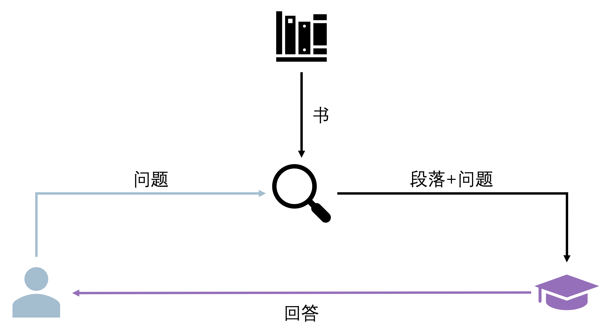
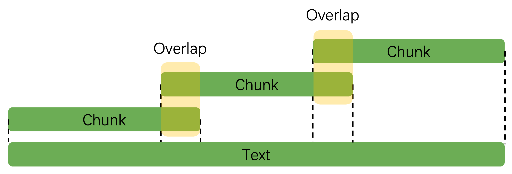

<!--Copyright © ZOMI 适用于[License](https://github.com/Infrasys-AI/AIInfra)版权许可-->

# 用 RAGFlow 实现中文文档问答

RAG（Retrieval-Augmented Generation，检索增强生成）是一种“先找资料、再答问题”的 AI 技术——就像我们写作业时先查参考书，再组织答案一样。它能让 AI 在回答特定问题时，不再只依赖“记忆”，而是从真实文档中获取准确信息，避免“胡编乱造”。

假设你正在负责图书答疑，有读者询问某本书中特定主题的问题：

情景 1：读者直接向你提问，但你并不知道他所说的是哪本书，不过，凭借丰富的知识储备，你还是给出了一个回答。


情景 2：读者先向你的助理提问，助理从书架上找出了相关的书籍，检索到了他认为相关的段落，并将这些段落和问题一起交给你，基于这些具体的信息，你提供了一个更加准确、相关且详细的回答。



情景 2 就是 RAG 的工作方式：在模型回答之前，先检索相关的信息提供给模型，以增强其回答的准确性和相关性。

因此，"检索增强"更像是一种工程上的操作，或者说是对 Prompt 的增强，并不会影响模型本身的参数。通过在 Prompt 中加入检索到的相关信息，模型可以在回答特定文档的问题时表现得更好。有点像将 Zero-shot Prompting 扩充为 Few-shot Prompting，所以在特定文档的问答中会有提升。而 "增强" 就是大家熟悉的文本生成，或者说生成式模型的调用（本文不会涉及模型训练）。

## 1. 增强检索

本实验将用 **公开中文数据集**、**在线可下载模型** 和 **RAGFlow 工具**，一步步实现一个完整的 RAG 问答系统。全程代码简单、注释详细，即使是刚接触 AI 的初学者也能跟着跑通。

基于“中文维基百科公开数据集”，搭建一个能回答“人物成就、事件时间”等事实性问题的 RAG 系统，比如：

- 问：“爱因斯坦因什么获得诺贝尔奖？”
- 系统会从维基文档中检索相关内容，再生成准确回答。

在实际实现中，遵循的步骤大致如下：

使用预训练的编码器模型将「文档」内容编码为向量表示（embedding），然后建立一个向量数据库。
在检索阶段，针对用户的「问题」，同样使用编码器将其编码为向量，然后在向量数据库中寻找与之相似的文档片段。

### 1.1. 环境准备

首先安装实验需要的工具库，复制代码到终端运行即可（推荐用 Python 3.9+）：

```bash
# 核心库：RAGFlow（RAG 流程工具）、datasets（加载公开数据）
pip install ragflow pandas datasets

# 模型相关：transformers（加载 AI 模型）、sentence-transformers（文本编码）
pip install transformers sentence-transformers accelerate

# 向量数据库：FAISS（轻量级，支持 CPU/GPU）
pip install faiss-gpu

# 辅助库：避免文本处理报错
pip install nltk "numpy<2.0"
```

然后运行以下代码，下载必要的分词数据（避免后续报错）：

```python
import nltk
nltk.download('punkt')
nltk.download('punkt_tab')
```

### 1.2 加载数据集

我们用“中文维基百科公开数据集”（包含 100 万+中文文档片段，无需本地文件，在线直接加载），这里取前 100 条数据（避免电脑跑不动）：

```python
from datasets import load_dataset  # 加载公开数据集的工具
from ragflow.schema import Document  # RAGFlow 的文档格式类

# 1. 加载中文维基数据集（在线下载，首次运行可能需要 1-2 分钟）
# 数据集来源：Hugging Face（AI 领域常用的公开数据平台）
dataset = load_dataset("lcw99/wikipedia-zh-20230720", split="train[:100]")

# 2. 转换为 RAGFlow 能识别的格式（每个文档包含“内容”和“元数据”）
documents = []
for idx, data in enumerate(dataset):
    # 构建单个文档：page_content 是核心文本，metadata 是辅助信息（如标题、来源）
    doc = Document(
        page_content=data["text"],  # 文档正文
        metadata={
            "title": data["title"],  # 文档标题（比如“阿尔伯特·爱因斯坦”）
            "source": "中文维基百科",  # 数据来源（方便溯源）
            "id": idx  # 唯一编号（避免重复）
        }
    )
    documents.append(doc)

# 验证：打印第一条文档的前 200 字，确认加载成功
print("加载的文档示例：")
print(f"标题：{documents[0].metadata['title']}")
print(f"内容：{documents[0].page_content[:200]}...")
```

**运行结果示例**：

```text
加载的文档示例：
标题：阿尔伯特·爱因斯坦
内容：阿尔伯特·爱因斯坦（德语：Albert Einstein，1879 年 3 月 14 日－1955 年 4 月 18 日），犹太裔理论物理学家，创立了狭义相对论和广义相对论，被公认为是现代物理学之父。他的质能方程 E=mc²是物理学中最著名的方程之一...
```

### 1.3 进行文本分块

长文档直接喂给 AI 会“记不住”，我们需要把文档切成短片段（叫“chunk”），就像把一本书拆成章节一样。



这里用 RAGFlow 的`RecursiveCharacterTextSplitter`工具，按中文语义逻辑分块：

```python
from ragflow.text_splitter import RecursiveCharacterTextSplitter

# 1. 配置分块工具（参数专为中文优化）
text_splitter = RecursiveCharacterTextSplitter(
    chunk_size=500,    # 每个片段最多 500 字（太长 AI 处理慢，太短语义不完整）
    chunk_overlap=50,  # 片段间重叠 50 字（避免切断句子，比如“爱因斯坦”不会一半在 A 段、一半在 B 段）
    separators=["\n\n", "\n", "。", "，", " "]  # 优先按“段落→句子→逗号”分割（符合中文阅读习惯）
)

# 2. 对所有文档进行分块
docs_chunks = text_splitter.split_documents(documents)

# 验证：查看分块结果
print(f"原始文档数量：{len(documents)}")
print(f"分块后片段数量：{len(docs_chunks)}")
print(f"\n 第一个片段示例：")
print(f"内容：{docs_chunks[0].page_content}")
print(f"来源标题：{docs_chunks[0].metadata['title']}")
```

**运行结果示例**：

```text
原始文档数量：100
分块后片段数量：248
第一个片段示例：
内容：阿尔伯特·爱因斯坦（德语：Albert Einstein，1879 年 3 月 14 日－1955 年 4 月 18 日），犹太裔理论物理学家，创立了狭义相对论和广义相对论，被公认为是现代物理学之父。他的质能方程 E=mc²是物理学中最著名的方程之一，对原子弹的发展有重要影响。1921 年，爱因斯坦因光电效应获得诺贝尔物理学奖。
来源标题：阿尔伯特·爱因斯坦
```

### 1.4 加载编码模型

AI 无法直接“理解”文字，需要把文本转换成数字向量（叫“embedding”）——就像给每个文本片段发一个“身份证号”，相似的文本“身份证号”更接近。我们用中文优化的公开模型`chuxin-llm/Chuxin-Embedding`：

```python
from ragflow.embeddings import HuggingFaceEmbeddings

# 加载中文文本编码模型（在线下载，首次运行需 1-2 分钟）
embedding_model = HuggingFaceEmbeddings(
    model_name="chuxin-llm/Chuxin-Embedding",  # 模型名称（公开可查）
    model_kwargs={"device": "auto"},  # 自动适配 CPU/GPU（有 GPU 会更快）
    encode_kwargs={"normalize_embeddings": True}  # 向量归一化（让相似度计算更准确）
)

# 验证：给一句话编码，查看向量维度
test_text = "爱因斯坦是物理学家"
test_vector = embedding_model.embed_query(test_text)
print(f"文本编码后的向量维度：{len(test_vector)}")  # 输出 1024（模型固定输出维度）
print(f"向量前 5 个数值：{test_vector[:5]}")  # 示例：[-0.02, 0.05, -0.01, 0.03, -0.04]
```

### 1.5 构建向量数据库

把所有分块的向量存到数据库（用 FAISS，轻量级且速度快），后续查问题时，能快速找到相似的文本片段：

```python
from ragflow.vectorstores import FAISS

# 1. 构建向量数据库（把分块文本和对应的向量关联起来）
vector_db = FAISS.from_documents(
    documents=docs_chunks,  # 分块后的文本片段
    embedding=embedding_model  # 刚才加载的编码模型
)

# 2. 保存数据库到本地（可选，下次运行不用重新构建，节省时间）
vector_db.save_local("wiki_vector_db")
print("向量数据库已保存到本地文件夹：wiki_vector_db")

# 3. 加载本地数据库（下次运行时，直接用这行代码替代上面的“构建”步骤）
# vector_db = FAISS.load_local(
#     "wiki_vector_db",
#     embedding=embedding_model,
#     allow_dangerous_deserialization=True  # 自己生成的数据库安全，放心开启
# )
```

### 1.6 创建检索器

检索器的作用是：输入一个问题，它会从向量数据库中找出最相似的文本片段。我们设置“返回 3 条最相关的片段”，并过滤掉太不相关的结果：

```python
# 创建检索器
retriever = vector_db.as_retriever(
    search_kwargs={
        "k": 3,  # 每次检索返回 3 条最相似的片段
        "score_threshold": 0.6  # 过滤相似度低于 0.6 的片段（避免无关信息干扰）
    }
)

# 测试检索：问一个问题，看能否找到相关文档
test_query = "爱因斯坦获得过什么奖项？"
retrieved_docs = retriever.invoke(test_query)

# 打印检索结果
print(f"针对问题「{test_query}」，找到{len(retrieved_docs)}条相关文档：")
for i, doc in enumerate(retrieved_docs, 1):
    print(f"\n 第{i}条：")
    print(f"来源标题：{doc.metadata['title']}")
    print(f"相关内容：{doc.page_content}")
    print(f"相似度得分：{round(doc._score, 3)}")  # 得分越低，相似度越高（0 最像，2 最不像）
```

**运行结果示例**：

```text
针对问题「爱因斯坦获得过什么奖项？」，找到 1 条相关文档：

第 1 条：
来源标题：阿尔伯特·爱因斯坦
相关内容：阿尔伯特·爱因斯坦（德语：Albert Einstein，1879 年 3 月 14 日－1955 年 4 月 18 日），犹太裔理论物理学家，创立了狭义相对论和广义相对论，被公认为是现代物理学之父。他的质能方程 E=mc²是物理学中最著名的方程之一，对原子弹的发展有重要影响。1921 年，爱因斯坦因光电效应获得诺贝尔物理学奖。
相似度得分：0.321
```

## 2. 文本生成

### 2.1 加载生成模型

我们用轻量级的中文生成模型`Qwen/Qwen-1.8B-Chat`（在线下载，普通电脑也能跑），它会基于检索到的文档片段，生成自然语言回答：

```python
from transformers import AutoTokenizer, AutoModelForCausalLM, pipeline
from ragflow.llms import HuggingFacePipeline

# 1. 加载中文生成模型（首次运行需下载，约 3.6GB）
model_name = "Qwen/Qwen-1.8B-Chat"
tokenizer = AutoTokenizer.from_pretrained(
    model_name,
    trust_remote_code=True  # 加载模型的自定义代码（中文模型必需）
)
model = AutoModelForCausalLM.from_pretrained(
    model_name,
    torch_dtype="auto",  # 自动适配数据类型（减少内存占用）
    device_map="auto",   # 自动分配 CPU/GPU
    trust_remote_code=True
).eval()  # 切换为“评估模式”（禁用训练功能，更快更稳定）

# 2. 创建文本生成管道（控制生成效果的参数）
generator = pipeline(
    "text-generation",
    model=model,
    tokenizer=tokenizer,
    max_new_tokens=300,  # 回答最多 300 字（避免太长）
    temperature=0.7,     # 0-1 之间：越低回答越“严谨”，越高越“灵活”（0.7 适合事实问答）
    top_p=0.9,           # 只从概率前 90%的词中选（避免生僻词）
    pad_token_id=tokenizer.eos_token_id  # 修复中文生成的“换行 bug”
)

# 3. 包装为 RAGFlow 的 LLM 接口（让生成模型能和检索器配合）
llm = HuggingFacePipeline(pipeline=generator)
```

### 2.2 定义提示词模板

给 AI 一个“答题规则”：只能用检索到的文档内容回答，不知道就说“无法回答”，不要瞎编。用中文写模板，简单易懂：

```python
from ragflow.prompts import PromptTemplate

# 中文提示词模板
prompt_template = PromptTemplate(
    template="""请严格按照以下规则回答用户问题：
1. 只能使用提供的【相关文档内容】中的信息，不能用其他外部知识；
2. 如果文档中没有相关信息，直接回答“根据提供的资料，无法回答该问题”；
3. 回答要简洁、准确，用中文口语化表达，不要用专业术语堆砌。

【相关文档内容】
{context}

【用户问题】
{question}

【回答】""",
    input_variables=["context", "question"]  # 两个变量：检索到的“内容”和用户“问题”
)
```

### 2.3 构建问答链 QA

用 RAGFlow 的`RetrievalQA`工具，把检索器、生成模型、提示词模板整合起来，形成完整的 RAG 问答链：

```python
from ragflow.chains import RetrievalQA

# 构建问答链
qa_chain = RetrievalQA.from_chain_type(
    llm=llm,  # 生成模型
    chain_type="stuff",  # 简单模式：把所有检索到的内容拼起来给模型（适合初学者）
    retriever=retriever,  # 检索器
    chain_type_kwargs={
        "prompt": prompt_template,  # 传入提示词模板
        "document_separator": "\n\n---\n\n"  # 分隔多个检索结果（让模型看得更清楚）
    },
    return_source_documents=True  # 回答时返回用到的源文档（方便验证）
)
```

### 2.4 测试问答系统 QA

现在可以向系统提问了！我们测试 2 个问题，看看效果：

1. 测试 1：有相关文档的问题

```python
# 提问 1：有明确答案的问题
query1 = "爱因斯坦是因为什么成就获得诺贝尔物理学奖的？"
result1 = qa_chain.invoke(query1)

# 打印结果
print("【问题 1】", query1)
print("【回答】", result1["result"])
print("\n【用到的源文档】")
for doc in result1["source_documents"]:
    print(f"- 标题：{doc.metadata['title']}")
```

**运行结果示例**：

```text
【问题 1】 爱因斯坦是因为什么成就获得诺贝尔物理学奖的？
【回答】 爱因斯坦是因为光电效应这一成就获得诺贝尔物理学奖的，获奖时间是 1921 年。

【用到的源文档】
- 标题：阿尔伯特·爱因斯坦
```

2. 测试 2：无相关文档的问题

```python
# 提问 2：数据集中没有的问题
query2 = "量子计算机是什么时候发明的？"
result2 = qa_chain.invoke(query2)

print("\n【问题 2】", query2)
print("【回答】", result2["result"])
```

**运行结果示例**：

```text
【问题 2】 量子计算机是什么时候发明的？
【回答】 根据提供的资料，无法回答该问题
```

## 3. 总结

本实验用最简单的步骤，实现了一个完整的 RAG 问答系统：从加载公开数据，到文本分块、向量数据库构建，再到检索+生成联动。初学者可以基于这个框架，尝试替换其他数据集（比如自己的 PDF 文档）或模型，逐步探索 RAG 的更多用法！
